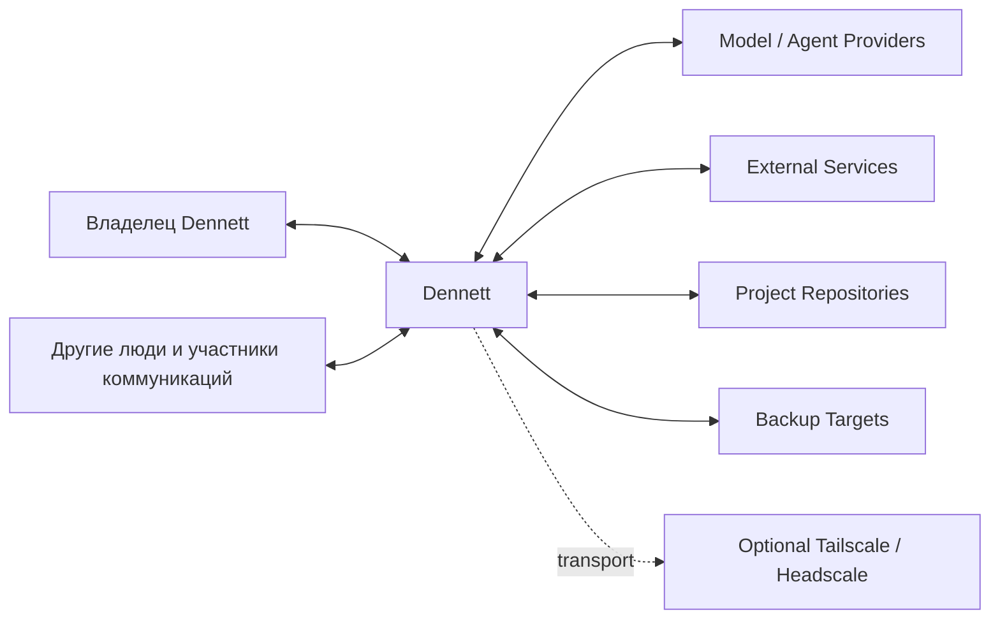
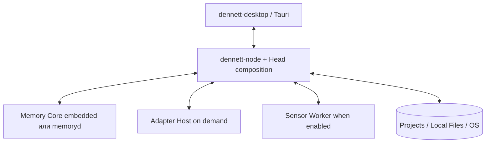
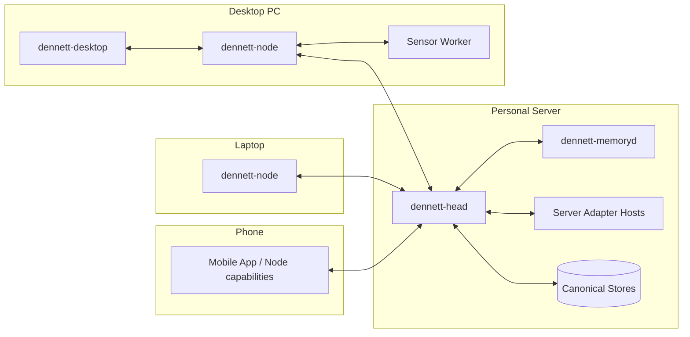
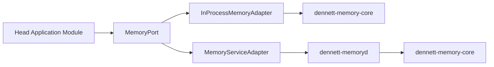
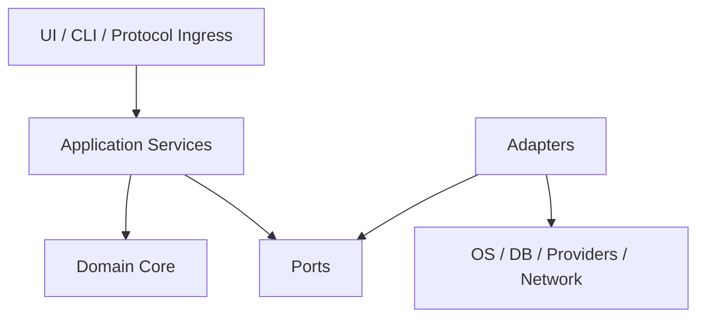
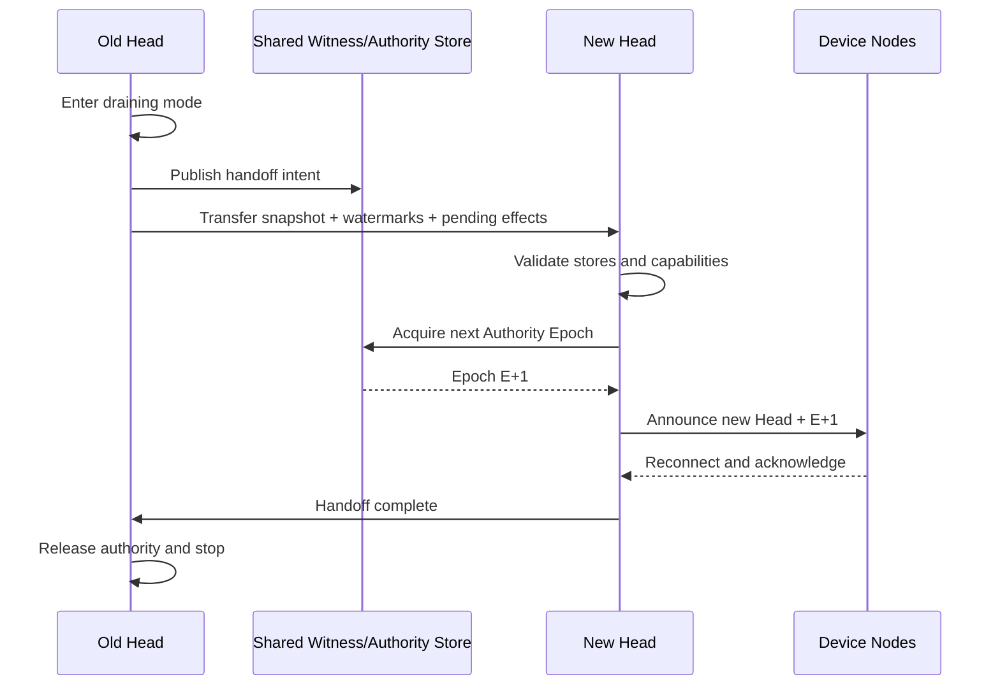
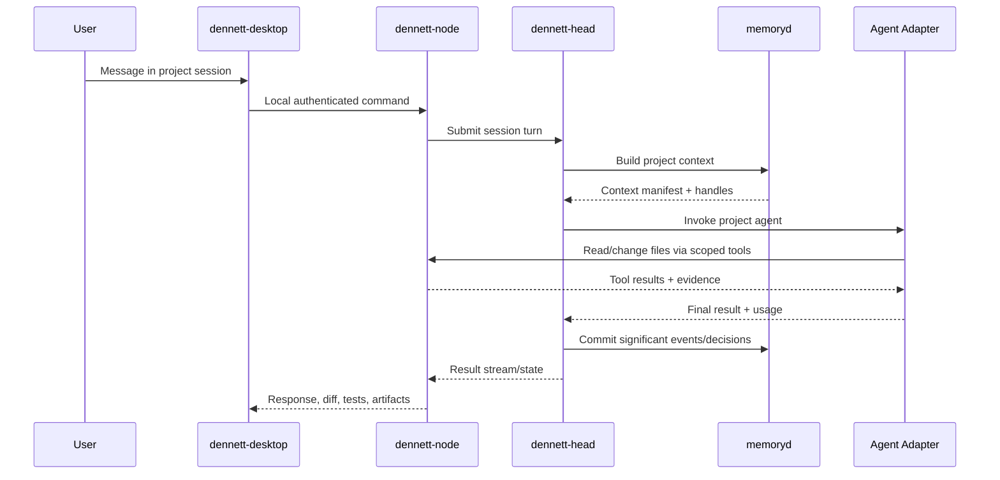
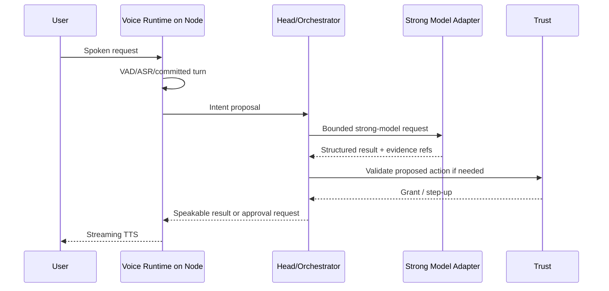
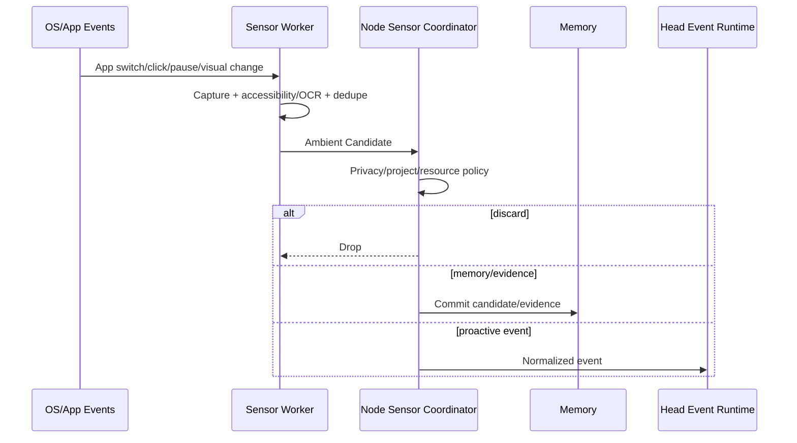
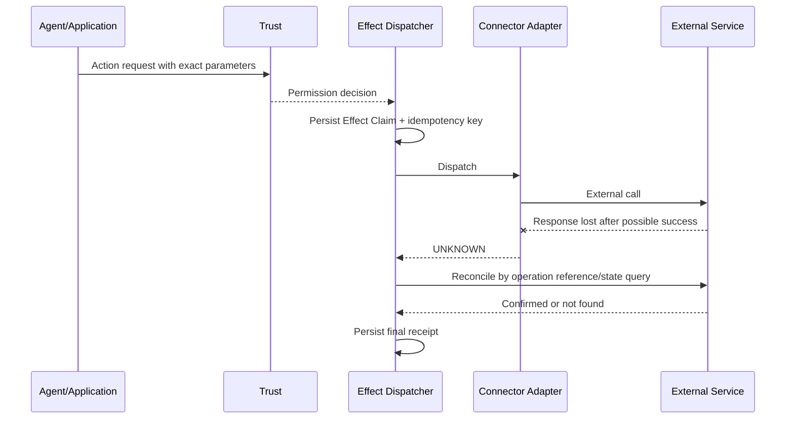

# Dennett System Architecture and Runtime Topology

> **Repository edition · 2026-07-13 · `80`**  
> Канонический архитектурный том. Сначала прочитайте [карту архитектуры](README.md) и [cross-domain contracts](../specifications/contracts/README.md).  
> Бывший временный предархитектурный документ разнесён по этим contracts; исторические ссылки на него означают данный интегрированный набор.


## Системная архитектура, исполняемые границы, топология процессов, отказоустойчивость, расширяемость и подготовка репозитория

**Версия:** 1.0  
**Дата исследования:** 13 июля 2026 года  
**Статус:** первый канонический архитектурный том. Документ определяет системную форму Dennett и служит основанием для последующих томов данных, интеллектуального исполнения и клиентской реализации.  
**Каноническое имя:** `80_Dennett_System_Architecture_and_Runtime_Topology.md`

Этот документ является самостоятельным. Чтобы понять выбранную архитектуру, читателю не требуется знать историю обсуждения проекта. При этом документ нормативно продолжает действующий комплект бизнес-логики Dennett:

- `00_Dennett_Functional_Concept.md`;
- `01_Dennett_Specification_Index_and_Shared_Contracts.md`;
- `10_Dennett_Memory_Fabric.md`;
- `20_Dennett_Agentic_Control_Fabric.md`;
- `30_Dennett_Trust_Identity_Autonomy_and_Permissions.md`;
- `40_Dennett_Voice_and_Ambient_Interaction_Fabric.md`;
- `41_Dennett_Capabilities_Providers_and_Integrations.md`;
- `50_Dennett_Server_Runtime_Events_Sync_and_Portability.md`;
- `60_Dennett_Desktop_Application_Business_Logic.md`;
- `61_Dennett_Mobile_Application_Business_Logic.md`;
- `70_Dennett_End_to_End_Validation_and_Architecture_Handoff.md`;
- `../specifications/contracts/README.md`.

Документ отвечает на вопрос:

> **Из каких исполняемых частей должен состоять Dennett, где они живут, как взаимодействуют, как переживают ошибки и обновления, как заменяются без переписывания всей системы и как организовать код так, чтобы длительная разработка людьми и агентами оставалась управляемой?**

Он не определяет окончательную физическую схему памяти и баз данных — это задача тома `81`. Он не детализирует внутренний prompt loop, конкретные provider adapters, Voice pipeline и Capability SDK — это задача тома `82`. Он не доводит desktop/mobile, CI/CD и структуру каждого source-файла до окончательной реализации — это задача тома `83`. Однако этот том задаёт границы и обязательные контракты, внутри которых следующие решения должны находиться.

---

# Часть I. Итоговое решение и его основания

## 0. Архитектурный вердикт

### 0.1. Главная форма системы

Dennett следует строить как **process-selective modular monolith** — модульный монолит с небольшим числом осмысленных исполняемых границ и архитектурой ports-and-adapters.

Это означает одновременно четыре вещи.

Первая: бизнес-логика не дробится на десятки сетевых микросервисов. Основной Head Runtime представляет собой один хорошо модульный Rust-процесс. Внутри него модули взаимодействуют обычными типизированными вызовами и локальными событиями. Сеть не используется там, где компоненты уже находятся в одном процессе.

Вторая: те части, которым действительно нужна отдельная жизнь, получают собственный процесс. Основанием для process boundary может быть только одно из следующих требований:

- компонент должен продолжать работать после закрытия UI;
- компонент физически находится на другом устройстве;
- ему нужна отдельная привилегия или trust zone;
- он использует другой язык или vendor SDK;
- его падение, утечка памяти или перегрузка не должны валить основной runtime;
- он должен независимо обновляться, масштабироваться или переиспользоваться;
- его задача требует тяжёлого CPU/GPU/медиа-контура;
- пользователь должен иметь возможность полностью отключить или заменить его.

Третья: границы модулей определяются **capabilities и domain contracts**, а не названиями конкретных провайдеров. OpenAI, Anthropic, Playwright, Screenpipe, Tailscale, Restate или другой продукт являются адаптерами. Ни один из них не диктует внутреннюю модель Dennett.

Четвёртая: одна и та же логическая часть может иметь два способа размещения. Например, Memory Core может работать внутри Head Runtime в минимальной установке либо через отдельный `dennett-memoryd` в персональном серверном профиле. Оба варианта обязаны проходить один набор contract tests и вести себя одинаково на уровне бизнес-контракта.

Короткая формула:

> **Стабильное модульное ядро, сменные края, отдельные процессы только по измеримой причине, один логический центр власти и локально способные устройства.**

### 0.2. Выбранный стек верхнего уровня

Для первой полноценной реализации принимается следующий основной технологический вектор.

**Rust** используется для:

- Head Runtime;
- постоянного node-демона;
- Memory Core и optional Memory Daemon;
- общих доменных типов и критических протоколов;
- sync/effect/runtime/trust enforcement;
- локальных системных адаптеров, где Rust даёт хороший доступ к ОС;
- supervision, resource control и системной телеметрии.

Причины: memory safety, предсказуемое потребление ресурсов, сильная система типов, один язык с Tauri core, удобство сборки переносимых бинарников и возможность писать тестируемые низкоуровневые компоненты без garbage-collector pauses. Выбор Rust не означает попытку переписать на нём каждый SDK.

**Tauri 2** используется как desktop application shell. Tauri уже разделяет привилегированный Rust Core и WebView-процесс, поддерживает capability-scoped IPC, external binaries, подписанные обновления, single-instance, autostart, системный tray и cross-platform bundling. Это хорошо соответствует требованию Dennett: богатый desktop UX без переноса секретов и authoritative logic в JavaScript. [[S12]] [[S13]] [[S14]] [[S15]]

**TypeScript и React** рекомендуются для desktop frontend. Окончательный UI toolkit фиксируется в томе `83`, но React является предпочтительным baseline из-за зрелой экосистемы сложных workbench-интерфейсов, виртуализированных списков, редакторов, state machines, accessibility и тестирования. Tauri не связывает архитектуру с конкретным frontend-framework, поэтому этот выбор остаётся заменяемым внутри UI boundary.

**Python и TypeScript/Node.js** допускаются для provider adapters и интеграций, если официальный SDK, computer-use framework, ML-инструмент или media library лучше поддерживается в этих языках. Они не встраиваются непосредственно в основной адресный простор Head Runtime: такие компоненты запускаются через ограниченный `Adapter Host`.

**WebAssembly Component Model / Extism** рассматривается как дополнительный безопасный lane для небольших deterministic extensions. Он не становится обязательным plugin format для всего. WASM удобен для transform, validator, parser, lightweight policy extension или feature extractor, но плохо подходит как универсальная оболочка вокруг тяжёлых Python SDK, browser runtime и нативного computer-use. [[S24]] [[S25]] [[S26]]

### 0.3. Desktop и демон

Desktop-приложение не является сервером Dennett и не владеет долговечными процессами.

Принято разделение:

- `dennett-desktop` — Tauri UI, окна, tray, local presentation state, визуальные overlays и OS-specific user interaction;
- `dennett-node` — постоянный Rust-демон устройства, продолжающий работу после закрытия окна и даже полного выхода из UI;
- при local-only установке `dennett-node` может одновременно размещать Head Runtime;
- при personal-server установке node соединяется с удалённым `dennett-head`.

Tauri умеет упаковывать и запускать sidecar binaries, но sidecar как дочерний процесс UI недостаточен для постоянного фонового ядра: закрытие, update или авария desktop shell не должны завершать capture, offline queue, локальную модель, активную project operation либо долгий Run. Поэтому installer регистрирует `dennett-node` через штатный механизм фонового пользовательского сервиса ОС. Tauri используется для установки, управления и диагностики демона, а не как его lifetime owner. [[S12]] [[S13]]

На Windows это будет user-scoped service или другой подходящий штатный startup mechanism; на macOS — LaunchAgent; на Linux — systemd user service или совместимый user-session manager. Конкретные install recipes и права будут окончательно описаны в томе `83`.

### 0.4. Memory Core и отдельный процесс

Память проектируется в двух формах одновременно:

1. **`dennett-memory-core`** — переиспользуемая библиотека с канонической логикой Event/Evidence/Claim/Current State, retrieval planning, scope, correction, deletion и project packs;
2. **`dennett-memoryd`** — необязательный самостоятельный процесс, предоставляющий ту же логику через versioned service contract.

Выбран именно такой гибрид, а не один из крайних вариантов.

Только библиотека была бы проще, но:

- тяжёлые indexing/rebuild операции могли бы ухудшать Head Runtime;
- память нельзя было бы независимо переиспользовать другими агентными системами;
- crash или memory leak в стороннем indexer мог бы повредить весь control plane;
- отдельные процессы не смогли бы обращаться к памяти без встраивания полного ядра.

Только удалённый сервис сделал бы даже маленькую локальную установку зависимой от IPC, усложнил бы тесты и превратил бы память в обязательную distributed system.

Поэтому в минимальном профиле Head использует `InProcessMemoryAdapter`, а в рекомендуемом персональном серверном профиле — `MemoryServiceAdapter` к локальному `dennett-memoryd`. Оба адаптера реализуют один `MemoryPort` и проходят общий conformance suite.

Существующие продукты Mem0, Letta, Zep/Graphiti и Cognee подтверждают полезность отдельного memory layer и дают готовые идеи для integrations, graphs и retrieval. Однако ни один из них не покрывает одновременно доказательный Event Ledger Dennett, bitemporality, exact deletion, portable project memory, influence policy, offline conflict preservation и человекочитаемые projections. Поэтому они рассматриваются как benchmark/reference/adapter, но не как каноническое ядро памяти. [[S31]] [[S32]] [[S33]] [[S34]]

### 0.5. Что берётся готовым

Архитектура сознательно пытается переложить на зрелые проекты как можно больше недифференцирующей инфраструктуры.

Предпочтительно использовать готовые решения для:

- desktop shell, packaging и updater — Tauri;
- защищённой peer connectivity — Tailscale или Headscale-compatible deployment как optional transport;
- structured browser automation — Playwright/Chrome DevTools;
- provider-native computer-use — OpenAI, Anthropic и другие adapters;
- open-source visual computer-use — Browser Use, UI-TARS или будущие backends через общий контракт;
- screen/audio capture — Screenpipe как первый adapter-кандидат плюс native fallbacks;
- durable automation — Restate/Temporal adapter там, где реально нужна строгая долговечность;
- telemetry — OpenTelemetry;
- local models — Ollama/LM Studio/vLLM/OpenVINO и другие backends из Capability Fabric;
- secret storage — platform keystores/vaults через Secret Broker;
- transport, object storage, indexing и backup — mature components, выбираемые в томе `81`.

Готовый продукт никогда не получает право стать источником истины бизнес-логики. Например, Screenpipe может захватывать и предварительно индексировать экран, но каноническая память Dennett формируется через `Sensor Adapter` и Memory Fabric. Tailscale может дать сетевой маршрут, но не выдаёт Dennett permissions. Provider-native computer-use выполняет действия, но Effect Claim и Trust Decision принадлежат Dennett.

### 0.6. Что не принимается

В качестве baseline отклоняются:

- microservices для каждого домена;
- Kubernetes как обязательная среда;
- обязательный Temporal для любого agent turn;
- обязательный NATS/Kafka внутри одной машины;
- одна giant Python application;
- один giant Tauri process;
- один процесс на каждый skill или MCP;
- прямая загрузка сторонних native dynamic libraries в Head;
- сеть между модулями одного процесса;
- общий доступ всех модулей к одной базе без владельцев;
- UI как источник истины;
- Tailscale как единственный способ соединения;
- Screenpipe как каноническое хранилище памяти;
- один provider как архитектурная основа;
- собственная foundation GUI model в первой версии;
- обязательный consensus cluster для личной установки;
- полная event sourcing каждого клика и каждой промежуточной мысли модели.

---

## 1. Как проводилось исследование

### 1.1. План для построения плана

До выбора компонентов были сформулированы вопросы, провал которых заставляет вернуть архитектуру на переработку.

1. Можно ли закрыть desktop UI и не потерять фоновые задачи, capture и sync?
2. Можно ли в минимальной установке запустить Dennett без Kubernetes, message broker, Tailscale и отдельной БД-сетки?
3. Можно ли позднее вынести модуль в отдельный процесс без переписывания его бизнес-логики?
4. Можно ли заменить provider, computer-use backend, screen capture или durable engine через новый adapter?
5. Может ли один crashed adapter не уронить весь Head?
6. Можно ли протестировать каждый домен без реального OpenAI, Telegram, GPU и второго устройства?
7. Можно ли детерминированно воспроизвести split-brain, timeout, retry, clock skew и disk pressure?
8. Можно ли использовать Memory Core отдельно от Dennett, не выдавая внешнему потребителю прямой доступ к внутренней БД?
9. Можно ли выполнить обычный project chat без сетевого прыжка через пять сервисов?
10. Можно ли восстановить Managed Run после restart, не превращая смысловую стратегию агента в жёсткий workflow?
11. Можно ли определить владельца каждого authoritative state и запретить скрытые дубли?
12. Может ли архитектура работать с одним компьютером сегодня и с сервером, телефоном и GPU-node завтра?
13. Можно ли обновлять процессы поэтапно, сохраняя protocol compatibility?
14. Есть ли у каждого внешнего эффекта явная граница, idempotency и reconciliation?
15. Можно ли разработчику или coding agent понять область изменения, прочитав локальный `AGENTS.md`, не прогружая весь комплект документации?

### 1.2. Сравнённые формы системы

Были рассмотрены пять общих вариантов.

**Единый desktop process.** Прост на старте, но не выполняет требования постоянной жизни, crash isolation, server profile и переиспользования памяти.

**Единый server process и тонкие клиенты.** Хорош для координации, но плохо использует локальные файлы, микрофон, экран, GPU и offline mode.

**Полный набор микросервисов.** Даёт независимое масштабирование, но создаёт сетевую, deployment- и observability-сложность, не оправданную персональным продуктом.

**Полностью peer-to-peer local-first multi-master.** Силен для документов, но опасен для permissions, payments, messages, shared limits и единого состояния Runs.

**Process-selective modular monolith с Head и local-capable nodes.** Даёт один логический центр, быстрый локальный data plane, минимум обязательных процессов и возможность позднего выделения тяжёлых частей. Этот вариант принят.

### 1.3. Использованные классы источников

Изучены:

- официальная архитектура и security model Tauri;
- hexagonal architecture и ports-and-adapters;
- Tailscale/Headscale и разделение control/data plane;
- Temporal, Restate, NATS и transactional outbox;
- WebAssembly Component Model, Wasmtime и Extism;
- supervisor trees Erlang и structured shutdown Tokio;
- deterministic simulation FoundationDB;
- OpenTelemetry, C4 и arc42;
- Screenpipe и его event-driven capture;
- OpenAI/Anthropic computer-use, Browser Use и UI-TARS;
- memory systems Mem0, Letta, Zep и Cognee;
- действующие бизнес-логические документы Dennett.

### 1.4. Критерий принятия механизма

Компонент или паттерн принят, если он:

- закрывает реальный failure mode или важное качество;
- имеет более простой baseline и выигрывает у него;
- не требует лишнего LLM-вызова на нормальном пути;
- допускает in-memory или fake adapter для тестов;
- имеет понятный владелец состояния;
- не проникает vendor-specific типами в domain core;
- может быть заменён или отключён;
- не увеличивает число always-on процессов без причины;
- сохраняет local-only и personal-server deployment;
- имеет наблюдаемый failure и recovery path.

### 1.5. Критерий отказа

Архитектурное решение отклоняется либо переводится в optional, если:

- оно красиво только на диаграмме;
- увеличивает operational burden до первой полезной функции;
- требует сетевой координации для локального вызова;
- создаёт ещё один источник истины;
- делает ordinary project chat зависимым от workflow engine;
- заставляет все adapters использовать наименьший общий знаменатель;
- не позволяет unit/contract testing без внешнего сервиса;
- скрывает UNKNOWN external effect;
- зависит от одного продукта без escape hatch;
- создаёт глобальный mutable singleton;
- требует менять несколько несвязанных модулей при добавлении provider или sensor;
- не имеет ясного rollback/migration path.

---

# Часть II. Архитектурные драйверы и неподвижные принципы

## 2. Приоритеты качества

Архитектура оптимизируется не по одной метрике. При конфликте решения применяются следующие приоритеты.

### 2.1. Корректность внешних эффектов и сохранность данных

Нельзя ради удобства допускать:

- двойную отправку сообщения;
- повторный платёж;
- исчезновение Memory Event;
- потерю единственного artifact;
- молчаливое разрешение конфликта;
- запись старым Head после handoff;
- выполнение отозванного permission;
- ложный статус completion.

### 2.2. Изменяемость и тестируемость

Система будет развиваться в условиях постоянной смены моделей, SDK, provider APIs и agent patterns. Поэтому важнее не угадать идеальный vendor 2026 года, а обеспечить:

- stable ports;
- contract tests;
- replaceable adapters;
- versioned protocols;
- module ownership;
- отсутствие циклов зависимостей;
- deterministic test seams;
- возможность сравнить старый и новый backend.

### 2.3. Практическая простота эксплуатации

Personal installation должна запускаться без собственного DevOps-отдела. Baseline не требует:

- container orchestration;
- внешнего broker;
- distributed database cluster;
- consensus service;
- отдельного process для каждого модуля.

### 2.4. Локальность и приватность

Локальные файлы, экран, микрофон, модели и сенсорные данные должны обрабатываться на устройстве, если нет необходимости отправлять их дальше. Централизация применяется к власти и глобальному состоянию, а не ко всем байтам.

### 2.5. Интерактивная скорость

Cancel, voice barge-in, user takeover, local status и project file operation не должны ждать background indexing, backup или cloud provider. Интерактивные каналы имеют отдельные очереди, бюджеты и приоритет.

### 2.6. Cost of success

Архитектура должна позволять заменить cloud model на local, ограничить background work, выключить дорогой index lane, использовать subscription provider и измерить реальную стоимость по Project/Run. Максимальное качество любой ценой не является целью.

---

## 3. Неподвижные архитектурные инварианты

1. В каждый момент существует один логически активный Head Runtime, кроме явно обозначенного isolated emergency mode.
2. UI не является источником истины Task, permission, memory, effect или device state.
3. Tauri WebView не хранит secrets и не обращается напрямую к канонической БД.
4. Обычная project session остаётся single-agent-first и не требует durable workflow.
5. Runtime хранит состояние и гарантии, но не подменяет смысловое планирование модели.
6. Любой consequential external effect проходит через Effect Port, Trust decision и receipt lifecycle.
7. Provider session не является самой Task.
8. Memory canonical write не зависит от доступности vector/graph index.
9. Ни один third-party adapter не получает прямой доступ ко всем данным установки.
10. Tailscale/Headscale являются транспортом, а не identity/authorization source Dennett.
11. Внутрипроцессный модуль не вызывается через сеть без отдельного основания.
12. Cross-process contract versioned и проверяется при handshake.
13. Каждый background loop имеет cancellation, backpressure и resource budget.
14. Каждый process имеет readiness, health, graceful shutdown и crash-loop policy.
15. Сторонние provider SDK не проникают в domain types.
16. Capability installation не равна trust, authorization или activation.
17. Добавление нового adapter не требует изменения оркестратора, памяти и UI core, кроме регистрации нового capability facet.
18. Shared mutable state принадлежит ровно одному модулю.
19. Межмодульное событие не используется как скрытая RPC-команда.
20. At-least-once delivery не превращается в повтор внешнего эффекта.
21. UNKNOWN effect не повторяется до reconciliation.
22. Offline node не повышает себе authority.
23. Старый Authority Epoch не может записать новое глобальное consequential state.
24. Любой cache может быть удалён и пересоздан без потери канонического смысла.
25. Hidden chain-of-thought не является inter-process protocol или долговременным состоянием.
26. Logs, traces и debug bundles проходят redaction до экспорта.
27. Test implementation использует те же ports, что production adapters.
28. Process boundary не означает обязательный remote network boundary.
29. Сложность вводится только после scenario/eval, а не «на будущее».
30. Архитектурный документ описывает обязательный контракт, но не превращает каждую логическую часть в отдельный service.

---

## 4. Стиль внутренней архитектуры

### 4.1. Ports and Adapters

Каждый доменный модуль состоит из четырёх слоёв:

- **Domain:** сущности, value objects, инварианты и pure decision logic;
- **Application:** use cases, команды, orchestration одного домена и transaction boundaries;
- **Ports:** интерфейсы к внешнему миру и соседним доменам;
- **Adapters:** БД, provider SDK, OS, network, filesystem и UI bridges.

Domain и Application не импортируют конкретные SDK или storage libraries. Этот принцип соответствует изначальной цели hexagonal architecture: бизнес-логика должна запускаться и тестироваться независимо от UI, БД и внешнего сервиса. [[S17]] [[S18]]

### 4.2. Модульный монолит, а не «распределённый монолит»

Модули одного процесса:

- имеют отдельные namespaces/crates;
- не читают таблицы или файлы другого модуля напрямую;
- обращаются через public application API;
- используют in-process call для query/command, когда ответ нужен сразу;
- публикуют domain event для независимых реакций;
- используют outbox только при необходимости durable delivery;
- не сериализуют данные без process boundary.

### 4.3. Pragmatic CQRS

Dennett не вводит полноценный CQRS framework. Разделяется только смысл:

- **Command** хочет изменить состояние;
- **Query** читает состояние;
- **Event** сообщает, что уже произошло;
- **Projection** ускоряет чтение.

Один и тот же storage может обслуживать command и query path в первой версии. Отдельные read models создаются только для Radar, Search, Inbox, timelines и других реально тяжёлых представлений.

### 4.4. Explicit dependency injection

Компоненты получают dependencies через constructors/builders. Глобальный service locator запрещён. Test может передать fake clock, fake provider, in-memory repository и faulting transport без изменения production code.

### 4.5. Functional Core, Imperative Shell

Где возможно, решение отделяется от эффекта:

```text
input facts + policy + current state
→ pure decision
→ action proposal
→ effect adapter
→ observed result
→ state transition
```

Это особенно важно для:

- permission decisions;
- event filtering;
- provider routing;
- retry policy;
- sync conflict classification;
- memory admission;
- resource budgeting;
- notification choice;
- update compatibility.


---

# Часть III. Системный контекст и профили развёртывания

## 5. Система и внешние участники

### 5.1. Главные участники

**Владелец Dennett** — основной human principal, управляющий установкой, проектами, данными, автономностью и recovery.

**Другие люди** — собеседники в Telegram/email/встречах, участники проектов и источники внешних сообщений. Они не становятся владельцами Dennett из-за того, что их речь или текст попали в систему.

**Desktop и mobile clients** — пользовательские поверхности, отображающие authoritative state и отправляющие commands.

**Device Nodes** — компьютеры, серверы, ноутбуки, телефоны и позднее другие устройства, которые могут хранить локальные данные, предоставлять capabilities и выполнять команды.

**Model/Agent Providers** — OpenAI, Anthropic, Google, локальные runtimes и другие экосистемы.

**External Services** — GitHub, Telegram, email, calendar, cloud storage, search, package registries и любые API.

**Project Repositories** — локальные и remote Git repositories, папки документов, research workspaces и portable project memory packs.

**Backup Targets** — локальные диски, NAS, облачные object stores и removable storage.

**Optional Network Overlay** — Tailscale или Headscale-compatible control server, предоставляющий маршрутизацию, но не бизнес-права Dennett.

### 5.2. C4 System Context

Представления этого тома используют C4 для ясного разделения system/context/container/component и arc42 для runtime, deployment, cross-cutting concepts, risks и quality scenarios. [[S44]] [[S45]]



Система Dennett в этой диаграмме является одним продуктом независимо от количества процессов. Ни Tailscale, ни provider, ни memory backend не являются частью доменной власти Dennett.

---

## 6. Профили развёртывания

### 6.1. Профиль A — Development and Test

Назначение: локальная разработка, CI и быстрые integration tests.

Состав:

- Head Runtime в одном process;
- Memory Core in-process либо test memoryd;
- in-memory или disposable stores;
- fake/device node;
- mock/fake provider adapters;
- adapter host только для нужного integration test;
- virtual clock и fault injector.

Этот профиль обязан запускаться одной командой и не требовать реальных cloud credentials.

### 6.2. Профиль B — Local-only Personal

Назначение: один основной компьютер без отдельного сервера.



Свойства:

- UI можно закрыть; `dennett-node` остаётся активным;
- Head modules размещены внутри node daemon;
- Memory Core может быть embedded для минимальной установки;
- adapter/sensor workers запускаются только при необходимости;
- mobile может позднее подключиться к этому компьютеру как к Head;
- если компьютер выключен, глобальная проактивная работа не идёт.

### 6.3. Профиль C — Personal Server, рекомендуемый

Назначение: основной постоянный режим Dennett.



Свойства:

- Head и Memory доступны постоянно;
- тяжёлые project files, screen/audio capture и local models остаются на подходящем node;
- Head координирует, но не проксирует каждый blob;
- desktop и phone могут быть выключены без остановки background Runs;
- server может быть домашним, VPS либо выделенным компьютером;
- deployment не требует Kubernetes.

### 6.4. Профиль D — Hybrid

Personal Server остаётся authority, но отдельные workloads выполняются:

- на облачном model provider;
- на удалённом GPU node;
- в disposable VM для computer-use;
- через remote browser service;
- через cloud backup;
- через hosted search/media backend.

Гибридный профиль не меняет domain contracts. Он добавляет adapters и placement decisions.

### 6.5. Профиль E — Isolated Emergency

Возникает, когда node потерял Head и не может подтвердить новый Authority Epoch.

Разрешены:

- local project work;
- local notes/capture;
- local models;
- draft external communication;
- reversible project-local actions;
- просмотр cached memory с freshness;
- очередь commands на reconnect.

Ограничены:

- глобальные permission changes;
- shared spending quotas;
- payments;
- irreversible cross-device actions;
- повтор UNKNOWN external effect;
- объявление глобальной Task завершённой без reconciliation.

---

## 7. Почему Tailscale — optional transport, а не фундамент

### 7.1. Что полезно взять

Tailscale разделяет coordination/control plane и peer data path. После обмена identity и network policy устройства по возможности устанавливают прямое WireGuard-соединение, а relay используется при невозможности direct path. Этот принцип подходит Dennett: Head координирует, но большой artifact или локальный media stream может передаваться node-to-node. [[S19]]

Headscale предоставляет self-hosted control server, совместимый с Tailscale clients, что полезно пользователю, не желающему зависеть от SaaS-control-plane. [[S21]]

### 7.2. Почему Tailscale нельзя сделать обязательным

- пользователь может не хотеть отдельный network product;
- mobile/desktop должны работать через обычный outbound TLS;
- корпоративная сеть может блокировать или регулировать overlay;
- Dennett должен уметь работать в одной LAN без Tailscale;
- Tailscale account не равен Dennett principal;
- remote provider/cloud integration всё равно использует обычные APIs;
- embedded `tsnet` официально является Go library, а core Dennett выбран на Rust. Встраивание Go runtime только ради транспорта усложнило бы build и supervision. [[S20]]

### 7.3. Transport abstraction

`NodeTransportPort` должен поддержать минимум:

- authenticated local IPC;
- direct LAN/Tailnet connection;
- outbound connection node → Head;
- relayed connection через Head;
- streaming и object transfer;
- reconnect и protocol negotiation.

Предпочтительный порядок маршрута:

```text
local IPC
→ direct private address / Tailnet
→ direct public endpoint with mTLS
→ Head relay
→ offline queue
```

Application-level device identity, certificate/grant state и Authority Epoch проверяются независимо от сетевого пути.

---

# Часть IV. Исполняемая топология

## 8. Карта основных процессов

### 8.1. `dennett-desktop`

**Тип:** Tauri 2 desktop application.  
**Lifetime:** пользовательский, может быть закрыт независимо от фоновой системы.  
**Владеет:** окнами, визуальным layout, local view cache, desktop-specific gestures, tray presentation и UI interaction.  
**Не владеет:** долговечными Runs, canonical memory, permissions, project execution или external effects.

Внутренняя структура:

- React/TypeScript Workbench UI;
- typed frontend state;
- Tauri Rust bridge;
- local daemon client;
- secure local session bootstrap;
- desktop notification/tray/shortcut adapters;
- updater UI;
- crash recovery of view state.

Tauri WebView получает только scoped commands. Секреты, provider keys и прямые DB connections в frontend запрещены. Tauri Core может обрабатывать system integrations, но основной бизнес runtime остаётся в `dennett-node`, чтобы UI process не был lifetime owner. Tauri capabilities применяются как дополнительная локальная граница. [[S12]] [[S14]]

### 8.2. `dennett-node`

**Тип:** постоянный Rust daemon на каждом полнофункциональном устройстве.  
**Lifetime:** стартует через user service manager ОС; не зависит от окна desktop.  
**Владеет:** device-local execution и local continuity.

Основные обязанности:

- device identity и secure channel к Head;
- local project/worktree access;
- execution of shell/build/test/local tools;
- inventory локальных capabilities;
- local model coordination;
- screen/microphone/camera/clipboard source coordination;
- computer-use session ownership;
- local object cache;
- offline operation log;
- direct peer transfers;
- local notification fallback;
- process supervision adapters/sensors;
- user takeover и emergency local commands;
- report health/resource pressure;
- optional Head composition в local-only profile.

`dennett-node` не решает глобальные permissions самостоятельно. Он исполняет signed/current grants либо ограниченную emergency policy.

### 8.3. `dennett-head`

**Тип:** постоянный Rust control-plane process.  
**Lifetime:** always-on в personal-server/hybrid profile.  
**Владеет:** глобальной runtime-координацией и authoritative operational state.

Основные модули:

- Installation and Authority;
- Command Gateway;
- Orchestrator Host;
- Runtime Registry;
- Task/Run Coordinator;
- Event and Schedule Runtime;
- Action Inbox;
- Radar Projection;
- Device Registry and Session Coordinator;
- Sync Coordinator;
- Effect Dispatcher/Reconciler;
- Notification Router;
- Resource and Usage Coordinator;
- Update Coordinator;
- Capability Resolution facade;
- Trust Enforcement facade;
- Memory Client;
- Observability and Repair.

В первой версии эти модули находятся в одном binary и одном deployment unit. Их storage ownership и transaction boundaries будут определены в `81`.

### 8.4. `dennett-memoryd`

**Тип:** optional separate Rust process вокруг `dennett-memory-core`.  
**Lifetime:** persistent on personal server, optional local.  
**Владеет:** Memory Fabric API, а не агентной стратегией.

Состав:

- canonical ingestion coordinator;
- evidence/object reference management;
- claim/current-state services;
- retrieval planner;
- index coordination;
- project memory pack import/export;
- deletion/retention coordinator;
- memory sync facade;
- health/rebuild status.

Тяжёлые indexers могут быть worker tasks внутри `memoryd` либо позднее отдельными workers. Canonical ingest не должен останавливаться из-за падения vector/graph indexer.

### 8.5. `dennett-adapter-host`

**Тип:** supervised out-of-process extension host.  
**Реализации:** Rust, Python и TypeScript/Node variants.  
**Lifetime:** on-demand либо warm pool.

Используется для:

- provider SDK;
- MCP servers/clients;
- connectors;
- browser automation;
- computer-use;
- media processing;
- package-specific CLI;
- plugins, которые нельзя безопасно или удобно встроить в core.

Не каждый adapter получает отдельный host. Processes группируются по:

- runtime/language;
- trust level;
- resource profile;
- crash isolation;
- credential boundary;
- session persistence.

Например, несколько low-risk stateless Python adapters могут жить в одном worker pool. Недоверенный computer-use backend с широким доступом получает отдельный process/VM.

### 8.6. `dennett-sensor-worker`

**Тип:** optional device-local worker.  
**Lifetime:** работает только при включённом sensor profile.  
**Владеет:** capture pipeline до передачи Ambient Candidate в Node/Memory.

Причины отдельного процесса:

- OS capture APIs могут падать или зависать;
- OCR/ASR требуют CPU/GPU;
- screen/audio libraries обновляются независимо;
- пользователь должен быстро остановить источник;
- sensor process не должен иметь global control-plane authority.

В первой реализации Screenpipe может быть одним из backends этого worker, а не самим worker contract.

### 8.7. Mobile node

Мобильное приложение физически ограничено правилами Android/iOS. Оно реализует subset `NodePort`:

- device identity;
- voice/capture;
- offline queue;
- notifications/approvals;
- local cache;
- optional local ASR/model;
- mobile-safe background work;
- health and sync.

Mobile OS может приостановить process. Поэтому Head не считает mobile heartbeat гарантией постоянного execution и не назначает телефону долгий critical Run без явной capability.

---

## 9. Процессные границы: правило принятия

Новый процесс создаётся только после ответа «да» хотя бы на один вопрос:

1. Должен ли компонент жить независимо от UI/Head?
2. Нужен ли отдельный OS privilege или sandbox?
3. Может ли он зависнуть, исчерпать RAM/VRAM или crash так, что его надо перезапустить отдельно?
4. Требуется ли другой язык/runtime?
5. Должен ли компонент быть переиспользуемым отдельным продуктом?
6. Есть ли независимая потребность в scale/placement?
7. Требуется ли security isolation от остальных данных?
8. Нужно ли обновлять его отдельно из-за vendor cadence?

Если ответ «нет», компонент остаётся модулем существующего process.

### 9.1. Почему не process на каждый домен

Отдельные `inbox-service`, `radar-service`, `project-service`, `event-service`, `usage-service` и `notification-service` сделали бы:

- каждый user action сетевым;
- локальную разработку сложнее;
- transaction boundaries хрупче;
- запуск системы тяжелее;
- integration tests медленнее;
- debugging распределённее;
- version skew постоянной проблемой.

Пока они имеют общий lifecycle и скромный масштаб, они являются modules Head Runtime.

### 9.2. Когда модуль можно выделить позже

Модуль считается подготовленным к extraction, если:

- имеет собственный public port;
- не разделяет таблицы с соседями;
- команды и события versioned;
- contract suite работает с in-process и remote adapter;
- нет циклических зависимостей;
- placement действительно даёт измеримый выигрыш.

---

## 10. Supervisor topology

### 10.1. Два уровня supervision

**OS supervisor** отвечает за persistent binaries:

- `dennett-node`;
- `dennett-head`;
- `dennett-memoryd` при отдельном размещении.

**Internal supervisor** отвечает за child tasks/processes:

- adapter hosts;
- sensor workers;
- model servers;
- current Runs;
- indexers;
- object transfers;
- background maintenance.

Из Erlang OTP заимствуется не сам runtime, а проверенный принцип supervision tree: отдельный supervisor стартует, останавливает и наблюдает children; restart strategy и maximum restart intensity не позволяют бесконечно перезапускать неисправный worker. [[S27]]

### 10.2. Стратегии

**One-for-one** — default для независимых adapters и sensor workers.

**Rest-for-one** — для цепочки, где downstream depends on upstream session. Например, provider streaming worker и decoder могут быть перезапущены вместе.

**One-for-all** — применяется редко, только если группа образует единый неделимый session runtime.

### 10.3. Restart budget

Для каждого child:

- maximum burst;
- rolling window;
- exponential backoff;
- jitter;
- stable-run reset;
- quarantine threshold;
- user-visible incident threshold.

Crash loop приводит не к бесконечному restart, а к:

```text
DEGRADED
→ adapter disabled/quarantined
→ related Runs paused or rerouted
→ Action Inbox only if user decision needed
→ diagnostic bundle
```

### 10.4. Structured cancellation

В Rust async code используется structured cancellation:

- parent создаёт cancellation scope;
- child получает token;
- Stop/Pause/Shutdown сигнал распространяется вниз;
- child обязан завершить effect-safe boundary;
- timeout приводит к forced termination только после записи состояния;
- detached tasks запрещены без explicit supervisor registration.

Tokio рекомендует отдельно определять момент shutdown, уведомление tasks и ожидание их завершения; `CancellationToken` обеспечивает иерархически клонируемый сигнал. [[S28]] [[S29]]


---

# Часть V. Модули, зависимости и внутренние контракты

## 11. Архитектурная карта workspace

Логическая структура Cargo workspace должна отражать устойчивые границы, но не создавать crate на каждую мелкую сущность.

Предварительная карта:

```text
crates/
├── dennett-kernel
├── dennett-contracts
├── dennett-runtime-core
├── dennett-agent-core
├── dennett-memory-core
├── dennett-trust-core
├── dennett-capability-core
├── dennett-event-core
├── dennett-project-core
├── dennett-artifact-core
├── dennett-sync-core
├── dennett-device-core
├── dennett-observability
├── dennett-testkit
└── dennett-config
```

Это не окончательная структура репозитория и не требование разнести каждый module по отдельному package. Критерий отдельного crate:

- устойчивый public API;
- отдельный dependency direction;
- переиспользование несколькими binaries;
- необходимость architecture test;
- значимый независимый test suite.

Если два небольших модуля меняются вместе и не переиспользуются, их следует держать в одном crate как modules.

---

## 12. `dennett-kernel`

Kernel содержит только самые стабильные общие понятия:

- typed IDs;
- principal/device/project/session/task/run references;
- scopes;
- time abstractions;
- revision/version tokens;
- correlation and causation IDs;
- generic effect and sensitivity classes;
- common result/error categories;
- clocks, ID generators and deterministic randomness ports.

Kernel не содержит:

- provider SDK;
- DB types;
- HTTP/gRPC types;
- UI DTO;
- memory retrieval logic;
- orchestrator logic;
- plugin loading.

Изменение Kernel имеет высокий blast radius. Поэтому новый тип добавляется туда только если действительно используется несколькими bounded contexts и имеет одинаковую семантику.

---

## 13. `dennett-contracts`

Contracts содержит versioned wire schemas и generated bindings для межпроцессных границ.

Он отделён от domain types. Причины:

- domain model может быть богаче wire representation;
- protocol evolution не должна заставлять domain код хранить deprecated fields;
- Python/TypeScript/Rust adapters получают generated или validated types;
- conversion layer является явным местом compatibility logic.

Том `81` выберет конкретный IDL и transport. Кандидатами являются Protobuf/Buf для typed internal RPC/events и JSON/YAML manifests для human-editable extension metadata. Extension host может использовать JSON-RPC-подобный protocol, поскольку этот pattern доказал переносимость между языками в LSP и MCP, но это пока provisional decision. LSP показывает ценность отделения редактора от language-specific process через versioned protocol, не заставляя обе стороны использовать один язык. [[S30]]

Обязательные правила:

- protocol version negotiation до meaningful command;
- additive compatible evolution по умолчанию;
- unknown fields сохраняются или безопасно игнорируются по контракту;
- enum имеет `UNKNOWN/UNRECOGNIZED` strategy;
- no wire type is authoritative without validation;
- commands содержат idempotency/correlation;
- streams содержат sequence/resume token;
- sensitive fields помечаются для redaction;
- generated files не редактируются вручную.

---

## 14. Head Runtime modules

### 14.1. Installation and Authority

Отвечает за:

- installation identity;
- active Head lease;
- Authority Epoch;
- startup mode;
- planned handoff;
- emergency mode;
- protocol compatibility floor;
- recovery state.

Не хранит пользовательские secrets и не решает permissions вместо Trust Core.

### 14.2. Command Gateway

Единая входная точка значимых commands от desktop, mobile, node, voice и internal modules.

Задачи:

- authenticate transport/session;
- validate command envelope;
- reject stale revision/epoch;
- apply idempotency;
- route к application service;
- return accepted/rejected/pending response;
- attach correlation context.

Command Gateway не является universal business router с giant switch. Routing генерируется или регистрируется по command handlers modules.

### 14.3. Orchestrator Host

Размещает logical main orchestrator и связывает его с Agentic Control Fabric.

Он:

- принимает Intent/Opportunity;
- собирает high-level context;
- выбирает Direct Turn, Adaptive Session, Managed Run или Automation;
- инициирует agent runtime;
- не хранит весь процесс только в model context;
- не исполняет OS command напрямую;
- не выдаёт permission;
- не владеет Memory storage.

### 14.4. Runtime Registry

Authoritative operational registry для:

- Task;
- Run;
- Agent Instance;
- Provider Session handle;
- waits;
- checkpoints;
- budgets;
- cancellation;
- ownership;
- effects;
- current placement.

Registry не обязан содержать every Work Item. Микрошаги остаются внутри agent session trace.

### 14.5. Event and Schedule Runtime

Владеет:

- event intake;
- deduplication;
- timers;
- schedules;
- trigger subscriptions;
- semantic evaluation candidates;
- cooldown;
- event storms/backpressure;
- late event handling.

Semantic model evaluation вызывается через Capability/Agent port, а не вшивается в module.

### 14.6. Action Inbox

Хранит canonical decision card state и revision.

Модуль:

- создаёт карточку из typed reason;
- объединяет дубли;
- проверяет expiry/supersession;
- применяет ответ с base revision;
- передаёт decision owner module;
- не превращает card в permission token.

### 14.7. Radar Projection

Строит materialized user-facing view из Runtime Registry, device/provider health и Inbox.

Radar projection полностью rebuildable. Он не принимает state mutation, кроме UI-specific saved view preferences.

### 14.8. Device and Sync Coordination

Отвечает за:

- device sessions;
- capability snapshots;
- online/offline freshness;
- direct transfer negotiation;
- operation log sync;
- Head epoch propagation;
- conflict routing;
- queued command revalidation.

Физическая sync protocol и storage будут описаны в `81`.

### 14.9. Effect Dispatcher and Reconciler

Единственная logical gateway для external effects:

- send;
- publish;
- purchase;
- delete external resource;
- push/release;
- modify account;
- invoke consequential computer-use.

Модуль управляет:

- Effect Claim;
- idempotency key;
- prepared parameters;
- permission reference;
- dispatch;
- provider operation handle;
- confirmed/failed/unknown;
- reconciliation;
- compensation.

Он не формирует content сообщения и не решает, кому писать: это приходит как validated proposal из Communication/Agentic layer.

### 14.10. Resource and Usage Coordinator

Объединяет:

- provider quota;
- API cost observations;
- local CPU/GPU/RAM/VRAM;
- storage pressure;
- network/battery;
- project/run budgets;
- interactive/background priority.

Coordinator выдаёт budget/placement recommendations, но не решает смысловую стратегию задачи.

### 14.11. Update Coordinator

Управляет:

- release manifest;
- signatures;
- compatibility matrix;
- staged node update;
- migration preflight;
- drain;
- rollback/forward-fix;
- provider adapter update isolation;
- migration backups.

Он использует platform updater adapters, включая Tauri updater для desktop packages. Tauri updater требует подписи update artifacts, что соответствует Trust Fabric. [[S15]]

---

## 15. Node Runtime modules

### 15.1. Node Identity and Head Session

- хранит device identity через platform keystore/Secret Broker;
- устанавливает outbound secure connection;
- negotiates protocol;
- отслеживает Authority Epoch;
- поддерживает reconnect/backoff;
- не доверяет одному network overlay.

### 15.2. Workspace Manager

- project path registration;
- repository/worktree discovery;
- file/watch events;
- branch/worktree creation;
- local filesystem authority;
- path disappearance/rebind;
- local project locks только при реальной конкуренции;
- safe delete/archive handoff.

Workspace Manager не хранит project business memory вместо Memory Fabric.

### 15.3. Local Execution Manager

- shell/build/test commands;
- process lifecycle;
- stdout/stderr streaming;
- cancellation;
- environment manifest;
- result evidence;
- command sandbox handoff;
- local resource limits.

Любая команда содержит Task/Run/grant scope. Node не выполняет arbitrary command только потому, что текст пришёл от модели.

### 15.4. Local Capability Inventory

- installed runtimes/models;
- available applications;
- screen/audio devices;
- GPU/CPU/NPU;
- browser profiles;
- computer-use backends;
- local MCP/tool endpoints;
- version/health.

Snapshot публикуется Head, а Capability Fabric строит registry view.

### 15.5. Sensor Coordinator

- включает/выключает sources;
- выдаёт sensor worker session config;
- контролирует ring buffers;
- принимает candidates;
- применяет local privacy filters;
- следит за storage pressure;
- отправляет commit candidate либо discard;
- гарантирует local stop без Head.

### 15.6. Computer-use Coordinator

- создаёт isolated session;
- выбирает window/device;
- выдаёт backend узкий grant;
- обеспечивает user takeover;
- фиксирует screenshots/state;
- переводит UI transaction в Effect Proposal;
- завершает/убивает зависший backend.

### 15.7. Local Model Coordinator

- discovery/load/unload;
- warm pool;
- VRAM/RAM budgets;
- model server lifecycle;
- queue/fairness;
- health;
- local privacy labels;
- provider-compatible adapter facade.

### 15.8. Offline Operation Log

Локально сохраняет только операции, которые должны пережить process death или reconnect:

- captures committed locally;
- notes/drafts;
- queued safe commands;
- local project state observations;
- effect proposal, но не автоматическое повторное исполнение;
- sync watermark.

Каждый UI click не попадает в log.

### 15.9. Object Transfer and Cache

- local artifact/media cache;
- content hash;
- resumable transfer;
- direct peer path;
- eviction policy;
- no canonical delete without owner confirmation;
- quarantine of imported objects.

---

## 16. Memory architecture boundary

### 16.1. `MemoryPort`

Минимальные группы операций:

- ingest event/evidence;
- commit correction/deletion operation;
- current/historical query;
- context request;
- evidence open by handle;
- project space mount/unmount;
- portable pack import/export;
- index/rebuild status;
- retention obligation;
- health/freshness.

Port не раскрывает:

- конкретные таблицы;
- vector DB client;
- graph DB query language;
- raw global scan без scope;
- mutable internal projection.

### 16.2. In-process и service adapters



Одинаковое поведение обеспечивается:

- shared conformance tests;
- golden query fixtures;
- identical error semantics;
- versioned service contract;
- same policy enforcement inputs;
- migration parity tests.

### 16.3. Почему Memory Core нужно сделать переиспользуемым

Другой разработчик должен иметь возможность:

- встроить Memory Core как library;
- запустить memoryd рядом со своим агентом;
- использовать scoped API;
- импортировать/экспортировать project memory;
- подключить собственный extraction/retrieval adapter;
- не получать весь Dennett Orchestrator и UI.

Это создаёт реальную самостоятельную ценность и повышает качество самого Dennett: reusable boundary заставляет отделить memory semantics от случайных деталей приложения.

### 16.4. Чего memoryd не делает

- не выбирает agent topology;
- не отправляет сообщения;
- не выдаёт permissions;
- не хранит secret values как обычные evidence;
- не запускает proactivity без Event Runtime;
- не считает similarity достаточным authority;
- не становится second Head.

---

## 17. Dependency rules

### 17.1. Направление зависимостей



В compile-time терминах adapter implements port, но domain/application не импортируют adapter.

### 17.2. Запрещённые зависимости

- `memory-core` → provider SDK;
- `trust-core` → desktop UI;
- `agent-core` → конкретный OpenAI/Claude type;
- `event-core` → Telegram connector;
- frontend → storage crate;
- adapter → private module repository;
- project module → direct Memory DB;
- capability registry → execution permission decision;
- node OS adapter → Head internal table.

### 17.3. Architecture fitness tests

CI автоматически проверяет:

- запрещённые crate dependencies;
- циклы;
- публичный API growth;
- wire/domain type leakage;
- direct SQL/file access из чужого module;
- provider imports только в adapter packages;
- generated files не изменены вручную;
- module AGENTS/README present для major boundaries;
- every external adapter passes contract suite.

---

# Часть VI. Коммуникация, команды и долговечность

## 18. Логические каналы

Система различает каналы по семантике, даже если несколько из них используют одно физическое соединение.

### 18.1. Control Channel

Приоритетные:

- command;
- cancel;
- pause/resume;
- permission decision;
- user takeover;
- Head epoch;
- grant revoke;
- health transition.

Control не должен блокироваться artifact transfer или transcript stream.

### 18.2. Event Channel

- observations;
- domain events;
- acknowledgements;
- watermarks;
- late events;
- sensor candidates metadata.

Delivery обычно at-least-once; handlers idempotent.

### 18.3. Streaming Channel

- voice audio;
- model deltas;
- terminal output;
- progress;
- live transcript;
- computer-use frames.

Stream может оборваться без потери Task. Resume semantics определяются типом stream.

### 18.4. Object Channel

- artifacts;
- screenshots;
- audio clips;
- documents;
- backup chunks;
- model files.

Поддерживает chunking, hashes, resume и lazy fetch.

### 18.5. Notification Channel

- push;
- local OS notifications;
- wearable hints;
- delivery acknowledgement.

Notification не является decision state.

### 18.6. Direct Peer Channel

Опциональный transfer node-to-node после authorization Head. Используется для больших объектов, remote desktop/audio и local model artifacts. При недоступности возвращается к relay/object store.

---

## 19. Command, Query, Event и Effect

### 19.1. Command

Command содержит:

- stable command ID;
- actor/on-behalf-of;
- target;
- base revision/epoch;
- idempotency key;
- intent/action parameters;
- expected effect class;
- correlation/causation;
- deadline/expiry;
- response preference.

Command может получить:

- `accepted`;
- `rejected`;
- `conflict`;
- `pending`;
- `requires_step_up`;
- `superseded`;
- `unknown` только для уже начавшегося external effect, не для обычной local mutation.

### 19.2. Query

Query обязан обозначать freshness need:

- cached acceptable;
- current Head state;
- authoritative source required;
- as-of historical;
- read-your-writes.

UI не должен автоматически использовать дорогой authoritative query для каждого hover.

### 19.3. Event

Event фиксирует факт, уже произошедший в пределах своего domain. Он не является скрытым указанием выполнить действие.

Минимум:

- event ID/type/version;
- source;
- observed/ingested time;
- subject references;
- correlation/causation;
- scope/sensitivity;
- payload reference;
- dedupe identity.

### 19.4. Effect

Effect Proposal отличается от Command: он описывает изменение внешнего мира. До dispatch он проходит Trust and Effect lifecycle.

---

## 20. In-process events и transactional outbox

### 20.1. In-process bus

Используется для независимых реакций внутри Head/Node:

- обновить Radar projection;
- запланировать notification;
- отметить usage;
- записать memory observation;
- инвалидировать cache.

Bus не используется для последовательности, где caller обязан знать результат. В таком случае применяется direct application call.

### 20.2. Durable outbox

Если state mutation и внешняя публикация должны быть согласованы, application transaction сохраняет:

- domain state;
- outbox record;
- idempotency/correlation

в одной transaction boundary. Relay публикует outbox позднее, допускает повтор и отмечает delivery. Transactional outbox решает проблему dual write без распределённой transaction, но требует idempotent consumer и preservation ordering. [[S16]]

### 20.3. Почему NATS не обязателен

NATS JetStream предоставляет durable storage, replay, consumers и edge/cloud deployment, поэтому является сильным кандидатом, если позднее появится несколько independently deployed processes и высокая event нагрузка. [[S23]]

В первой personal installation он не нужен:

- Head modules in-process;
- node connections немногочисленны;
- operational store + outbox достаточно;
- лишний broker усложняет install/backup/diagnostics.

`EventTransportPort` позволяет добавить NATS adapter позже без изменения domain events.

---

## 21. Durable execution

### 21.1. Три уровня

**Session-local:** state живёт в active agent/provider session и важных persisted summaries.

**Managed Run:** lightweight durable envelope в Dennett store:

- Task/Run state;
- goal;
- checkpoint;
- pending actions;
- artifacts;
- effects;
- provider continuation handle;
- budget;
- cancellation.

**Structured Automation:** использует `DurableExecutionPort`, реализация которого может быть Dennett-native, Restate или Temporal.

### 21.2. Почему не Temporal по умолчанию

Temporal надёжно восстанавливает Workflows через event history и deterministic replay, но workflow code должен соблюдать replay constraints, а LLM/API/DB операции выносятся в Activities; versioning долгоживущих workflows также требует специальной дисциплины. Эти свойства ценны для строгих automations, но чрезмерны для обычного сильного агента, меняющего стратегию динамически. [[S22]]

### 21.3. Restate как кандидат

Restate интересен для Dennett тем, что предлагает durable execution, journals, deduplication и single-writer state в относительно компактном server runtime, включая Rust ecosystem. Он является сильным кандидатом для optional Structured Automation и durable object-like coordination. [[S11R]]

Решение между Restate, Temporal и собственной lightweight implementation принимается после risk spike в томе `82/83`. Core зависит только от `DurableExecutionPort`.

### 21.4. Lightweight Managed Run baseline

В первой версии:

- Head сохраняет Run transition;
- долгий agent периодически создаёт semantic checkpoint;
- provider call выполняется как adapter activity;
- effects имеют отдельный ledger;
- restart восстанавливает last safe checkpoint;
- неповторяемые calls reconciled;
- code does not replay hidden model reasoning.

### 21.5. Checkpoint quality

Checkpoint не является полным transcript. Он должен позволить новому provider session продолжить работу:

- исходная цель;
- текущая интерпретация;
- завершённые логические действия;
- текущие files/commit/worktree;
- artifacts/evidence;
- decisions;
- pending questions/actions;
- external effects;
- constraints/permissions;
- next safe step.

---

## 22. Startup lifecycle

### 22.1. Head startup

```text
process starts
→ load immutable bootstrap config
→ initialize telemetry and crash reporting
→ validate installation identity
→ open operational stores
→ inspect migration state
→ acquire/confirm Head lease and Authority Epoch
→ start core modules in dependency order
→ reconcile incomplete Effect Claims
→ restore Managed Runs and waits
→ start outbox/event relays
→ start scheduler
→ accept node/client sessions
→ advertise readiness
```

Head не объявляется ready до:

- validation critical stores;
- authority confirmation;
- migration compatibility;
- reconciliation queue initialization;
- Trust and command gateway readiness.

Memory search indexes, AI providers и noncritical adapters могут стартовать позже, переводя систему в `DEGRADED`, но не блокируя safe core.

### 22.2. Node startup

```text
load device identity
→ initialize local telemetry
→ open offline log and local cache
→ discover OS capabilities
→ recover local child processes/sensor state
→ establish Head session
→ negotiate protocol and epoch
→ sync control state
→ reconcile queued operations
→ publish capability/health snapshot
→ become ready
```

### 22.3. Desktop startup

```text
Tauri shell starts
→ verify local bundle/config
→ locate/start dennett-node if absent
→ establish local authenticated IPC
→ show cached shell
→ request fresh Home/Inbox/Radar state
→ restore tabs/layout
→ expose degraded/offline status
```

Desktop does not wait for complete memory indexing before showing UI.

---

## 23. Graceful shutdown and drain

### 23.1. Head shutdown

1. Stop accepting new consequential work.
2. Mark process `DRAINING`.
3. Notify nodes and clients.
4. Allow active Direct Turns to finish within short budget.
5. Pause/checkpoint Managed Runs.
6. Stop schedules from creating new work.
7. Flush outbox and canonical writes.
8. Reconcile or mark ongoing effects `UNKNOWN`.
9. Close node sessions.
10. Release Head lease only after durable flush.
11. Stop modules in reverse dependency order.

### 23.2. Forced shutdown

Если timeout исчерпан:

- process state remains detectable as unclean;
- next startup runs repair/reconciliation;
- effect is never assumed failed merely because process died;
- index/cache may be discarded;
- canonical store requires integrity check.

### 23.3. Node shutdown

- stop new local commands;
- stop/mute sensors according to policy;
- checkpoint running local tasks;
- flush offline log;
- terminate adapters;
- report last health if connection exists;
- leave local workspace intact.

---

## 24. Head handoff and fencing

### 24.1. Planned handoff



### 24.2. Fencing rule

Каждая authoritative mutation/effect содержит current epoch. Store/dispatcher отвергает operation из старого epoch, даже если старый process «ожил» после паузы. Lease без fencing недостаточен для protection от delayed old owner.

### 24.3. Emergency without witness

Новый node может стать Isolated Emergency Head только с явной маркировкой риска. Он создаёт separate branch of operations, не выполняет globally conflicting E3/E4 effects по умолчанию и требует reconciliation при восстановлении связи.

---

# Часть VII. Расширяемость и заменяемые интеграции

## 25. Extension model

### 25.1. Три lanes

**Lane A — Declarative.**

- skills;
- prompts;
- provider configs;
- MCP manifests;
- schemas;
- recipes;
- policies;
- artifact templates.

Не требует исполняемого plugin code.

**Lane B — WASM component.**

- parsers;
- normalizers;
- validators;
- deterministic transforms;
- small feature extractors;
- safe domain-specific helpers.

Запускается с явными imports/capabilities, без ambient filesystem/network access. Wasmtime и Component Model позволяют описывать ограниченные imports и изолировать guest code; Extism упрощает cross-language plugin packaging. [[S24]] [[S25]] [[S26]]

**Lane C — Out-of-process adapter.**

- Python/Node SDK;
- provider agent runtime;
- MCP server;
- browser/computer-use;
- local model server;
- media processor;
- native CLI;
- complex connector.

Это основной путь для быстро меняющихся AI-интеграций.

### 25.2. Почему не native shared libraries

Dynamic native plugin внутри Head способен:

- уронить process;
- обойти memory safety через FFI;
- получить весь адресный простор;
- усложнить обновление и ABI;
- создать platform-specific build matrix.

Допускаются только trusted, bundled, same-release Rust modules. Сторонние extensions — WASM или out-of-process.

---

## 26. Adapter contract

Каждый adapter проходит lifecycle:

```text
discovered
→ installed
→ handshake
→ manifest validated
→ health probe
→ capability probe
→ available
→ degraded/quota-limited
→ draining
→ stopped/removed
```

### 26.1. Handshake

Adapter сообщает:

- adapter identity/version;
- protocol range;
- capability manifests;
- supported cancellation;
- stream types;
- required secrets;
- declared effects;
- resource needs;
- isolation expectations;
- update fingerprint.

Head/Node отвечает:

- selected protocol;
- installation/device identity;
- granted capability subset;
- secret handles, но не обязательно values;
- log/trace configuration;
- session limits.

### 26.2. Invocation

Invocation содержит:

- invocation ID;
- Task/Run/session;
- exact capability;
- input reference;
- context handles;
- deadline;
- budget;
- grant reference;
- expected effect class;
- output contract;
- cancellation token.

Adapter не может сам повысить effect class или scope. Если в ходе работы обнаружена необходимость, возвращается `CapabilityExpansionRequest`.

### 26.3. Streaming

Adapter streams:

- semantic delta;
- tool progress;
- audio/video/data frames;
- logs;
- usage;
- final result.

Runtime отличает user-facing content от diagnostic/internal events. Internal reasoning markers не должны попадать в TTS/UI.

### 26.4. Contract test kit

Каждый adapter обязан пройти:

- handshake/version;
- health;
- cancellation;
- timeout;
- retry semantics;
- invalid input;
- scope rejection;
- secret non-leak;
- stream interruption;
- partial result;
- provider error mapping;
- resource cleanup;
- observability propagation.

---

## 27. Provider replacement

### 27.1. Общий слой остаётся маленьким

Общий `ModelPort/AgentRuntimePort` нормализует только:

- messages/input references;
- streaming deltas;
- tool/capability calls;
- usage;
- cancellation;
- session continuation handle;
- final result;
- provider error;
- native metadata extension.

Reasoning effort, prompt cache, background jobs, worktrees, native citations, voice settings и plugin semantics остаются в `native_extensions`.

### 27.2. Добавление нового provider

Разработчик должен:

1. реализовать adapter protocol;
2. объявить capability manifest;
3. реализовать error/usage/session mapping;
4. пройти generic contract suite;
5. добавить provider-specific tests;
6. задокументировать native features;
7. не менять Agentic Core.

### 27.3. Fallback

Fallback выбирается Capability Fabric и Agentic policy. Runtime только выполняет решение.

- direct user chat не меняет модель скрытно;
- internal bounded task может переключиться по policy;
- provider-native session может быть непереносимой;
- semantic checkpoint используется для нового session;
- external effect не повторяется из-за смены provider.

---

## 28. Computer-use architecture

### 28.1. Backend-neutral port

`ComputerUsePort` описывает:

- target device/session;
- observe/interact mode;
- structured state support;
- screenshot/frame stream;
- action proposal;
- takeover;
- pause/cancel;
- checkpoint;
- effect boundary;
- final evidence.

### 28.2. Backend priority

```text
native API / connector
→ SDK / CLI
→ DOM / accessibility / DevTools
→ provider-native computer-use
→ adaptive browser agent
→ local visual agent
→ custom glue
```

OpenAI и Anthropic предоставляют computer-use tool interfaces; Browser Use и UI-TARS дают альтернативные open-source paths. Архитектура поддерживает несколько adapters и measured selection, не пытаясь заранее выбрать один вечный backend. [[S35]] [[S36]] [[S37]] [[S38]]

### 28.3. Process placement

Computer-use работает:

- в dedicated adapter host;
- в disposable browser profile/VM при риске;
- на node, где находится нужное приложение;
- с отдельным user takeover channel;
- без прямого доступа к Memory DB или global secrets.

### 28.4. Новая реализация

Чтобы добавить новый backend, достаточно:

- capability manifest;
- adapter implementation;
- screen/action translation;
- takeover/cancel;
- trust/effect mapping;
- benchmark profile;
- contract tests.

Нельзя требовать изменения desktop UI, orchestrator или memory internals.

---

## 29. Screen and audio capture architecture

### 29.1. `SensorSourcePort`

Общий контракт источника:

- source identity/device;
- start/stop/pause;
- consent/permission state;
- capture policy;
- raw sample/ring buffer;
- candidate output;
- redaction/exclusion;
- resource metrics;
- health;
- capability version.

### 29.2. Screenpipe adapter

Screenpipe уже реализует event-driven screen capture, accessibility tree с OCR fallback, локальную transcription, speaker data, search API и Tauri-based desktop application. Это делает его сильным первым backend для risk spike и ранней реализации. [[S39]]

Но его ограничения учитываются явно:

- source-available license и commercial conditions;
- собственное local storage не равно Dennett Memory;
- main branch быстро меняется;
- resource claims нужно проверить на целевых устройствах;
- Dennett нужны свои privacy, deletion и project linking rules.

Поэтому архитектура:

```text
Screenpipe/native capture
→ ScreenContextAdapter
→ Sensor Coordinator
→ Ambient Candidate
→ Memory Ingest
```

Screenpipe API/storage не читаются другими modules напрямую.

### 29.3. Native fallback

Если Screenpipe неприемлем по лицензии, качеству или platform behavior, реализуются OS-specific adapters:

- Windows capture/accessibility/OCR;
- macOS ScreenCaptureKit/accessibility;
- Linux PipeWire/portal/accessibility/OCR;
- local audio/VAD/ASR.

Они реализуют тот же SensorSourcePort.

---

# Часть VIII. Надёжность и эксплуатационное поведение

## 30. Failure domains

Система различает failure domains:

- UI/WebView;
- local node daemon;
- Head Runtime;
- Memory canonical store;
- memory indexes;
- provider adapter;
- sensor worker;
- local model server;
- network path;
- external service;
- project filesystem;
- backup target;
- update/migration.

Failure одного domain не должен автоматически становиться failure всей системы.

### 30.1. UI crash

- node/head продолжают работу;
- view state восстанавливается;
- drafts local-persisted;
- no Task loss;
- new UI reconnects and rehydrates.

### 30.2. Node crash

- OS restarts daemon по budget;
- Head marks node stale/offline;
- local Run placement paused/rerouted;
- provider effect state reconciled;
- offline log integrity checked;
- capture gap visible.

### 30.3. Head crash

- nodes continue local allowed work;
- Head restarts and acquires same/new epoch per policy;
- Managed Runs restored;
- effects reconciled before retry;
- Inbox/Radar rebuilt;
- scheduled missed events evaluated.

### 30.4. Memoryd crash

- Head retains operational state;
- memory writes queue within bounded durable spool if canonical store unavailable;
- ordinary project action can continue with cached context if policy permits;
- search marked degraded;
- memoryd restarts;
- canonical ingest and projection/index recovery separated.

### 30.5. Index failure

- canonical memory remains writable/readable through exact/log paths;
- failed index quarantined;
- rebuild from ledger;
- search results expose partial/degraded state;
- no destructive automatic repair of canonical data.

### 30.6. Adapter crash

- only affected invocation/session fails;
- restart budget;
- provider fallback candidate;
- partial artifacts preserved;
- no blind retry external effect;
- adapter may be quarantined.

### 30.7. Storage pressure

Resource Coordinator applies policy from `71`:

- remove cache/previews;
- reduce sensory retention/frequency;
- offload cold media;
- pause noncritical source;
- preserve canonical events/effects/unsynced work;
- enter emergency read-only rather than corrupt writes.

### 30.8. Network partition

- control state becomes stale visibly;
- node enters offline rules;
- direct peer transfer may continue only with valid grants;
- no authority escalation;
- queued operations revalidated;
- split-brain containment through epoch/fencing.

---

## 31. Circuit breakers, bulkheads and backpressure

### 31.1. Circuit breaker

Применяется к:

- provider endpoint;
- connector;
- adapter host;
- object store;
- memory index;
- remote node.

States:

```text
CLOSED
→ failure threshold
→ OPEN
→ cooldown
→ HALF_OPEN probe
→ CLOSED or OPEN
```

Circuit breaker не используется для deterministic authorization denial.

### 31.2. Bulkheads

Отдельные concurrency pools:

- interactive voice/control;
- foreground project calls;
- background agents;
- indexing;
- media/OCR/ASR;
- backup;
- adapter groups.

Backup не может занять все threads/IO и задержать cancel.

### 31.3. Backpressure

Каждая очередь имеет:

- capacity;
- priority;
- overflow policy;
- source feedback;
- metrics;
- dead-letter/repair path при необходимости.

Недопустимо бесконечно накапливать:

- screen candidates;
- model deltas;
- event storms;
- retry tasks;
- notifications;
- adapter logs.

### 31.4. Drop policy

Можно сбрасывать:

- duplicate noncommitted frames;
- superseded progress deltas;
- low-value telemetry samples;
- stale UI updates.

Нельзя сбрасывать молча:

- accepted command;
- canonical memory event;
- effect receipt;
- permission decision;
- unsynced user note;
- project file mutation evidence;
- backup manifest.

---

## 32. Resource scheduling

### 32.1. Priority classes

1. **Emergency/control:** stop, revoke, barge-in, user takeover.
2. **Interactive:** current voice turn, foreground project response, permission answer.
3. **User-visible active:** followed Run, requested test, artifact preview.
4. **Project background:** Managed Runs.
5. **Ambient:** capture processing and event evaluation.
6. **Maintenance:** indexing, consolidation, backup, eval.

### 32.2. Admission control

До запуска тяжёлой работы проверяются:

- device availability;
- quota;
- model slot;
- memory/storage pressure;
- battery/thermal;
- network policy;
- current foreground load;
- project budget;
- user execution profile.

### 32.3. Preemption

Допускается:

- pause low-priority local model job;
- unload model;
- reduce ambient sampling;
- defer maintenance;
- move Run на server/GPU node;
- cancel speculative helper.

Не допускается без special contract:

- kill in-flight external effect;
- interrupt transaction at unsafe point;
- discard uncheckpointed user work.

---

## 33. Configuration architecture

### 33.1. Layered configuration

Порядок:

```text
compiled safe defaults
→ installation policy
→ user profile
→ device profile
→ project profile
→ session/run override
→ temporary elevated override
```

Каждый effective value имеет provenance. UI может объяснить, почему настройка такая.

### 33.2. Typed and validated

Config загружается в typed structures и проверяется до применения. Unknown/deprecated fields сохраняются для round-trip либо показываются как incompatibility.

### 33.3. Hot reload

Без restart можно менять только declared hot-reload fields:

- notification policy;
- resource budgets;
- ambient sampling;
- provider routing preference;
- noncritical feature flags.

Изменения storage engine, identity, process placement и protocol требуют controlled restart/migration.

### 33.4. Feature flags

Feature flag:

- имеет owner;
- expiry/review date;
- target scope;
- default;
- fallback;
- telemetry;
- removal plan.

Flags не заменяют versioned schema migration и не остаются навечно.

---

# Часть IX. Тестируемость как архитектурное свойство

## 34. Главный принцип тестирования

Каждая внешняя граница является port. Поэтому business logic можно тестировать без реальной сети, provider, OS capture и базы.

Архитектура должна позволить ответить на ошибку не фразой «что-то произошло между агентами», а локализованным контрактом:

- decision wrong;
- state transition wrong;
- adapter violated contract;
- protocol compatibility wrong;
- external provider failed;
- effect reconciliation incomplete;
- UI projection stale.

---

## 35. Уровни тестов

### 35.1. Domain unit tests

Проверяют pure rules:

- state transitions;
- permission/effect classification;
- resource policy;
- event dedupe;
- ranking/fusion helper;
- project/artifact lifecycle;
- compatibility decision;
- restart/backoff policy.

Не используют network, sleep и wall clock.

### 35.2. Application tests

Use case запускается с fakes:

- in-memory repositories;
- fake clock;
- deterministic IDs;
- scripted provider;
- fake node;
- fake memory;
- faulting effect adapter.

Проверяется command → state/events/effect proposal.

### 35.3. Adapter contract tests

Один suite запускается против:

- fake adapter;
- local implementation;
- external process adapter;
- real sandbox provider, где возможно.

Контракт должен ловить несовместимость при обновлении provider до production rollout.

### 35.4. Protocol compatibility tests

- old client ↔ new Head;
- new client ↔ old supported Head;
- unknown fields;
- enum evolution;
- stream resume;
- duplicate command;
- stale revision;
- expired epoch;
- malformed payload;
- redaction markers.

### 35.5. Integration tests

Запускают реальные processes:

- Head;
- Node;
- memoryd;
- adapter host;
- disposable stores;
- mock HTTP/provider server.

Проверяют lifecycle и IPC, а не только функции.

### 35.6. End-to-end vertical slices

Минимум:

- project chat → file change → diff → result;
- voice → orchestrator → Task → notification;
- ambient capture → Memory query;
- permission → external effect → receipt;
- offline note → reconnect;
- Head restart → Run resume;
- skill install → project use;
- provider failure → visible fallback.

### 35.7. UI tests

Tauri предоставляет mock APIs и WebDriver paths; frontend дополнительно тестируется component и accessibility tooling. [[S40]]

---

## 36. Deterministic simulation

### 36.1. Зачем

Распределённые ошибки редко воспроизводятся обычными integration tests:

- node disconnect между prepare и effect confirmation;
- old Head возвращается;
- clock jumps;
- duplicate event;
- queue reorder;
- device storage fills;
- provider times out after success;
- backup snapshot overlaps migration.

FoundationDB показывает силу deterministic simulation: целый cluster моделируется в одном процессе, failures инъецируются массово, а deterministic execution делает редкий bug повторяемым. Dennett не обязан копировать весь Flow runtime, но должен перенять принцип для control-plane semantics. [[S41]]

### 36.2. Dennett Simulation Harness

`dennett-testkit` предоставляет:

- virtual clock;
- deterministic scheduler;
- seeded randomness;
- virtual network with delay/drop/duplicate/reorder/partition;
- virtual filesystem and disk-full;
- fake Head lease/witness;
- fake providers/effects;
- process crash/restart;
- device sleep/wake;
- version skew;
- resource pressure;
- scripted user decisions.

### 36.3. Объём симуляции

Не моделируются:

- WebView rendering;
- реальная ASR quality;
- GPU kernels;
- OS pixel capture.

Моделируются критические contracts:

- commands/events;
- runtime registry;
- sync;
- effects;
- authority epochs;
- retries;
- time;
- resource scheduling;
- update compatibility.

### 36.4. Reproducibility

Каждый failure scenario сохраняет:

- seed;
- architecture version;
- event sequence;
- virtual time;
- final state hash;
- invariant violation;
- minimal shrunk trace, если property framework поддерживает.

---

## 37. Property and model-based tests

Подходящие свойства:

- один idempotency key не создаёт два confirmed effects;
- old epoch не изменяет authoritative state;
- cancel eventually stops cancellable children;
- every accepted command reaches terminal/repair state;
- no canonical event disappears after sync;
- deletion obligation monotonically progresses;
- cache loss does not change canonical result;
- project archive не удаляет files;
- provider fallback не меняет direct-chat model скрытно;
- memory embedded/service adapters эквивалентны;
- Resource Coordinator не отдаёт maintenance весь interactive budget;
- update никогда не оставляет partial schema without marker.

---

## 38. Fault injection in production-like tests

Используются:

- kill -9 process;
- connection reset;
- corrupt/truncated cache;
- read-only filesystem;
- disk-full;
- provider 429/500/timeout;
- long GC/CPU stall adapter;
- delayed callback after cancellation;
- duplicate webhook;
- expired credentials;
- incompatible adapter version;
- object hash mismatch;
- missing backup chunk.

Любой найденный production bug должен получить regression scenario на самом низком уровне, который воспроизводит причину.

---

## 39. Testability requirements для нового модуля

Новый major module не принимается без:

1. public port;
2. fake/in-memory adapter;
3. domain invariants;
4. unit tests;
5. contract tests внешних adapters;
6. cancellation test;
7. degraded/failure path;
8. telemetry;
9. migration/version story;
10. AGENTS instructions по запуску tests.

---

# Часть X. Наблюдаемость, диагностика и ремонт

## 40. OpenTelemetry как общий каркас

Все processes используют OpenTelemetry-compatible traces, metrics и logs. OpenTelemetry является vendor-neutral framework и не навязывает конкретный backend. [[S42]]

### 40.1. Correlation chain

```text
user/ambient input
→ command/intent
→ Task/Run
→ memory query
→ permission
→ capability selection
→ provider invocation
→ node action
→ external effect
→ artifact/result
→ notification
```

Каждый hop сохраняет trace/correlation, но не скрытый chain-of-thought.

### 40.2. Metrics

Классы:

- latency;
- queue depth;
- active Runs;
- provider errors/quota;
- memory ingest/search/index lag;
- node/device health;
- sensor drop/dedupe;
- effect unknown/duplicate prevention;
- resource use;
- update/migration;
- backup restore state.

### 40.3. Logs

Структурированные, с:

- timestamp;
- process/module;
- severity;
- correlation;
- subject references;
- error code;
- redaction state;
- human-readable message.

Не логируются по умолчанию:

- secrets;
- raw private message body;
- full screenshots/audio;
- hidden reasoning;
- access tokens;
- unrestricted prompts with personal memory.

### 40.4. Diagnostic bundle

Пользователь может создать redacted support bundle:

- versions;
- topology;
- health;
- last relevant traces;
- config schema, без secret values;
- adapter manifests;
- crash reports;
- migration state;
- storage pressure;
- checksums.

Перед экспортом показывается inventory и sensitivity scan.

---

## 41. Health semantics

### 41.1. Process health

- `STARTING`;
- `READY`;
- `DEGRADED`;
- `DRAINING`;
- `FAILED`;
- `QUARANTINED`;
- `STOPPED`.

### 41.2. Liveness vs readiness

Process может быть жив, но не ready:

- Head без Authority lease;
- memoryd при migration;
- adapter без auth;
- node с incompatible protocol;
- sensor без OS permission.

### 41.3. Dependency health

Head не становится полностью failed из-за:

- одного provider;
- vector index;
- screen capture;
- optional plugin;
- backup target.

Он показывает degraded capability set.

### 41.4. Repair objects

Неавтоматически решаемая проблема становится Repair Object:

- broken migration;
- orphaned effect;
- inconsistent device;
- failed index rebuild;
- missing object;
- corrupted package;
- repeated adapter crash.

Repair Object может породить Action Inbox, но не каждое warning требует пользователя.

---

# Часть XI. Security topology и доверительные зоны

## 42. Trust zones

### Zone 0 — Human interface

Tauri WebView/mobile UI. Считается потенциально уязвимым presentation layer. Получает только scoped commands и redacted data.

### Zone 1 — Local trusted node core

`dennett-node`, OS integrations, project filesystem, local execution. Имеет сильные local capabilities, но global actions ограничены grants/Head.

### Zone 2 — Head control plane

Authoritative runtime coordination, effect state, device sessions, Inbox. Наиболее защищённый control zone.

### Zone 3 — Memory sensitive zone

Memory canonical evidence, personal context, indexes. Scope и influence enforcement обязательны. Может быть отдельным memoryd.

### Zone 4 — Extension/adapter zone

Provider SDK, MCP, plugins, computer-use, media tools. Получают минимальные handles и effects; по умолчанию out-of-process.

### Zone 5 — External provider/service

Недоверенная внешняя система с собственными policies, outage и data retention.

### Zone 6 — Imported project/content

Repository, docs, skills, memory packs и webpages. Relevant content не является authority.

---

## 43. Secret flow

```text
Agent/Application requests operation
→ Trust validates grant
→ Secret Broker resolves handle
→ adapter receives ephemeral credential or performs brokered call
→ provider result
→ credential revoked/expires
→ redacted receipt
```

Секрет не проходит через:

- frontend state;
- ordinary model prompt;
- memory search;
- adapter logs;
- artifact package.

Tauri Stronghold может использоваться как один из локальных secure-storage adapters, но Secret Broker остаётся общей абстракцией и может использовать OS keychain, Vault или другое решение. [[S43]]

---

## 44. Local IPC security

Desktop ↔ node соединение не считается безопасным только потому, что использует localhost.

Требования:

- OS user-scoped endpoint;
- random/session bootstrap secret;
- peer process/user validation, где доступно;
- protocol version;
- capability-scoped commands;
- CSRF-like origin protection для WebView;
- no unauthenticated public port;
- rate limit;
- audit consequential local commands.

---

## 45. Adapter isolation levels

**Trusted in-process:** только bundled Rust adapter, reviewed и version-locked.

**Shared out-of-process:** обычные providers/connectors без широкого filesystem access.

**Dedicated process:** persistent agent runtime, large dependency, unstable SDK.

**Sandbox/VM:** untrusted code, broad computer-use, external binary, risky project.

**Remote service:** cloud provider, hosted browser, GPU endpoint.

Selection задаётся Trust + Capability manifest, а не решением adapter.

---

# Часть XII. Обновления и эволюция

## 46. Versioning model

Версионируются независимо:

- product release;
- internal protocol;
- event schemas;
- DB/storage schema;
- portable packages;
- adapter protocol;
- capability manifests;
- project memory format;
- API contracts.

Version numbers не заменяют feature negotiation.

---

## 47. Rolling update

### 47.1. Preflight

- verify signature;
- check compatibility;
- disk space;
- backup/migration snapshot;
- active effects/Runs;
- node availability;
- rollback support.

### 47.2. Order

В personal server profile:

1. update noncritical adapter hosts;
2. update idle nodes;
3. verify compatibility;
4. drain/update Head;
5. migrate stores;
6. reconnect nodes;
7. update desktop/mobile on their cadence;
8. remove old protocol after compatibility window.

Order может меняться в зависимости от protocol direction; Update Coordinator рассчитывает plan, а не использует один hardcoded sequence.

### 47.3. Failure

- stop rollout;
- restore compatible binary;
- rollback reversible migration;
- otherwise forward-fix mode;
- keep old nodes restricted but readable;
- generate Repair Object.

---

## 48. Provider and adapter updates

Adapter update проходит:

- manifest diff;
- capability/effect diff;
- protocol check;
- contract suite;
- sandbox canary;
- project-local trial;
- staged promotion.

Изменение OAuth scopes, executable hooks, network destinations или declared effects требует Trust review.

---

## 49. Architectural evolvability rules

Чтобы изменение одного компонента не требовало правок по всей системе:

1. Domain зависит от capability concepts, не vendor names.
2. UI использует command/query contracts, не storage schema.
3. Head не импортирует adapter implementation.
4. Memory exposed через port.
5. Transport hidden behind channel ports.
6. Processes negotiate version.
7. Manifests preserve native extensions.
8. New fields additive.
9. Feature flags temporary.
10. Data migration separated from code rollout.
11. External packages staged.
12. Architecture fitness tests run in CI.

---

# Часть XIII. Критические runtime-сценарии

## 50. Project chat и локальная правка



Properties:

- file authority remains on node;
- memory can be degraded without losing diff;
- provider type does not leak into UI contract;
- ordinary turn does not create durable workflow;
- background promotion happens only if needed.

---

## 51. Voice command with strong model sidecar



Voice provider can change without changing orchestrator contract. Partial transcript is not command authority.

---

## 52. Ambient screen capture



No cloud model sees every frame. Screenpipe or native adapter is replaceable.

---

## 53. External effect timeout



No blind retry.

---

## 54. Head restart during Managed Run

1. Provider call/session continues or disconnects depending on adapter.
2. OS supervisor restarts Head.
3. Head opens stores, confirms epoch and reconciliation state.
4. Runtime Registry finds nonterminal Run.
5. External effects reconciled first.
6. Provider continuation handle checked.
7. If unavailable, semantic checkpoint starts new session.
8. Run resumes or moves to `WAITING/FAILED/PARTIAL` with preserved artifacts.
9. Radar/Inbox projections rebuilt.

---

## 55. New computer-use backend

1. Developer adds adapter package outside core.
2. Package declares `computer_use` capabilities and effect classes.
3. Adapter Host installs in restricted state.
4. Contract suite runs.
5. Trust reviews new resources/scopes.
6. Capability Fabric adds candidate backend.
7. Project-local canary compares success/latency/cost.
8. Resolver can select it for eligible tasks.
9. Existing backends remain fallback.
10. No Head/Memory/UI redesign.

---

# Часть XIV. Репозиторий и инструкции для coding agents

## 56. Зачем разделять документацию для людей и AGENTS

Архитектурные тома предназначены для людей и агентов, которым нужно понять **почему система устроена именно так**, какие trade-offs приняты и как части работают вместе.

`AGENTS.md` предназначен для агента, уже изменяющего конкретную часть кода. Он должен быстро ответить:

- где я нахожусь;
- за что отвечает эта папка;
- какие зависимости разрешены;
- какой источник истины;
- какие инварианты нельзя нарушить;
- какие tests запустить;
- как добавить новый adapter/handler;
- какие files generated;
- какие документы читать при сложном изменении.

AGENTS не должен дублировать весь архитектурный том.

---

## 57. Предварительная структура репозитория

Окончательная структура будет сформирована в томе `83` и итоговом ZIP, но architecture boundary предполагает следующий вид:

```text
dennett/
├── README.md
├── AGENTS.md
├── Cargo.toml
├── package.json
├── pnpm-workspace.yaml
├── docs/
│   ├── specifications/
│   ├── architecture/
│   ├── decisions/
│   ├── research/
│   ├── diagrams/
│   └── archive/
├── apps/
│   ├── desktop/
│   └── mobile/
├── services/
│   ├── head/
│   ├── node/
│   ├── memoryd/
│   └── adapter-host/
├── crates/
│   ├── kernel/
│   ├── contracts/
│   ├── runtime-core/
│   ├── agent-core/
│   ├── memory-core/
│   ├── trust-core/
│   ├── capability-core/
│   ├── event-core/
│   ├── project-core/
│   ├── artifact-core/
│   ├── sync-core/
│   ├── device-core/
│   ├── observability/
│   ├── config/
│   └── testkit/
├── adapters/
│   ├── rust/
│   ├── python/
│   ├── typescript/
│   ├── wasm/
│   └── manifests/
├── integrations/
│   ├── providers/
│   ├── connectors/
│   ├── computer-use/
│   ├── sensors/
│   └── storage/
├── schemas/
├── tests/
│   ├── contracts/
│   ├── integration/
│   ├── scenarios/
│   ├── simulation/
│   ├── e2e/
│   └── performance/
├── tools/
├── infra/
└── examples/
```

Эта структура не означает, что все папки обязаны появиться в первом commit. Skeleton создаёт только выбранный vertical slice и placeholder README/AGENTS для остальных approved boundaries.

---

## 58. Root README

Root `README.md` ориентирован на человека:

- что такое Dennett;
- current project status;
- screenshots/overview позднее;
- quick start development;
- supported profiles;
- architecture map;
- docs reading order;
- build/test commands;
- contribution principles;
- security warning;
- license;
- roadmap.

README не содержит полный список внутренних инвариантов.

---

## 59. Root AGENTS.md

Root `AGENTS.md` должен быть коротким bootstrap-файлом, ориентировочно 100–200 строк, а не копией всех спецификаций.

Обязательные разделы:

1. **Mission:** что строится и какой baseline актуален.
2. **Canonical docs order:** ссылки на Functional, Memory, Agentic, Trust, Voice, Capability, Server, UI, E2E и Architecture.
3. **Repository map:** major apps/services/crates.
4. **Architecture rules:** ports/adapters, one owner, no provider types in core, no UI authority, effects через dispatcher.
5. **Dependency rules:** allowed direction and forbidden imports.
6. **Common commands:** format, lint, unit, contract, integration, scenario.
7. **Change protocol:** read nearest AGENTS, update tests/ADR/schema/docs.
8. **Generated files:** never edit directly.
9. **Security:** no secrets/logging, do not bypass Trust.
10. **Definition of Done:** tests, telemetry, migration and documentation.

---

## 60. Nested AGENTS.md

Nested AGENTS создаются не в каждой папке, а в stable bounded context roots:

- `apps/desktop`;
- `apps/mobile`;
- `services/head`;
- `services/node`;
- `services/memoryd`;
- `services/adapter-host`;
- `crates/memory-core`;
- `crates/trust-core`;
- `crates/agent-core`;
- `crates/contracts`;
- `adapters`;
- `tests/scenarios`.

Шаблон:

```markdown
# Purpose
Что реализует подсистема и что не реализует.

# Canonical requirements
Ссылки на конкретные разделы спецификации/архитектуры.

# Public surface
Ports, commands, events и stable types.

# State ownership
Какое состояние является authoritative; какие caches rebuildable.

# Allowed dependencies
Какие crates/modules можно импортировать.

# Invariants
Что нельзя нарушать.

# How to change
Типовые рецепты: добавить handler, adapter, state transition.

# Tests
Команды и обязательные suites.

# Observability and failures
Какие traces/metrics/errors обязательны.

# Generated and protected files
Что не редактировать вручную.

# Review checklist
Что проверить перед завершением.
```

### 60.1. Почему не хранить реализацию только в AGENTS

AGENTS является guide, но не компилятором архитектуры. Критические границы закрепляются:

- Rust types/traits;
- schemas;
- dependency checks;
- tests;
- migrations;
- CI policies.

Инструкция без enforcement легко устаревает.

---

## 61. Code skeleton

Skeleton должен содержать не сотни пустых классов, а минимальные реальные seams:

- workspace manifests;
- process binaries with startup/shutdown;
- kernel IDs and clock ports;
- command/event envelopes;
- core ports;
- in-memory adapters;
- one real vertical slice;
- contract test harness;
- telemetry bootstrap;
- config validation;
- health/readiness;
- architecture tests.

Первый vertical slice рекомендуется:

```text
Desktop project chat
→ local Node
→ Head Runtime
→ fake/one real model adapter
→ project file read
→ streamed answer
→ Result Envelope
→ basic memory event
```

После него:

- Managed Run restart;
- external effect dummy connector;
- mobile approval;
- ambient capture adapter.

Skeleton не должен заранее создавать ложную полноту через TODO implementations, которые не проходят tests.

---

# Часть XV. Решения, риски и поэтапное внедрение

## 62. Architecture Decision Record index

### Accepted

- **ADR-001:** Tauri 2 desktop shell.
- **ADR-002:** Rust core with polyglot out-of-process adapters.
- **ADR-003:** Process-selective modular monolith.
- **ADR-004:** Persistent `dennett-node` independent of UI.
- **ADR-005:** One logical Head Runtime.
- **ADR-006:** Memory Core + optional memoryd.
- **ADR-007:** Ports-and-adapters and explicit dependency direction.
- **ADR-008:** Tailscale/Headscale optional transport, not authority.
- **ADR-009:** Third-party executable integrations out-of-process by default.
- **ADR-010:** Lightweight Managed Run baseline; durable engine optional.
- **ADR-011:** OpenTelemetry observability.
- **ADR-012:** Deterministic simulation for control-plane failure semantics.
- **ADR-013:** Screenpipe as candidate sensor adapter, not canonical memory.
- **ADR-014:** Multiple computer-use adapters behind common port.

### Provisional / requires risk spike

- **ADR-P01:** React as desktop frontend framework.
- **ADR-P02:** exact IDL and RPC transport.
- **ADR-P03:** Restate vs Temporal vs Dennett-native structured automation.
- **ADR-P04:** memoryd default placement in local-only profile.
- **ADR-P05:** Screenpipe license/quality suitability.
- **ADR-P06:** WASM/Extism scope in first release.
- **ADR-P07:** exact OS service packaging strategy.
- **ADR-P08:** Tailscale auto-detection and direct object transfer.

---

## 63. Главные риски архитектуры

### 63.1. Rust slows provider integration

Mitigation:

- adapter hosts in Python/TS;
- generated contracts;
- no rewrite of official SDK;
- generic OpenAI-compatible adapter;
- capability manifest.

### 63.2. Process topology becomes too complex

Mitigation:

- minimal profile embeds Head and Memory;
- adapter/sensor workers on demand;
- one installer and `dennett doctor`;
- no broker/cluster baseline;
- process creation criteria.

### 63.3. memoryd duplicates embedded behavior

Mitigation:

- one shared `memory-core`;
- thin service wrapper;
- common conformance suite;
- no separate semantic implementations.

### 63.4. Adapter protocol becomes lowest common denominator

Mitigation:

- small common contract;
- `native_extensions`;
- provider-native session handles;
- dedicated adapter APIs when needed;
- UI facets discovered from capability manifests.

### 63.5. Tauri WebView cross-platform differences

Mitigation:

- browser-compatible frontend standards;
- platform E2E matrix;
- no critical domain logic in WebView;
- native bridge abstractions;
- fallback views.

### 63.6. Distributed state still creates bugs

Mitigation:

- one Head;
- type-specific consistency;
- authority epoch;
- operation log;
- deterministic simulation;
- effect reconciliation;
- no automatic multi-master global state.

### 63.7. Third-party capture/computer-use changes or disappears

Mitigation:

- adapter contract;
- native fallback;
- pinned versions;
- capability probes;
- no canonical data trapped in vendor store;
- multiple backends.

### 63.8. Architecture becomes documentation-heavy but unenforced

Mitigation:

- traits/schemas;
- architecture fitness tests;
- contract suites;
- code owners;
- AGENTS kept local;
- ADR linked to code;
- CI checks docs/schema drift.

---

## 64. Risk spikes before locking remaining decisions

### Spike 1 — Tauri + persistent daemon

Prove:

- installer starts node service;
- UI closes without stopping daemon;
- local IPC authenticated;
- update both components;
- crash/restart recovery;
- Windows/macOS/Linux feasibility.

### Spike 2 — Memory embedded/service parity

- same ingest/query fixtures;
- in-process vs IPC latency;
- crash isolation;
- index rebuild;
- external client SDK.

### Spike 3 — Head/node protocol

- reconnect;
- version negotiation;
- command idempotency;
- stream resume;
- direct/relayed object transfer;
- offline log.

### Spike 4 — Durable Managed Run

- agent call;
- checkpoint;
- kill Head;
- resume;
- provider session lost;
- no duplicate effect.

### Spike 5 — Tailscale optional path

- direct Tailnet;
- Tailscale absent;
- Headscale;
- relay fallback;
- device identity independent.

### Spike 6 — Screenpipe adapter

- event-driven capture;
- CPU/RAM/disk;
- accessibility/OCR;
- privacy exclusions;
- local API stability;
- license decision;
- migration to Dennett memory.

### Spike 7 — Computer-use adapters

- OpenAI/provider-native;
- Playwright/DevTools;
- Browser Use or UI-TARS;
- takeover;
- effect interception;
- add adapter without core change.

### Spike 8 — Deterministic simulator

- duplicate event;
- Head crash;
- old epoch;
- effect timeout;
- disk full;
- reproducible seed.

### Spike 9 — Adapter host

- Python and TS adapters;
- cancellation;
- secret handles;
- crash isolation;
- stream;
- version skew.

---

## 65. Implementation phases

### Phase 0 — Architecture skeleton

- Cargo/JS workspace;
- root docs/AGENTS;
- kernel/contracts/config/observability;
- process binaries start and stop;
- architecture tests;
- in-memory stores.

### Phase 1 — Local vertical slice

- Tauri desktop;
- local node with embedded Head;
- project registration;
- one model adapter;
- project chat;
- file read/diff;
- result and basic memory event.

### Phase 2 — Personal server

- standalone Head;
- node connection;
- device pairing;
- Runtime Registry;
- Action Inbox/Radar minimal;
- sync of control state.

### Phase 3 — Memory daemon

- memory-core parity;
- separate memoryd;
- project context;
- indexing status;
- import/export.

### Phase 4 — Managed Runs and effects

- checkpoints;
- cancellation;
- external effect ledger;
- reconciliation;
- provider failure.

### Phase 5 — Voice and ambient

- node sensor worker;
- push-to-talk/live voice;
- screen capture adapter;
- local filtering;
- memory ingest.

### Phase 6 — Capabilities and adapters

- plugin/adapter host;
- skills/MCP;
- computer-use;
- local models;
- provider catalogue.

### Phase 7 — Offline, sync, backup and migration

- operation log;
- object transfer;
- Head handoff;
- restore drill;
- update coordinator.

### Phase 8 — Advanced optional layers

- structured automation engine;
- WASM extensions;
- Tailscale direct data plane;
- GPU nodes;
- advanced HA.

---

## 66. Acceptance gates для тома 80

Документ считается достаточным, если будущие тома могут ответить, не меняя его основных решений:

1. Где исполняется каждая крупная функция?
2. Что остаётся после закрытия UI?
3. Кто является authoritative Head?
4. Какие части in-process, а какие out-of-process и почему?
5. Как заменить provider/tool/sensor?
6. Как встраивается Memory Core другим разработчиком?
7. Как изолируется сторонний adapter?
8. Как обычный project chat избегает микросервисного overhead?
9. Как Run переживает restart?
10. Как external effect не повторяется?
11. Как node работает offline?
12. Как Tailscale используется без vendor lock-in?
13. Как проверяются module boundaries?
14. Как тестируется rare distributed failure?
15. Как организовать репозиторий и AGENTS для coding agents?

---

## 67. Rejection gates

Архитектуру нужно пересмотреть, если implementation требует:

- UI process для фоновой работы;
- network call между любыми Head modules;
- прямой provider SDK в domain core;
- direct Memory DB access из agents/UI;
- обязательный Tailscale, Temporal, NATS или Kubernetes;
- два semantic implementations памяти;
- ручное изменение нескольких core modules при добавлении adapter;
- один global service locator;
- background task без cancellation;
- retry external effect без claim/reconciliation;
- process без health/shutdown;
- adapter без contract tests;
- shared database tables без owner;
- AGENTS как единственную enforcement boundary;
- архитектуру, которую нельзя запустить локально одной командой для development.

---

# Часть XVI. Передача следующим архитектурным томам

## 68. Требования к тому 81

`81_Dennett_Data_Memory_Storage_Sync_and_Protocol_Architecture.md` должен выбрать и описать:

- physical operational store;
- Memory canonical store;
- object/media storage;
- indexes;
- transaction boundaries;
- outbox;
- IDs and schema formats;
- RPC/event/object protocols;
- sync operation log;
- consistency classes;
- deletion/retention;
- backup;
- migrations;
- project packs;
- capacity model.

Он обязан сохранить process-optional MemoryPort и не связывать UI/provider с physical storage.

## 69. Требования к тому 82

`82_Dennett_Agent_Voice_Capability_and_Integration_Architecture.md` должен детализировать:

- orchestrator host;
- agent/provider adapters;
- Context Manifest;
- Managed Run execution;
- model routing;
- skills/MCP/plugins;
- adapter protocol;
- voice realtime/chained/hybrid;
- deliberative sidecar;
- ambient sensor adapters;
- computer-use;
- communication connectors;
- Trust/effect integration;
- local models;
- provider failure.

Он не может превращать every turn в workflow или создавать постоянный swarm.

## 70. Требования к тому 83

`83_Dennett_Client_Operations_Testing_and_Implementation_Blueprint.md` должен определить:

- Tauri/React internal structure;
- mobile client architecture;
- local IPC implementation;
- state management;
- OS services/installers;
- update packaging;
- repository final layout;
- exact AGENTS/README templates;
- build tooling;
- CI/CD;
- test suites and scenario DSL;
- observability backend;
- developer environment;
- implementation milestones;
- code skeleton.

---

## 71. Финальная нормативная формула

> **Dennett строится как process-selective modular monolith: один логический Head Runtime удерживает глобальную власть и долговечное состояние; local-capable nodes владеют устройствами, файлами, сенсорикой и локальным исполнением; Tauri является тонкой desktop-оболочкой над независимым Rust-демоном; Memory Core существует как переиспользуемая библиотека и необязательный самостоятельный service; быстро меняющиеся providers, computer-use, sensors и integrations подключаются через изолированные adapters; обычная работа остаётся быстрой и in-process, а долговечность, сеть и отдельные процессы появляются только там, где они защищают данные, эффекты, привилегии, отказоустойчивость или переиспользование.**

Эта архитектура не обещает, что конкретный provider, database или capture tool останется лучшим навсегда. Она обещает более важное: замена такого компонента не должна разрушать продукт, изменять источник истины или требовать переписать все остальные части.

---


# Часть XVII. Детализация ключевых решений и обратимость архитектуры

## 72. Почему выбран process-selective modular monolith

Архитектура должна быть способна развиваться десятилетиями, но первая версия должна оставаться понятной одному разработчику и нескольким coding agents. Это требование делает одинаково опасными две крайности: giant monolith без границ и преждевременную сеть микросервисов.

### 72.1. Сравнение с giant monolith

Giant monolith мог бы состоять из Tauri process, внутри которого одновременно находятся:

- UI;
- agent runtime;
- memory;
- screen capture;
- voice;
- provider SDK;
- sync;
- database;
- background scheduler.

На первых неделях это ускорило бы prototype. Затем появились бы системные проблемы:

- закрытие UI завершает фоновые процессы;
- WebView update может затронуть agent runtime;
- Python/Node SDK трудно упаковывать внутри Rust/Tauri process;
- зависший OCR или provider callback блокирует приложение;
- memory indexing борется с UI за RAM/CPU;
- тесты требуют поднять весь продукт;
- невозможно переиспользовать память отдельно;
- security boundary существует лишь в кодовой дисциплине.

Поэтому giant runtime отклонён, но простота его локальных function calls сохраняется внутри каждого host process.

### 72.2. Сравнение с microservices

Полная микросервисная архитектура предложила бы отдельные сервисы memory, events, inbox, radar, scheduler, projects, agents, capabilities, trust, artifacts, usage, notifications и search. Она дала бы независимое deployment, но цена для Dennett чрезмерна:

- service discovery;
- distributed tracing с первого дня;
- contract/version management для каждого внутреннего изменения;
- network partitions даже на одном компьютере;
- отдельная observability и backup каждого сервиса;
- много процессов idle;
- сложный local development;
- очереди и eventual consistency там, где нужен обычный function call;
- огромное поле для coding agents создать несовместимые реализации.

Из микросервисной дисциплины Dennett берёт владельцев данных, explicit contracts, автономные modules и outbox. Сетевое распределение добавляется позже и выборочно.

### 72.3. Почему модульная граница должна существовать до process extraction

Если Head modules сначала написать как один каталог с общими structs и общей БД, последующее выделение будет почти равно переписыванию. Поэтому modular monolith с первого дня требует:

- public facade каждого bounded context;
- private implementation details;
- явные repository ports;
- запрещённый cross-module storage access;
- domain events, не зависящие от process transport;
- contract tests;
- dependency architecture tests.

При этом нельзя создавать ceremony ради ceremony. Маленький module может иметь один facade и несколько файлов, а не полный набор `domain/application/infrastructure` папок, если смысл остаётся ясным.

### 72.4. Process extraction score

Когда возникает идея вынести module, решение оценивается по факторам:

```text
extraction_value =
    crash_isolation
  + privilege_isolation
  + independent_lifecycle
  + language/runtime_need
  + device_locality
  + independent_scaling
  + external_reuse
  - network_latency
  - operational_cost
  - consistency_cost
  - protocol_maintenance
  - debugging_complexity
```

Это не буквальная арифметическая формула, а review checklist. Extraction принимается только при устойчивом положительном результате.

---

## 73. Решение по Tauri и постоянному демону

### 73.1. Роли Tauri Core и `dennett-node`

У Tauri уже есть привилегированный Core process, через который проходит WebView IPC. Возникает соблазн поместить в него весь local runtime. Архитектура сознательно этого не делает.

Tauri Core отвечает за UI-adjacent функции:

- создание окон;
- tray и menu integration;
- deep links;
- global shortcuts, если UI active/resident;
- native dialogs;
- system notifications;
- secure bootstrap к local node;
- Tauri-specific updater;
- WebView command scope.

`dennett-node` отвечает за persistent device runtime:

- background Runs;
- sensor sources;
- local tools;
- project files;
- offline log;
- model servers;
- computer-use;
- Head connectivity;
- OS-level resource supervision.

Если Tauri shell остаётся в tray после закрытия окна, это UX-опция, а не requirement для фоновой работоспособности.

### 73.2. Local IPC lifecycle

Первый launch:

1. Installer устанавливает desktop и node binaries из одной signed release family.
2. Node регистрируется в user service manager.
3. Desktop запускается и ищет node endpoint.
4. Если node отсутствует, desktop предлагает repair/start и может использовать bundled binary.
5. Node выдаёт одноразовый local pairing challenge через user-restricted channel/file/socket.
6. Tauri Core завершает handshake.
7. WebView получает только scoped Tauri commands, которые обращаются к local Node Client.

Повторный launch:

- desktop использует local credential handle;
- node проверяет OS user/session;
- protocol compatibility negotiates;
- session имеет короткий lifetime;
- closing WebView revokes only UI session, not node identity.

### 73.3. Поведение кнопок Close, Exit и Stop Dennett

`Close Window`:

- закрывает окно;
- node продолжает работу;
- tray behaviour зависит от setting.

`Quit Desktop`:

- завершает Tauri process;
- node продолжает;
- active voice output UI handoff or stop по policy.

`Pause Background`:

- command Head/Node остановить новые background work;
- не завершает process;
- foreground project session может остаться.

`Stop Dennett Services`:

- явная административная операция;
- drain node/head if local;
- предупреждение о последствиях;
- sensors off;
- queued operations сохраняются.

`Emergency Stop`:

- быстрый Trust/Runtime command;
- блокирует новые consequential effects;
- не уничтожает state;
- работает даже при неоткрытом основном окне.

### 73.4. Tauri updates и daemon updates

Desktop и node входят в release manifest, но обновляются координированно:

- updater скачивает signed artifacts;
- Node validates release family;
- compatibility check определяет допустим ли mixed version;
- active critical work может отложить node update;
- desktop можно обновить раньше, если protocol window поддерживается;
- daemon update выполняется service manager через helper, а не самим обновляемым process без rollback plan;
- неудачный health check возвращает previous binary, если schema compatible.

### 73.5. Риск Tauri

Tauri использует system WebView, поэтому rendering и browser features различаются между Windows, macOS и Linux. Это не влияет на domain core, но требует:

- supported WebView baseline;
- cross-platform visual/E2E tests;
- feature detection;
- no reliance on experimental browser API без fallback;
- native Rust bridge для OS-specific функций;
- graceful degradation на Linux WebKitGTK.

---

## 74. Rust core и polyglot edges

### 74.1. Почему не всё на Rust

Полностью Rust implementation заставила бы:

- переписывать или оборачивать быстро меняющиеся Python/TS SDK;
- ждать community crates для новых providers;
- самостоятельно поддерживать browser/ML integrations;
- уменьшить скорость экспериментов.

### 74.2. Почему не всё на Python

Полностью Python implementation упростила бы AI-интеграции, но усложнила бы:

- Tauri integration;
- cross-platform packaging;
- long-running daemon resource predictability;
- low-level screen/audio/device APIs;
- compile-time protocol invariants;
- memory-safe concurrency;
- single-binary deployment.

### 74.3. Почему не всё на TypeScript

Node/TypeScript силён для providers и UI, но основной daemon получил бы:

- более тяжёлый runtime footprint;
- меньший контроль над native resource isolation;
- необходимость Rust bridge всё равно для Tauri/OS;
- риск крупных shared mutable object graphs;
- менее удобную reusable memory library для systems use.

### 74.4. Chosen language boundary

```text
Rust:
  authority, state machines, memory semantics, sync, effects,
  daemon, device control, protocol, supervision, test simulator.

TypeScript/React:
  desktop presentation and interaction state.

Python/TypeScript:
  vendor adapters, experimental agents, ML/media integrations.

WASM:
  small untrusted or portable deterministic extensions.
```

### 74.5. Cross-language rules

- no shared database access;
- no direct FFI unless bundled/trusted and benchmarked;
- schema-first messages;
- process health and cancellation mandatory;
- adapter can be replaced independently;
- package locks and reproducible env;
- stdout is not protocol unless framed adapter mode explicitly declares it;
- logs separated from RPC stream;
- environment variables containing secrets minimized and ephemeral.

---

## 75. Решение по Memory Process

### 75.1. Process-optional component pattern

Memory является первой подсистемой, для которой вводится formal process-optional pattern. Pattern включает:

- один core library;
- один port;
- in-process adapter;
- remote/local service adapter;
- standalone daemon host;
- common test fixtures;
- common migrations;
- parity metrics.

Позднее такой pattern может использоваться для Search или Artifact processing, но не копируется автоматически.

### 75.2. Рекомендуемый placement

**Development/tests:** embedded memory by default.

**Local-only user:** embedded baseline; optional memoryd при включённом always-on capture, больших данных или external access.

**Personal server:** separate memoryd recommended.

**Hybrid/advanced:** memoryd on trusted server; index workers/GPU embeddings могут выполняться на отдельном node через job port.

### 75.3. Memoryd service surface

Service должен поддерживать:

- request/response queries;
- streaming ingest for batches;
- asynchronous rebuild jobs;
- event subscription for committed memory changes;
- health/readiness/index watermark;
- scoped caller identity;
- backpressure;
- cancellation;
- export/import jobs.

Service не должен выдавать raw physical storage handles.

### 75.4. Reuse by external developers

Standalone memory distribution может включать:

- `memoryd` binary/container;
- Rust SDK;
- TypeScript/Python SDK;
- schema package;
- CLI;
- read/query MCP bridge as optional adapter;
- example integration;
- conformance suite.

External client создаёт own principal/scope and cannot query all Dennett personal memory by default.

### 75.5. Memoryd failure modes

**Canonical store unavailable:** write queue bounded and persistent at Head/Node; UI shows memory degraded; no false success.

**Index store unavailable:** exact/ledger/current paths continue where possible; index rebuild scheduled.

**Extraction model unavailable:** raw evidence committed; semantic extraction delayed.

**Object store unavailable:** event may reference pending local evidence; commit semantics explicitly mark object availability.

**High query load:** prioritise project/voice current query; background consolidation throttled.

### 75.6. Decision reversal

If separate memoryd proves operationally expensive:

- personal profile can embed core;
- wire adapter removed from deployment, not domain;
- no data model rewrite;
- external reusable distribution remains optional.

If embedded memory later limits scale:

- switch `MemoryPort` adapter;
- migration moves physical stores;
- Head business modules unchanged.

---

## 76. Durable engine decision in depth

### 76.1. What Dennett actually needs

Managed Runs need:

- persisted status;
- wait/timer;
- checkpoint;
- cancellation;
- retry classification;
- effects ledger;
- restart recovery;
- provider session handle;
- human approval waits.

They do not always need:

- deterministic replay of every control-flow line;
- workflow-code version routing;
- external workflow cluster;
- graph compilation.

### 76.2. Baseline Dennett executor

The Head Runtime can implement Managed Run as application state machine:

```text
command transaction
→ Run transition
→ optional outbox activity
→ adapter execution
→ observed result
→ next transition/checkpoint
```

This is enough for most agent workloads because the agent itself chooses semantic next step after checkpoint.

### 76.3. When Restate/Temporal becomes useful

Use durable engine when:

- wait lasts hours/days;
- strict multi-step process repeats;
- many instances run concurrently;
- human approval and timers interleave;
- activity retries must be standardized;
- workflow versioning burden is acceptable;
- operational visibility outweighs new dependency.

### 76.4. Adapter boundary

`DurableExecutionPort` offers:

- start durable procedure;
- signal;
- query;
- cancel;
- schedule/wait;
- run idempotent activity;
- read history summary;
- migrate version where supported.

Agentic Core never receives Temporal-specific context or Restate object type.

### 76.5. Risk spike verdict criteria

Choose external engine if it beats lightweight baseline on:

- recovery correctness;
- implementation effort;
- upgrade/versioning;
- operational simplicity;
- local installation;
- Rust support;
- human wait;
- observability;
- resource footprint.

Otherwise keep optional.

---

## 77. Internal messaging decision in depth

### 77.1. Avoid “event bus for everything”

Event-driven architecture can hide control flow. Dennett uses direct calls for:

- validate and mutate same domain;
- synchronous query;
- authorization before action;
- operation requiring immediate result.

Events for:

- independent projections;
- telemetry;
- notifications;
- memory observation;
- downstream asynchronous work.

### 77.2. Event ownership

Publisher owns event meaning and version. Subscriber cannot reinterpret event as permission.

Example:

`RunCompleted` means runtime reached verified terminal result. It does not mean “publish result externally”. Publication is a separate command/effect.

### 77.3. Event replay

Only durable domain events have replay semantics. Transient progress stream can be dropped. Projection builder consumes versioned durable events or authoritative query snapshots.

### 77.4. Consumer idempotency

Consumer stores:

- event ID;
- consumer version;
- last watermark;
- optional result hash.

Duplicate event cannot create duplicate notification/action/artifact.

---

# Часть XVIII. Подробные process contracts

## 78. Desktop-to-Node contract

### 78.1. Commands

- open project/session/run/object;
- submit chat turn;
- queue/steer/stop;
- start/stop voice;
- quick capture;
- resolve Inbox card;
- change local setting;
- request file/diff/log stream;
- handoff to device;
- emergency stop.

### 78.2. Queries

- cached shell state;
- local device health;
- Head connection;
- Home projection;
- project/session lists;
- current object details;
- local file/diff;
- command availability.

### 78.3. Streams

- chat/model response;
- terminal/test output;
- voice state/audio metadata;
- Run progress;
- object transfer;
- notification state.

### 78.4. Local UI session

UI session contains:

- UI instance ID;
- OS user/session;
- frontend version;
- negotiated features;
- active window/focus state;
- local interaction scope;
- expiration;
- last command sequence.

UI session does not contain broad global grants independent of Trust Registry.

### 78.5. Failure semantics

If Node unavailable:

- Tauri shell shows cached state;
- user can retry/start repair;
- drafts/capture may persist locally through a tiny bootstrap store;
- no command shown as accepted before Node acknowledgement;
- UI cannot silently execute provider call itself.

---

## 79. Node-to-Head contract

### 79.1. Session handshake

Node sends:

- device identity proof;
- protocol range;
- software version;
- last seen Authority Epoch;
- offline operation watermark;
- capability snapshot hash;
- clock observation;
- network paths;
- health.

Head returns:

- current epoch;
- selected protocol/features;
- device trust state;
- configuration revision;
- pending commands/revokes;
- sync plan;
- time/freshness guidance;
- direct transfer tickets.

### 79.2. Node commands from Head

- execute local tool;
- start/stop sensor;
- start local model;
- open project context;
- transfer object;
- display notification;
- start computer-use;
- cancel/pause local Run;
- update/restart.

Each command has scope, expiry, grant, idempotency and epoch.

### 79.3. Node reports

- command accepted/rejected;
- progress;
- evidence/result;
- capability change;
- health/resource;
- sensor candidate;
- offline operations;
- external effect observation;
- user takeover.

### 79.4. Reconnect

Reconnect never means “replay everything blindly”. Head computes:

- unseen operations;
- already applied commands;
- stale actions requiring revalidation;
- conflicts;
- missing objects;
- revoked grants;
- version migration.

---

## 80. Head-to-Memory contract

### 80.1. Context request

Includes:

- principal/agent;
- task/project/session;
- query intent;
- authority/freshness;
- privacy scope;
- token/context budget;
- modality;
- required current/historical distinction;
- stable handles requested.

### 80.2. Context result

Includes separately:

- authoritative evidence;
- current state;
- historical episodes;
- advisory preferences;
- procedures;
- conflicts/uncertainty;
- untrusted external data;
- stable handles;
- watermarks/freshness.

### 80.3. Write request

- evidence reference;
- observation/claim candidate;
- source;
- valid/transaction time;
- scope;
- sensitivity;
- retention;
- relation to Task/Run/effect;
- author/agent;
- idempotency.

### 80.4. Failure

Memory query failure returns explicit partial/fallback, not empty list interpreted as “nothing relevant exists”.

---

## 81. Head-to-Adapter contract

### 81.1. Session vs invocation

Session is provider/runtime continuity. Invocation is one bounded action. Adapter may support sessionless mode.

### 81.2. Lifecycle

```text
spawn/connect
→ handshake
→ authenticate through Secret Broker
→ warm/probe
→ invoke/stream
→ cancel/drain
→ close
```

### 81.3. Deadline semantics

Adapter receives absolute deadline and cancellation. Local timeout requires remote cancellation where provider supports it. Late output after timeout is not automatically shown or applied.

### 81.4. Tool calls

Provider tool call is proposal. Dennett maps tool name to capability, resolves grant, executes through proper adapter and returns result. Provider cannot call arbitrary local function by string.

### 81.5. Usage

Adapter reports:

- input/output/audio/cache units;
- provider request ID;
- estimated/confirmed cost;
- rate/quota signals;
- latency phases;
- model/deployment.

---

## 82. Sensor Worker contract

### 82.1. Configuration

- source type/device;
- capture mode;
- allowed/denied apps/windows;
- sampling policy;
- accessibility/OCR policy;
- ring buffer duration;
- raw retention;
- redaction profile;
- project hints;
- resource limits;
- local-only/cloud permission.

### 82.2. Candidate

- source/time interval;
- app/window/URL where permitted;
- visual/audio/text representations;
- duplicate similarity;
- speaker hypotheses;
- sensitivity signals;
- reason for candidate;
- resource usage;
- raw handle with expiry.

### 82.3. Stop guarantee

Local stop must:

- cease new capture promptly;
- close/release OS capture session;
- invalidate active cloud stream;
- optionally erase ring buffer;
- report stopped state;
- not wait for Head/model.

---

# Часть XIX. Data ownership and transaction boundaries at system level

## 83. Ownership map

This volume does not choose tables, but fixes logical owners.

### Installation Authority

- installation ID;
- Head epoch/lease;
- protocol compatibility state.

### Trust

- principals;
- devices trust;
- grants/denies/revokes;
- authentication assurance;
- Secret Broker references.

### Runtime

- Task/Run/Agent operational state;
- checkpoint;
- waits;
- placement;
- cancellation.

### Effects

- Effect Claim/Receipt/reconciliation.

### Event Runtime

- schedules;
- subscriptions;
- event processing watermarks;
- trigger lifecycle.

### Inbox

- decision card and revision.

### Capability

- definitions/sources/installations/health/selection history.

### Project

- Dennett project record, path binding and lifecycle; repository/filesystem remains file authority.

### Artifact

- artifact record/version/publication state; object bytes may live elsewhere.

### Memory

- event/evidence/claims/current/projections/retention.

### Device/Sync

- device session, sync watermark, operation log ownership.

### UI

- view/layout/draft state only.

---

## 84. Transaction boundary examples

### 84.1. Create Task

Atomically:

- Task record;
- initial Run if started;
- outbox event;
- correlation.

Memory observation may follow asynchronously and does not roll back Task creation.

### 84.2. Approve external effect

Atomically:

- permission decision/reference;
- exact parameters/revision;
- Effect Claim prepared;
- outbox dispatch.

### 84.3. Commit memory evidence

Atomically:

- Memory Event;
- evidence object reference/pending status;
- source/provenance;
- affected projection jobs.

Index update asynchronous.

### 84.4. Resolve Inbox card

Atomically:

- card revision/terminal decision;
- response command/outbox;
- idempotency.

### 84.5. Head epoch change

Atomically or through linearizable authority store:

- new epoch;
- lease owner;
- timestamp/witness;
- previous owner invalidation/fencing.

---

## 85. Consistency expectations

**Strong/current:** permissions, Head epoch, effect claim, Inbox revision, Run terminal transition.

**Read-your-writes:** current user session, local note/capture, project chat.

**Eventual/rebuildable:** Radar, search index, graph, usage aggregation, recommendations.

**Source-authoritative:** repository files, provider delivery status, external account state.

**Conflict-preserving:** offline semantic notes, project memory edits, imported package modifications.

---

# Часть XX. Production operation model

## 86. `dennett doctor`

Production-friendly personal system needs one diagnostics command/UI action.

Doctor performs:

- binary/version inventory;
- process status;
- protocol compatibility;
- Head authority;
- node connectivity;
- store open/integrity status;
- memory/index watermarks;
- provider authentication/health without leaking secret;
- adapter crash loops;
- sensor permissions;
- disk/resource pressure;
- backup freshness/restore verification;
- pending unknown effects;
- migrations;
- clock/timezone;
- network route/Tailscale optional status.

Output levels:

- summary for user;
- actionable repair steps;
- developer details;
- redacted export bundle.

Doctor does not automatically perform destructive repair without preview.

---

## 87. Safe mode

Safe mode starts:

- Head/Node core;
- Trust;
- canonical stores read/write only if healthy;
- Memory exact/current minimal path;
- project file read;
- diagnostics;
- backup/export.

Disabled:

- third-party adapters;
- ambient sensors;
- auto-updates;
- background agents;
- external effects;
- experimental indexes;
- plugins.

Purpose: recover data/config, not provide full functionality.

---

## 88. Backup and restore architecture handoff

Although physical strategy belongs to `81`, topology must support:

- consistent snapshot barrier or coordinated manifests;
- process quiesce where needed;
- incremental logs;
- object inventory;
- key/recovery metadata;
- restore into isolated validation environment;
- semantic smoke tests;
- new installation identity/epoch decision;
- provider reauthentication.

Backup component does not read provider secrets directly; Secret Broker exports only approved recovery material.

---

## 89. Operational simplicity targets

First useful personal-server installation should require:

- one installer or compose-like package;
- one configuration wizard;
- no manual broker/database cluster;
- automatic local certificates/device pairing;
- built-in doctor;
- built-in backup verification;
- sane embedded defaults;
- explicit optional advanced dependencies.

Idle baseline should not keep unnecessary model/adapter/sensor processes loaded.

---

## 90. Capacity and scale classes

### Personal Small

- 1 owner;
- 1–3 devices;
- several active projects;
- one foreground agent;
- few background Runs;
- local screen/audio data.

### Personal Advanced

- 3–10 nodes/devices;
- multiple local/cloud models;
- long sensory history;
- several parallel Runs;
- GPU node;
- many integrations.

### Future Team

Out of current scope, but architecture avoids owner-hardcoded storage keys where reasonable. Team mode would require tenancy, organization policy and stronger audit; it is not enabled merely by adding another account.

Scale-up is first vertical:

- faster storage;
- separate memoryd;
- separate adapter workers;
- GPU node;
- object store;
- optional NATS/durable engine.

Horizontal microservice scaling is later and evidence-driven.

---

# Часть XXI. Expanded testing blueprint

## 91. Test doubles catalog

- `TestClock`;
- `DeterministicIdGenerator`;
- `SeededRandom`;
- `InMemoryRuntimeRepository`;
- `InMemoryMemoryPort`;
- `ScriptedModelAdapter`;
- `FaultingConnector`;
- `VirtualNode`;
- `VirtualTransport`;
- `FakeSecretBroker` returning handles;
- `VirtualObjectStore`;
- `FakeHeadAuthority`;
- `ResourceMeterStub`;
- `SensorFixtureSource`;
- `ComputerUseSimulator`.

Test doubles mimic contracts, not implementation details.

---

## 92. Adapter conformance suite template

Each adapter suite checks:

```text
identity/version handshake
capability discovery
valid invocation
invalid input
permission/scope denial
stream order
cancellation before start
cancellation during stream
provider timeout
late result
partial result
retryable/nonretryable mapping
usage reporting
secret redaction
health transition
shutdown cleanup
version incompatibility
```

Computer-use adapters add:

- screenshot/action consistency;
- takeover;
- effect interception;
- restricted application/window;
- no hidden clicks after stop.

Sensor adapters add:

- local stop;
- duplicate frames;
- excluded window;
- ring-buffer expiry;
- disk pressure;
- permission revocation.

---

## 93. Scenario suites mapped to business documents

`tests/scenarios/` groups:

- installation/recovery;
- projects/sessions;
- agents/runs;
- memory;
- ambient;
- voice;
- events/proactivity;
- communications;
- trust/effects;
- capabilities;
- server/sync;
- desktop/mobile continuity;
- updates/migrations;
- resource pressure.

Each scenario references requirement IDs from `70/71` and later architecture IDs. CI can report uncovered requirements.

---

## 94. Long-running and soak tests

- 24–72h node/head runtime;
- repeated provider reconnect;
- sensor capture under normal workload;
- index rebuild while project chat active;
- thousands of event candidates;
- notification/inbox dedupe;
- model load/unload cycles;
- disk growth/cleanup;
- process restart loops;
- mobile reconnect.

Metrics compare against baseline commits to detect resource leaks and latency drift.

---

## 95. Mutation and invariant testing

Critical pure rules can use mutation testing to ensure tests fail when:

- epoch comparison inverted;
- idempotency omitted;
- permission scope widened;
- cache treated authoritative;
- unknown effect mapped to failed;
- deletion skips replica;
- restart budget ignored.

Property tests complement example tests.

---

## 96. Architecture tests in CI

Examples:

- scan Cargo metadata for forbidden edges;
- provider crates only under adapters/integrations;
- frontend cannot depend on generated storage clients;
- every service exposes health/shutdown hooks;
- every public command schema has version/idempotency metadata;
- every external effect handler goes through Effect Port;
- every adapter manifest has owner/version/effect declarations;
- every major folder has matching AGENTS and README links;
- source ledger/ADR links resolve.

---

# Часть XXII. Additional critical sequences

## 97. Desktop closes during active Run

1. Tauri sends UI-session closing event and persists layout/draft.
2. Node confirms whether any UI-owned media session needs handoff.
3. Desktop process exits.
4. Node/Head keep Run.
5. Completion creates notification/Inbox update.
6. Reopened desktop reconnects and rehydrates.
7. No provider session tied to WebView lifetime.

---

## 98. Memoryd update during active project work

1. Update Coordinator checks protocol compatibility.
2. Memoryd enters draining for long queries/jobs.
3. Canonical writes either finish or queue at Head spool.
4. Old memoryd stops after checkpoint/watermark.
5. New binary starts, migrates if required.
6. Health checks exact/current/retrieval.
7. Head switches service session.
8. Queued writes replay idempotently.
9. Failed indexes rebuild without blocking canonical ledger.

---

## 99. Adapter update changes effect class

1. New manifest diff identifies effect scope expansion.
2. Adapter remains installed but unavailable for old trust grant.
3. Trust review/canary required.
4. Existing running session stays on pinned version or drains.
5. New version contract tests run.
6. User/project policy decides promotion.
7. No silent reuse of old broad permission.

---

## 100. Tailscale disappears mid-transfer

1. Direct object stream fails.
2. Object transfer manager retains verified chunk map.
3. Transport resolver selects Head relay/ordinary TLS.
4. Resume from last verified chunk.
5. Application command/Run remains active.
6. Tailscale account state does not revoke Dennett device identity.

---

## 101. Screenpipe unavailable

1. Sensor Adapter reports unavailable/license/config error.
2. Sensor Coordinator stops pretending capture active.
3. UI/Voice shows source degraded.
4. Manual capture remains.
5. Native adapter can be selected if installed.
6. Existing captured objects remain in Dennett memory independent of Screenpipe DB.

---

## 102. Old Head writes after migration

1. New Head receives Epoch 42.
2. Old Head resumes with Epoch 41.
3. Store/effect dispatcher rejects mutation.
4. Old Head enters revoked/safe mode.
5. Nodes refuse its control messages.
6. Incident recorded; no split-brain external effect.

---

## 103. Provider callback arrives after cancellation

1. Runtime marks invocation cancelled revision N.
2. Adapter sends remote cancel where supported.
3. Late callback arrives.
4. Adapter maps as late/superseded.
5. Content not shown or applied automatically.
6. Usage recorded.
7. If callback indicates external effect, reconciler processes separately.

---

# Часть XXIII. Self-criticism and falsification

## 104. Where this architecture may be wrong

### 104.1. Too much Rust

If provider integration speed becomes bottleneck, more application orchestration may move to TypeScript/Python adapter hosts. Core authority remains Rust. Measure implementation lead time and adapter bugs.

### 104.2. Separate memoryd may not pay off

If IPC/operations exceed benefit for most users, embed by default and ship memoryd only for server/external reuse. Same MemoryPort prevents redesign.

### 104.3. Adapter host protocol may become complex

If generic protocol accumulates provider-specific fields, split into small base protocol plus capability-specific subprotocols rather than giant schema.

### 104.4. Tauri may limit rich workbench UX

If WebView inconsistencies or editor performance fail tests, frontend can move to another shell while Node/Head contracts remain. Tauri choice is isolated at client boundary.

### 104.5. One Head may limit availability

For personal system, simplicity wins. If real uptime requirements grow, Head Authority implementation can move behind consensus while clients/contracts remain. Do not prebuild cluster.

### 104.6. Lightweight durable runtime may grow into custom Temporal

Guardrail: if requirements repeatedly add workflow history/version/timers/retries, adopt Restate/Temporal adapter rather than reinventing complete engine.

### 104.7. Screenpipe dependency may be unsuitable

License, resource use or capture quality may fail risk spike. SensorSourcePort and native fallback are mandatory before declaring product dependent.

### 104.8. Too many process-optional modes

Supporting embedded and service placement can double test matrix. Limit process-optional pattern to components with strong reason; enforce shared core and parity suite.

---

## 105. Evidence that would overturn decisions

Switch away from Tauri if:

- required accessibility/workbench performance cannot be met;
- platform WebView defects dominate development;
- background/update integration remains unreliable after spike.

Switch core language strategy if:

- Rust adapter overhead materially blocks provider support;
- daemon resource/reliability advantage does not appear;
- team cannot maintain unsafe/async code quality.

Make memoryd mandatory if:

- embedded indexing reliably harms Head;
- external reuse becomes primary product;
- multiple processes need concurrent memory at scale.

Keep memory embedded by default if:

- IPC latency/operation burden exceeds isolation benefit;
- canonical store is naturally colocated;
- external users prefer library.

Adopt NATS if:

- independent process count grows;
- event throughput/replay/consumer fan-out exceeds outbox transport;
- operational footprint remains acceptable.

Adopt durable engine if:

- lightweight executor accumulates retry/timer/version complexity;
- long automations become common;
- recovery bugs exceed integration cost.

---

# Часть XXIV. Human and agent orientation

## 106. Reading architecture as a human

Recommended order:

1. Functional Concept;
2. Specification Index;
3. current domain business document relevant to work;
4. this volume for system placement and runtime;
5. volume 81 for data/protocol;
6. volume 82 for agents/voice/integrations;
7. volume 83 for code/client/testing;
8. relevant ADR;
9. subsystem README.

A contributor does not need to read all 10 business documents before fixing one adapter. Documentation must provide navigable links and local summaries.

---

## 107. Reading architecture as a coding agent

Coding agent starts:

1. root `AGENTS.md`;
2. nearest nested `AGENTS.md`;
3. linked architecture sections;
4. public trait/schema;
5. tests for subsystem;
6. existing similar adapter/module.

Before editing, agent identifies:

- source of truth;
- allowed dependencies;
- effect/security boundary;
- required test suite;
- whether schema/ADR/docs update is needed.

After editing, agent reports:

- files changed;
- invariant affected;
- tests executed;
- migration/compatibility impact;
- observability change;
- unresolved risks.

---

## 108. AGENTS content must stay executable

An instruction is valuable only if linked to enforcement:

- “do not import providers into core” → dependency test;
- “all effects through dispatcher” → trait/module architecture test;
- “run contract tests” → CI target;
- “generated file” → header and generation check;
- “update schema” → compatibility test;
- “no secret logs” → lint/redaction tests.

AGENTS that only repeats philosophy will be ignored by models and humans.

---

## 109. Planned documentation redistribution

When final repository is assembled:

- this volume remains human-oriented architecture;
- code-specific recipes move to nested AGENTS;
- process contracts get machine schemas in `schemas/`;
- choices become ADR files;
- diagrams are exported to `docs/diagrams`;
- risk spikes become executable examples/tests;
- `71` business deltas are distributed to owners and archived;
- README summarizes, not duplicates.

---


# Часть XXV. Практические правила реализации runtime

## 110. Concurrency model в Rust

### 110.1. Tokio как async runtime

Head, Node и memoryd используют Tokio для I/O-bound concurrency, таймеров, channels и process/network orchestration. Это не означает, что вся работа выполняется как бесконтрольные `tokio::spawn`.

Правила:

- каждая долгоживущая task зарегистрирована supervisor;
- каждый task имеет owner и cancellation scope;
- CPU-heavy OCR/embedding/compression не выполняется на async executor threads;
- blocking OS/SDK call использует bounded blocking pool или отдельный process;
- task panic фиксируется и переводится в health/restart decision;
- detached fire-and-forget запрещён для stateful/effectful work;
- channels bounded по умолчанию;
- select loops имеют shutdown branch;
- interval timers учитывают missed-tick policy;
- locks не удерживаются через `.await`, кроме специально доказанных async locks.

### 110.2. Actors only where state ownership benefits

Dennett не требует actor framework для каждого object. Actor-like owner task полезен, когда существует:

- sequential mutable session state;
- asynchronous command mailbox;
- independent lifecycle;
- need to serialize competing operations.

Кандидаты:

- provider session;
- voice session;
- device session;
- computer-use session;
- active Run coordinator;
- object transfer;
- local model slot.

Неподходящие кандидаты:

- pure permission calculation;
- static capability definition;
- simple query service;
- immutable artifact descriptor.

### 110.3. Shared state

Preference order:

1. immutable data;
2. owned state in one task/module;
3. message passing;
4. short-lived lock around small structure;
5. transactional repository;
6. distributed coordination only when unavoidable.

Global `Arc<Mutex<AppState>>` запрещён как основной architecture pattern.

### 110.4. Cancellation safety

Function that can be cancelled documents:

- safe cancellation points;
- whether operation is idempotent;
- whether partial output exists;
- cleanup responsibility;
- external effect status;
- checkpoint semantics.

A future dropped at arbitrary `.await` cannot be assumed to have rolled back external work.

---

## 111. State machines at process boundaries

### 111.1. Process lifecycle

```text
INSTALLED
→ STARTING
→ MIGRATING / RECOVERING
→ READY
↔ DEGRADED
→ DRAINING
→ STOPPED

Any nonterminal
→ FAILED
→ RESTARTING
→ READY / QUARANTINED
```

### 111.2. Node session

```text
DISCONNECTED
→ CONNECTING
→ AUTHENTICATING
→ NEGOTIATING
→ SYNCING
→ ONLINE
↔ DEGRADED
→ DRAINING
→ DISCONNECTED

ONLINE/DEGRADED
→ OFFLINE_LOCAL
```

### 111.3. Adapter instance

```text
DISCOVERED
→ INSTALLED
→ STARTING
→ HANDSHAKE
→ PROBING
→ AVAILABLE
↔ DEGRADED / QUOTA_LIMITED
→ DRAINING
→ STOPPED

Any
→ FAILED
→ RESTARTING / QUARANTINED
```

### 111.4. Object transfer

```text
PLANNED
→ NEGOTIATING_PATH
→ TRANSFERRING
↔ PAUSED
→ VERIFYING
→ COMPLETED

TRANSFERRING
→ FAILED_RETRYABLE / FAILED_FINAL
```

### 111.5. Update unit

```text
AVAILABLE
→ DOWNLOADING
→ VERIFIED
→ STAGED
→ WAITING_DRAIN
→ INSTALLING
→ HEALTH_CHECK
→ COMMITTED

INSTALLING/HEALTH_CHECK
→ ROLLING_BACK / REPAIR_REQUIRED
```

State transitions are implemented in domain code and tested, not inferred from logs.

---

## 112. Error taxonomy

### 112.1. Domain rejection

Expected refusal:

- invalid state transition;
- stale revision;
- incompatible project lifecycle action;
- budget exceeded;
- capability not applicable.

Does not trigger crash/retry automatically.

### 112.2. Authorization rejection

- no grant;
- scope mismatch;
- insufficient assurance;
- revoked device/tool;
- safety floor.

Mapped to deny/step-up/prepare-only, not infrastructure error.

### 112.3. Retryable infrastructure

- temporary network failure;
- provider 429/5xx;
- transient adapter unavailable;
- temporary object store error.

Retry policy must know whether external effect might have happened.

### 112.4. Non-retryable integration

- unsupported model/tool;
- invalid credentials;
- incompatible schema;
- removed endpoint;
- license/config missing.

Requires configuration, fallback or update.

### 112.5. Conflict/stale

- concurrent revision;
- offline update conflict;
- old Head epoch;
- changed recipient/amount after approval;
- provider session state mismatch.

Requires re-read/rebase/review, not blind retry.

### 112.6. Unknown effect

Separate category. It cannot be downgraded to timeout. Reconciliation owner and next probe time are mandatory.

### 112.7. Corruption/invariant violation

- checksum mismatch;
- impossible state;
- schema invariant broken;
- missing canonical reference;
- duplicate confirmed effect.

Triggers incident, safe mode/quarantine and preservation of evidence.

### 112.8. Error envelope

Cross-process error includes:

- stable code;
- category;
- human summary;
- retryability;
- user action if any;
- correlation;
- provider/native details in extension;
- sensitivity/redaction;
- repair object reference;
- documentation link where useful.

Stack trace is diagnostic, not primary user error.

---

## 113. Time, clock and ordering

### 113.1. ClockPort

All domain logic uses injected `ClockPort`. Wall clock, monotonic time and virtual test time are distinct.

### 113.2. Time uses

- wall clock for user schedules/display;
- monotonic clock for timeout/duration within process;
- event valid time for world history;
- transaction/ingest time for system knowledge;
- source sequence and causation for ordering;
- Authority Epoch for global fencing.

### 113.3. Clock skew

Node reports clock observation, but Head does not assume synchronized clocks. Commands use expiry with tolerance and authoritative Head timestamp where needed. Offline events preserve source observed time and ingestion time.

### 113.4. Tests

No production code calls global `SystemTime::now()` inside domain decision. Test virtual clock can jump, freeze and simulate DST/travel scenarios at higher layers.

---

## 114. ID and reference model

Stable IDs are globally unique, sortable where useful, and opaque to users.

Rules:

- no database auto-increment exposed across processes;
- ID does not encode sensitive content;
- reference includes type and optional installation namespace;
- imported packages map external IDs through explicit import mapping;
- correlation and causation separate from object identity;
- provider request IDs stored as external references, not primary IDs;
- human slugs/names mutable and not authority.

Exact ID format is finalized in `81`, but all modules use typed wrappers to prevent mixing `TaskId`, `RunId`, `ProjectId` and `EffectId`.

---

## 115. Scheduler implementation rules

### 115.1. Scheduler is not orchestrator

Scheduler decides when/where runnable work gets execution capacity. Orchestrator decides what work means.

### 115.2. Runnable item

Contains:

- workload class;
- Task/Run;
- required capabilities;
- preferred placement;
- deadline/urgency;
- resource estimate;
- budget;
- affinity/session handle;
- preemptibility;
- trust constraints;
- data locality.

### 115.3. Placement

Placement prefers:

1. required data locality;
2. required capability;
3. trust/privacy;
4. existing warm session/model;
5. interactive latency;
6. quota/cost;
7. load/energy;
8. fallback availability.

### 115.4. Fairness

One runaway project cannot consume all model slots. Scheduler uses per-user installation global budget and per-project/run limits. Interactive work may borrow from background quota, but background eventually progresses unless paused.

### 115.5. Resource estimates

Estimates can be uncertain. Runtime records actual usage and learns task-class priors, but model prediction is advisory. Hard limits enforced by process/container/provider where possible.

---

## 116. Backpressure design per source

### Voice

- audio frames have short bounded buffers;
- oldest uncommitted audio may be dropped with visible degradation;
- stop/cancel channel separate;
- transcript partials superseded.

### Screen capture

- dynamic sampling;
- dedupe before OCR;
- candidate queue bounded;
- static screen frequency reduced;
- raw ring overwritten;
- committed evidence never silently dropped.

### Provider stream

- UI delta coalescing;
- final semantic output retained;
- logs sampled;
- tool calls not dropped.

### Events

- exact/deterministic events durable where required;
- noisy telemetry aggregated;
- repeated semantic candidates grouped;
- overload degrades proactivity before core control.

### Object transfer

- flow control per stream;
- chunk checksums;
- pause/resume;
- low-priority backup yields to interactive transfer.

---

# Часть XXVI. Packaging and OS integration

## 117. Release artifacts

A release family may include:

- `dennett-desktop` installers per OS/arch;
- `dennett-node` binaries/services;
- `dennett-head` binary/container/package;
- `dennett-memoryd` optional binary/container;
- adapter host runtimes;
- bundled trusted adapters;
- schemas/manifest;
- migration tools;
- CLI;
- symbols/debug artifacts separately;
- SBOM and signatures.

### 117.1. Reproducibility

- pinned Rust toolchain;
- lockfiles;
- deterministic generated schemas;
- container build definitions where relevant;
- provenance/SBOM;
- signed release manifest;
- checksums;
- source commit.

### 117.2. Platform-specific binaries

Tauri sidecar packaging expects target-specific binaries, which can simplify delivering node/helper tools with desktop installer. Persistent service registration remains installer concern. [[S13]]

---

## 118. OS service management

### Windows

Requirements:

- user-context or service identity chosen deliberately;
- access to interactive desktop only through controlled helper;
- service recovery configuration;
- event log integration;
- update helper;
- named pipe/local endpoint ACL;
- no broad SYSTEM privilege by default.

### macOS

- LaunchAgent for user-context node;
- Screen Recording/Microphone/Accessibility permission lifecycle;
- keychain;
- app bundle/helper signing and notarization;
- no hidden daemon bypassing consent.

### Linux

- systemd user service preferred;
- XDG paths;
- PipeWire/portal for capture;
- Secret Service/keyring;
- Wayland/X11 differences;
- AppImage/deb/rpm packaging choices later.

OS-specific code sits behind `PlatformPort` and has platform contract tests where possible.

---

## 119. CLI and administration

A small `dennett` CLI is part of architecture, even if ordinary users use UI.

Commands conceptual:

```text
dennett status
dennett doctor
dennett start|stop|restart
dennett logs
dennett devices
dennett projects
dennett runs
dennett adapters
dennett backup verify
dennett recovery kit
dennett export
dennett version
dennett update check
```

CLI communicates through same commands/contracts, not direct database mutation. Offline repair commands are explicitly separated and require backup/preview.

---

## 120. Development environment

One command should start a local profile with:

- dev Head/Node;
- embedded memory;
- fake or local model adapter;
- Tauri frontend hot reload;
- disposable data directory;
- telemetry console;
- deterministic test credentials;
- optional real provider feature flag.

Developer should not manually start seven terminals for baseline.

A process supervisor/dev launcher can manage subcommands and aggregate logs; choice finalized in `83`.

---

# Часть XXVII. Security and privacy implementation details

## 121. WebView boundary

Frontend receives presentation DTO, not domain entities with hidden fields. Commands are allowlisted through Tauri capabilities. No arbitrary shell/filesystem HTTP from WebView.

Content Security Policy, navigation restrictions and external link handling configured. Untrusted artifact HTML rendered in sandboxed/isolated viewer, not main privileged WebView context.

---

## 122. Node privilege minimization

Node may need broad project/sensor access, but capabilities are split:

- workspace file operations;
- screen capture;
- microphone;
- accessibility;
- shell;
- browser;
- notification;
- local model.

A project Run receives subset. Sensor worker receives capture permissions but no project write/effect permission. Adapter host receives handles, not ambient access.

---

## 123. Process credentials

- long-lived device identity in platform secure store;
- short-lived session tokens;
- adapter invocation credentials ephemeral;
- provider keys resolved by Secret Broker;
- certificate/key rotation;
- revoke without reinstall;
- no secret in command line if OS process listing exposes it;
- env vars only for trusted child and shortest scope;
- stdout/stderr redaction.

---

## 124. Project trust boundary

Project repository can contain:

- executable scripts;
- hooks;
- AGENTS/CLAUDE instructions;
- MCP configs;
- symlinks;
- dependencies;
- malicious documents.

Node Workspace Manager identifies project trust state. Project content can influence agent task but cannot modify system policy or grant. Execution adapter receives project sandbox profile.

---

## 125. Extension supply chain

Installation records:

- source/repository/registry;
- publisher;
- signature/checksum;
- exact version;
- dependencies;
- executable components;
- requested scopes/effects;
- license;
- update channel;
- scan/eval history.

Update does not inherit old trust when sensitive facets change.

---

# Часть XXVIII. User-facing reliability semantics

## 126. Architecture states exposed to UI

UI does not show raw infrastructure terms alone. Mapping:

- `Head unavailable` → “Сервер недоступен; локальная работа продолжается, глобальные действия отложены.”
- `Memory index rebuilding` → “Поиск частично доступен; история не потеряна.”
- `Effect UNKNOWN` → “Сервис мог выполнить действие. Dennett проверяет результат и не повторяет его.”
- `Adapter quarantined` → “Интеграция остановлена после повторных ошибок.”
- `Old protocol` → “Устройство может читать состояние, но часть действий недоступна до обновления.”

### 126.1. No false green

Ready/complete status requires authoritative confirmation. UI cache includes `observed_at` and source.

### 126.2. Partial utility

Degraded system should expose what still works:

- projects local;
- memory exact;
- local model;
- draft;
- capture;
- export/backup.

Not a generic “Something went wrong”.

---

# Часть XXIX. Feature addition recipes

## 127. Add a new model/provider

1. Define source/connection in Capability Registry.
2. Implement generic or native adapter.
3. Map session, stream, tools, usage and errors.
4. Declare native extensions.
5. Pass adapter conformance.
6. Add provider-specific eval fixtures.
7. Configure Trust/data locality.
8. Add UI dynamically from manifest where possible.
9. No core domain modification.

---

## 128. Add a new computer-use backend

1. Implement `ComputerUsePort` adapter.
2. Declare environment, modalities and effects.
3. Provide session/takeover/cancel.
4. Intercept consequential UI actions.
5. Pass simulator and sandbox tests.
6. Register measured profile.
7. Project can select/canary.

---

## 129. Add a new sensor source

Examples: wearable camera, clipboard monitor, browser extension.

1. Implement `SensorSourcePort`.
2. Declare OS permission and raw data type.
3. Local ring buffer/stop semantics.
4. Candidate schema and privacy signals.
5. Resource budget.
6. Memory mapping adapter.
7. UI settings generated/extended.
8. No direct write to Memory DB.

---

## 130. Add a new memory index

1. Implement IndexPort.
2. Build from canonical ledger/object refs.
3. Maintain watermark/version.
4. Query lane declares strengths/limits.
5. Rebuild and delete propagation.
6. Compare baseline retrieval.
7. Failure does not block canonical memory.
8. No index becomes authority.

---

## 131. Add a new Node type

Examples: GPU server, NAS, wearable gateway.

1. Device identity/pairing.
2. Node protocol implementation or compatible agent.
3. Capability inventory.
4. command execution subset.
5. health/resource report.
6. offline semantics.
7. update strategy.
8. Trust profile.
9. No assumption that all nodes have UI/filesystem/sensors.

---

## 132. Add a new durable engine

1. Implement `DurableExecutionPort`.
2. Map start/signal/query/cancel/activity.
3. Define versioning and history limits.
4. Integrate effect dispatcher rather than bypass.
5. Pass restart/human-wait tests.
6. Keep Agentic semantic plan outside engine-specific types.

---

# Часть XXX. Detailed repository guidance

## 133. Major folder template

A Rust subsystem might contain:

```text
crates/example-core/
├── README.md
├── AGENTS.md
├── Cargo.toml
├── src/
│   ├── lib.rs
│   ├── domain/
│   ├── application/
│   ├── ports/
│   └── error.rs
├── tests/
│   ├── domain.rs
│   ├── application.rs
│   └── contract_fixtures.rs
└── fixtures/
```

Only create all directories if subsystem complexity warrants. A small crate may use flat files.

An adapter package:

```text
adapters/python/openai-runtime/
├── README.md
├── AGENTS.md
├── pyproject.toml
├── manifest.yaml
├── src/
├── tests/
│   ├── contract/
│   └── provider/
└── fixtures/
```

### 133.1. README vs AGENTS

README:

- explains to human what component does;
- quickstart;
- examples;
- operational notes;
- public API.

AGENTS:

- precise modification rules;
- invariants;
- dependency constraints;
- test commands;
- canonical docs;
- prohibited shortcuts.

---

## 134. Sample nested AGENTS.md

```markdown
# Scope
This directory implements the device-local Node Runtime.
It owns project filesystem execution, local capabilities, sensors,
offline operation log, and the secure session to Head.
It does not own global permissions, Task semantics, or memory storage.

# Canonical documents
- docs/architecture/80... §§ 8.2, 15, 78–82
- docs/specifications/50...
- docs/specifications/30...

# Dependency rules
- May depend on kernel, contracts, device-core, sync-core, trust client ports.
- Must not depend on desktop frontend or provider SDK packages.
- External tools run through adapter-host or declared OS adapter.

# Invariants
- UI exit must not stop Node.
- Old Authority Epoch cannot execute global commands.
- Every local external effect carries grant and idempotency data.
- Offline work never grants itself new authority.
- Sensor stop works without Head or model.

# Required tests
- cargo nextest run -p dennett-node
- cargo test -p dennett-node --test contract
- dennett-sim scenario node-reconnect
- dennett-sim scenario old-epoch-rejected

# Change checklist
- Update protocol schema if public message changes.
- Add migration for durable local state.
- Add telemetry for new background loop.
- Document cancellation and pressure behavior.
```

This is illustrative; final files are generated in volume 83.

---

## 135. Code ownership and change blast radius

Each major subsystem has logical owner metadata even if one person initially owns all:

- docs owner;
- code owner;
- schema owner;
- migration owner;
- security reviewer for sensitive boundary.

A pull request/template or agent completion record identifies:

- modules touched;
- public contracts changed;
- migrations;
- effects/permissions;
- tests;
- ADR/doc updates;
- rollback.

Large refactor across many boundaries requires architecture plan before code generation.

---

# Часть XXXI. CI/CD and quality gates overview

## 136. Fast local gate

On every change:

- format;
- compile/typecheck;
- lint;
- affected unit tests;
- dependency architecture check;
- schema generation drift;
- frontend static checks.

Target: short enough for coding agent to run frequently.

### 136.1. Pull request gate

- all unit/application tests;
- contract tests;
- integration subset;
- security/dependency scan;
- license policy;
- protocol compatibility;
- migrations dry run;
- Tauri build smoke;
- docs links;
- coverage of changed invariants.

### 136.2. Nightly gate

- full scenario simulation seeds;
- provider sandbox tests;
- cross-platform builds;
- E2E;
- performance baselines;
- long-running/soak subset;
- backup/restore small fixture;
- adapter marketplace probes;
- fuzz/property tests.

### 136.3. Release gate

- signed artifacts;
- SBOM;
- migration rehearsal;
- update/rollback test;
- compatibility matrix;
- full E2E critical paths;
- security red-team suite;
- restore drill;
- release notes and ADR status.

---

## 137. Branching and versioning

Repository should prefer trunk-based or short-lived branches. Agents use worktrees/branches for parallel changes, but one integration owner merges.

Long-lived release branches only when supporting stable channel. Generated adapters/plugins can version independently if protocol compatible.

---

# Часть XXXII. Provisional performance and footprint budgets

## 138. Why budgets exist

Budgets are not guarantees yet. They prevent architecture from accepting hidden overhead without measurement.

### 138.1. Local control

- UI → Node local command should feel immediate;
- stop/emergency should not depend on network or LLM;
- control channel prioritized over object/backup.

### 138.2. Idle footprint

Local-only idle profile should normally have:

- desktop only when open/tray;
- one node/head daemon;
- memory embedded;
- no loaded adapter host unless needed;
- no sensor worker if capture off;
- no local model loaded unless warm policy.

Personal server profile may keep head + memoryd; adapter pools remain demand-driven.

### 138.3. Restart recovery

- node/head should restart and advertise degraded/ready quickly;
- Managed Run restore must not wait for all indexes;
- unknown effects reconciled before retries;
- UI receives status early.

Exact SLOs measured in spikes and documented in 83.

### 138.4. Memory IPC

Separate memoryd must demonstrate acceptable p95 for project context/voice query or use local cache/embedded placement. Batch ingest and local socket minimize overhead.

### 138.5. Sensor overhead

Screen/audio capture has CPU, RAM, disk, battery budgets per mode and dynamic degradation. Screenpipe claims event-driven resource reductions, but Dennett validates on target hardware rather than adopting README numbers as guarantees. [[S39]]

---

# Часть XXXIII. Final expanded readiness checklist

## 139. Runtime topology

- [ ] Local-only profile has minimal process count.
- [ ] Personal-server profile has one Head.
- [ ] UI closure does not stop node.
- [ ] Every process boundary has explicit reason.
- [ ] Each process has supervisor and health.
- [ ] Head handoff uses epoch/fencing.

## 140. Modularity

- [ ] Provider SDKs stay in adapters.
- [ ] Memory core usable in-process and service.
- [ ] No shared DB access between modules.
- [ ] Dependency graph acyclic.
- [ ] Ports have fakes and conformance tests.
- [ ] Native extensions preserved without polluting core.

## 141. Reliability

- [ ] Managed Run survives restart.
- [ ] External effect has claim/receipt.
- [ ] UNKNOWN reconciled.
- [ ] Offline operations revalidated.
- [ ] Crash loop quarantined.
- [ ] Disk pressure cannot silently delete canonical data.
- [ ] Backup restore tested.

## 142. Evolvability

- [ ] New provider through adapter only.
- [ ] New computer-use through port only.
- [ ] New sensor through port only.
- [ ] Durable engine replaceable.
- [ ] Tailscale optional.
- [ ] Screenpipe optional.
- [ ] Protocol versioned.
- [ ] Updates staged and reversible where possible.

## 143. Testability

- [ ] Pure domain tests.
- [ ] Application tests with fakes.
- [ ] Adapter contract suites.
- [ ] Process integration tests.
- [ ] Deterministic failure simulator.
- [ ] Cross-version tests.
- [ ] E2E scenario mapping.
- [ ] Architecture fitness tests.

## 144. Developer and agent orientation

- [ ] Root README for humans.
- [ ] Short root AGENTS.
- [ ] Nested AGENTS only at stable boundaries.
- [ ] Every AGENTS points to tests and canonical docs.
- [ ] Critical rules enforced in code/CI.
- [ ] Generated files marked.
- [ ] Change report includes contracts/migrations/rollback.


# Часть XXXIV. Dennett как конструктор: composition и замена частей

## 145. Статическое ядро и динамические компоненты

Архитектура-конструктор не означает, что абсолютно всё является plugin. Полностью динамическое ядро было бы трудно типизировать, тестировать и защищать. Dennett делит систему на два слоя.

### 145.1. Static Core

Всегда присутствуют концепты:

- identity and authority;
- commands/events/effects;
- project/session/task/run;
- Trust enforcement;
- Capability Registry;
- MemoryPort;
- Device/Node;
- Artifact;
- Event/Inbox;
- configuration;
- observability.

Их implementation может менять storage или placement, но сами contracts являются фундаментом продукта.

### 145.2. Dynamic Capability Plane

Подключаемы:

- models/providers;
- agent runtimes;
- skills;
- MCP;
- connectors;
- computer-use;
- local model servers;
- speech/media;
- sensors;
- search/index lanes;
- durable engines;
- notification transports;
- backup targets.

### 145.3. Почему граница важна

Если permission engine или Task semantics сделать plugin, любой сторонний extension сможет заменить фундаментальную гарантию. Если provider adapter вшить в static core, система быстро устареет. Граница проходит по стабильности и authority.

---

## 146. Composition Root

Каждый host binary имеет один composition root, который:

- загружает validated config;
- создаёт core repositories/ports;
- выбирает in-process или remote implementations;
- регистрирует adapters;
- связывает modules;
- запускает supervisors;
- публикует health/readiness.

Business module не читает environment/config и не создаёт adapter сам.

### 146.1. Conceptual Head composition

```rust
let memory: Arc<dyn MemoryPort> = match config.memory.placement {
    Embedded => Arc::new(InProcessMemory::open(...)?),
    Service => Arc::new(MemoryClient::connect(...).await?),
};

let effects: Arc<dyn EffectPort> = Arc::new(EffectDispatcher::new(...));
let capabilities: Arc<dyn CapabilityResolverPort> = Arc::new(CapabilityService::new(...));
let trust: Arc<dyn AuthorizationPort> = Arc::new(TrustService::new(...));

let app = HeadBuilder::new()
    .with_clock(clock)
    .with_memory(memory)
    .with_effects(effects)
    .with_capabilities(capabilities)
    .with_trust(trust)
    .build()?;
```

Псевдокод показывает направление зависимости, а не фиксирует exact Rust API.

### 146.2. No hidden fallback in composition

Если config требует memory service, а service недоступен, builder не должен молча открыть другую пустую embedded memory. Он может:

- fail startup;
- start explicit degraded/read-only mode;
- use declared fallback with same store;
- ask user.

Скрытая замена authoritative backend опасна.

---

## 147. Component Descriptor

Для deployable/replaceable component хранится descriptor:

```yaml
component:
  id: dennett.memory.service
  kind: core_service | adapter_host | sensor | provider | storage | transport
  version: 1.0.0
  protocol_range: [1, 2]
  capabilities: []
  required_ports: []
  provided_ports: []
  trust_zone: memory_sensitive
  placement:
    allowed: [embedded, local_process, remote_trusted]
    preferred: local_process
  resources: {}
  lifecycle: persistent
  health_contract: ref
  update_policy: coordinated
```

Descriptor используется architecture/deployment tooling, но domain core не принимает business decisions по произвольным strings из descriptor.

---

## 148. Component replacement workflow

1. Install/register candidate implementation.
2. Validate manifest and protocol.
3. Run contract suite.
4. Run shadow/canary against representative workload.
5. Compare correctness, latency, cost, resource and failures.
6. Plan state/session migration.
7. Drain old component.
8. Switch composition/config revision.
9. Observe rollback window.
10. Remove old only after verification.

Examples:

- replace OpenAI computer-use with new provider;
- replace Screenpipe with native sensor;
- replace local model runtime;
- move memory embedded → memoryd;
- add NATS transport;
- replace object store.

---

## 149. Hot-plug vs restart-required

### Hot-plug eligible

- stateless provider adapter;
- skill;
- MCP server;
- notification connector;
- optional search lane;
- local model endpoint;
- project-local capability.

### Controlled restart/drain

- memory placement;
- operational store;
- protocol listener;
- Head authority implementation;
- trust/secret backend;
- process supervisor configuration;
- core schema version.

System must not claim hot reload where state safety requires restart.

---

# Часть XXXV. Illustrative core ports

## 150. `MemoryPort`

```rust
#[async_trait]
pub trait MemoryPort: Send + Sync {
    async fn ingest(&self, request: MemoryIngest) -> Result<MemoryCommit, MemoryError>;
    async fn context(&self, request: ContextRequest) -> Result<ContextBundle, MemoryError>;
    async fn open_evidence(&self, request: EvidenceRequest) -> Result<EvidenceBundle, MemoryError>;
    async fn correct(&self, request: MemoryCorrection) -> Result<MemoryCommit, MemoryError>;
    async fn forget(&self, request: ForgetRequest) -> Result<DeletionJobRef, MemoryError>;
    async fn mount_space(&self, request: MountRequest) -> Result<MountedSpace, MemoryError>;
    async fn health(&self) -> MemoryHealth;
}
```

Requirements:

- caller identity/scope always explicit;
- context request includes freshness/budget;
- no direct physical query;
- ingest idempotent;
- forget returns tracked operation;
- health separates canonical/index status.

---

## 151. `AgentRuntimePort`

```rust
#[async_trait]
pub trait AgentRuntimePort: Send + Sync {
    async fn create_session(&self, request: AgentSessionRequest) -> Result<SessionHandle, AgentError>;
    async fn run_turn(&self, request: AgentTurnRequest, sink: AgentStreamSink) -> Result<AgentTurnResult, AgentError>;
    async fn cancel(&self, invocation: InvocationId) -> Result<CancelOutcome, AgentError>;
    async fn checkpoint(&self, session: SessionHandle) -> Result<ProviderCheckpoint, AgentError>;
    async fn close_session(&self, session: SessionHandle) -> Result<(), AgentError>;
}
```

Native features exposed via typed extension namespaces. A provider without sessions can emulate handle through Dennett context, but adapter declares lower continuity fidelity.

---

## 152. `NodeExecutionPort`

```rust
#[async_trait]
pub trait NodeExecutionPort: Send + Sync {
    async fn execute(&self, request: ScopedNodeAction, sink: NodeActionSink) -> Result<NodeActionResult, NodeError>;
    async fn cancel(&self, action: ActionId) -> Result<CancelOutcome, NodeError>;
    async fn inspect_workspace(&self, request: WorkspaceQuery) -> Result<WorkspaceSnapshot, NodeError>;
    async fn capability_snapshot(&self) -> Result<DeviceCapabilities, NodeError>;
}
```

Every `ScopedNodeAction` has grant, project/worktree, effect class, deadline and expected evidence.

---

## 153. `EffectPort`

```rust
#[async_trait]
pub trait EffectPort: Send + Sync {
    async fn prepare(&self, proposal: EffectProposal) -> Result<PreparedEffect, EffectError>;
    async fn dispatch(&self, effect: PreparedEffectId) -> Result<DispatchOutcome, EffectError>;
    async fn reconcile(&self, effect: EffectId) -> Result<ReconciliationOutcome, EffectError>;
    async fn compensate(&self, effect: EffectId) -> Result<CompensationOutcome, EffectError>;
}
```

Adapter cannot skip `prepare` for consequential actions. Low-risk reversible local mutation may be mapped to simpler effect class, but still has explicit ownership.

---

## 154. `SensorSourcePort`

```rust
#[async_trait]
pub trait SensorSourcePort: Send + Sync {
    async fn start(&self, config: SensorSessionConfig, sink: SensorCandidateSink) -> Result<SensorSession, SensorError>;
    async fn update(&self, session: SensorSessionId, config: SensorSessionConfig) -> Result<(), SensorError>;
    async fn stop(&self, session: SensorSessionId, mode: StopMode) -> Result<StopReceipt, SensorError>;
    async fn health(&self, session: SensorSessionId) -> SensorHealth;
}
```

`StopMode::EraseRingBuffer` must work locally without model/Head.

---

## 155. `CapabilityResolverPort`

```rust
#[async_trait]
pub trait CapabilityResolverPort: Send + Sync {
    async fn resolve(&self, request: CapabilityRequirement) -> Result<CapabilityPlan, CapabilityError>;
    async fn report_outcome(&self, outcome: CapabilityOutcome) -> Result<(), CapabilityError>;
    async fn health(&self, capability: CapabilityRef) -> CapabilityHealth;
}
```

Resolver returns candidates/plan; Trust and Agentic decide authorization and strategy.

---

## 156. `TransportPort`

```rust
#[async_trait]
pub trait NodeTransportPort: Send + Sync {
    async fn connect(&self, target: HeadEndpoint, hello: NodeHello) -> Result<NodeSession, TransportError>;
    async fn send_command(&self, session: &NodeSession, command: CommandEnvelope) -> Result<CommandAck, TransportError>;
    async fn publish_event(&self, session: &NodeSession, event: EventEnvelope) -> Result<EventAck, TransportError>;
    async fn open_stream(&self, session: &NodeSession, request: StreamRequest) -> Result<DuplexStream, TransportError>;
    async fn transfer_object(&self, request: ObjectTransferRequest) -> Result<ObjectTransferHandle, TransportError>;
}
```

Exact transport implementations belong to 81.

---

# Часть XXXVI. Detailed deployment profiles

## 157. Development all-in-one

Process count:

- Tauri dev process;
- Node/Head combined;
- memory embedded;
- fake adapter in-process or one adapter host.

Data:

- temporary directory;
- deterministic seed;
- no real secrets;
- sample repository;
- test memory fixture.

Purpose:

- feature development;
- UI iteration;
- unit/integration.

Not production-like for process failure, therefore separate integration profile exists.

---

## 158. Development distributed

Processes:

- desktop;
- node;
- head;
- memoryd;
- adapter host;
- fake provider server;
- optional sensor fixture.

Supports:

- kill/restart;
- protocol versions;
- network fault proxy;
- distributed tracing;
- migration.

One dev command launches all through supervisor.

---

## 159. Single-PC production

Recommended minimal installation:

- `dennett-node` contains Head host modules;
- memory embedded initially;
- desktop Tauri separate;
- adapter hosts on demand;
- sensor worker only when ambient enabled;
- local backup target optional plus remote backup.

Failure:

- if PC off, no global service;
- if desktop closed, node continues;
- if node fails, OS restarts;
- if memory embedded fails with node, restart/recovery same process.

Upgrade path to server preserves installation and data formats.

---

## 160. Personal home server

Server packages:

- Head;
- memoryd;
- operational/data stores;
- server adapter hosts;
- backup coordinator;
- optional local model runtime.

Desktop node:

- files;
- sensors;
- local models/GPU;
- computer-use;
- UI.

Network:

- outbound secure session;
- Tailscale optional;
- direct object transfer optional;
- server reachable through configured endpoint.

---

## 161. VPS/headless server

Considerations:

- no trusted local screen/audio;
- encrypted storage;
- remote backup independent provider;
- limited local models;
- public endpoint hardening;
- Tailscale/Headscale recommended but not required;
- node handles sensitive local data;
- cloud provider data policies explicit.

---

## 162. GPU node

GPU node is Node role with:

- model runtime capabilities;
- VRAM inventory;
- job queue;
- no UI requirement;
- optional object cache;
- trust profile;
- thermal/resource metrics;
- versioned model artifacts.

It does not become Head merely due compute power.

---

## 163. Disposable computer-use worker

Can run as:

- local VM/container where GUI support works;
- remote VM;
- hosted browser/computer service.

Lifecycle:

```text
allocate
→ bootstrap adapter
→ inject scoped credentials/inputs
→ run
→ collect evidence/effects
→ revoke secrets
→ destroy/snapshot according to policy
```

No personal memory copied wholesale.

---

# Часть XXXVII. Operations and repair runbooks

## 164. Head cannot start after update

1. Installer/service manager retains previous binary.
2. Head logs migration/startup code.
3. Auto rollback only if data schema remains backward compatible.
4. Otherwise safe migration repair mode.
5. Nodes enter offline/local mode.
6. Desktop shows recovery actions.
7. Backup snapshot available.
8. Diagnostic bundle generated.

---

## 165. Memory index corruption

1. Mark affected lane unavailable.
2. Stop serving potentially wrong results.
3. Keep canonical memory path.
4. Determine index version/watermark.
5. Delete/rebuild derived index.
6. Run retrieval smoke benchmark.
7. Promote after pass.
8. Record incident and root cause.

---

## 166. Provider adapter crash loop

1. Internal supervisor retries within burst budget.
2. Circuit opens.
3. Adapter quarantined.
4. Active Runs checkpoint/partial/fallback.
5. Other providers remain.
6. User notified only if work blocked or security concern.
7. Adapter logs/redacted diagnostic attached.
8. Update/rollback candidate.

---

## 167. Node lost with unsynced capture

1. Head marks node offline; knows last watermark.
2. Canonical memory shows unavailable local evidence handles.
3. No fake deletion.
4. When node returns, sync resumes by IDs/hashes.
5. If device declared lost/revoked, unresolved local-only data reported as unavailable.
6. Backup status informs loss estimate.

---

## 168. Disk full during ambient capture

1. Resource monitor reaches pressure threshold.
2. Stop/degrade new raw capture locally.
3. Flush committed metadata if possible.
4. Remove only reclaimable caches/ring buffers.
5. Notify user with exact affected source.
6. Do not continue pretending capture active.
7. Resume after space and health check.

---

## 169. Effect remains UNKNOWN

1. Reconciliation schedule with bounded retries.
2. Query provider by operation ID/target state.
3. Search external state if safe.
4. Keep new conflicting effect blocked.
5. Surface Action Inbox only if user input can resolve.
6. Eventually mark unresolved incident, never silently failed.

---

## 170. Recovery from configuration corruption

1. Typed config parse fails.
2. Load last known good revision if compatible.
3. Start safe mode.
4. Show diff and invalid fields.
5. Do not reset entire installation automatically.
6. Allow export/recovery.
7. Write corrected revision with audit.

---

# Часть XXXVIII. Architecture governance

## 171. When ADR is mandatory

ADR required for change that:

- introduces process/service;
- changes source of truth;
- changes consistency model;
- adopts mandatory external infrastructure;
- changes core language/framework;
- changes security boundary;
- changes portable/wire format incompatibly;
- makes data migration irreversible;
- removes supported deployment profile;
- introduces long-term vendor lock-in.

Small internal refactor does not need ADR.

---

## 172. ADR lifecycle

```text
PROPOSED
→ ACCEPTED / REJECTED
→ SUPERSEDED / DEPRECATED
```

ADR records:

- context;
- alternatives;
- decision;
- consequences;
- evidence;
- validation/risk spike;
- rollback/migration;
- affected docs/code.

---

## 173. Architecture review cadence

- review during major feature planning;
- quarterly or release-based architecture health review;
- incident-driven review;
- dependency/provider change review;
- remove obsolete complexity, not only add.

Metrics:

- number of processes/dependencies;
- adapter lead time;
- test duration/flakiness;
- cross-module changes per feature;
- incident recovery;
- contract breaks;
- idle resource footprint;
- architecture rule violations.

---

## 174. Complexity budget

Every new permanent component spends complexity budget. Proposal states:

- user value;
- failure addressed;
- simplest alternative;
- new runtime/dependency;
- maintenance owner;
- tests;
- removal plan.

If two-percent quality gain adds a permanent service and operational dependency, default is reject or optional adapter.

---

# Часть XXXIX. Final architecture assertions

## 175. Assertions that code must make true

1. `dennett-desktop` can be killed while Run continues.
2. `dennett-node` can run without WebView.
3. Head modules can be unit-tested without network.
4. Memory core can run embedded and as service.
5. Index loss does not lose memory.
6. Provider adapter can crash independently.
7. New provider requires no core fork.
8. New computer-use backend requires no UI redesign.
9. Tailscale absence does not break system.
10. Node offline cannot create new global authority.
11. Old Head epoch cannot mutate effects/state.
12. Every accepted consequential command has trace and receipt lifecycle.
13. Every background loop can stop.
14. Every process reports health and drains.
15. Every public protocol is versioned.
16. Every major adapter has conformance tests.
17. Simulation reproduces core distributed failures.
18. Root and nested AGENTS guide but do not replace enforcement.
19. Local development starts without production infrastructure.
20. Architecture can be simplified if optional components removed.

---

## 176. Minimum viable architecture, not minimum product

Before implementing every product feature, architecture baseline should prove:

```text
Tauri desktop
+ persistent node/head
+ one project
+ one agent provider
+ project file tool
+ MemoryPort
+ Trust fast path
+ Result/Artifact
+ telemetry
+ restart test
```

Only after this vertical slice is reliable should system add server split, memoryd, voice, sensors, mobile and advanced adapters. This avoids building a platform whose basic project chat still does not work.

---


# Appendix A. Source Ledger

## Внутренние документы

**[S01] Dennett Functional Concept.** Видение продукта, проекты, оркестратор, голос, память, sensors, интерфейсы и переносимость.  
`00_Dennett_Functional_Concept.md`

**[S02] Dennett Specification Index and Shared Contracts.** Ownership документов, общие контракты и источники истины.  
`01_Dennett_Specification_Index_and_Shared_Contracts.md`

**[S03] Dennett Memory Fabric 1.2.** Evidence/event memory, retrieval, project packs, deletion, offline и переносимость.  
`10_Dennett_Memory_Fabric.md`

**[S04] Dennett Pragmatic Agentic Control Fabric 1.1.** Single-agent-first, Task/Run, Managed Run, completion и provider adapters.  
`20_Dennett_Agentic_Control_Fabric.md`

**[S05] Dennett Trust Fabric.** Identity, permissions, grants, effects, secrets и workspace trust.  
`30_Dennett_Trust_Identity_Autonomy_and_Permissions.md`

**[S06] Dennett Voice and Ambient Fabric.** Voice session, fast/slow path, ambient edge и turn-taking.  
`40_Dennett_Voice_and_Ambient_Interaction_Fabric.md`

**[S07] Dennett Capability Fabric.** Providers, models, skills, MCP, plugins, connectors, computer-use и local runtimes.  
`41_Dennett_Capabilities_Providers_and_Integrations.md`

**[S08] Dennett Server Runtime.** Head, local-capable nodes, sync, effects, backup и failover.  
`50_Dennett_Server_Runtime_Events_Sync_and_Portability.md`

**[S09] Dennett Desktop Business Logic.** Adaptive Agent Workbench и desktop states.  
`60_Dennett_Desktop_Application_Business_Logic.md`

**[S10] Dennett Mobile Business Logic.** Interruptible Agent Remote и mobile/offline flows.  
`61_Dennett_Mobile_Application_Business_Logic.md`

**[S11] Dennett End-to-End and Pre-Architecture Completion.** Quality scenarios, gaps, architecture requirements и завершённые cross-domain contracts.  
`70_Dennett_End_to_End_Validation_and_Architecture_Handoff.md`  
`../specifications/contracts/README.md`

## Desktop и process architecture

**[S12] Tauri Process Model.** Multi-process Core/WebView, OS authority в Core и blast-radius isolation.  
https://v2.tauri.app/concept/process-model/

**[S13] Tauri External Binaries / Sidecars.** Packaging и запуск cross-platform external processes.  
https://v2.tauri.app/develop/sidecar/

**[S14] Tauri Capabilities.** Capability-scoped frontend access.  
https://v2.tauri.app/security/capabilities/

**[S15] Tauri Updater.** Signed update flow.  
https://v2.tauri.app/plugin/updater/

**[S16] Transactional Outbox.** Atomic state + message record без distributed transaction.  
https://microservices.io/patterns/data/transactional-outbox.html

**[S17] Alistair Cockburn — Hexagonal Architecture.** Ports/adapters и тестирование business logic вне UI/DB.  
https://alistair.cockburn.us/hexagonal-architecture/

**[S18] AWS Hexagonal Architecture Guidance.** Практическое применение ports/adapters и dependency inversion.  
https://docs.aws.amazon.com/prescriptive-guidance/latest/cloud-design-patterns/hexagonal-architecture.html

## Network and distribution

**[S19] Tailscale — How it works.** Control-plane/data-plane separation, direct peer paths и relay fallback.  
https://tailscale.com/blog/how-tailscale-works/

**[S20] Tailscale tsnet.** Embedded Tailscale server library; Go-specific nature важна для решения не встраивать его в Rust core.  
https://tailscale.com/docs/features/tsnet

**[S21] Headscale.** Self-hosted Tailscale-compatible control server.  
https://headscale.net/stable/

## Durable execution and messaging

**[S22] Temporal Workflow Definition.** Deterministic replay, Activities, Worker recovery и versioning constraints.  
https://docs.temporal.io/workflow-definition

**[S23] NATS JetStream.** Durable streams, replay, consumers, retention и edge/cloud deployment.  
https://docs.nats.io/nats-concepts/jetstream

**[S11R] Restate Key Concepts.** Durable execution, journals, invocations и stateful coordination.  
https://docs.restate.dev/foundations/key-concepts

## Extensions

**[S24] Extism Overview.** Cross-language WebAssembly plugin framework.  
https://extism.org/docs/overview/

**[S25] WebAssembly Component Model.** Typed component composition and interfaces.  
https://component-model.bytecodealliance.org/

**[S26] Wasmtime Security.** Sandboxing и explicit host imports.  
https://docs.wasmtime.dev/security.html

## Supervision and testing

**[S27] Erlang Supervisor Behaviour.** Restart strategies, restart intensity и hierarchical supervision.  
https://www.erlang.org/doc/system/sup_princ.html

**[S28] Tokio Graceful Shutdown.** Detect, signal and wait phases.  
https://tokio.rs/tokio/topics/shutdown

**[S29] Tokio CancellationToken.** Structured cancellation primitive.  
https://docs.rs/tokio-util/latest/tokio_util/sync/struct.CancellationToken.html

**[S30] Language Server Protocol.** Reusable cross-process protocol between language-specific server and generic clients.  
https://microsoft.github.io/language-server-protocol/

**[S41] FoundationDB Simulation and Testing.** Deterministic simulation, massive fault injection и reproducibility.  
https://apple.github.io/foundationdb/testing.html

**[S42] OpenTelemetry.** Vendor-neutral traces, metrics and logs.  
https://opentelemetry.io/docs/what-is-opentelemetry/

**[S40] Tauri Tests.** Mock API и WebDriver testing paths.  
https://v2.tauri.app/develop/tests/

**[S43] Tauri Stronghold.** Secure local secrets adapter candidate.  
https://v2.tauri.app/plugin/stronghold/

## Memory references

**[S31] Mem0.** Standalone/self-hostable memory layer and integrations.  
https://docs.mem0.ai/introduction

**[S32] Letta.** Stateful memory-first agents, memory blocks, archival memory и server API.  
https://docs.letta.com/

**[S33] Zep.** Temporal context graph and governed context serving.  
https://help.getzep.com/overview

**[S34] Cognee.** Customizable data, graph and vector memory pipelines with HTTP/Rust/TS interfaces.  
https://docs.cognee.ai/

## Computer-use and sensors

**[S35] OpenAI Computer Use.** Provider-native computer-use tool.  
https://developers.openai.com/api/docs/guides/tools-computer-use

**[S36] Anthropic Computer Use.** Provider-native computer-use tool and environment model.  
https://platform.claude.com/docs/en/agents-and-tools/tool-use/computer-use-tool

**[S37] Browser Use.** Browser-agent backend candidate.  
https://docs.browser-use.com/

**[S38] UI-TARS Desktop.** Open-source multimodal GUI agent stack.  
https://github.com/bytedance/UI-TARS-desktop

**[S39] Screenpipe.** Event-driven screen/audio capture, accessibility tree, OCR fallback, local storage/API and licensing constraints.  
https://github.com/screenpipe/screenpipe

## Architecture documentation

**[S44] C4 Model.** Context, Container, Component and Code views.  
https://c4model.com/

**[S45] arc42.** Architecture goals, runtime/deployment views, cross-cutting concepts, risks and quality scenarios.  
https://arc42.org/overview

---

# Appendix B. Architecture Review Checklist

Перед принятием значимого изменения нужно проверить:

- [ ] Какой domain владеет состоянием?
- [ ] Нужен ли новый process или достаточно module?
- [ ] Есть ли более простой mature component?
- [ ] Скрыт ли vendor за port?
- [ ] Можно ли протестировать без внешнего сервиса?
- [ ] Есть ли fake и contract suite?
- [ ] Как работает cancellation?
- [ ] Что происходит при crash/restart?
- [ ] Может ли retry повторить effect?
- [ ] Какова offline semantics?
- [ ] Какова version/migration semantics?
- [ ] Как telemetry коррелируется и редактируется?
- [ ] Нужно ли обновить ADR?
- [ ] Нужно ли обновить local AGENTS?
- [ ] Не создан ли второй источник истины?
- [ ] Не ухудшен ли ordinary project-chat path?
- [ ] Можно ли удалить/заменить компонент позднее?

Конец документа.

---

# Repository integration decision: Head eligibility and canonical memory

## Role-neutral deployment устройств

«Server», «PC», «laptop» и «phone» описывают hardware; `Head`, `Node`, `Memory Service` и `client` описывают роли. Достаточно мощный ПК может быть обычным персональным сервером, если пользователь установил и включил такой профиль. В этом случае он запускает те же `dennett-head`, optional `dennett-memoryd`, object-store role и supervision contracts, что и выделенный сервер.

Архитектура поэтому не создаёт отдельную «память ПК». Все callers используют `MemoryPort`; deployment composition выбирает embedded local-only, canonical service, full replica или client-cache adapters. Кандидатство на Head является opt-in и объявляется в Device Manifest.
