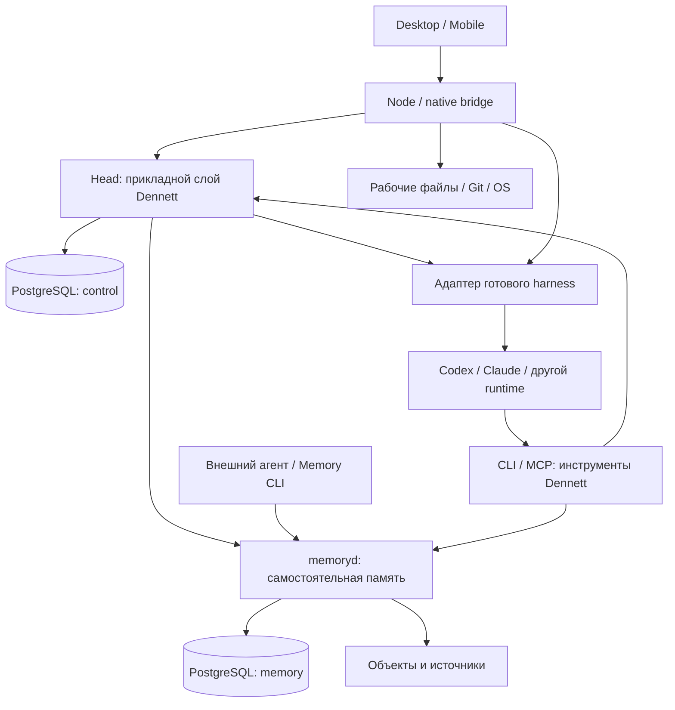

# Dennett: системная архитектура и топология исполнения

Версия 2.0 · 2026-09-26 · согласованная архитектурная база, **не отчёт о реализации**.
Приоритет: [состояние проекта](../restart/README.md), F01–F10, E01–E10 и контракт L. Этот том заменяет прежний том 80 целиком. Исходная редакция сохранена в [архиве](../archive/architecture-2026-07-13/README.md) и не является параллельным заданием разработчику.

## 1. Область и неизменяемые требования

Этот том владеет процессами, размещением, полномочиями узлов и порядком восстановления. [81](81_Dennett_Data_Memory_Storage_Sync_and_Protocol_Architecture.md) владеет данными, транзакциями, синхронизацией и восстановимым срезом; [82](82_Dennett_Agent_Voice_Capability_and_Integration_Architecture.md) — исполнением агентов, инструментами и голосом; [83](83_Dennett_Client_Operations_Testing_and_Implementation_Blueprint.md) — клиентами, представлением, поставкой и испытаниями. Один владелец не означает отдельный сервис на каждый пункт.

Сохраняется бизнес-логика 00–70 и дополнений 00/A–L/90 в пределах установленного приоритета. Подробные команды экранов и семантика памяти не дублируются здесь. В архитектуру перенесены следующие обязательства:

- разговор с агентом не обходит его память, поручения и ограничения Dennett;
- все агенты — один вид сущности, а не классы «главный/рабочий/временный»;
- смысловая кооперация описана текстом, без собственного графа потребителей и обязательных анкет;
- готовые агентные движки сохраняют своё исполнение и полезные возможности;
- **Memory Fabric предоставляется отдельным `dennett-memoryd`, в том числе без Head**;
- каноническое серверное состояние реализуется только на PostgreSQL; клиентское локальное состояние не становится второй серверной реализацией;
- выбранный полный резерв — подготовленный серверный комплект, а не увеличенный кэш;
- длительная работа, ожидания и локальная запись не зависят от открытого окна;
- права, остановка и учёт уже совершённых действий обеспечиваются не только промптами;
- новые интерфейсы не отменяют текст, изображения, файлы и произвольную веб-графику;
- самоулучшение использует реальное сравнение в изолированных условиях, не согласие моделей.

Разделение на программную архитектуру и архитектуру промптов обязательно. Программа даёт операции, хранение и необходимые гарантии. Агент выбирает содержательный способ работы. Изменение графика сотрудничества в тексте не должно требовать изменения схемы БД.

## 2. Системная форма и стек

Сохраняется модульный монолит с осмысленными процессными границами. Head не дробится на сеть микросервисов. Локальные модули вызывают друг друга непосредственно; IPC используется для реальной границы процесса.

Базовый стек: Rust для Head, Node, memoryd и системных адаптеров; Tauri 2 и React/TypeScript для desktop; React Native с нативными Kotlin/Swift-компонентами для mobile; PostgreSQL для канонического структурированного состояния; файловое content-addressed хранилище для больших объектов; Git/filesystem для рабочих проектов. Python/TypeScript SDK остаются допустимыми там, где приносят функции. Номера зависимостей закрепляются в release manifest после проверок, не словом «latest».

Отдельный процесс нужен для независимого использования, срока жизни, иной среды исполнения, привилегий, тяжёлой нагрузки или изоляции. Независимость памяти — **уже принятое основание**, а не гипотеза, которую разработчик вправе отменить ради сокращения числа процессов.

Не вводятся обязательные Kafka, Redis, Temporal, отдельная graph/vector DB, универсальная workflow-платформа, процесс на каждого агента или полный кластер консенсуса для каждой личной установки. Готовое средство выбирается на конкретной границе, а не заменяет весь Dennett.

## 3. Исполняемые части

### 3.1. Head

`dennett-head` владеет управляющим прикладным слоем: агентами и сессиями, значимыми поручениями/запусками, действующими политиками, бюджетами, durable events, Inbox, метаданными результатов и состоянием внешних действий. Главный агент — обычный настроенный участник внутри этого слоя, не сам процесс Head.

Head не исполняет самостоятельно каждую команду нативного агента, не хранит единственную копию состояния только у провайдера, не встраивает Memory Core и не работает как прокси всего медиатрафика. Клиент `MemoryPort` связывает его с memoryd. Падение памяти переводит затронутые операции в явное ожидание/частичный режим, но не отменяет Stop и сохранённые результаты.

### 3.2. Node устройства

`dennett-node` обеспечивает местные файлы, workspaces, процессы движков, ограниченные инструменты, локальную очередь, capture и соединение с Head. Он не равен Node.js. Head и Node используют общие библиотеки; на ПК могут устанавливаться одним пакетом, но роль Head активируется отдельно.

Node не становится новым глобальным авторитетом при потере сети. Ранее разрешённая локальная работа может продолжаться в явно доступных пределах; черновики и изменения сохраняются для последующего согласования. Локальный worktree не объявляется одновременно записываемой основной репликой серверного проекта.

### 3.3. Самостоятельный сервис памяти

`dennett-memoryd` — отдельный процесс и отдельно собираемый компонент. Он владеет памятью, её приёмом и актуализацией, источниками, рабочими документами, поиском, исправлением, удалением и переносом. `dennett-memory-core` остаётся библиотекой **внутри memoryd и тестов**, а не альтернативным способом размещения памяти в Head.

И Head, и внешний агент обращаются к одному версионируемому Memory API. Standalone-установка запускается с PostgreSQL, хранилищем объектов и собственной конфигурацией доступа; ей не нужны UI, Task service, главный агент или работающий Head. Для модельной обработки подключаются конфигурируемые порты моделей/индексов: их наличие не требует вызова оркестратора. Без такой возможности исходники и ручные заметки сохраняются, а соответствующая обработка ждёт или отключается явно.

Сервис не получает SQL-доступ к permissions/effects/tasks таблицам Head. Авторизация имеет независимую границу: standalone verifier и локальные правила либо интеграционный verifier полномочий Dennett. Проверка подписи, аудитории, области, срока и отзыва обязательна; имя агента в тексте запроса не является удостоверением. Нельзя сделать каждый запрос памяти синхронно зависимым от запуска Head. Операции, требующие свежей глобальной политики, при отсутствии её подтверждения ограничиваются согласно сроку полномочий, а не становятся безусловно разрешёнными.

Минимальные отдельно проверяемые сценарии: запустить memoryd без Head; подключить стороннего клиента; записать заметку; найти и открыть источник; исправить актуальное состояние; удалить данные в рамках политики; перезапустить сервис и повторить чтение. Head может быть остановлен в течение всего теста.

### 3.4. Клиенты и вспомогательные процессы

Desktop владеет окнами и представлением, mobile — доверенным управлением и нативными локальными возможностями. Они не имеют прямого доступа к серверной SQL-базе и не становятся владельцами задач через UI-кэш.

Codex App Server и Claude Code/SDK-host запускаются под наблюдением Node или Head рядом с рабочей средой. Дополнительный host нужен только при полезной работе SDK/языковой среды, не как обязательный пересыльщик. Браузер, локальная модель, OCR/media и недоверенный плагин изолируются по риску. Процессы можно группировать только при совместимых полномочиях и жизненном цикле.

## 4. Схема обычной установки

```mermaid
flowchart TB
  UI[Desktop / Mobile] --> N[Node / native bridge]
  N --> H[Head: прикладной слой Dennett]
  H --> M[memoryd: самостоятельная память]
  EXT[Внешний агент / Memory CLI] --> M
  H --> C[(PostgreSQL: control)]
  M --> D[(PostgreSQL: memory)]
  H --> R[Адаптер готового harness]
  N --> R
  R --> P[Codex / Claude / другой runtime]
  P --> T[CLI / MCP: инструменты Dennett]
  T --> H
  T --> M
  M --> O[Объекты и источники]
  N --> W[Рабочие файлы / Git / OS]
```

`control` и `memory` — разные домены и роли одного PostgreSQL cluster в стандартной установке, не два обязательных сервера PostgreSQL. Для standalone Memory не создаётся пустая control-база. Объекты могут разделять физический backend при раздельных областях доступа и независимом экспорте памяти.

## 5. Развёртывание и роли устройств

### 5.1. Личный ПК без отдельного сервера

Запускаются UI, постоянный Node, Head, отдельный memoryd и PostgreSQL. Закрытие UI не завершает остальные процессы. «Локальный» означает отсутствие обязательного внешнего сервера, **не SQLite вместо серверной памяти**. Установщик управляет локальными зависимостями; пользователь не обязан вручную собирать цепочку процессов.

### 5.2. Персональный сервер и обычные клиенты

Head/memoryd/PostgreSQL/объекты работают на сервере. Клиенты имеют scoped cache, drafts, capture staging и operation log. Допустим локальный поиск по доступным данным; он маркирует актуальность и неполноту. Объём реплики — явная настройка, не скрытая копия всей личной памяти на каждом телефоне.

### 5.3. Полный резервный ПК или ноутбук

Владелец явно разрешает роль полного резерва. Узел заранее получает совместимый серверный runtime, PostgreSQL standby, все канонические данные выбранной установки, необходимые внешние объекты и рабочие материалы, настройки, разрешённый доступ к ключам и доступные средства исполнения. Резерв не конвертируется из клиентской SQLite при аварии.

Полнота охватывает данные, но не создаёт отсутствующий GPU, физическое устройство, облачную доступность или логин провайдера. Readiness отдельно показывает ограничения этих возможностей. Система не объявляет «всё готово», пока обязательная зависимость отсутствует.

Телефон остаётся клиентом и может хранить разрешённые данные. Полный Head на телефоне не обещается без поддержанного серверного окружения и жизненного цикла ОС. Это не ограничивает полноту подготовленного ПК.

### 5.4. Поддерживаемая база репликации

Полные standby используют штатную физическую потоковую репликацию PostgreSQL. Базовый failover-профиль стандартизирует совместимые major version, бинарную архитектуру, расширения и пути PostgreSQL. Для Linux-сервера и Windows-ПК допускается одинаковая закреплённая Linux-среда PostgreSQL через поддержанный контейнерный/WSL2-хост; жизненный цикл этого хоста проверяется отдельно от UI. Произвольная пара Linux/Windows/ARM не объявляется совместимой по одному имени PostgreSQL. Нативная установка допускается после тех же проверок совместимости [AR04].

Репликация SQL, доставка пользовательских операций и перенос файлов — разные границы. Внешние объекты и файлы не попадают в WAL автоматически; точный контракт находится в 81.

## 6. Владение и зависимости модулей

Доменные библиотеки зависят от узких контрактов, не от UI, concrete storage и SDK провайдера. Composition Root выбирает реализации; глобальный service locator не используется.

`head → memory-client → Memory API`; **нет** `head → memory-core` в production-размещении. `memoryd → memory-core + PostgreSQL/Object/Model adapters`; **нет** `memoryd → Head application`, Task DB или UI. Общие типы identity/scope/provenance не должны тянуть весь control runtime.

Клиент, CLI и MCP используют один прикладной обработчик своего домена. Прямая работа внешнего клиента с Memory API допустима и не требует транзита через Head. Встроенные операции Head, включая отправку сообщений, не получают альтернативного обходного пути через Memory API.

Для сериализации на границах нужны типы и версии; смысловые задания агентов остаются текстом. Машинные идентификаторы запуска, подписи, номера доставки и ссылки на источник не являются графом кооперации.

## 7. Власть, права и защита от двух Head

Одновременно действует один авторизованный Head установки. `head_eligibility` выдаётся владельцем, не моделью, импортом или наличием реплики. Основной PostgreSQL и активный Head — связанные, но разные состояния: повышение БД само не даёт разрешения исполнять глобальные действия.

Все исполнители последствий проверяют актуальную эпоху и срок полномочий. Локальная запись новой эпохи в изолированной копии PostgreSQL **сама по себе не отсекает старый живой сервер**. Требуется подтверждённое прекращение его полномочий/исполнения либо внешний согласованный механизм владения с fail-closed leases. Открытый TCP socket и старый cache такой гарантии не дают [AR05]. Fencing относится ко всем writer-путям прежней установки, включая прямые записи внешних клиентов в memoryd и прежний PostgreSQL primary, а не только к процессу Head. Самостоятельность Memory API не разрешает два writable memory-primary.

В стандартной установке без отдельного HA-координатора предусмотрен управляемый перенос. Автоматическое продвижение разрешается только при настроенном и испытанном готовом механизме election/fencing; наличие одного witness-файла без атомарного владения и принудительного отсечения недостаточно. Кластер консенсуса не становится обязательной зависимостью простого профиля.

Отмена отзываемых прав применяется и к native runtime: через поддержанные policy hooks/sandbox/credentials и остановку процесса там, где требуется. Если исполнитель технически не позволяет обеспечить обязательную границу, конкретная операция не допускается в таком режиме, а не объявляется безопасной на основании журнала постфактум.

## 8. Переключение и возврат сервера

### 8.1. Плановый перенос

1. Проверить разрешение владельца, версии, ресурсы, файлы и ключи кандидата.
2. Остановить приём новых глобальных изменяющих операций прежним Head; закончить или безопасно зафиксировать начатые действия. Длинное рассуждение не требует удерживать SQL-транзакцию.
3. Получить согласованный срез 81: подтверждённые позиции данных и наличие связанных объектов/файлов.
4. Подтвердить отсечение прежнего исполнителя и передачу authority; лишь затем повысить PostgreSQL и активировать Head/memoryd записи кандидата.
5. Переподключить Nodes по новой эпохе, согласовать UNKNOWN-действия, восстановить доступные сессии и ожидания.
6. Вернуть прежний сервер резервом. Не держать два writeable primary ради «обратной синхронизации».

### 8.2. Неплановый отказ

Недоступность сети не доказывает смерть сервера. Без доказанного fencing полный новый Head не самоназначается. Клиентские черновики и разрешённая локальная работа сохраняются; недостаток глобальной власти видим.

После безопасного продвижения учитываются реальное отставание базы, наличие файлов и политика допустимой потери. Отправленное перед сбоем действие с неизвестным результатом не повторяется. Бесшовный перенос скрытого состояния модели и живого процесса провайдера не обещается.

### 8.3. Возврат старого primary

Сначала сохранить данные для разбора возможного расхождения; запретить обслуживание пользователей старым Head. При выполнении предпосылок использовать `pg_rewind`, иначе новую базовую копию и WAL catch-up. Это не merge двух ветвей SQL. Непринятые пользовательские локальные операции согласуются отдельным клиентским путём [AR06].

## 9. Каналы взаимодействия

Внутри процесса — обычные вызовы. Между доверенными локальными процессами — версионированный gRPC/Protobuf по UDS или проверенному Windows IPC; локальный защищённый TCP допустим при эквивалентной проверке peer и секрета подключения. Head↔Nodes — mTLS и возобновляемые управляющие потоки. Большие bytes передаются отдельно по resumable object channel. Голос использует подходящий media transport, а не очередь SQL-событий на каждый аудиофрейм.

Provider-native протокол не переписывается под gRPC ради единообразия. Например, адаптер Codex использует документированный протокол процесса; CLI Dennett вызывает тот же прикладной интерфейс, что MCP. Внешний Memory API получает тонкий HTTP/MCP-фасад там, где это нужно сторонним клиентам, без копирования семантической реализации.

Deadline, cancellation и ограничение буфера задаются на каждой настоящей границе. Watch UI не является надёжной очередью внешних действий. Потоковые токены можно объединять; принятые команды, финальные результаты и receipts не теряются как «шум».

## 10. Ожидания и события

Head сохраняет условие времени/сигнала, адресат, область разрешения, срок, deduplication и политику опоздания для значимого ожидания. Текст содержательной реакции принадлежит агенту/навыку. Не требуется бесконечный вызов модели для проверки таймера.

Программа сообщает факт завершения, ошибки или наступления условия. Решение «проверить причину, ждать, сменить подход, спросить человека» по умолчанию принимает агент. Расписание не становится графом мыслительных шагов. Для явной структурированной автоматизации можно использовать существующую последовательность операций или подходящий готовый durable engine, без навязывания всем задачам.

Запись события и установка курсора чтения согласованы по правилам 81; нет окна «событие произошло до подписки и исчезло». Повтор и поздний сигнал проверяются по действующему поручению. Для локального календарного времени сохраняются IANA zone, wall-time/instant semantics, DST и catch-up policy из контракта I.

## 11. Сбои и ресурсные границы

Supervisor перезапускает отказавший компонент с ограничением частоты, сохраняет причину и circuit-open состояние. Перезапуск процесса не означает повтор внешнего действия. Head хранит принятое обязательство до запуска, а не получает его единственную копию из stdout после успеха.

Недоступен memoryd: результаты и команды управления остаются в control store, запись в память ставится в durable outbox; операции, требующие актуальной памяти, ждут либо показывают ограниченный контекст. Memoryd доступен без Head: самостоятельные чтения/разрешённые записи продолжаются в его режиме authority. PostgreSQL недоступен: новое каноническое подтверждение не выдаётся; безопасные локальные drafts/captures сохраняются отдельно. Утрачен provider: доступное состояние сохраняется, fallback не меняет выбранную пользователем модель скрытно.

Stop, отзыв прав, голосовое прерывание и локальное сохранение получают приоритет над indexing/consolidation. Модель, OCR и browser имеют лимиты CPU/RAM/VRAM/диска/времени. Очереди ограничены; явный отказ предпочтительнее безграничного накопления. Тяжёлая обработка памяти вынесена в workers при необходимости; отдельный memoryd не означает отдельный процесс для каждой функции.

При давлении диска первыми удаляются разрешённые кэши и производные; неподтверждённые captures и канонические данные не уничтожаются молча. Отставший standby не удерживает WAL бесконечно: лимит и предупреждение, затем явная необходимость re-seed без заполнения основного диска [AR07].

## 12. Независимость ОС и интерфейса

На desktop постоянно работающие компоненты регистрируются штатным сервисным механизмом. Windows capture/input выполняются в нужной интерактивной пользовательской сессии, а не обещаются из session-0 службы. macOS/Linux учитывают permissions и пользовательский login. Закрытое окно не равно завершённому сервису; выключенный компьютер не исполняет задачи.

Mobile использует нативные persistent/background mechanisms и локальную фиксацию, не рассчитывает на вечный JavaScript-процесс [AR17]. Разделение device role, наличия данных и текущего исполнения сохраняется на всех платформах.

Графика и UI из L размещаются в клиентах и изолированных surface hosts. Они не являются дополнительным Head, не владеют всей памятью агента и не получают секреты или полномочия из собственного состояния.

## 13. Обновления и эволюция

Совместимость определяется версиями контрактов и заявленными возможностями. Новая модель с совместимым интерфейсом может добавляться настройкой; новая семантика требует локального изменения адаптера. Никакой контракт не обещает нулевых изменений кода при любом будущем прогрессе.

Head и memoryd обновляются независимо в проверенном окне совместимости. Memory service владеет своими миграциями; standby не применяет их независимо поверх физической реплики. Несовместимое изменение останавливается до разрушения данных; forward-fix предпочтительнее фиктивного rollback приложения на несовместимую схему.

Выбранная пользователем прямая модель не меняется скрытно. Конфигурация внутренних исполнителей может упрощаться в разрешённых пределах. Продвижение общих автоулучшений выполняется по E01–E10, а не через безусловную запись нового промпта самим кандидатом.

## 14. Проверка системной формы

Обязательны независимый запуск memoryd, остановка UI при работающем поручении, отказ memoryd/Head/provider по отдельности, replica lag и отсутствие объекта, partition двух живых Head, возврат старого primary, отзыв действующих прав, потеря сети во время ожидания и pressure-тест.

[Матрица соответствия и проверки](ARCHITECTURE_VALIDATION.md) отделяет документально согласованное от непроведённых испытаний. Этот том задаёт исполнимые границы, но не утверждает, что текущий код их уже обеспечивает.

## Источники

[AR04–AR07, AR17](../research/2026-09-26_architecture_evidence.md) подтверждают возможности и ограничения PostgreSQL/платформ. Самостоятельный memoryd и текстовые связи — решения владельца, не вывод о научном превосходстве. Старые причины и рассмотренные альтернативы сохранены в архиве как история, не как действующие исключения.

[AR04]: ../research/2026-09-26_architecture_evidence.md#ar04

[AR05]: ../research/2026-09-26_architecture_evidence.md#ar05

[AR06]: ../research/2026-09-26_architecture_evidence.md#ar06

[AR07]: ../research/2026-09-26_architecture_evidence.md#ar07

[AR17]: ../research/2026-09-26_architecture_evidence.md#ar17
