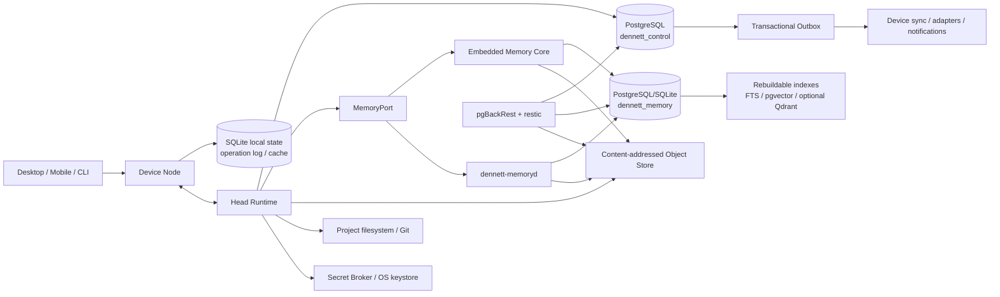
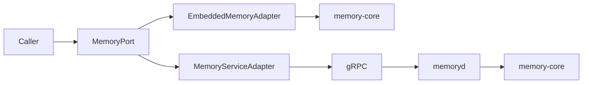

# Dennett Data, Memory, Storage, Sync and Protocol Architecture

> **Repository edition · 2026-07-13 · `81`**  
> Канонический архитектурный том. Сначала прочитайте [карту архитектуры](README.md) и [cross-domain contracts](../specifications/contracts/README.md).  
> Бывший временный предархитектурный документ разнесён по этим contracts; исторические ссылки на него означают данный интегрированный набор.


## Физическая архитектура данных, памяти, хранилищ, индексов, синхронизации, протоколов, удаления, резервного копирования и миграций

**Версия:** 1.0  
**Дата исследования:** 13 июля 2026 года  
**Статус:** канонический архитектурный baseline второго тома; определяет физические источники истины и контракты данных до создания кодового skeleton.  
**Каноническое имя:** `81_Dennett_Data_Memory_Storage_Sync_and_Protocol_Architecture.md`.

Этот документ является самостоятельным. Он предполагает только общее понимание Dennett как персональной агентной операционной системы: у пользователя есть проекты и проектные агенты, главный оркестратор, долговременная память, голосовой и ambient-режимы, несколько устройств, подключаемые модели и инструменты, фоновые задачи и возможность работать локально, через персональный сервер или гибридно.

Том отвечает на вопрос:

> **Где физически живёт каждое состояние Dennett, какие данные являются каноническими, как они записываются, ищутся, синхронизируются, удаляются, восстанавливаются и передаются между процессами и устройствами без превращения персональной системы в тяжёлую распределённую платформу?**

Он продолжает архитектурный том `80_Dennett_System_Architecture_and_Runtime_Topology.md`, который выбрал process-selective modular monolith, один логический Head Runtime, локально способные Device Nodes, Rust-ядро, Tauri desktop, заменяемые адаптеры и необязательный `dennett-memoryd`. Этот том не меняет эти решения, а делает их реализуемыми на уровне данных. [[S12]]

Документ не описывает окончательную внутреннюю архитектуру конкретных providers, голосовых моделей и computer-use; этим будет заниматься том 82. Он также не повторяет бизнес-логику UI. Его задача — дать будущему коду однозначные storage ownership, transaction boundaries, wire contracts, consistency rules и recovery paths.

Нормативными входами являются функциональная концепция [[S01]], карта спецификаций [[S02]], Memory Fabric [[S03]], Agentic Control Fabric [[S04]], Trust Fabric [[S05]], Capability Fabric [[S06]], Server Runtime [[S07]], Voice Fabric [[S08]], desktop/mobile-логика [[S09]], end-to-end аудит [[S10]], pre-architecture completion [[S11]] и том 80 [[S12]]. При конфликте этот том не переписывает их продуктовую семантику, а обязан вернуть противоречие владельцу соответствующего документа.

---

## Как читать этот том

Том организован от решений к реализации и проверке:

1. **Части I–III** фиксируют архитектурные драйверы, классы данных, источники истины и выбранные физические хранилища.
2. **Части IV–VI** описывают каноническую память, поисковые проекции и operational state.
3. **Части VII–IX** задают transaction boundaries, согласованность, offline sync и wire protocols.
4. **Части X–XIII** определяют project packages, удаление, backup, restore и migrations.
5. **Части XIV–XVI** переводят решения в capacity model, тестовые контракты и структуру кода.
6. **Части XVII–XIX** содержат самокритику, условия замены компонентов, передачу следующим томам и Definition of Done.

Главная карта данных:



Каноничность на этой схеме означает следующее: PostgreSQL/SQLite хранят структурированное состояние в своих deployment profiles; Object Store хранит неизменяемые bytes; Git/filesystem остаётся authority проектных файлов; индексы ускоряют чтение, но могут быть удалены и пересобраны; клиенты никогда не обращаются к физическим хранилищам в обход владельца домена.

# Часть I. Итоговое решение и метод исследования

## 0. Архитектурный вердикт

### 0.1. Минимальная полиглотная архитектура вместо «одной базы на всё» и вместо зоопарка хранилищ

Для первой production-способной версии Dennett принимается следующий физический baseline:

1. **PostgreSQL** — серверный источник истины для operational state и канонической долговременной памяти.
2. **SQLite** — локальное и offline-хранилище каждого Device Node, локального профиля и тестовой установки.
3. **Неизменяемое content-addressed object storage** — большие evidence-объекты, screenshots, audio, документы, artifacts, backup chunks и другие bytes.
4. **PostgreSQL Full Text Search + pgvector + обычные реляционные индексы** — первый серверный поисковый слой.
5. **SQLite FTS5 + ограниченный локальный vector adapter** — быстрый локальный поиск по доступному subset, когда он действительно нужен.
6. **Git и filesystem проекта** — источник истины для проектных файлов и кода, а не таблицы памяти.
7. **Платформенные keystore/vault и Secret Broker** — секреты; в обычных БД остаются только handles и metadata.
8. **PostgreSQL WAL/PITR + pgBackRest и restic** — рекомендуемый backup path персонального сервера; SQLite Online Backup API и опциональный Litestream — для локальных БД.

Это уже несколько технологий, но они образуют не случайный «зоопарк», а четыре фундаментально разные роли:

```text
structured authoritative state
+ local/offline state
+ large immutable bytes
+ rebuildable search acceleration
```

Нельзя безопасно заменить их одной vector database. Нельзя также оправдать отдельные Neo4j, Elasticsearch, Qdrant, Kafka, Redis, S3-кластер и CRDT-service до появления измеримой нагрузки, которую baseline не выдерживает.

### 0.2. Два канонических серверных домена данных

На персональном сервере используется один PostgreSQL cluster, но два логически разделённых владельца данных:

```text
PostgreSQL cluster
├── dennett_control   # Head Runtime и operational modules
└── dennett_memory    # Memory Core / memoryd
```

У каждого — отдельная database role, migration stream и repository layer.

Причины разделения:

- `dennett-memory-core` должен оставаться переиспользуемым вне полного Dennett;
- `memoryd` может быть отдельным процессом;
- memory schema и operational schema имеют разные темпы эволюции;
- memory indexing и consolidation не должны получать прямой доступ к permission, effect или Task tables;
- cross-domain взаимодействия должны быть явными, а не скрытыми SQL JOIN между чужими таблицами.

Это **не два независимых сервиса по умолчанию**. В local-only profile обе БД могут быть SQLite-файлами и обе application-модели могут работать in-process. Разделение логическое и тестируемое, а физическое выделение остаётся опциональным.

### 0.3. Память сохраняет смысловую гибкость

Физическая схема памяти не превращает все человеческие сведения в жёсткую онтологию.

Строго типизированы:

- идентичность записи;
- scope;
- provenance;
- время;
- evidence references;
- sensitivity;
- lifecycle;
- influence class;
- current/conflict/deletion state;
- operational contracts, требующие детерминированного поведения.

Свободными или эволюционируемыми остаются:

- Open Observations;
- Human Notes;
- Topic Documents;
- дополнительные facets;
- domain-specific claim payloads;
- generated views;
- project-specific schemas.

Для этого основные semantic entities имеют стабильный control envelope и расширяемый typed JSON payload. Новая вкусовая, социальная или исследовательская категория не требует новой SQL-таблицы и миграции всей истории.

### 0.4. Индексы не являются памятью

Vector, lexical, graph, multimodal и summary representations являются **rebuildable projections**.

Если pgvector index, FTS index или внешний Qdrant сломался:

- канонические events и evidence остаются доступны;
- новая запись памяти продолжается;
- exact и recent-overlay чтение сохраняются;
- UI показывает degraded retrieval;
- индекс строится заново из canonical store;
- восстановление индекса не переписывает исходные доказательства.

### 0.5. Синхронизация является доменным протоколом, а не репликацией БД

Device Node не получает логическую репликацию PostgreSQL и не синхронизирует SQLite-файлы целиком.

Каждое устройство ведёт локальный append-only **Operation Log**. Head принимает операции, проверяет:

- identity устройства;
- Authority Epoch;
- scope;
- base revision;
- idempotency;
- permission freshness;
- object dependencies;
- domain merge policy.

После этого операция:

- принимается;
- отклоняется;
- преобразуется;
- создаёт conflict;
- требует пользовательского решения;
- становится stale/no-op.

Так Dennett сохраняет бизнес-смысл offline-команды и не смешивает техническую репликацию страниц БД с разрешениями, конфликтами и внешними эффектами.

### 0.6. Протоколы выбираются по границе

```text
внутри одного процесса       Rust calls / domain types
локально между процессами    gRPC/Protobuf over UDS or named pipe
Head ↔ Device Nodes          mTLS gRPC streams + version negotiation
большие объекты              chunked resumable object protocol
voice/media                  специализированный streaming data plane
public developer API         optional HTTP/JSON + OpenAPI
asynchronous documentation   AsyncAPI / CloudEvents-like semantics
portable packages            JSON Schema manifests + files/objects
```

Один внутренний вызов не превращается в REST-запрос. Один сетевой протокол не обязан обслуживать low-latency cancel, гигабайтный artifact и realtime audio одинаковым способом.

### 0.7. Короткая формула

> **Dennett Data Architecture — это минимальная полиглотная система: PostgreSQL хранит серверную operational и доказательную истину, SQLite даёт локальность и offline, content-addressed object storage удерживает большие неизменяемые bytes, а все интеллектуальные индексы являются сменными проекциями. Синхронизация передаёт доменные операции, протоколы версионируются, а ни UI, ни provider, ни vector store не получают право стать скрытым источником истины.**

---

## 1. План для построения плана и исследовательский протокол

### 1.1. Что должен был позволить финальный результат

До исследования были зафиксированы обязательные способности будущей архитектуры:

- разработчик может создать модули и migrations, не придумывая ownership заново;
- local-only установка запускается без PostgreSQL-сервера;
- personal-server установка не требует ручного администрирования множества баз;
- embedded memory и `memoryd` ведут себя одинаково;
- память переживает замену embedding model и index backend;
- Device Node работает offline и синхронизируется без silent overwrite;
- внешний эффект не повторяется после timeout;
- удаление проходит через все active replicas и indexes;
- backup действительно восстанавливает систему;
- проектная память переносится через Git без коммита огромных индексов;
- новая версия приложения может сосуществовать со старым устройством в ограниченном окне;
- новый storage, vector engine или sync adapter можно добавить без изменения domain core;
- все критические переходы можно воспроизвести в deterministic simulation.

### 1.2. Высокоimpact-решения

Отдельно проверялись решения, которые позднее трудно изменить:

1. server authoritative DB;
2. local DB;
3. граница `memory-core`/`memoryd`;
4. форма Event Ledger;
5. IDs и ordering;
6. object identity и шифрование;
7. sync protocol;
8. wire schemas;
9. search baseline;
10. backup/PITR;
11. migration policy;
12. формат project memory pack.

### 1.3. Кандидаты, сравнённые для structured state

Сравнивались:

- PostgreSQL;
- SQLite-only с file replication;
- embedded Postgres/PGlite;
- Couchbase Lite + Sync Gateway;
- document database;
- event-store-first система;
- PostgreSQL + отдельный vector DB;
- cloud-only managed database;
- гибрид PostgreSQL server + SQLite edge.

Выбран гибрид PostgreSQL + SQLite, потому что он даёт:

- зрелую transactional основу на сервере;
- богатые structured/temporal queries;
- локальную работу без отдельного сервера;
- понятные backup-инструменты;
- одну хорошо поддерживаемую Rust data-access abstraction;
- возможность позднее заменить sync implementation, не меняя canonical domain.

Couchbase Lite остаётся технически сильной альтернативой для готового mobile/edge sync, но сделал бы Dennett зависимым от собственной document/revision/conflict модели Couchbase. Он может быть повторно рассмотрен, если custom sync окажется существенно дороже и менее надёжным, чем ожидается.

### 1.4. Кандидаты для search

Сравнивались:

- PostgreSQL FTS + pgvector;
- Qdrant;
- OpenSearch/Elasticsearch;
- LanceDB;
- SQLite FTS5 + sqlite-vec;
- hnswlib/USearch;
- отдельный graph database;
- direct full scan для небольших наборов.

Принято:

- Postgres/pgvector как default server baseline;
- SQLite FTS5 и optional local vector extension для edge;
- Qdrant как заранее предусмотренный adapter и вероятный второй этап;
- OpenSearch только при доказанной необходимости тяжёлого enterprise search;
- graph relations сначала хранятся в relational adjacency tables;
- direct/exact search остаётся baseline и oracle для оценки ANN.

### 1.5. Кандидаты для object storage

Сравнивались:

- локальная filesystem CAS;
- PostgreSQL large objects/bytea;
- S3/S3-compatible storage;
- Garage;
- Ceph;
- MinIO/AIStor;
- cloud object stores;
- Syncthing folders.

Выбран один `ObjectStorePort` с default filesystem adapter и S3-compatible adapter.

Отдельный object server не требуется в local-only или маленьком personal-server profile. Garage/Ceph/cloud storage подключаются только если нужны репликация, несколько дисков, удалённое хранение или большой объём.

### 1.6. Кандидаты для sync

Сравнивались:

- file sync;
- database replication;
- CRDT everywhere;
- CouchDB/Couchbase-style revision sync;
- Electric/PowerSync read synchronization;
- custom domain operation protocol;
- Syncthing для project directories;
- Git для project files.

Принят domain operation protocol, потому что Dennett должен синхронизировать не только документы, но и:

- permissions;
- offline commands;
- Tasks/Runs;
- events;
- memory corrections;
- deletion obligations;
- object references;
- Head epoch;
- unknown effects.

Готовые sync engines допускаются как adapters для отдельных классов данных, но не как универсальная authority model.

### 1.7. Overengineering audit

Для каждого механизма задавались вопросы:

- можно ли обойтись одной таблицей вместо отдельной БД;
- нужен ли broker или достаточно outbox polling;
- нужен ли Qdrant или pgvector достаточен;
- нужен ли CRDT или three-way merge проще;
- нужен ли отдельный object server или filesystem CAS достаточен;
- нужна ли server partitioning с первого дня;
- нужен ли сложный event store или append-only table достаточно;
- нужен ли Protobuf во внутренних in-process calls;
- требуется ли полная temporal graph DB;
- можно ли использовать готовый backup engine;
- можно ли удалить механизм без потери canonical data.

### 1.8. Underengineering audit

Параллельно проверено, не исчезают ли при упрощении:

- atomic state + outbox;
- bitemporal history;
- exact deletion;
- offline conflict preservation;
- idempotency;
- object integrity;
- index rebuild;
- point-in-time recovery;
- protocol version skew;
- cross-device permission revalidation;
- portable project memory;
- reproducible restore.

### 1.9. Критерий принятия компонента

Компонент принимается в baseline, если:

- решает обязательный failure mode;
- имеет зрелую implementation и operational story;
- работает локально или имеет локальный fallback;
- не становится вторым скрытым source of truth;
- имеет понятный backup/restore;
- можно покрыть contract tests;
- не требует отдельного администратора;
- допускает замену через port;
- улучшает cost of success относительно простого варианта.

### 1.10. Критерий отказа или перевода в optional

Механизм удаляется из baseline, если:

- нужен только для гипотетического масштаба;
- заставляет синхронизировать всё одной моделью;
- создаёт distributed transaction между core domains;
- требует model call на обычной write path;
- делает index каноническим;
- ломает local-only profile;
- дублирует PostgreSQL/SQLite без измеримой пользы;
- не имеет recovery path;
- не может быть протестирован in-process/fake adapter;
- создаёт больше operational failure domains, чем закрывает.

---

# Часть II. Архитектурные драйверы, данные и источники истины

## 2. Приоритеты качества

### 2.1. Сохранность и корректность

Первый приоритет — не максимальная скорость поиска, а отсутствие потери:

- пользовательских данных;
- evidence;
- project history;
- external effect state;
- permissions;
- offline operations;
- deletion obligations;
- recovery material.

### 2.2. Rebuildability

Любое производное представление должно иметь:

- canonical input;
- versioned builder;
- generation ID;
- progress/watermark;
- возможность parallel rebuild;
- verification;
- atomic activation;
- rollback на прежнее поколение.

### 2.3. Local-first utility

Устройство должно быть полезным без Head:

- открыть локальные проекты;
- читать cached memory;
- писать notes и capture;
- работать с локальной моделью;
- продолжать локальный project chat;
- создавать queued operations;
- понимать freshness и ограничения.

### 2.4. Простота эксплуатации

Personal-server profile не должен требовать:

- Kubernetes;
- отдельный Kafka/NATS cluster;
- несколько distributed DB;
- ручное шардирование;
- постоянный DBA;
- rebuild с потерей доступа к каноническим данным.

### 2.5. Изменяемость

Новое хранилище или index backend подключается через adapter и migration path. Domain entities не зависят от SQLx types, Qdrant payloads или S3 SDK.

### 2.6. Наблюдаемость

Для любой записи должно быть возможно ответить:

- кто её создал;
- откуда она пришла;
- где находится authority;
- на каком устройстве она уже присутствует;
- каким индексом она покрыта;
- когда и как была изменена;
- почему она видна агенту;
- как её исправить или удалить;
- входит ли она в подтверждённый backup.

---

## 3. Неподвижные data-инварианты

1. Ни UI, ни provider, ни search index не являются источником истины.
2. Project files принадлежат filesystem/Git, а не memory tables.
3. Secret value не хранится как обычный Evidence Object.
4. Canonical event append выполняется до смысловой интерпретации.
5. Semantic projection можно удалить и пересобрать.
6. Cross-domain mutation не требует distributed transaction.
7. State change и outbox record фиксируются атомарно в одном domain store.
8. Внешний effect получает claim до dispatch.
9. Offline operation сохраняет origin, base revision и idempotency.
10. Wall-clock timestamp не является единственным порядком событий.
11. Conflict не исчезает через blind last-write-wins.
12. Deletion является отслеживаемым графом работ, а не одной SQL-командой.
13. Backup отличается от sync и реплики.
14. Restore считается успешным только после проверки смысла, а не только запуска процесса.
15. Object bytes проверяются hash до активации.
16. Generated summary не заменяет исходное evidence.
17. Старая версия protocol не получает скрыто новое значение поля.
18. Local cache всегда имеет freshness/watermark.
19. Indexer не может блокировать canonical write path бесконечно.
20. Физическое partitioning вводится по измерениям, а не заранее.
21. Любая shared table имеет одного module owner.
22. Application code другого модуля не выполняет direct SQL к чужим tables.
23. Embedded и service Memory adapters проходят один conformance suite.
24. Portable package не содержит private overlay без явного export policy.
25. Удаление active data не обещает удалить уже переданный пользователем внешний export; остаточные ограничения сообщаются честно.

---

## 4. Восемь физических плоскостей данных

### 4.1. Operational Control Plane

Хранит строго актуальные и управляемые сущности:

- Installation и Head authority;
- Devices;
- Projects records;
- Sessions;
- Tasks, Runs и checkpoints;
- agents/provider session handles;
- events/schedules/subscriptions;
- Action Inbox;
- notifications;
- effect claims/receipts;
- capability state snapshots;
- budgets/usage;
- update/migration state.

**Authority:** `dennett_control` на Head.  
**Local copy:** selective SQLite projection/cache.  
**Consistency:** strong на Head, optimistic/cached на clients.

### 4.2. Canonical Memory Plane

Хранит:

- Memory Events;
- Evidence metadata;
- Memory Spaces;
- observations/episodes;
- claims/current state;
- relations;
- corrections/conflicts;
- causal traces;
- prospective intents;
- topic documents;
- notes;
- procedures;
- instruction interoperability;
- retention/deletion state;
- retrieval/influence audit.

**Authority:** `dennett_memory`.  
**Local copy:** scoped subset и operation log.  
**Consistency:** append/temporal; projections eventual, current-state resolver dependent.

### 4.3. Object and Media Plane

Хранит bytes:

- screenshots;
- audio/video segments;
- documents;
- images;
- model outputs;
- archives;
- artifacts;
- import packages;
- diagnostic bundles;
- backup manifests/chunks.

**Authority:** immutable object version + metadata record.  
**Consistency:** immutable, hash-verified.  
**Replication:** lazy/tiered.

### 4.4. Search and Projection Plane

Хранит:

- FTS documents;
- embeddings;
- vector indexes;
- graph adjacency/search projections;
- entity resolution candidates;
- multimodal embeddings;
- summaries;
- Global Search documents;
- Radar/read views.

**Authority:** отсутствует; всё пересобираемо.  
**Consistency:** eventual + explicit watermark.

### 4.5. Device Local Plane

Хранит:

- offline operation log;
- local project/session state;
- queued commands;
- local capture staging;
- cached memory;
- local search indexes;
- downloaded artifacts;
- object cache;
- UI resume state;
- node capability inventory;
- sync watermarks.

**Authority:** локальная операция до Head acceptance; после acceptance — Head/domain authority.

### 4.6. Project Files Plane

Хранит реальные рабочие файлы проекта.

**Authority:** конкретная папка, worktree, commit или remote repository согласно project binding.  
**Sync:** Git, provider-native storage, Syncthing или ручной перенос; не Memory DB replication.

### 4.7. Secret Plane

Хранит credentials и cryptographic key material через platform keystore, OS secure enclave, vault или Secret Broker.

Operational и Memory stores содержат только:

- secret handle;
- provider/account identity;
- scope;
- expiry;
- usage/audit reference;
- revocation state.

### 4.8. Telemetry Plane

Хранит traces, metrics, logs, crash reports и profiling data.

Он имеет отдельные:

- retention;
- redaction;
- export policy;
- sampling;
- storage quota.

Telemetry не используется как единственный source of truth для user data или external effect.

---

## 5. Data ownership matrix

| Данные | Канонический владелец | Физический baseline | Local representation | Derived |
|---|---|---|---|---|
| Installation/Head epoch | Installation module | PostgreSQL control | SQLite cache | status view |
| Device state | Device Coordinator | PostgreSQL control | SQLite node DB | Radar |
| Project record | Project module | PostgreSQL control | SQLite cache | Home/Search |
| Project files | filesystem/Git | project directory/repository | local checkout | code index |
| Task/Run | Runtime Registry | PostgreSQL control | selective SQLite | Radar/Timeline |
| Permission | Trust Registry | PostgreSQL control + secure policy | signed/cached grant | UI explanation |
| Effect | Effect Dispatcher | PostgreSQL control | pending local request | audit timeline |
| Memory Event | Memory Core | PostgreSQL memory/SQLite embedded | scoped copy | all semantic views |
| Evidence bytes | Object Store | filesystem CAS/S3 | object cache | OCR/embeddings |
| Claim/Current State | Memory Core | PostgreSQL memory | scoped cache | context bundle |
| Artifact | Artifact module + Object Store | metadata DB + immutable object | cache | previews/search |
| Capability state | Capability Registry | PostgreSQL control | node inventory/cache | selector view |
| Secret value | Secret Broker | keystore/vault | device-local protected | none |
| Search index | Index Coordinator | Postgres/SQLite/Qdrant optional | local index | itself |
| UI layout/draft | client | SQLite/client store | local | sync optional |
| Backup | Backup Coordinator | pgBackRest/restic targets | manifest cache | restore report |

---

## 6. Идентификаторы, время и версии

### 6.1. UUIDv7 для сущностей и событий

Для всех independently created domain entities используется UUIDv7: [[S28]]

- sortable по приблизительному времени создания;
- генерируется без центрального сервера;
- переносим между PostgreSQL, SQLite, Protobuf и packages;
- не раскрывает MAC address;
- не требует coordinate round-trip.

Текстовое представление — canonical lowercase UUID. В БД используется native UUID/BLOB(16), а не произвольный string, если driver поддерживает это без потери переносимости.

UUID не является security secret и не используется как permission.

### 6.2. Дополнительный source sequence

Каждое устройство хранит:

```text
device_id
+ device_epoch
+ monotonically increasing source_sequence
```

`device_epoch` меняется после восстановления локального state, re-pair или потери sequence continuity.

Это позволяет:

- обнаружить пропуск;
- дедуплицировать replay;
- восстанавливать локальный порядок;
- не доверять одному wall clock.

### 6.3. Idempotency keys

Отдельно от entity ID существуют idempotency keys:

- пользовательская команда;
- sync operation;
- provider invocation;
- external effect;
- object upload session;
- package import;
- migration step;
- outbox delivery.

Одна и та же операция с тем же ключом и другими parameters отклоняется как mismatch, а не выполняется повторно.

### 6.4. Content identifiers

Externally portable object identifier:

```text
sha256:<hex>
```

Причины:

- повсеместная совместимость;
- устойчивость для packages и manifests;
- понятность внешним инструментам;
- удобная проверка без Dennett.

Для внутренних chunk trees допускается BLAKE3 из-за высокой скорости и parallel hashing, но algorithm всегда указан в ID; система не предполагает один hash навсегда. [[S40]]

### 6.5. Временные поля

В зависимости от сущности используются:

- `occurred_at` — когда событие произошло в мире;
- `observed_at` — когда source его наблюдал;
- `recorded_at` — когда локальная система записала;
- `ingested_at` — когда authority приняла;
- `valid_from` / `valid_to` — когда утверждение было истинно;
- `transaction_from` / `transaction_to` — когда система считала запись действующей;
- `scheduled_for`;
- `expires_at`;
- `deleted_at`;
- `verified_at`.

Wire timestamps используют RFC 3339/Protobuf Timestamp в UTC. Пользовательское wall-clock значение дополнительно хранит IANA timezone и original expression, если это важно для смысла.

### 6.6. Revision и generation

Различаются:

- **entity revision** — optimistic concurrency конкретной изменяемой записи;
- **schema version** — physical/logical storage format;
- **protocol version** — wire compatibility;
- **projection generation** — версия перестроенного индекса/view;
- **model revision** — embedding/extractor/reranker;
- **package format version**;
- **Authority Epoch** — текущая власть Head.

Один integer `version` не должен означать всё одновременно.


---

# Часть III. Физические хранилища и topology данных

## 7. PostgreSQL как серверный authoritative store

### 7.1. Почему PostgreSQL

PostgreSQL выбран не потому, что «реляционная БД решает всё», а потому что Dennett нуждается в сочетании:

- ACID transactions;
- constraints;
- rich indexes;
- JSONB для controlled extension fields;
- full-text search;
- temporal и relational queries;
- joins между operational records внутри одного domain;
- WAL и point-in-time recovery;
- зрелых backup tools;
- observable migrations;
- pgvector как первый vector backend;
- широкого support ecosystem.

На дату исследования current stable documentation относится к PostgreSQL 18.4 и включает отдельные главы по full-text search, concurrency, backup, WAL, replication и logical decoding. [[S20]]

### 7.2. Один cluster, две logical databases

Рекомендуемый personal-server layout:

```text
postgresql cluster
├── database: dennett_control
│   ├── role: dennett_control_owner
│   ├── role: dennett_head_runtime
│   └── role: dennett_control_readonly
└── database: dennett_memory
    ├── role: dennett_memory_owner
    ├── role: dennett_memory_runtime
    └── role: dennett_memory_readonly
```

Почему не один giant schema:

- memoryd не должен иметь SQL-доступ к effects или permissions;
- Head не должен обходить MemoryPort и править claims напрямую;
- restore/rebuild memory можно тестировать отдельно;
- reuse memoryd требует самостоятельной database boundary;
- разные migration streams меньше связаны.

Почему не два PostgreSQL cluster по умолчанию:

- лишние процессы, ports, backups и monitoring;
- больше RAM;
- сложнее upgrade;
- нет практической пользы для одного пользователя.

Два cluster допустимы позднее при отдельном сервере памяти или сильной resource isolation.

### 7.3. Module-owned schemas

Внутри `dennett_control` таблицы распределены по schemas или жёстким префиксам владельцев:

```text
installation.*
project.*
runtime.*
eventing.*
inbox.*
effect.*
capability.*
artifact.*
usage.*
update.*
outbox.*
```

Внутри `dennett_memory`:

```text
memory.*
evidence.*
semantic.*
current_state.*
instruction.*
federation.*
retention.*
indexing.*
search.*
outbox.*
```

Правило:

> migration одного module может изменять только принадлежащие ему таблицы и explicit shared contract views.

Для cross-module read создаются application query или stable database view, но не произвольный direct JOIN из чужого repository.

### 7.4. Data access layer

Rust baseline — SQLx:

- PostgreSQL и SQLite поддерживаются одним ecosystem;
- queries остаются явными SQL, а не скрытой магией ORM;
- compile-time checked query macros применяются для stable queries;
- migrations встраиваются в binaries;
- transaction boundaries видны в application code;
- complex FTS/vector/temporal queries не приходится обходить ORM abstractions.

Domain types не содержат SQLx-specific types. Repository adapter переводит: [[S27]]

```text
SQL row ↔ persistence DTO ↔ domain entity/value object
```

### 7.5. Connection pooling

Пулы разделяются по workload class:

- interactive control;
- background runtime;
- memory ingest;
- retrieval;
- index maintenance;
- migrations/administration.

Это позволяет:

- не дать тяжёлому retrieval занять все connections;
- сохранить cancel/permission path;
- установить statement timeout отдельно;
- ограничить index workers;
- видеть saturation по классу.

Для personal server не нужен внешний PgBouncer с первого дня. Он появляется только если число processes/connections реально создаёт проблему.

### 7.6. Query budgets

Каждый query class имеет:

- timeout;
- maximum rows;
- cursor pagination;
- cancellation;
- observability tag;
- memory/CPU expectation;
- fallback.

Нельзя позволять случайному agent-generated filter выполнить неограниченный scan всей истории.

Dynamic filtering не превращается в raw SQL от модели. Query Planner строит typed query AST или вызывает заранее определённые repository operations.

### 7.7. Partitioning policy

Partitioning **не включается повсеместно с первого дня**.

Кандидаты:

- `memory_events` по времени и/или installation;
- `usage_observations` по месяцу;
- telemetry/audit по retention window;
- outbox history;
- large capture metadata.

Partition создаётся, если выполняется одно из условий:

- vacuum/index maintenance перестаёт укладываться в окно;
- retention требует дешёвого удаления диапазона;
- planner стабильно выигрывает от pruning;
- таблица превышает измеренный operational threshold;
- backup/restore одного logical segment приносит пользу.

Default — обычная таблица с подходящими индексами и retention jobs.

### 7.8. Row-level security

PostgreSQL RLS может использоваться как дополнительная защита для reusable `memoryd` или будущего multi-principal режима, но не является единственной enforcement boundary.

В personal installation application services всё равно проверяют:

- principal;
- scope;
- Memory Space mount;
- capability grant;
- sensitivity;
- influence policy.

RLS включается там, где:

- один memoryd обслуживает несколько изолированных clients;
- SQL-level defense-in-depth оправдан;
- policy можно выразить без сложной и непрозрачной логики.

### 7.9. Что PostgreSQL не хранит

Не рекомендуется класть в обычные rows:

- большие audio/video;
- screenshots в bytea;
- model weights;
- многогигабайтные archives;
- временные screen frames;
- working copies project repositories;
- секретные credentials;
- rebuildable caches.

В таблице хранится Object Reference и metadata.

---

## 8. SQLite как локальный и embedded store

### 8.1. Роль SQLite

SQLite используется для:

- local-only installation;
- `dennett-node` offline state;
- mobile local state;
- desktop cache и drafts;
- embedded Memory Core;
- development/test fixtures;
- portable/emergency profile.

Это не «маленькая копия PostgreSQL». Local schema оптимизирована под:

- один Device Node;
- bounded subset данных;
- append-only operations;
- read-your-writes;
- быстрый startup;
- zero administration;
- file-level backup и repair.

### 8.2. Отдельные SQLite-файлы

Рекомендуемый Node layout:

```text
state/
├── control.sqlite     # local operational cache, commands, drafts
├── memory.sqlite      # embedded/scoped memory and local candidates
├── device.sqlite      # node identity, capability inventory, sync state
└── search.sqlite      # optional disposable FTS/vector projection
```

Почему не один giant file:

- search corruption можно исправить удалением `search.sqlite`;
- Memory Core можно переиспользовать;
- backup/retention различаются;
- UI cache не блокирует offline operation log;
- privacy scope проще контролировать.

Почему не файл на каждый module:

- слишком много connections, migrations и recovery cases;
- cross-local transaction для связанных drafts/ops усложняется;
- small personal Node не выигрывает от такой гранулярности.

### 8.3. WAL mode

SQLite используется в WAL mode на локальном filesystem.

Плюсы:

- readers работают параллельно с writer;
- commit не переписывает основной файл немедленно;
- crash recovery зрелая;
- checkpoint можно выполнять в idle window.

Ограничения:

- один writer одновременно;
- WAL использует shared memory и не предназначен для network filesystem;
- long read может задерживать checkpoint;
- неконтролируемый WAL рост требует monitoring.

Поэтому:

- SQLite-файл не размещается на SMB/NFS как shared DB;
- writes проходят через один local repository/process owner;
- busy timeout задан явно;
- checkpoint policy наблюдаема;
- тяжёлые rebuild jobs используют bounded transactions. [[S22]]

### 8.4. Local writer discipline

Для каждого SQLite file существует один logical write coordinator.

UI и adapter processes не открывают файл для самостоятельной записи. Они обращаются к `dennett-node` или embedded owner через application API.

Это снимает значительную часть проблем «database is locked» и делает ordering тестируемым.

### 8.5. Encryption at rest

Baseline не предполагает, что open-source SQLite magically зашифрован.

Варианты адаптера:

- OS full-disk/user-profile encryption как минимальная защита;
- SQLCipher-compatible build;
- encrypted object fields для high-sensitivity payload;
- platform-specific protected file container.

Выбор будет оформлен ADR в томе 83/implementation phase. Domain layer видит `EncryptionProfile`, а не конкретный cipher library.

### 8.6. SQLite schema parity

PostgreSQL и SQLite не обязаны иметь идентичный DDL. Они обязаны иметь **logical behavior parity**.

Conformance tests проверяют:

- entity round-trip;
- optimistic revision;
- append ordering;
- tombstones;
- temporal queries, поддерживаемые local profile;
- sync operation creation;
- FTS behavior;
- migration;
- deletion;
- backup/restore.

Некоторые server-only queries могут отсутствовать локально и возвращать `CapabilityUnavailable`, а не имитировать плохой результат.

### 8.7. Local backup

SQLite backup создаётся через Online Backup API или `VACUUM INTO`, а не копированием live file наугад.

Snapshot затем передаётся backup engine или Installation Export.

Litestream допускается как optional continuous replication для важного local-only Head, но не заменяет доменную sync и не включается на каждом phone cache. [[S23]] [[S26]]

---

## 9. Object and Media Store

### 9.1. Единый ObjectStorePort

Application code использует:

```rust
pub trait ObjectStorePort {
    async fn begin_put(&self, request: BeginObjectPut) -> Result<UploadSession>;
    async fn put_chunk(&self, session: &UploadSessionId, chunk: ObjectChunk) -> Result<ChunkReceipt>;
    async fn finalize_put(&self, session: &UploadSessionId, manifest: FinalizeManifest) -> Result<ObjectDescriptor>;
    async fn get(&self, object: &ObjectId, range: Option<ByteRange>) -> Result<ObjectStream>;
    async fn head(&self, object: &ObjectId) -> Result<ObjectDescriptor>;
    async fn delete_physical(&self, object: &ObjectId, authorization: DeletionTicket) -> Result<DeletionReceipt>;
}
```

Методы являются архитектурным примером, а не финальным Rust API.

### 9.2. Default adapters

**Development/local:** filesystem CAS.  
**Personal server:** filesystem CAS на выделенном data directory; optional S3-compatible backend.  
**Hybrid/cloud:** S3/GCS/Azure-compatible adapter.  
**Multi-node self-hosted:** Garage или Ceph только после отдельного operational review. [[S35]]

Rust `object_store` crate является полезным кандидатом для унифицированной работы с local filesystem и cloud object stores, но Dennett сохраняет собственные semantics Object ID, encryption, staging и deletion. [[S34]]

### 9.3. Content-addressed identity

Object ID строится по canonical stored bytes:

```text
sha256:<digest>
```

Metadata отделена:

```yaml
object_descriptor:
  object_id: sha256:...
  byte_length: 123456
  media_type: image/webp
  encoding: identity
  encryption_profile: private-space-v1
  plaintext_digest: optional-protected
  created_at: ...
  source_ref: ...
  sensitivity: private
  retention_class: warm
  object_generation: 1
```

### 9.4. Staged put

Запись объекта:

```text
create upload session
→ stream chunks to staging
→ verify chunk lengths/hashes
→ compute final digest
→ optionally encrypt/transform
→ fsync/commit backend object
→ create Object Descriptor in owning DB transaction
→ publish object-ready event
→ remove staging
```

Если process падает до descriptor commit, staging/object становится orphan candidate и удаляется после grace period.

Если descriptor записан, но backend подтверждение потеряно, объект имеет `VERIFYING/UNKNOWN` и проверяется `HEAD`, а не загружается заново вслепую.

### 9.5. Atomic visibility

Partial upload никогда не виден по финальному Object ID.

Для filesystem:

- запись в temp path;
- hash verification;
- fsync файла;
- atomic rename в CAS path;
- fsync directory, где это требуется.

Для object store:

- multipart/staging key;
- completion;
- server-returned checksum/ETag не считается универсальным SHA-256 без проверки semantics backend;
- final manifest commit в DB.

### 9.6. Resumable transfer

Большие uploads поддерживают:

- fixed или content-defined chunks;
- upload session ID;
- received ranges;
- retry отдельного chunk;
- expiration;
- integrity verification;
- final manifest.

Протокол может использовать tus или S3 multipart adapter, но canonical semantics принадлежат Dennett. [[S33]] [[S36]]

### 9.7. Chunking

Default chunking:

- small objects ниже threshold хранятся одним blob;
- большие objects получают chunk manifest;
- chunk size адаптируется к media/network/device;
- chunks адресуются hash;
- identical chunks могут переиспользоваться внутри разрешённого privacy domain.

Content-defined chunking не включается автоматически: для compressed video/images оно часто мало полезно и увеличивает metadata. Оно оценивается для backup archives и больших изменяемых documents.

### 9.8. Дедупликация и приватность

Глобальная дедупликация plaintext может раскрывать, что два private spaces имеют одинаковый объект.

Поэтому domain дедупликации ограничивается:

- installation;
- principal;
- Memory Space;
- encryption domain;
- export package.

Для high-sensitivity объектов hash внешнего ID может вычисляться по ciphertext либо использовать keyed derivation. Конкретная cryptographic scheme выбирается в security ADR; архитектура требует algorithm agility и не раскрывает plaintext digest всем clients.

### 9.9. Transformations и renditions

Оригинал и производные версии являются отдельными Object IDs, связанными provenance:

```text
original screenshot
├── redacted screenshot
├── thumbnail
├── OCR text
├── visual embedding input
└── compressed cold copy
```

Нельзя перезаписать оригинал redacted-версией и потерять evidence. Доступ к оригиналу проверяется отдельно.

### 9.10. Object metadata и reference counting

Physical object не удаляется просто потому, что один Artifact или Evidence был удалён.

Хранятся references:

- owner domain;
- owner entity/version;
- relationship;
- retention override;
- legal/backup state;
- created/deleted revision.

GC вычисляет reachability из authoritative records, а cached counter используется только как ускорение.

### 9.11. Почему не хранить media в PostgreSQL

`bytea` подходит для небольших atomic payload, но массовые screenshots/audio/video:

- увеличивают WAL;
- раздувают backups;
- усложняют tiering;
- ухудшают vacuum/restore;
- связывают database и media lifecycle.

В PostgreSQL допускаются только малые payload, если атомарность существенно важнее object abstraction, например небольшой encrypted recovery envelope или tiny generated text snapshot.

---

## 10. Project Files, Git и внешние file stores

### 10.1. Project binding

Project Record хранит:

- stable Project ID;
- local bindings per Device;
- repository remote identities;
- preferred working tree;
- branch/worktree state;
- sync strategy;
- project memory pack location;
- capability requirements;
- trust state reference.

Путь вроде `C:\code\dennett` не является global identity проекта.

### 10.2. Authority

Для code project:

- filesystem определяет текущие bytes;
- Git index/commit определяет versioned state;
- remote provider определяет remote branch/PR state;
- Dennett DB хранит observations, links, sessions, decisions и desired operations.

Memory summary «файл содержит X» не переопределяет фактический файл.

### 10.3. File synchronization

Dennett не пишет собственный universal file-sync engine в первой версии.

Поддерживаемые strategies:

- Git fetch/pull/push;
- provider cloud drive;
- Syncthing folder;
- Tailscale/SSH copy;
- project-specific adapter;
- manual/offline package.

Dennett Sync Coordinator знает strategy и состояние, но не выдаёт один file-sync backend за универсальный.

Syncthing полезен как optional adapter: он использует block hashes, проверяет integrity и сохраняет conflict copies вместо silent overwrite. Но conflict-файлы и Git state должны быть показаны пользователю, а не автоматически считаться merge resolution. [[S44]]

### 10.4. File observations

Sensor/file watcher публикует:

- path;
- stable project-relative identity;
- file ID, если ОС поддерживает;
- content hash;
- size;
- mtime как hint;
- repository status;
- source device;
- observed revision.

mtime не считается достаточным доказательством содержания.

### 10.5. Atomic writes

Dennett-owned file generation использует:

```text
write temp
→ fsync if consequential
→ validate
→ atomic replace/rename
→ record hash
→ emit file-observed event
```

Прямое overwrite незаменимого файла запрещено без backup/version/checkpoint policy.

---

## 11. Secret, cache и telemetry boundaries

### 11.1. Secret references

В structured stores:

```yaml
secret_binding:
  secret_handle: sec_...
  provider: github
  account_ref: ...
  scopes: [...]
  expires_at: ...
  broker_location: device/server
  status: available | locked | expired | revoked
```

Значение token/password не попадает в ordinary JSONB, event payload или logs.

### 11.2. Caches

Cache имеет:

- owner;
- source revision/watermark;
- expiry;
- size budget;
- invalidation rule;
- privacy class;
- rebuild function.

Не существует безымянного «cache folder», который нельзя объяснить или безопасно очистить.

### 11.3. Telemetry storage

Logs/traces отделены от user memory.

Запреты:

- не логировать full prompt по умолчанию;
- не логировать secret-bearing args;
- не экспортировать private evidence внешнему telemetry provider без policy;
- не хранить raw audio в debug trace;
- не использовать telemetry retention как backup.

---

# Часть IV. Физическая архитектура Memory Core

## 12. Memory Core как domain library и service

### 12.1. Внутренние компоненты

`dennett-memory-core` содержит:

```text
memory-domain
memory-application
memory-ports
memory-repositories
memory-query-planner
memory-context-composer
memory-retention
memory-federation
memory-instruction-interoperability
memory-evaluation-contracts
```

Concrete PostgreSQL/SQLite/Qdrant/object adapters находятся вне domain core.

### 12.2. Основные порты

- `MemoryEventRepository`;
- `EvidenceRepository`;
- `SemanticProjectionRepository`;
- `CurrentStateRepository`;
- `RelationRepository`;
- `MemorySpaceRepository`;
- `RetrievalIndexPort`;
- `ObjectStorePort`;
- `EmbeddingPort`;
- `ExtractionPort`;
- `RerankPort`;
- `ClockPort`;
- `AuthorizationContextPort`;
- `OutboxPort`;
- `RetentionExecutorPort`;
- `ProjectPackPort`.

### 12.3. Embedded и service mode



Оба режима возвращают одинаковые:

- domain errors;
- pagination semantics;
- freshness information;
- conflict representation;
- deletion states;
- evidence handles;
- query diagnostics.

### 12.4. memoryd process ownership

`memoryd` владеет:

- `dennett_memory` connections;
- memory object metadata;
- memory outbox;
- retrieval generations;
- project memory import/export;
- memory health;
- retention/deletion coordination.

Он не владеет:

- user permissions registry;
- Agent Run;
- project files;
- external sends;
- provider choice;
- global Event Runtime.

---

## 13. Каноническая physical schema памяти

Ниже описывается logical table inventory. Точные SQL names могут быть уточнены migrations, но ownership и semantics являются нормативными.

### 13.1. `memory_spaces`

```text
space_id UUID PK
installation_id UUID
owner_principal_id UUID
parent_space_id UUID NULL
space_kind TEXT
name TEXT
trust_domain TEXT
sensitivity_default TEXT
retention_policy_id UUID
created_at TIMESTAMPTZ
archived_at TIMESTAMPTZ NULL
revision BIGINT
metadata JSONB
```

Space kinds не являются закрытой онтологией. Baseline:

- personal;
- world_intelligence;
- project;
- research;
- task_branch;
- team_shared;
- imported;
- quarantine.

### 13.2. `memory_events`

```text
event_id UUID PK
space_id UUID
source_kind TEXT
source_ref JSONB
actor_ref JSONB
occurred_at TIMESTAMPTZ NULL
observed_at TIMESTAMPTZ NULL
recorded_at TIMESTAMPTZ
ingested_at TIMESTAMPTZ
valid_interval TSTZRANGE NULL
transaction_interval TSTZRANGE
source_device_id UUID NULL
source_device_epoch UUID NULL
source_sequence BIGINT NULL
causal_parent_ids UUID[]
correlation_id UUID NULL
event_kind TEXT
payload_schema TEXT
payload JSONB
sensitivity TEXT
trust_class TEXT
retention_class TEXT
processing_state TEXT
content_fingerprint BYTEA NULL
supersedes_event_id UUID NULL
redaction_state TEXT
```

Properties:

- append-only;
- correction создаёт новое событие;
- hard deletion/redaction выполняются отдельным lifecycle;
- payload schema может эволюционировать через upcaster;
- source sequence уникален в рамках device epoch, где применимо.

### 13.3. `evidence_objects`

```text
evidence_id UUID PK
space_id UUID
object_id TEXT NULL
inline_payload BYTEA NULL
media_type TEXT
capture_kind TEXT
source_ref JSONB
created_at TIMESTAMPTZ
occurred_interval TSTZRANGE NULL
sensitivity TEXT
retention_class TEXT
integrity_state TEXT
redaction_state TEXT
availability_state TEXT
metadata JSONB
```

Малый inline payload разрешён только ниже конфигурируемого threshold и при отсутствии отдельной object lifecycle ценности.

### 13.4. `event_evidence_links`

```text
event_id UUID
evidence_id UUID
relationship TEXT
anchor JSONB NULL
ordinal INTEGER NULL
PRIMARY KEY(event_id, evidence_id, relationship, ordinal)
```

Anchor может указывать:

- line range;
- page;
- time interval;
- bounding box;
- DOM node;
- Git hunk;
- transcript token range.

### 13.5. `observations`

Generic semantic observation:

```text
observation_id UUID PK
space_id UUID
source_event_ids UUID[]
subject_refs JSONB
observation_kind TEXT
content TEXT
facets JSONB
valid_interval TSTZRANGE NULL
created_by JSONB
confidence_evidence JSONB
status TEXT
created_at TIMESTAMPTZ
revision BIGINT
```

`facets` позволяет сохранять непредвиденный смысл без schema migration.

### 13.6. `episodes`

```text
episode_id UUID PK
space_id UUID
parent_episode_id UUID NULL
episode_kind TEXT
title TEXT NULL
start_at TIMESTAMPTZ NULL
end_at TIMESTAMPTZ NULL
event_ids UUID[] or relation table
summary TEXT NULL
summary_model_ref JSONB NULL
summary_generation UUID NULL
status TEXT
metadata JSONB
```

Для больших episodes event membership хранится relation table, а не массивом.

### 13.7. `claims`

```text
claim_id UUID PK
space_id UUID
subject_refs JSONB
predicate TEXT NULL
object_value JSONB
natural_language TEXT
applicability JSONB
valid_interval TSTZRANGE NULL
transaction_interval TSTZRANGE
claim_state TEXT
confidence_breakdown JSONB
resolver_key TEXT NULL
created_at TIMESTAMPTZ
revision BIGINT
```

Claim не обязан быть RDF triple. `natural_language + structured facets` остаются допустимым baseline.

### 13.8. `claim_evidence`

Хранит поддержку, опровержение и происхождение:

```text
claim_id UUID
evidence_ref JSONB
relationship support | contradict | contextualize | derive
weight_hint REAL NULL
anchor JSONB NULL
created_at TIMESTAMPTZ
```

`weight_hint` не превращается в итоговую истинность автоматически.

### 13.9. `current_state_items`

```text
state_item_id UUID PK
space_id UUID
state_key TEXT
scope_key TEXT
value JSONB
resolver_key TEXT
supporting_claim_ids UUID[]
conflict_id UUID NULL
valid_from TIMESTAMPTZ NULL
computed_at TIMESTAMPTZ
generation UUID
freshness_deadline TIMESTAMPTZ NULL
status TEXT
revision BIGINT
UNIQUE(space_id, state_key, scope_key)
```

Это materialized best-known state, а не уничтожение истории.

### 13.10. `relations`

```text
relation_id UUID PK
space_id UUID
source_ref JSONB
target_ref JSONB
relation_type TEXT
valid_interval TSTZRANGE NULL
transaction_interval TSTZRANGE
provenance JSONB
status TEXT
properties JSONB
```

Первоначально graph traversal выполняется recursive SQL/adjacency queries. Отдельный graph DB появляется только после benchmark.

### 13.11. `topic_documents` и `topic_document_versions`

Topic Document является человекочитаемой проекцией:

```text
topic_document:
  document_id
  space_id
  topic_key
  title
  current_version_id
  ownership
  generation_policy
  status

topic_document_version:
  version_id
  document_id
  markdown_text
  source_refs
  generated_by
  created_at
  base_version_id
  revision_kind
```

Generated version не перезаписывает human-owned текст без ownership policy.

### 13.12. `human_notes`

Human Note хранит:

- original Markdown;
- author;
- edit history;
- project/space links;
- instruction/advisory/data classification;
- explicit pins;
- optional structured facets.

Для shared live editor optional Yjs state хранится как отдельная representation, а canonical human-readable versions периодически materialize в Markdown.

### 13.13. `causal_traces`

```text
trace_id
space_id
intent_ref
constraint_refs
decision_refs
action_refs
observation_refs
result_refs
verification_refs
feedback_refs
start_at/end_at
status
```

Trace edges могут храниться normalized relation table, если массивы становятся тяжёлыми.

### 13.14. `prospective_intents`

Хранит:

- condition expression;
- semantic description;
- owner;
- linked goals;
- action ceiling;
- false-positive/false-negative cost;
- cooldown;
- expiry;
- state;
- evidence;
- last evaluation.

Исполнение принадлежит Event Runtime, Memory хранит намерение и историю.

### 13.15. `procedures`

Procedure/Lesson version хранит:

- applicability;
- environment/version constraints;
- steps/instructions;
- tool requirements;
- evidence traces;
- success/failure counts;
- validation status;
- owner;
- rollback/supersession.

Skill package остаётся capability; procedure memory может стать candidate skill через Capability Fabric.

### 13.16. `instruction_sources` и `instruction_items`

Физически поддерживают:

- AGENTS.md;
- CLAUDE.md/rules;
- provider-native files;
- Dennett-native project instructions;
- imports;
- precedence;
- path scopes;
- hashes/revisions;
- managed ownership;
- effective-set generations.

Original source file остаётся evidence/reference; Effective Instruction Set является generated projection.

### 13.17. `conflicts` и `corrections`

Conflict:

- competing refs;
- domain;
- materiality;
- resolver attempted;
- status;
- user decision;
- created/resolved times.

Correction:

- target ref;
- corrective event;
- reason;
- affected projection generations;
- propagation status.

### 13.18. `retention_obligations` и `deletion_jobs`

Описаны подробнее в части X. Они хранят graph of affected objects, indexes, devices, backups и external exports.

### 13.19. `memory_outbox`

Memory domain публикует события:

- event committed;
- evidence available;
- claim changed;
- current state changed;
- conflict created;
- project pack imported;
- deletion progressed;
- index generation ready.

Публикация атомарна с memory transaction.

---

## 14. Memory write path и transaction boundaries

### 14.1. Canonical append

```text
capture/input
→ normalize envelope
→ authorize target Memory Space
→ validate source/provenance
→ stage evidence object if needed
→ begin memory transaction
→ append Memory Event
→ attach committed Evidence Descriptor
→ create memory outbox record
→ commit
→ acknowledge canonical handle
→ async semantic/index processing
```

### 14.2. Object + event consistency

Нельзя одной ACID transaction покрыть PostgreSQL и external object store без тяжёлой distributed transaction.

Принят saga-like staged pattern:

1. object bytes staged и verified;
2. final immutable object становится available;
3. memory transaction создаёт Evidence Descriptor и Event;
4. orphan sweeper удаляет object без committed reference после grace period;
5. descriptor без доступного object переводится в repair state.

Для small inline evidence object и event могут быть одной DB transaction.

### 14.3. Semantic processing

После append worker выполняет:

- extraction;
- segmentation;
- entity resolution proposals;
- claim proposals;
- topic links;
- embeddings;
- current-state resolver;
- human view refresh.

Каждый stage:

- idempotent;
- versioned;
- retryable;
- не изменяет raw evidence;
- имеет status и last error;
- может быть пропущен согласно source/profile.

### 14.4. Read-your-writes overlay

Новый event должен быть виден caller сразу, даже если:

- FTS ещё не обновлён;
- embedding не создан;
- dossier не пересобран;
- remote memoryd недоступен после local capture.

Context Composer объединяет:

- committed canonical recent events;
- local unaccepted operations, помеченные provisional;
- active session working memory;
- stable projections.

### 14.5. Current-state update

Current State обновляется transactionally относительно claims в memory domain:

```text
lock/select state key revision
→ load resolver inputs
→ compute pure resolution
→ persist new state version/conflict
→ outbox state-changed
→ commit
```

LLM resolver может предложить interpretation, но application layer фиксирует evidence refs и conflict semantics.

### 14.6. Cross-domain memory influence

Head не читает memory DB напрямую.

```text
Head/Agent
→ Memory Query via MemoryPort
→ evidence/context bundle
→ Agent/Trust decision
→ Memory Influence Record via MemoryPort
```

Это позволяет понять, что повлияло на действие, не превращая память в permission.

---

## 15. Bitemporality, conflicts и corrections

### 15.1. Bitemporal storage

Для claims/current state используется:

- valid time;
- transaction time.

Пример:

```text
1 июля пользователь изменил предпочтение
3 июля offline device синхронизировался
```

Запросы:

- «что было верно 2 июля?»;
- «что Dennett знал 2 июля?»

дают разные результаты.

### 15.2. PostgreSQL representation

Baseline:

- `valid_from`, `valid_to` nullable;
- `transaction_from`, `transaction_to`;
- exclusion/uniqueness constraints только для state types с single-current invariant;
- history rows immutable после закрытия transaction interval.

Не все observations требуют bitemporal columns; expensive semantics применяются там, где time влияет на truth.

### 15.3. Conflict preservation

При competing updates:

- обе версии сохраняются;
- conflict получает stable ID;
- resolver может предложить решение;
- material conflict остаётся открытым;
- downstream context видит uncertainty;
- user correction создаёт new event и resolution.

### 15.4. Correction propagation

Correction job определяет affected:

- claims;
- current states;
- topic docs;
- embeddings;
- entity links;
- cached context;
- project packs;
- downstream promotions.

Никакая correction не требует вручную редактировать все generated representations.

---

## 16. Federation и Memory Space mount

### 16.1. Mount record

```text
mount_id
consumer_space_id
source_space_id/source_package_id
mode: read_only | read_write | fork_on_write | snapshot
trust_class
allowed_query_classes
promotion_policy
created_by
expires_at
status
```

Mount не копирует все данные автоматически.

### 16.2. Promotion

Promotion является новым memory event:

- source;
- target;
- selected content;
- transformation;
- evidence;
- reason;
- authority;
- reversible lineage.

### 16.3. Imported space

Imported package сначала живёт в isolated space:

- data-only influence;
- no executable instruction by default;
- no automatic global merge;
- own trust domain;
- package provenance;
- optional fork.

### 16.4. Query across spaces

Query Planner получает explicit space set. Global Personal, Project и World Intelligence не смешиваются неявно.

Cross-space result содержит source space и influence class.


---

# Часть V. Search, retrieval и rebuildable indexes

## 17. Search architecture: несколько lanes, один Query Planner

### 17.1. Почему одного vector search недостаточно

Dennett должен одинаково хорошо находить:

- точное имя файла;
- редкий error code;
- смысловой аналог старой идеи;
- актуальное решение;
- последовательность событий;
- источник утверждения;
- человека и связанные обещания;
- screenshot по визуальному содержимому;
- прошлую процедуру в совместимом environment;
- объект из другого, но допустимого проекта.

Ни один index не оптимален для всех запросов.

### 17.2. Retrieval lanes

**Exact/identity lane**

- UUID;
- object hash;
- Git commit;
- path;
- provider operation ID;
- account/contact ID;
- exact title/name.

**Structured lane**

- project;
- source;
- time range;
- sensitivity;
- state;
- type;
- entity;
- current/historical mode;
- status.

**Lexical lane**

- BM25/FTS;
- exact words;
- rare identifiers;
- code symbols;
- transcript phrases.

**Dense semantic lane**

- meaning;
- paraphrase;
- concept similarity;
- image/text cross-modal retrieval where supported.

**Temporal lane**

- before/after;
- as-of;
- current state;
- event sequence;
- intervals;
- late observations.

**Graph lane**

- related people/projects;
- claim/evidence paths;
- causal trace;
- multi-hop relation expansion.

**Episode/document lane**

- first retrieve episode/topic document;
- then inspect relevant evidence anchors.

**Recent overlay lane**

- newly committed events not yet indexed;
- active session state;
- provisional local writes.

**Direct corpus lane**

- exact scan of a small bounded corpus;
- deterministic baseline;
- evaluation oracle for ANN.

### 17.3. Query request

```yaml
memory_query:
  query_id: uuidv7
  principal_ref: ...
  purpose: answer | action | style | planning | audit
  text: ...
  exact_terms: []
  space_refs: []
  project_ref: optional
  time_mode: current | historical | as_of | interval | any
  as_of: optional
  allowed_sensitivity: ...
  influence_ceiling: ...
  required_authority: ...
  freshness_requirement: ...
  latency_budget_ms: ...
  token_budget: ...
  max_results: ...
  explain: boolean
```

### 17.4. Query Planner

Planner выполняет:

```text
classify intent
→ enforce scopes and trust
→ extract exact constraints
→ choose lanes
→ query in parallel where useful
→ normalize results
→ deduplicate by canonical ref/evidence
→ fuse rankings
→ optional rerank
→ evidence sufficiency check
→ iterative expansion if budget allows
→ Context Bundle
```

Planner может быть:

- deterministic для типовых exact/current queries;
- lightweight model-assisted для open semantic questions;
- полностью agent-driven для исследовательского evidence inspection.

### 17.5. Reciprocal Rank Fusion

Для baseline fusion используется Reciprocal Rank Fusion:

```text
score(d) = Σ 1 / (k + rank_lane(d))
```

Преимущества:

- не требует калибровать несопоставимые cosine/BM25 scores;
- прост;
- устойчив;
- легко объясним;
- хорошо работает как первый hybrid baseline.

Вес lanes может зависеть от query type, но complex learned fusion принимается только после benchmark. SQLite/FTS/vector/RRF-подход также подтверждается свежим local-first retrieval prototype, но рассматривается только как дополнительное design evidence. [[S47]]

---

## 18. Server search baseline: PostgreSQL FTS + pgvector

### 18.1. Full-text index

PostgreSQL FTS хранит generated search document:

```text
search_document_id
canonical_ref
space_id
project_id
language_config
plain_text
weighted_tsvector
source_revision
index_generation
sensitivity
valid_interval
metadata
```

Weights различают:

- title/explicit keywords;
- exact user text;
- generated summary;
- OCR/ASR text;
- low-confidence metadata.

Generated text не получает тот же authority, что original evidence.

### 18.2. Language handling

FTS config выбирается по source language.

Для mixed-language text допускаются:

- separate language vectors;
- simple tokenizer;
- n-gram/trigram fallback;
- exact raw-text lane.

Русский, английский и code identifiers не должны насильно проходить через один stemmer.

### 18.3. pgvector tables

Embedding Record:

```text
embedding_id UUID
canonical_ref JSONB
space_id UUID
project_id UUID NULL
modality TEXT
model_id TEXT
model_revision TEXT
dimensions INTEGER
vector/halfvec
chunker_id TEXT
chunker_revision TEXT
source_revision BIGINT
created_at TIMESTAMPTZ
index_generation UUID
valid BOOLEAN
metadata JSONB
```

### 18.4. Exact before approximate

Для небольшого corpus и evaluation используется exact nearest neighbor.

HNSW создаётся, когда:

- p95 exact query выходит за latency budget;
- index memory помещается в server budget;
- recall benchmark показывает приемлемый уровень;
- filtered retrieval не деградирует ниже threshold.

pgvector поддерживает exact search и HNSW/IVFFlat. HNSW обычно даёт лучший speed/recall trade-off, но дороже строится и использует больше памяти; IVFFlat дешевле по памяти/build, но требует training/data-aware tuning. [[S21]]

### 18.5. Filtering problem

Approximate search с `WHERE` может вернуть слишком мало результатов, потому что filter применяется после ANN scan.

Mitigations:

- B-tree/GIN indexes на filter columns;
- exact search для highly selective filters;
- iterative HNSW scans;
- partial indexes для небольшого числа hot scopes;
- partitioning только для действительно крупных isolated spaces;
- overfetch + postfilter;
- Qdrant adapter, если workload стабильно требует predicate-heavy ANN.

Это обязательный benchmark area, а не скрытая implementation detail. Официальная pgvector documentation прямо описывает post-filtering, iterative scans и partitioning для filtered nearest-neighbor queries; отдельные исследования predicate-aware ANN подтверждают, что filtered retrieval является самостоятельной optimisation problem. [[S21]] [[S48]]

### 18.6. Vector dimensions

Чтобы не заставить одну таблицу поддерживать несовместимые dimensions, используются:

- separate table per active embedding family; либо
- `embedding_payload` per model group;
- generated adapter views.

Не создаётся новый SQL column для каждой экспериментальной модели.

### 18.7. Half precision

`halfvec` допускается для large corpus после измерения recall. Original embedding или ability to regenerate сохраняются.

### 18.8. Vector data deletion

Удаление canonical source:

- invalidates embedding records immediately;
- query filters `valid=true`;
- physical delete выполняется job;
- HNSW maintenance/rebuild планируется по bloat/quality;
- stale vector никогда не остаётся доступным из-за eventual index cleanup.

---

## 19. Local search baseline

### 19.1. SQLite FTS5

На Device Node FTS5 индексирует только доступный локальный subset:

- project notes;
- recent sessions;
- downloaded memory;
- local captures;
- offline drafts;
- local artifacts metadata.

FTS database считается disposable projection. [[S23]]

### 19.2. Local vectors

Варианты:

- `sqlite-vec` adapter;
- USearch/hnswlib side index;
- Qdrant Edge/embedded;
- no local vectors.

Default первой версии:

- local vectors включены только на capable PC/server;
- phone может использовать lexical/exact и remote semantic query;
- private/offline profile может подключить sqlite-vec;
- adapter проходит recall/latency/corruption tests. Кандидаты остаются сменными и проходят одинаковый local-vector benchmark. [[S42]]

### 19.3. Local index consistency

Local search result показывает:

- local-only;
- synced through watermark;
- potentially stale;
- missing remote sources.

Он не выдаётся за global complete result.

---

## 20. Когда добавлять Qdrant

### 20.1. Qdrant adapter предусмотрен заранее

Qdrant полезен, если нужны:

- большие HNSW collections;
- predicate filtering;
- multivector/late interaction;
- sparse+dense hybrid;
- payload indexes;
- отдельное scaling/index lifecycle;
- edge/local embedded deployment.

### 20.2. Acceptance gate

Qdrant добавляется, если на реалистичном Dennett corpus одновременно выполняется одно из условий:

- pgvector не достигает recall/latency при scope filters;
- index maintenance мешает operational PostgreSQL;
- multi-vector retrieval даёт измеримый gain;
- corpus/throughput оправдывает отдельный process;
- local Qdrant Edge лучше sqlite-vec по total cost.

### 20.3. Что не переносится в Qdrant

- canonical events;
- claims authority;
- permissions;
- deletion source of truth;
- project state;
- only copy of embedding metadata.

Qdrant collection всегда rebuildable из memory metadata/object sources. [[S41]] Свежие operational-исследования PostgreSQL/pgvector рассматриваются как дополнительное подтверждение единого baseline, но не заменяют собственные Dennett-бенчмарки фильтрованного retrieval, rebuild и обслуживания. [[S49]]

### 20.4. Почему OpenSearch не baseline

OpenSearch силён для:

- large-scale lexical search;
- hybrid search;
- aggregations;
- dashboards;
- distributed operations.

Но personal Dennett получил бы:

- дополнительную JVM/cluster operational burden;
- duplicate structured data;
- сложнее backup/restore;
- ещё один permissions model;
- больше RAM.

Он остаётся enterprise/scale adapter.

---

## 21. Graph representation

### 21.1. Relational adjacency first

Entities/relations хранятся в PostgreSQL tables с indexes:

- source ref/type;
- target ref/type;
- relation type;
- space;
- valid time;
- status.

Queries:

- one-hop via indexed select;
- bounded multi-hop via recursive CTE;
- path explanation;
- causal chain;
- related project/person/source.

### 21.2. Graph projection generation

Для expensive graph analytics можно строить:

- community clusters;
- centrality;
- topic graph;
- precomputed path neighborhoods.

Они являются generated views.

### 21.3. Gate для отдельного graph DB

Отдельный graph engine принимается, если:

- recursive SQL стабильно не укладывается в budget;
- graph analytics является частым core workload;
- projection sync/rebuild доказана;
- operational overhead приемлем;
- explanation/provenance не теряются.

---

## 22. Index lifecycle

### 22.1. Index definition

```yaml
index_definition:
  index_id: memory.text.default
  lane: lexical
  source_query: ...
  builder_version: ...
  model_ref: optional
  chunker_ref: optional
  schema_version: ...
  scope_policy: ...
  current_generation: ...
```

### 22.2. Generation state

```text
PLANNED
→ BUILDING
→ VERIFYING
→ READY
→ ACTIVE
→ RETIRING
→ RETIRED

FAILED / QUARANTINED
```

### 22.3. Watermarks

Каждая generation хранит:

- max canonical event watermark;
- object availability watermark;
- deletion watermark;
- correction watermark;
- builder version;
- build start/end;
- missing/error count.

### 22.4. Blue-green rebuild

```text
active generation A
+ build generation B from canonical data
→ replay changes since B snapshot
→ benchmark and integrity checks
→ atomic pointer switch
→ keep A for rollback window
→ retire A
```

### 22.5. Recent overlay

Чтобы rebuild/index lag не скрывал свежие данные, search объединяет active generation с recent canonical overlay.

### 22.6. Index corruption

При обнаружении:

- generation quarantined;
- queries downgrade;
- no writes to canonical store are blocked;
- rebuild scheduled;
- health visible;
- affected answers expose partial coverage.

---

## 23. Federated Global Search

### 23.1. Search domains

Global Search охватывает:

- projects/files;
- sessions/messages;
- memory;
- artifacts;
- captures;
- Tasks/Runs;
- Action Inbox;
- capabilities;
- contacts/threads;
- events/automations;
- commands/settings;
- remote/offline nodes.

### 23.2. Search facade

Каждый domain реализует `SearchProviderPort`:

```rust
trait SearchProviderPort {
    async fn search(&self, request: DomainSearchRequest) -> Result<DomainSearchPage>;
    fn capabilities(&self) -> SearchCapabilities;
}
```

### 23.3. Search result contract

```yaml
search_result:
  result_id: ...
  canonical_ref: ...
  domain: project | memory | artifact | run | capability | command
  title: ...
  snippet: ...
  match_reasons: []
  authority: canonical | projection | cache | external
  freshness: ...
  source_device: optional
  availability: local | remote | offline | missing
  sensitivity: ...
  open_command: ...
  rank_features: ...
```

### 23.4. Query federation

Global Search:

1. parses exact prefixes/filters;
2. chooses providers;
3. enforces permissions before snippet generation;
4. executes fast providers first;
5. streams partial results;
6. fuses results;
7. marks unavailable remote sources;
8. opens canonical object via command.

### 23.5. Search privacy

Sensitive result may show:

- existence only;
- redacted title;
- no snippet;
- requirement for step-up;
- local-only availability.

Global index cannot leak secret names to unauthorized UI state.

---

## 24. Retrieval evaluation

### 24.1. Golden sets

Нужны separate benchmarks:

- exact identifiers;
- semantic personal context;
- temporal current state;
- project code/history;
- multi-hop claim/evidence;
- multimodal screenshot/audio;
- procedure applicability;
- cross-project reuse;
- poisoning/forbidden scope;
- deletion non-retrievability.

### 24.2. Metrics

- Recall@k;
- Precision@k;
- NDCG/MRR where meaningful;
- current-state error;
- stale-result rate;
- evidence coverage;
- forbidden-result rate;
- p50/p95 latency;
- token cost;
- index size;
- build/rebuild time;
- deletion propagation lag.

### 24.3. Ablation

Любой новый lane сравнивается с:

- exact/FTS baseline;
- dense-only;
- hybrid RRF;
- current production stack;
- direct full-context scan на bounded corpus.

Если lane не улучшает end-task outcome, он отключается, даже если его architecture выглядит современной.

---

# Часть VI. Operational Control Store

## 25. Control database: module inventory

### 25.1. Installation and authority

Tables/aggregates:

- installations;
- head_epochs;
- head_leases;
- installation_settings;
- recovery_state;
- update channels;
- protocol compatibility.

Strong invariants:

- один active authority epoch;
- stale epoch writes rejected;
- handoff journaled;
- recovery state cannot be silently reset.

### 25.2. Devices

- devices;
- device_keys metadata;
- device_sessions;
- device_capability_snapshots;
- device_health;
- device_sync_watermarks;
- device_revocations;
- local binding records.

### 25.3. Projects

- projects;
- project_bindings;
- repository_remotes;
- project_sessions;
- project_lifecycle_events;
- project_capability_requirements;
- project_settings;
- archive/detach/delete jobs.

Physical project files не копируются в DB.

### 25.4. Runtime

- tasks;
- runs;
- run_attempts;
- agent_instances;
- provider_sessions;
- checkpoints;
- waits;
- cancellations;
- resource_claims;
- run_budgets;
- completion records.

### 25.5. Eventing

- normalized_events;
- trigger_subscriptions;
- prospective_intent_links;
- schedules;
- timers;
- trigger_evaluations;
- cooldowns;
- event processing dedupe;
- dead letters/repair state.

### 25.6. Action Inbox and notifications

- inbox_cards;
- inbox_card_revisions;
- inbox_resolutions;
- notification_records;
- delivery attempts;
- snooze rules;
- attention grouping.

Card revision используется для optimistic concurrency между phone, desktop и voice.

### 25.7. Capabilities

- provider definitions/connections;
- model endpoints;
- capability definitions/instances;
- project capability sets;
- candidate capabilities;
- component descriptors;
- health observations;
- quota observations;
- installation/update state;
- skill/plugin ownership references.

Large skill/plugin packages находятся в object/project storage.

### 25.8. Effects

- effect_claims;
- effect_attempts;
- effect_receipts;
- reconciliation jobs;
- compensation records;
- provider operation mappings;
- idempotency records.

### 25.9. Artifacts

- artifacts;
- artifact_versions;
- artifact_representations;
- artifact_links;
- publication records;
- review/approval;
- share grants;
- revocation/deletion.

Bytes — Object Store.

### 25.10. Usage and resources

- usage_observations;
- provider quota snapshots;
- local resource samples;
- project/run budgets;
- cost allocations;
- storage pressure events;
- retention decisions.

### 25.11. Updates and migrations

- release manifests;
- node versions;
- compatibility matrix;
- migration jobs;
- migration steps;
- backup refs;
- rollback/forward-fix state;
- extension updates.

---

## 26. Task, Run и checkpoint physical model

### 26.1. Task row

Task хранит durable commitment, а не каждый microstep.

```text
task_id
project_id nullable
parent_task_id nullable
goal
status
owner_ref
priority
created_at/updated_at
current_run_id
result_ref
revision
```

### 26.2. Run row

```text
run_id
task_id
attempt_number
execution_profile
placement_node_id
provider_session_ref
status
budget
started_at/ended_at
last_progress_at
checkpoint_ref
cancel_state
result_ref
failure_ref
revision
```

### 26.3. Checkpoint

Checkpoint payload может быть object-backed:

- goal;
- current state summary;
- completed logical actions;
- artifacts/evidence;
- pending actions;
- effects;
- provider continuation handle;
- context handles;
- environment fingerprint.

Checkpoint version immutable; Run points to latest accepted checkpoint.

### 26.4. Progress

Progress events append-only. Current Run row хранит materialized status/last progress.

Это позволяет Radar читать быстро, а audit — видеть историю.

---

## 27. Artifact physical model

### 27.1. Artifact identity and versions

Artifact — logical object. Version — immutable snapshot.

```text
artifact_id
artifact_kind
owner_project/task/run
status
current_version_id
created_by
created_at
revision
```

Version:

```text
version_id
artifact_id
parent_version_ids
object_refs
structured_metadata
provenance
created_at
creator_ref
state: draft|candidate|approved|final|superseded|revoked
```

### 27.2. Representations

Одна version может иметь:

- source Markdown;
- rendered PDF;
- HTML;
- thumbnail;
- audio summary;
- redacted share copy.

Они связаны с одной semantic version, но имеют отдельные object refs и generation metadata.

### 27.3. Publication

Publication record хранит:

- exact artifact version;
- target;
- prepared parameters;
- permission;
- effect claim;
- external URL/ID;
- state;
- revocation ability.

### 27.4. Deletion

Удаление Artifact Record не удаляет automatically shared external publication; создаётся separate revoke/delete obligation и residual report.

---

## 28. External effect storage

### 28.1. Prepare before dispatch

```text
transaction:
  insert/update effect_claim PREPARED
  insert outbox dispatch_requested
commit
```

Dispatcher получает outbox, повторно проверяет current grant/epoch, выполняет provider call и записывает attempt/receipt.

### 28.2. State machine

```text
PREPARED
→ DISPATCHING
→ CONFIRMED | FAILED | UNKNOWN
→ RECONCILING
→ CONFIRMED | FAILED | UNRESOLVED
→ COMPENSATING | COMPENSATED
```

### 28.3. Exact parameters

Claim хранит canonicalized authority-bearing args:

- recipient;
- target resource;
- amount/currency;
- repository/branch;
- deletion path;
- attachment object IDs;
- disclosure classes;
- operation kind.

Approval hash привязан к этим параметрам.

### 28.4. Idempotency

Provider-native idempotency используется, если есть. Иначе Dennett хранит own key, provider operation mapping и reconciliation strategy.

`UNKNOWN` не повторяется автоматически.

---

## 29. Event store и outbox

### 29.1. Domain events, не универсальная event sourcing религия

Не каждое поле operational state восстанавливается только replay всех событий.

Используется гибрид:

- current tables для operational truth;
- append-only events для history/integration;
- outbox для durable delivery;
- checkpoints/snapshots для long-running state.

### 29.2. Outbox schema

```text
outbox_id UUID PK
domain TEXT
aggregate_ref JSONB
event_type TEXT
payload_schema TEXT
payload JSONB
created_at TIMESTAMPTZ
available_at TIMESTAMPTZ
attempts INTEGER
claimed_by TEXT NULL
claimed_until TIMESTAMPTZ NULL
published_at TIMESTAMPTZ NULL
last_error JSONB NULL
ordering_key TEXT NULL
```

### 29.3. Claiming

Workers используют `FOR UPDATE SKIP LOCKED` либо equivalent repository primitive. Claim lease истекает после worker crash.

### 29.4. Inbox/dedup

Consumer хранит processed message/idempotency record:

```text
consumer_id
message_id
handler_version
processed_at
result_ref
```

### 29.5. Ordering

Глобальный total order не обещается.

Ordering гарантируется только по declared key:

- Task;
- Run;
- Effect;
- Device sequence;
- Memory Space, если operation требует;
- Artifact.

### 29.6. Когда добавлять broker

NATS JetStream/Kafka/Redpanda допускаются, если:

- independently deployed processes растут;
- outbox polling становится bottleneck;
- fan-out/replay нужен многим consumers;
- multi-site delivery оправдана;
- operational burden приемлем.

Broker остаётся transport; canonical state в domain stores.

---

# Часть VII. Transactions, consistency и concurrency

## 30. Transaction boundary rules

### 30.1. Внутри одного domain store

В одной DB transaction фиксируются:

- aggregate state;
- optimistic revision;
- audit/domain event, если обязателен;
- outbox message;
- idempotency record.

### 30.2. Control ↔ Memory

Distributed transaction запрещена.

Пример Task result + memory write:

```text
Control transaction commits Result and outbox MemoryCommitRequested
→ memory consumer idempotently appends Memory Event
→ memory emits MemoryCommitCompleted
→ Control optionally links memory handle
```

Пользовательский result не считается потерянным, если Memory temporarily unavailable; он остаётся в durable spool/repair state.

### 30.3. DB ↔ Object Store

Используется staged object + metadata transaction + orphan repair, описанные выше.

### 30.4. DB ↔ Project Files

Нет distributed transaction.

Pattern:

```text
prepare temp/worktree change
→ apply/atomic file operation
→ observe resulting hash/commit
→ commit Dennett record
```

Если запись DB не удалась, file watcher/reconciliation обнаруживает actual file state.

### 30.5. Deletion

Deletion request atomically creates obligation graph root. Physical deletes выполняются idempotent workers и подтверждаются receipts.

---

## 31. Consistency classes

### 31.1. Linearizable/authoritative Head state

Требуется для:

- Head epoch;
- active permission/revocation;
- effect claim;
- shared spending limit;
- unique ownership/lease;
- Inbox resolution;
- Task terminal state.

В single Head это достигается PostgreSQL transaction + fencing checks, а не distributed consensus внутри приложения.

### 31.2. Read-your-writes

Требуется для:

- user message/draft;
- local note;
- capture;
- project session;
- newly created Task;
- memory event.

Обеспечивается local overlay и accepted revision.

### 31.3. Causal/session consistency

Требуется для:

- project conversation;
- Voice Session;
- agent steering;
- artifact review;
- related memory updates.

### 31.4. Eventual consistency

Допустима для:

- search indexes;
- topic summaries;
- graph communities;
- Radar projections;
- usage aggregation;
- previews;
- cold replicas.

Но freshness/watermark видимы.

### 31.5. Conflict-preserving merge

Используется для:

- human notes;
- project memory pack;
- settings changed offline;
- semantic claims;
- imported project instructions.

### 31.6. Immutable identity

Используется для:

- artifact versions;
- object blobs;
- evidence snapshots;
- effect receipts;
- backup manifests;
- package manifests.

---

## 32. Optimistic concurrency и locking

### 32.1. Revision field

Изменяемая entity принимает:

```text
entity_id + expected_revision + command
```

Если revision изменилась:

- client получает conflict/current state;
- safe command может rebase;
- consequential command требует новый review.

### 32.2. Row locks

`SELECT ... FOR UPDATE` используется узко:

- budget consumption;
- effect state transition;
- Inbox resolve;
- Task terminal transition;
- Head epoch transition;
- current-state key resolver.

### 32.3. Advisory locks

PostgreSQL advisory lock допускается для coarse maintenance:

- one active index generation switch;
- one backup snapshot coordinator;
- one project pack export;
- one migration set.

Он не является correctness boundary без database state/fencing.

### 32.4. Leases

Lease применяется к work ownership, но stale worker operation проверяет lease revision/epoch перед commit.

### 32.5. Deadlocks

Rules:

- фиксированный order lock domains;
- короткие transactions;
- no network/model call inside DB transaction;
- retry serialization/deadlock errors с bounded budget;
- capture diagnostic correlation.

---

## 33. Read models и materialized projections

### 33.1. Не CQRS everywhere

Separate read models создаются только для:

- Agent Radar;
- Action Inbox group view;
- Home resume/delta;
- Global Search;
- memory timeline;
- usage dashboard;
- project overview.

### 33.2. Projection update

- in-transaction для маленького same-domain current view;
- outbox/event consumer для heavy/cross-domain view;
- scheduled rebuild для derived summaries.

### 33.3. Projection state

Каждая projection хранит:

- generation;
- source watermarks;
- last updated;
- error;
- partial coverage;
- rebuild status.

### 33.4. Client subscription

Client получает:

```text
snapshot(revision)
→ ordered deltas(base_revision, new_revision)
→ resync_required if gap
```

UI не строит canonical state только из случайно полученных websocket events.


---

# Часть VIII. Device sync, offline и conflict protocol

## 34. Цель синхронизации

Sync Dennett должна:

- позволять работать offline;
- не терять local capture и notes;
- не повторять commands/effects;
- сохранять conflicts;
- обновлять selective local state;
- переносить большие objects эффективно;
- переживать смену Head;
- работать при временном version skew;
- объяснять freshness;
- не копировать на каждое устройство всю private memory.

Она не должна:

- реплицировать PostgreSQL tables на clients;
- синхронизировать SQLite files;
- делать phone полным multi-master Head;
- автоматически merge все text моделью;
- выполнять offline permission expansion;
- считать file sync и domain sync одной задачей.

---

## 35. Local Operation Log

### 35.1. Operation record

```yaml
sync_operation:
  operation_id: uuidv7
  installation_id: uuid
  device_id: uuid
  device_epoch: uuid
  source_sequence: integer
  created_at: timestamp
  scope_ref: ...
  operation_type: ...
  payload_schema: ...
  payload: ...
  base_revision: optional
  causal_parent_ids: []
  idempotency_key: ...
  authority_epoch_seen: integer
  authentication_context_ref: ...
  required_object_refs: []
  expires_at: optional
  local_status: pending | sent | accepted | rejected | conflict | expired
```

### 35.2. Что является operation

Примеры:

- create note;
- edit note;
- append Memory Event;
- capture object committed locally;
- create project draft;
- enqueue message draft;
- request Task;
- resolve Inbox card;
- change setting;
- acknowledge notification;
- request deletion;
- bind project path;
- add artifact comment.

Не все local UI interactions становятся operation. Scroll, open tab и transient selection остаются local view state.

### 35.3. Durable local append

Operation сначала фиксируется в SQLite transaction, затем UI получает success.

Для capture:

- object bytes сначала staged locally;
- object manifest и operation atomic относительно local DB;
- sync может продолжиться после process death.

### 35.4. Local status и authoritative status

`pending` означает только, что устройство сохранило намерение.

После Head response сохраняются:

- accepted revision;
- rejection reason;
- conflict ID;
- canonical refs;
- transformed result;
- receipt.

---

## 36. Sync handshake

### 36.1. Hello

Device отправляет:

```yaml
sync_hello:
  installation_id: ...
  device_id: ...
  device_epoch: ...
  protocol_versions: [...]
  client_version: ...
  authority_epoch_seen: ...
  last_control_watermark: ...
  last_memory_watermark_by_space: {...}
  last_object_inventory_root: optional
  local_pending_range: [from_seq, to_seq]
  capability_summary_ref: ...
```

### 36.2. Head response

```yaml
sync_welcome:
  selected_protocol_version: ...
  current_authority_epoch: ...
  device_trust_state: ...
  required_reauth: boolean
  upload_from_sequence: ...
  control_delta_from: ...
  memory_delta_plan: ...
  object_plan: ...
  resync_required_domains: []
  compatibility_mode: ...
```

### 36.3. Snapshot vs delta

Head может выбрать:

- delta sync;
- domain snapshot + following deltas;
- full rebootstrap конкретного domain;
- read-only compatibility;
- block until update.

Одно повреждённое local search DB не требует полного re-pair Device.

### 36.4. Watermarks

Watermark не обязательно один global integer.

Используются:

- control event sequence;
- per Memory Space watermark;
- object inventory generation;
- deletion watermark;
- capability snapshot revision;
- protocol/schema version.

### 36.5. Clock skew

Handshake оценивает clock offset как diagnostic, но не использует remote wall clock для authority.

---

## 37. Upload local operations

### 37.1. Batch

Device отправляет bounded ordered batch по source sequence.

Head:

1. authenticates device/session;
2. checks device epoch;
3. deduplicates `operation_id`/idempotency;
4. validates protocol/schema;
5. checks current Authority Epoch;
6. loads current domain state;
7. revalidates permission if needed;
8. checks expiry;
9. applies domain merge/command rule;
10. commits state + result + outbox;
11. returns per-operation outcome.

### 37.2. Частичный batch result

Одна invalid operation не откатывает весь unrelated batch.

Dependencies задаются causal parents. Если parent rejected, child получает `dependency_rejected`.

### 37.3. Revalidation

Особенно важно для queued action:

- recipient мог измениться;
- card уже решена;
- Task завершена;
- permission revoked;
- Head epoch changed;
- project detached;
- deletion already happened;
- user issued newer contradictory command.

### 37.4. Transforming operation

Head может преобразовать:

- local provisional ID → canonical ref;
- old schema → current schema;
- note edit → conflict;
- outdated request → no-op;
- temporary project → existing project link.

Transformation сохраняется в result, чтобы client обновил local view.

---

## 38. Download authoritative deltas

### 38.1. Delta envelope

```yaml
domain_delta:
  delta_id: uuidv7
  domain: ...
  canonical_ref: ...
  base_revision: ...
  new_revision: ...
  operation: upsert | tombstone | invalidate | conflict | resync
  payload_schema: ...
  payload: ...
  authority_epoch: ...
  created_at: ...
```

### 38.2. Local application

Client applies delta in SQLite transaction:

- canonical cache/update;
- local optimistic operation reconciliation;
- view invalidation;
- local outbox/notification;
- watermark advance.

### 38.3. Gap detection

Если `base_revision` не совпадает или delta range missing:

- остановить применение domain;
- запросить snapshot/resync;
- не угадывать missing state;
- другие domains могут продолжать sync.

### 38.4. Sensitive delta

Payload может быть:

- full;
- redacted;
- handle-only;
- unavailable until step-up;
- metadata-only.

Device trust и user policy определяют replication class.

---

## 39. Merge policy по классам данных

### 39.1. Append-only events

- dedupe по Event ID/source sequence/content fingerprint policy;
- независимые events объединяются;
- causality сохраняется;
- late event не меняет silently earlier knowledge state;
- projections пересчитываются.

### 39.2. Operational current state

- expected revision обязателен;
- stale write rejected или re-evaluated as command;
- no last-write-wins;
- terminal Task state нельзя откатить старым client update.

### 39.3. Human notes

Default:

- version history;
- three-way text merge для очевидных non-overlapping changes;
- conflict object при semantic overlap;
- optional model suggestion;
- user chooses when uncertainty material.

### 39.4. Collaborative live document

Yjs допускается только для editors, где:

- реально нужна simultaneous collaboration;
- data type подходит CRDT;
- client ecosystem поддерживает;
- snapshots/materialized Markdown сохраняются;
- CRDT state не становится единственным portable format. [[S43]]

### 39.5. Settings

- per-field ownership/precedence;
- global vs device-local;
- latest accepted global revision;
- local override remains local;
- security policy cannot be weakened offline.

### 39.6. Project files

- Git/provider/file-sync strategy;
- DB sync только обновляет project binding/status;
- file conflicts сохраняются инструментом;
- Dennett может предложить merge, но не прячет конфликт.

### 39.7. Artifacts

- versions immutable;
- concurrent edits create branches/versions;
- current pointer resolved explicitly;
- publication refers exact version.

### 39.8. Inbox

- card resolution uses expected revision;
- first accepted consequential resolution wins;
- second device receives `already_resolved`;
- discussion/comment may still append.

### 39.9. Permissions

- no offline grant expansion;
- cached grant can authorize only within expiry/scope and policy;
- revoke watermark invalidates;
- consequential operation rechecks Head.

### 39.10. Deletion

- delete request is monotonic obligation;
- offline old create/edit cannot resurrect deleted sensitive object automatically;
- resurrection requires explicit restore/new entity policy.

---

## 40. Object synchronization

### 40.1. Inventory

Device advertises compact inventory:

- needed object IDs;
- present object IDs or Bloom/Merkle summary;
- partial upload sessions;
- storage budget;
- transfer capabilities.

### 40.2. Transfer plan

Head chooses:

- device → Head;
- Head → device;
- direct device → device;
- object store presigned transfer;
- skip/lazy;
- metadata-only.

### 40.3. Direct peer transfer

Head выдаёт signed/short-lived Transfer Ticket:

- source Device;
- destination Device;
- object/chunk IDs;
- expiry;
- encryption/session key reference;
- bandwidth class;
- expected receipt.

Tailscale/Headscale может предоставить network path, но ticket и authorization принадлежат Dennett.

### 40.4. Integrity

Каждый chunk проверяется hash. Final object проверяется manifest/root digest.

Corrupt source quarantine:

- chunk discarded;
- alternate source requested;
- source health lowered;
- canonical object availability not changed until verified.

### 40.5. Atomic local install

Как у осторожных file-sync systems:

```text
download temp
→ verify
→ fsync
→ atomic move
→ register local presence
```

### 40.6. Bandwidth and battery

Transfer respects:

- Wi-Fi only;
- charging only;
- background limits;
- priority;
- metered network;
- user-selected download;
- voice/control priority.

### 40.7. Lazy media

Phone по умолчанию получает:

- thumbnail;
- transcript/OCR;
- metadata;
- on-demand original.

Raw sensory media не реплицируется на все devices автоматически.

---

## 41. Sync log compaction and pruning

### 41.1. Conditions

Operation может быть pruned only when:

- Head accepted/rejected it;
- local view applied result;
- audit/retention period passed;
- required backup includes it;
- no unresolved dependent operation;
- deletion policy allows.

### 41.2. Snapshot anchor

Compaction creates:

- domain snapshot version;
- included sequence ranges;
- hash/integrity;
- schema version;
- Head epoch;
- object dependencies.

### 41.3. Device long offline

Если Device отсутствовал дольше retained delta window:

- local pending operations upload first;
- Head evaluates them against current state;
- client downloads fresh snapshot;
- conflicts preserved;
- stale cache replaced;
- pairing identity stays unless revoked.

---

## 42. Sync security

### 42.1. Transport

- mutual authentication;
- mTLS/session keys;
- device identity bound to installation;
- key rotation;
- replay protection;
- rate limits;
- protocol size limits.

### 42.2. Payload authorization

Encrypted transport не означает право на data. Head filters by:

- principal;
- device trust;
- Memory Space;
- project binding;
- sensitivity;
- local-retention policy;
- requested operation.

### 42.3. Revoked device

- new session denied;
- cached grants invalidated;
- pending operations not automatically accepted;
- key rotation/recovery workflow starts;
- remote wipe request best-effort only;
- local encrypted data protected by device security.

### 42.4. Malicious/buggy client

Server assumes client can send:

- malformed schema;
- oversized payload;
- duplicate/reordered ops;
- invalid object hash;
- stale epoch;
- unauthorized scope;
- billions of operations.

Validation and quotas occur before expensive processing.

---

## 43. Почему готовый sync engine не является core baseline

### 43.1. Electric

Electric Sync хорошо решает read-path sync из PostgreSQL в local clients через Shapes. Он может стать adapter для отдельных read models или быстро меняющихся client views.

Но Dennett также требует:

- writes через domain commands;
- offline operation semantics;
- permissions;
- effect revalidation;
- Memory Space conflicts;
- object transfer;
- Authority Epoch.

Поэтому Electric не заменяет Dennett Sync Protocol. [[S46]]

### 43.2. PowerSync

PowerSync является сильным candidate для готовой Postgres↔SQLite local-first replication. Он должен быть оценён risk spike, особенно для mobile/desktop read models.

Gate:

- можно ли сохранить domain command semantics;
- можно ли не раскрыть лишние rows;
- как работает custom conflict/permission;
- self-hosting/lock-in;
- migration and offline behavior;
- Rust/mobile integration.

### 43.3. Couchbase Lite

Couchbase Lite предоставляет embedded JSON database, offline sync, vector search и conflict handling. Он может значительно сократить custom edge data infrastructure.

Отклонён как default, потому что:

- меняет primary server store/queries;
- навязывает revision/document model;
- добавляет vendor/ecosystem dependency;
- reusable Memory Core пришлось бы подстроить под его semantics.

Решение пересматривается, если custom sync prototype провалит reliability/cost targets. [[S45]] [[S46]]

### 43.4. Syncthing

Используется для project folders/large files, но не operational state.

### 43.5. CRDT

Используется точечно для collaborative documents, а не для permissions, payments, Tasks и deletion.

---

# Часть IX. Protocol architecture

## 44. Типы границ и transport choices

### 44.1. In-process

- Rust traits;
- domain types;
- no serialization;
- cancellation token;
- typed errors;
- same conformance tests as service adapter.

### 44.2. Local IPC

Between Tauri/Node/Head/memoryd on one machine:

- Unix Domain Socket on Unix-like OS;
- Named Pipe on Windows;
- gRPC over HTTP/2 or compatible framed transport;
- OS peer credential validation where available;
- installation/session authentication;
- no open localhost port by default. gRPC остаётся transport/tooling choice, а не domain dependency. [[S31]]

### 44.3. Device network

- mTLS gRPC;
- bidirectional streams for control/event/watch;
- unary calls for bounded queries/commands;
- resumable separate object transfer;
- reconnect with resume token/watermark;
- application heartbeats.

### 44.4. Public/developer boundary

Optional:

- HTTP/JSON API;
- OpenAPI documentation;
- OAuth/token scope;
- read-only or bounded developer mode;
- no direct SQL exposure.

### 44.5. Streaming media

Voice/video may use:

- provider-native WebRTC/WebSocket;
- direct device stream;
- specialized codec/channel.

Only metadata/correlation enters generic gRPC control channel.

---

## 45. Protobuf contract rules

### 45.1. Why Protobuf

- strong cross-language schema;
- Rust/TypeScript/Python tooling;
- compact payloads;
- gRPC integration;
- streaming;
- explicit field evolution.

### 45.2. Domain vs wire

Generated Protobuf structs do not enter domain core.

```text
wire message
→ validation/normalization
→ application command/query
→ domain result
→ wire response
```

### 45.3. Compatibility rules

- field numbers never reused;
- removed field numbers reserved;
- new fields optional/additive by default;
- enum unknown values preserved/handled;
- semantic change requires new field/message/version;
- `oneof` used deliberately;
- opaque extension payload only with declared schema;
- maximum message sizes per method;
- no `google.protobuf.Any` as a universal escape hatch in core contracts.

Official Protobuf guidance explicitly warns that field numbers cannot be repurposed and should be reserved after deletion. [[S30]]

### 45.4. Protocol packages

```text
dennett.common.v1
dennett.control.v1
dennett.sync.v1
dennett.memory.v1
dennett.object.v1
dennett.adapter.v1
dennett.voice.v1
dennett.telemetry.v1
```

Major package version changes only for incompatible protocol epoch; ordinary additive changes remain in package v1 with feature negotiation.

### 45.5. Schema registry in repository

Proto files are canonical in `protocols/proto`.

CI checks:

- breaking changes;
- reserved fields;
- generated code current;
- golden wire fixtures;
- previous client compatibility;
- fuzz decode.

---

## 46. gRPC service boundaries

### 46.1. ControlService

Representative methods:

- `ExecuteCommand`;
- `QueryObject`;
- `WatchDomain`;
- `CancelOperation`;
- `GetSystemStatus`;
- `ResolveInboxCard`.

### 46.2. SyncService

- `OpenSyncSession` bidirectional;
- `UploadOperations`;
- `StreamDeltas`;
- `RequestSnapshot`;
- `AcknowledgeWatermark`;
- `NegotiateObjectTransfer`.

### 46.3. MemoryService

- `AppendEvent`;
- `AppendEvidence`;
- `QueryMemory`;
- `OpenEvidence`;
- `BuildContext`;
- `CorrectMemory`;
- `DeleteMemory`;
- `MountSpace`;
- `ExportProjectPack`;
- `WatchMemoryChanges`.

### 46.4. ObjectService

- `BeginUpload`;
- `UploadChunks`;
- `FinalizeUpload`;
- `DownloadObject`;
- `HeadObject`;
- `GetTransferTicket`.

### 46.5. AdapterService

- handshake/descriptor;
- capability list;
- invoke;
- stream;
- cancel;
- health;
- usage.

### 46.6. Watch semantics

Watch begins with:

- snapshot revision;
- optional snapshot payload;
- following deltas;
- heartbeat/freshness;
- `RESYNC_REQUIRED` on gap.

---

## 47. Common envelopes

### 47.1. Command Envelope

```yaml
command:
  command_id: uuidv7
  command_type: ...
  principal_ref: ...
  actor_ref: ...
  on_behalf_of: ...
  session_ref: ...
  project_ref: optional
  target_ref: optional
  expected_revision: optional
  idempotency_key: ...
  authority_epoch: ...
  created_at: ...
  expires_at: optional
  payload_schema: ...
  payload: ...
  correlation_id: ...
```

### 47.2. Event Envelope

CloudEvents-like semantics:

```yaml
id: uuidv7
source: dennett://head/runtime
spec_version: 1
subject: run/...
type: dennett.run.completed
time: ...
data_schema: ...
data: ...
correlation_id: ...
causation_id: ...
authority_epoch: ...
```

Dennett может map внешние события в CloudEvents format, но domain event не зависит от CloudEvents SDK.

### 47.3. Query Envelope

- principal/scope;
- consistency requirement;
- freshness requirement;
- pagination;
- budget;
- explain;
- protocol feature set.

### 47.4. Result Envelope

- outcome;
- summary;
- canonical refs;
- artifacts;
- evidence;
- external effects;
- unresolved items;
- freshness;
- partial/degraded flags;
- next action.

### 47.5. Error Envelope

```yaml
error:
  code: stable_machine_code
  category: validation | conflict | unavailable | permission | transient | internal
  message: safe_user_text
  retryable: boolean
  retry_after: optional
  current_revision: optional
  repair_ref: optional
  details: redacted_structured
  correlation_id: ...
```

Stack trace не пересылается обычному client.

---

## 48. Pagination, backpressure и cancellation

### 48.1. Cursor pagination

Cursor opaque и содержит/reference:

- query plan/generation;
- sort position;
- scope;
- expiry;
- signature/MAC where needed.

Offset pagination не используется для large changing timelines.

### 48.2. Streaming backpressure

Client advertises window/buffer. Server:

- pauses low-priority deltas;
- coalesces state updates;
- never drops cancel/revoke/critical control;
- may require resync if consumer too slow.

### 48.3. Cancellation

Every long request accepts cancellation context. Cancel acknowledgement distinguishes:

- cancelled before effect;
- stopping;
- cannot cancel;
- effect unknown;
- completed.

### 48.4. Deadlines

Client sends deadline/timeout. Server may reject unrealistically short deadline before expensive work.

---

## 49. Protocol negotiation and version skew

### 49.1. Handshake

Peers exchange:

- product version;
- protocol versions;
- feature flags;
- minimum compatible schema;
- compression;
- max message/object chunk;
- authentication method;
- node capabilities.

### 49.2. Compatibility mode

Possible modes:

- full;
- read-only;
- feature-degraded;
- sync-limited;
- update-required;
- blocked due to security.

### 49.3. Feature negotiation

Feature enabled only if:

- both sides support;
- policy allows;
- required schema available;
- device capability exists.

### 49.4. Old offline device

Old Device can:

- upload operations in supported old schema;
- receive migration/rejection per operation;
- update before protected new actions;
- export local data if incompatible.

It must not silently discard unknown fields and overwrite newer state.

---

## 50. API documentation artifacts

### 50.1. OpenAPI

Используется для:

- optional HTTP developer API;
- import/export endpoints;
- webhooks;
- diagnostics;
- external integration where REST fits.

### 50.2. AsyncAPI

Документирует:

- event channels;
- schemas;
- ordering;
- delivery semantics;
- consumer responsibilities;
- retries/dead letters.

### 50.3. CloudEvents

Используется как reference metadata model и optional external event representation. OpenAPI и AsyncAPI документируют соответствующие HTTP и asynchronous boundaries, но не диктуют внутренний transport. [[S32]]

### 50.4. Generated documentation

Protocol docs генерируются из source schemas. Handwritten architecture объясняет semantics, но не копирует все fields вручную после implementation.

---

# Часть X. Portable Project Memory and Packages

## 51. Project Memory Pack physical format

### 51.1. Directory layout

```text
.dennett/
└── memory/
    ├── manifest.json
    ├── README.md
    ├── events/
    │   ├── device-or-writer-a/
    │   │   └── 2026-07-13T...-segment.jsonl
    │   └── ...
    ├── objects/
    │   ├── sha256/
    │   └── external-objects.json
    ├── notes/
    ├── instructions/
    ├── decisions/
    ├── research/
    ├── procedures/
    ├── schemas/
    ├── views/
    └── adapters/
```

`.dennett/memory/` является рабочим именем до стабилизации публичного формата.

### 51.2. Manifest

```yaml
package_type: dennett.project_memory
format_version: 1.0.0
package_id: uuidv7
project_identity: ...
created_at: ...
created_by: ...
source_installation: optional-redacted
inventory:
  event_segments: []
  objects: []
  notes: []
  schemas: []
capability_requirements: []
minimum_reader_version: ...
privacy_class: shareable
checksums: ...
signatures: optional
provenance: ...
```

Manifest валидируется JSON Schema 2020-12. [[S29]]

### 51.3. Event segments

Один giant JSONL избегается.

Каждый writer/session создаёт immutable segment:

- unique file;
- sequence range;
- schema version;
- checksum;
- causal refs;
- no concurrent append by Git branches.

Git merge обычно объединяет разные files без content conflict.

### 51.4. Human views

`README.md`, notes, decisions и research остаются читаемыми без Dennett.

Generated views явно маркированы:

- generated;
- source refs;
- generation version;
- safe to rebuild.

### 51.5. Objects in Git

Default:

- small shareable object may be included;
- large binary externalized;
- Git LFS optional;
- external object record stores hash, size, fetch hint and availability;
- private object never included silently.

### 51.6. Signing

Package может иметь DSSE/Sigstore-compatible signature envelope. [[S38]]

Signature доказывает integrity/publisher identity, но не:

- truth;
- safety;
- absence of prompt injection;
- permission to execute scripts.

### 51.7. BagIt/RO-Crate

Optional export projection:

- BagIt для checksum-oriented transfer; [[S37]]
- RO-Crate/PROV для research/software provenance. [[S39]]

Они не диктуют internal hot-path schema.

---

## 52. Package import

### 52.1. Staging

Import никогда не активирует content прямо из ZIP/repository.

```text
unpack safely
→ path traversal checks
→ manifest/schema validation
→ checksums
→ inventory
→ executable content detection
→ sensitivity/privacy scan
→ compatibility plan
→ isolated Memory Space
→ index rebuild
→ user/policy activation
```

### 52.2. Zip/path safety

- reject absolute paths;
- reject `..` traversal;
- limit file count/size/decompression ratio;
- do not follow symlinks outside staging;
- sanitize filenames/case conflicts;
- no auto-execute.

### 52.3. Trust domain

Imported content defaults:

- read-only/fork-on-write;
- data-only influence;
- instructions disabled unless adapter/policy;
- procedures quarantined;
- external object fetch explicit.

### 52.4. Round-trip

Export → import → export must preserve:

- stable IDs where policy permits;
- event/evidence lineage;
- human notes;
- object hashes;
- schema compatibility;
- no private overlay leakage.

Derived indexes need not be byte-identical.

---

## 53. Other package classes

Common package envelope supports:

- Artifact Package;
- Skill Package;
- Settings Package;
- Automation Package;
- Research Package;
- Installation Transfer Package;
- Backup Snapshot.

Каждый package type имеет отдельный profile/schema. Один универсальный dump `data.json` запрещён.

---

# Часть XI. Retention, deletion, integrity and storage pressure

## 54. Retention classes

### 54.1. Canonical-critical

- Task/Run terminal result;
- effect receipt;
- permission/recovery audit;
- user-created note;
- project decision;
- accepted Memory Event;
- Artifact final version;
- deletion obligation.

Не удаляется автоматическим pressure cleanup.

### 54.2. Canonical-normal

- ordinary events;
- evidence;
- communications;
- accepted captures;
- procedures.

Retained by user/profile policy.

### 54.3. Raw sensory

- screen frames;
- audio segments;
- video;
- transient OCR/ASR source.

May tier/compress/delete after derived evidence and policy.

### 54.4. Rebuildable

- embeddings;
- FTS;
- previews;
- OCR cache;
- summaries;
- graph projections.

Can be evicted/rebuilt.

### 54.5. Ephemeral

- ring buffers;
- partial upload;
- temp files;
- stream fragments;
- speculative generation;
- UI cache.

Short TTL.

---

## 55. Deletion graph

### 55.1. Request

```yaml
deletion_request:
  deletion_id: uuidv7
  target_refs: []
  requested_by: ...
  scope: hide | logical_delete | active_erase | crypto_erase | external_revoke
  reason: optional
  requested_at: ...
  deadline: ...
  backup_policy: ...
```

### 55.2. State

```text
REQUESTED
→ PLANNED
→ PROPAGATING
→ VERIFYING
→ ACTIVE_ERASED
→ BACKUP_EXPIRY_PENDING
→ COMPLETE_WITH_LIMITATIONS | COMPLETE

FAILED / BLOCKED
```

### 55.3. Dependency traversal

Planner finds:

- canonical rows;
- object refs;
- renditions;
- embeddings/index docs;
- caches;
- Device replicas;
- project pack exports managed by Dennett;
- backup snapshots;
- external publications;
- derived claims/summaries.

### 55.4. Logical hide vs erase

`Hide from agent/search` не равно deletion.

UI and API show exact operation.

### 55.5. Content-free tombstone

When audit must preserve that deletion occurred:

- stable target category/hashed ref;
- deletion time;
- authority;
- status;
- no deleted content.

### 55.6. Backup expiry

Immutable backup may retain encrypted bytes until retention expires.

Options:

- record expiry date;
- crypto erase per-object key where architecture supports;
- rebuild backup set;
- disclose residual limitation.

### 55.7. External exports

If user copied package outside Dennett, Dennett cannot guarantee erase. It records export and warns honestly.

---

## 56. Object garbage collection

### 56.1. Mark and sweep

Mark roots:

- live evidence;
- artifact versions;
- project packs;
- backups in active set;
- pending sync;
- legal/retention hold;
- staged transfer dependencies.

Sweep object only after:

- grace period;
- no live root;
- deletion policy;
- backup policy;
- replica acknowledgements.

### 56.2. Orphan types

- staged upload never committed;
- descriptor without object;
- object without descriptor;
- stale rendition;
- abandoned package;
- failed migration copy.

Repair action differs by type.

### 56.3. Reference counter

Counter may optimize, but mark-and-sweep remains authority due to crash/race possibilities.

---

## 57. Integrity and corruption

### 57.1. Database

- PostgreSQL checks/monitoring;
- constraints;
- WAL/PITR;
- periodic logical invariant checks;
- SQLite integrity check;
- backup restore tests.

### 57.2. Objects

- hash verify on ingest/download;
- background sampling/full verify;
- multiple replicas where required;
- quarantine corrupt bytes;
- restore from alternate source/backup.

### 57.3. Packages

- manifest checksum;
- signatures optional;
- schema validation;
- no trust from signature alone.

### 57.4. Indexes

- compare sample queries with exact oracle;
- missing count;
- source watermark;
- rebuild.

---

## 58. Storage pressure policy

### 58.1. States

```text
NORMAL
→ WATCH
→ PRESSURE
→ CRITICAL
→ EMERGENCY_READ_ONLY
```

### 58.2. Cleanup order

1. temp/staging past grace;
2. disposable UI/browser/model caches;
3. old previews/thumbnails;
4. rebuildable local search generations;
5. unused local model artifacts with user policy;
6. duplicate object copies confirmed elsewhere;
7. expired ring buffers;
8. raw sensory data according to retention;
9. cold offload;
10. ask user for valuable data.

### 58.3. Never silently delete

- unsynced operation log;
- only canonical event copy;
- final Artifact only copy;
- project files;
- effect receipts;
- recovery keys;
- active backup manifest;
- unresolved deletion/repair record.

### 58.4. Adaptive capture

Under pressure:

- lower screenshot frequency;
- retain structured accessibility/OCR instead of every frame;
- stop low-value raw audio commit;
- continue overwrite-only ring buffer if safe;
- prefer local summarization;
- notify user before source pause.

---

# Часть XII. Backup, restore and disaster recovery

## 59. Backup architecture

### 59.1. Sync is not backup

Sync propagates corruption and deletion. Backup creates independent recoverable history.

### 59.2. PostgreSQL baseline: pgBackRest

Recommended personal-server setup:

- full + differential/incremental backups;
- WAL archiving;
- PITR;
- encrypted repository;
- local plus offsite repository;
- retention policy;
- periodic verify;
- restore drill.

pgBackRest supports full/differential/incremental backups, WAL archiving, PITR, multiple repositories and S3/GCS/Azure/SFTP-compatible targets. [[S25]]

WAL-G remains alternative where deployment/operations prefer it.

### 59.3. Object/config backup: restic

restic backs up:

- filesystem CAS;
- configuration;
- portable packages;
- selected SQLite snapshots;
- manifests;
- recovery documentation.

It supports encrypted repositories and local, SFTP, S3-compatible, Azure, GCS and rclone-backed targets, plus integrity checks and snapshot restore. [[S24]]

### 59.4. SQLite baseline

- Online Backup API or `VACUUM INTO` creates consistent snapshot;
- snapshot is then passed to restic;
- local-only Head may add Litestream for low-RPO continuous replication;
- ordinary client cache need not be backed up if fully rebuildable.

### 59.5. Backup target separation

At least two failure domains for important installation:

- local/NAS;
- offsite cloud/remote;
- optional removable cold copy.

One S3 bucket in same server is not offsite backup.

---

## 60. Coordinated backup manifest

### 60.1. Why coordination

PostgreSQL backup and object backup taken at different times may reference missing/new objects.

Snapshot Coordinator creates logical manifest:

```yaml
backup_manifest:
  backup_id: uuidv7
  installation_id: ...
  authority_epoch: ...
  created_at: ...
  control_db_checkpoint: {lsn, schema_version, backup_ref}
  memory_db_checkpoint: {lsn, schema_version, backup_ref}
  object_inventory_generation: ...
  object_backup_snapshot_ref: ...
  package_format_versions: ...
  encryption_key_refs: ...
  device_offline_status: ...
  unresolved_effects: []
  verification_state: ...
```

### 60.2. Quiescence level

Not all backups require global stop.

- DB PITR handles concurrent writes;
- object inventory has generation/watermark;
- manifest records consistency point;
- unresolved external effects listed;
- restore replays/repairs after point.

For whole-installation transfer, stricter drain may be used.

### 60.3. Object backup race

Objects newer than snapshot can remain harmless extra bytes. Missing objects referenced by DB at checkpoint are unacceptable and verified.

### 60.4. Backup keys

Backup decryption requires Recovery Kit/keys defined by Trust architecture. Backup tool password alone must not be the only undocumented recovery path.

---

## 61. Restore workflow

### 61.1. Restore is a new installation state

```text
prepare clean target
→ verify backup manifests
→ restore PostgreSQL control/memory
→ restore object store
→ restore configuration and key references
→ set new Authority Epoch
→ migrate if needed
→ rebuild derived indexes
→ re-pair/revalidate nodes
→ reconcile effects
→ semantic smoke tests
→ activate
```

### 61.2. Technical verification

- DB starts;
- constraints valid;
- object hashes available;
- migrations complete;
- no stale Head authority;
- secrets can be rehydrated/reconnected;
- outbox/inbox consistent.

### 61.3. Semantic verification

Tests:

- open known project;
- retrieve known memory evidence;
- query current state;
- open artifact;
- verify deleted item remains unavailable;
- inspect effect receipt;
- start safe fake Run;
- sync test Device.

### 61.4. Restore rehearsal

Periodic automated restore to isolated environment. Backup is not marked healthy based only on successful upload.

---

## 62. RPO/RTO profiles

Initial targets are hypotheses and must be measured.

### Personal Balanced

- operational DB RPO: minutes via WAL;
- object RPO: hours for ordinary media, shorter for important artifacts;
- local unsynced capture: protected on Device until ack;
- RTO: several hours including verification.

### Rigorous

- shorter WAL/object replication;
- multiple repos;
- frequent restore drills;
- key redundancy;
- faster standby/recovery.

### Minimal Local-only

- daily snapshot + optional Litestream;
- clear warning when no offsite backup.

UI shows actual latest verified backup, not configured schedule only.

---

# Часть XIII. Schema, index and protocol migrations

## 63. Migration principles

1. Migrations versioned in repository.
2. One module owns its migration stream.
3. Every migration has preconditions and postchecks.
4. Long migration resumable/journaled.
5. No model call in schema migration critical path.
6. Canonical raw event preserved; upcasters adapt reading.
7. Destructive migration delayed after new code rollout.
8. Backup/checkpoint before irreversible step.
9. Mixed-version window explicitly tested.
10. Failed migration leaves repairable state.

---

## 64. PostgreSQL and SQLite migrations

### 64.1. SQLx migrations [[S27]]

Stored:

```text
migrations/
├── postgres/control/
├── postgres/memory/
├── sqlite/control/
├── sqlite/memory/
├── sqlite/device/
└── sqlite/search/
```

### 64.2. Expand-contract

Example rename:

```text
add new field/table
→ dual read/write if necessary
→ backfill in bounded batches
→ switch readers
→ verify
→ stop old writes
→ remove old field in later release
```

### 64.3. Backfill

- progress table;
- idempotent batches;
- pause/cancel;
- rate limit;
- no long exclusive transaction;
- telemetry;
- repair.

### 64.4. SQLite constraints

Some ALTER operations require table rebuild. Migration uses shadow table/copy/verify/rename and enough free space preflight.

### 64.5. Logical parity tests

Same fixture migrated on PostgreSQL and SQLite; repository behavior compared.

---

## 65. Event schema upcasting

Canonical event stores:

- event type;
- payload schema/version;
- original payload.

Reader chain:

```text
v1 payload
→ upcaster v1→v2
→ upcaster v2→v3
→ current domain representation
```

Original bytes retained until retention/deletion.

Upcaster:

- deterministic;
- side-effect free;
- tested with golden fixtures;
- never invents unavailable evidence silently;
- can return legacy/partial representation.

---

## 66. Index migrations

Index changes never mutate active generation in place if rebuild possible.

Examples:

- new embedding model;
- different chunker;
- new OCR;
- FTS tokenizer;
- graph builder;
- Qdrant collection version.

Blue-green generation process from section 22 applies.

---

## 67. Object format migrations

Object bytes are immutable.

New compression/encryption/format creates new Object ID and provenance edge:

```text
old object
→ transformed_by migration
→ new object
```

References move only after verification. Old object retained through rollback window/retention.

---

## 68. Protocol migrations

- additive Protobuf fields first;
- new feature behind negotiation;
- old clients receive supported subset;
- breaking semantic change requires new method/message/package;
- reserved field numbers;
- captured previous-version fixtures;
- downgrade path documented.

---

## 69. Portable package migrations

Importer includes migration registry:

```text
format 1.0 → 1.1 → 2.0
```

Migration produces new staged package; original import bytes retained until activation succeeds.

Package too new:

- inspect inventory;
- read human files where safe;
- refuse activation;
- suggest compatible Dennett/update.

---

# Часть XIV. Capacity, performance and resource model

## 70. Capacity is driven by sensory media, not text rows

### 70.1. Text/events

Millions of events and notes are manageable in PostgreSQL/SQLite with appropriate indexes and retention. The dominant storage is likely:

- screenshots;
- audio;
- video;
- document copies;
- embeddings;
- model artifacts.

### 70.2. Screen estimate formula

```text
annual_screen_bytes =
  average_committed_frames_per_day
  × average_frame_bytes
  × 365
```

Illustrative:

- 1,000 useful/event frames/day;
- 100 KiB compressed/frame;
- ≈ 35.6 GiB/year before dedup/tiering.

At 5,000 frames/day this becomes ≈178 GiB/year. Therefore event filtering, visual diff, thumbnailing and retention are architectural necessities.

### 70.3. Audio estimate formula

```text
bytes = bitrate_bits_per_second / 8 × retained_seconds
```

Illustrative 24 kbit/s Opus:

- ≈10.3 MiB/hour;
- 8 retained hours/day ≈82 MiB/day;
- ≈29 GiB/year.

Dennett does **not** retain all ambient audio by default; most ring-buffer content is overwritten.

### 70.4. Embedding estimate

1536-dimensional float32:

```text
1536 × 4 bytes ≈ 6 KiB/vector
```

One million raw vectors ≈5.7 GiB before table/index overhead. Half precision roughly halves raw vector bytes, but HNSW overhead remains significant.

This justifies:

- selective embedding;
- chunk admission;
- model/version lifecycle;
- eviction/rebuild;
- half precision evaluation;
- external Qdrant only after measured need.

### 70.5. Object replicas

Storage estimate includes:

- primary;
- local cache;
- backup;
- offsite copy;
- temporary migration generation.

User dashboard should show logical and physical bytes separately.

---

## 71. Performance budgets

Candidate budgets, validated later:

- operational command DB commit p95: tens of ms on personal server;
- local SQLite append p95: low tens of ms;
- exact project/status query p95: <200 ms network-inclusive on LAN;
- Global Search first partial results: <500 ms where local/server online;
- memory hybrid search p95: 1–2 s for normal query;
- recent write visibility: immediate via overlay;
- cancel/revoke path: highest priority;
- object upload starts without full-file buffering;
- index rebuild never blocks interactive path.

These are design targets, not promises until benchmark.

---

## 72. PostgreSQL maintenance

### 72.1. Vacuum and bloat

Monitor:

- dead tuples;
- long transactions;
- table/index bloat;
- HNSW deletion behavior;
- outbox/history growth;
- WAL volume;
- replication/archive lag.

### 72.2. Long transactions prohibited

No LLM/tool/network call inside transaction. Streaming read uses pagination/cursors, not multi-minute transaction snapshot unless explicit.

### 72.3. Analyze/statistics

Vector + structured filters require benchmark and statistics. Query plans captured for slow queries.

### 72.4. Retention jobs

Use bounded batches and partitions only when needed. One giant nightly delete can destroy latency.

---

## 73. Local resource budgets

Device config defines:

- SQLite max size;
- object cache;
- search cache;
- sensory ring buffer;
- downloaded project/artifacts;
- local vector index;
- model storage;
- battery/network policy.

Node reports pressure to Head. Head does not command phone to download full memory ignoring device budget.

---

# Часть XV. Reliability, testing and observability

## 74. Failure matrix

### PostgreSQL unavailable

- Head enters degraded/write-limited state;
- local Nodes keep offline logs;
- no new consequential global effect unless safely handled;
- bounded spool for memory/control requests;
- reconnect and replay idempotently;
- no silent switch to stale local authority.

### SQLite corruption

- affected file isolated;
- disposable search/cache rebuilt;
- operation log restored from backup where possible;
- unsynced data recovery prioritized;
- Device may rebootstrap canonical cache.

### Object missing

- descriptor marked unavailable;
- alternate replica/backup lookup;
- canonical event remains;
- UI shows missing evidence;
- repair record.

### Index failure

- exact/recent search continues;
- degraded flag;
- rebuild generation;
- no canonical mutation.

### Sync duplication/reordering

- idempotency/source sequence;
- causal dependencies;
- no duplicate effect;
- property tests.

### Outbox worker crash

- claim lease expires;
- message republished;
- consumer dedup;
- ordering key preserved.

### Backup corruption

- integrity check fails;
- repository quarantined;
- alternate repo;
- incident/action Inbox;
- no false green status.

### Migration crash

- migration journal;
- resume/forward-fix;
- pre-migration snapshot;
- old binary blocked if incompatible.

---

## 75. Test strategy

### 75.1. Domain tests

Pure tests for:

- temporal resolution;
- conflict creation;
- retention;
- sync merge;
- operation expiry;
- effect state;
- deletion planning;
- package compatibility;
- ranking fusion.

### 75.2. Repository conformance

One suite runs against:

- in-memory fake;
- PostgreSQL adapter;
- SQLite adapter;
- embedded Memory;
- memoryd service.

### 75.3. Migration tests

For every supported previous version:

- seed fixture;
- migrate;
- verify invariants;
- query through application API;
- rollback/forward-fix scenario;
- backup restore.

### 75.4. Sync property tests

Generate random operations with:

- duplicate;
- reorder;
- drop/retry;
- partition;
- clock skew;
- old schema;
- stale revision;
- device revoke;
- Head epoch change.

Properties:

- accepted operation applied once;
- no unauthorized state;
- append events not lost;
- terminal state monotonic;
- conflicts preserved;
- convergence after delivery for mergeable classes;
- deletion not resurrected.

### 75.5. Object tests

- partial upload;
- corrupt chunk;
- duplicate chunks;
- crash before/after rename;
- orphan sweep;
- encryption domain;
- direct peer transfer;
- range reads;
- GC under concurrent reference.

### 75.6. Search tests

- exact oracle vs ANN;
- filtered recall;
- index lag overlay;
- generation switch;
- deletion;
- permission filtering;
- multilingual FTS;
- multimodal linkage;
- RRF diagnostics.

### 75.7. Backup/restore drills

- empty target restore;
- point-in-time restore;
- missing object repo;
- one lost key;
- old software version;
- corrupted backup;
- semantic smoke tests;
- re-pair Device.

### 75.8. Protocol compatibility

- current server with previous clients;
- current client with previous server where supported;
- unknown fields/enums;
- reserved fields;
- large payload limits;
- fuzzing;
- cancellation;
- reconnect/resume.

### 75.9. Deletion verification

Query every active layer after delete:

- canonical DB;
- local device;
- FTS;
- vector;
- object store;
- cache;
- package/export registry;
- backups/expiry.

---

## 76. Deterministic simulation integration

`dennett-sim` models:

- virtual Head/Nodes;
- operation logs;
- fake DB commits;
- outbox;
- object transfer;
- watermarks;
- clock;
- network partition;
- crash points;
- disk full;
- corruption;
- stale epoch.

A test seed reproduces exact interleaving.

Real PostgreSQL/SQLite integration tests remain necessary; simulation validates protocol/state logic, not database implementation bugs.

---

## 77. Observability

### 77.1. Correlation

Fields across DB/outbox/sync/protocol:

- correlation_id;
- causation_id;
- command_id;
- operation_id;
- Task/Run;
- principal/device;
- Authority Epoch;
- schema/protocol version.

### 77.2. Database metrics

- pool saturation;
- query latency;
- locks/deadlocks;
- transaction retries;
- table/index size;
- WAL/archive lag;
- vacuum health;
- migration progress.

### 77.3. Memory/search metrics

- ingest lag;
- index watermarks;
- generation health;
- query lane latency;
- recall benchmark;
- recent overlay size;
- deletion lag;
- object missing/corrupt.

### 77.4. Sync metrics

- pending ops;
- oldest op age;
- batch rejection/conflict;
- bytes/objects;
- resync count;
- stale Devices;
- duplicate rate;
- protocol version distribution.

### 77.5. Backup metrics

- latest successful backup;
- latest verified backup;
- latest restore drill;
- WAL/object lag;
- repository integrity;
- key recovery status.

### 77.6. Privacy

Telemetry exports IDs hashed/redacted according to policy. Query text, note content, recipients and secret-bearing params not exported by default.

---

## 78. `dennett doctor data`

Checks:

- PostgreSQL/SQLite schema version;
- DB connectivity and roles;
- migration state;
- WAL/checkpoint health;
- outbox backlog;
- orphan objects;
- object hashes sample;
- memory/index watermarks;
- sync operation gaps;
- stale Head epoch records;
- pending deletion;
- backup/restore verification;
- disk pressure;
- protocol compatibility;
- repair recommendations.

Doctor defaults read-only. Repairs require explicit command/ticket.

---

# Часть XVI. Repository and implementation blueprint

## 79. Repository layout additions

```text
dennett/
├── crates/
│   ├── contracts/
│   ├── persistence-core/
│   ├── control-store-port/
│   ├── memory-core/
│   ├── memory-store-port/
│   ├── object-store-port/
│   ├── sync-core/
│   ├── search-core/
│   ├── package-core/
│   └── migration-core/
├── services/
│   └── memoryd/
├── adapters/
│   ├── storage-postgres/
│   ├── storage-sqlite/
│   ├── object-filesystem/
│   ├── object-s3/
│   ├── vector-pgvector/
│   ├── vector-sqlite/
│   ├── vector-qdrant/
│   ├── backup-pgbackrest/
│   ├── backup-restic/
│   └── sync-transport-grpc/
├── protocols/
│   ├── proto/
│   ├── openapi/
│   ├── asyncapi/
│   └── fixtures/
├── schemas/
│   ├── json/
│   ├── packages/
│   └── events/
├── migrations/
│   ├── postgres/control/
│   ├── postgres/memory/
│   ├── sqlite/control/
│   ├── sqlite/memory/
│   ├── sqlite/device/
│   └── sqlite/search/
├── tests/
│   ├── persistence-conformance/
│   ├── migration/
│   ├── sync-model/
│   ├── object-integrity/
│   ├── search-evals/
│   ├── backup-restore/
│   └── protocol-compatibility/
└── tools/
    ├── dennett-doctor/
    ├── package-inspector/
    ├── index-rebuilder/
    └── restore-harness/
```

Exact crate split may be reduced after implementation spike. Boundary and ownership matter more than one crate per noun.

---

## 80. Local `AGENTS.md` requirements

### 80.1. `crates/memory-core/AGENTS.md`

Must state:

- canonical Memory Fabric spec;
- no provider/storage SDK imports;
- append-before-interpret;
- projections rebuildable;
- bitemporal/conflict invariants;
- deletion requirements;
- tests.

### 80.2. `adapters/storage-postgres/AGENTS.md`

- owned schemas;
- no foreign table access;
- transaction/outbox patterns;
- SQLx rules;
- migration commands;
- query plan/timeout requirements;
- conformance tests.

### 80.3. `adapters/storage-sqlite/AGENTS.md`

- WAL/local filesystem only;
- single logical writer;
- busy/checkpoint policy;
- no network share;
- backup API;
- parity tests.

### 80.4. `crates/sync-core/AGENTS.md`

- no DB replication assumptions;
- operation/idempotency/epoch;
- merge policies;
- property tests;
- deletion non-resurrection;
- no offline permission expansion.

### 80.5. `protocols/AGENTS.md`

- Protobuf field rules;
- breaking change check;
- domain/wire separation;
- size/deadline/cancellation;
- security review;
- fixtures.

### 80.6. `adapters/object-*/AGENTS.md`

- staged write;
- hash verification;
- atomic visibility;
- no direct deletion without ticket;
- object GC semantics;
- corruption tests.

### 80.7. `migrations/AGENTS.md`

- expand-contract;
- no irreversible migration without backup/ADR;
- idempotent/resumable backfill;
- old-version fixture;
- semantic smoke test.

---

## 81. Representative Rust ports

```rust
#[async_trait]
pub trait ControlStore {
    async fn execute<C: ControlCommand>(&self, command: C) -> Result<C::Output, StoreError>;
    async fn query<Q: ControlQuery>(&self, query: Q) -> Result<Q::Output, StoreError>;
}

#[async_trait]
pub trait MemoryPort {
    async fn append(&self, request: AppendMemoryRequest) -> Result<MemoryCommit, MemoryError>;
    async fn query(&self, request: MemoryQuery) -> Result<ContextBundle, MemoryError>;
    async fn correct(&self, request: CorrectionRequest) -> Result<CorrectionRecord, MemoryError>;
    async fn delete(&self, request: MemoryDeletionRequest) -> Result<DeletionJobRef, MemoryError>;
}

#[async_trait]
pub trait SyncDomain {
    async fn apply_operation(&self, operation: SyncOperation, context: SyncContext)
        -> Result<OperationOutcome, SyncError>;
    async fn snapshot(&self, request: SnapshotRequest) -> Result<DomainSnapshot, SyncError>;
}

#[async_trait]
pub trait RetrievalIndex {
    async fn search(&self, request: LaneQuery) -> Result<LaneResults, RetrievalError>;
    async fn generation_state(&self) -> Result<IndexGenerationState, RetrievalError>;
}
```

Это направление API. Финальные traits уточняются vertical slice и не должны становиться чрезмерно generic.

---

## 82. Первый implementation vertical slice

### Phase 1 — Local persistence

- SQLite control/device DB;
- Project Record;
- Session/message;
- local Operation Log;
- filesystem Object Store;
- simple FTS5;
- Online Backup snapshot;
- repository conformance tests.

### Phase 2 — Personal server data plane

- PostgreSQL control DB;
- Head Command Gateway;
- outbox;
- Device sync handshake;
- operations/deltas;
- object upload;
- migrations;
- backup baseline.

### Phase 3 — Memory Core

- Memory Space/Event/Evidence;
- append path;
- exact/timeline query;
- embedded SQLite adapter;
- PostgreSQL adapter;
- memoryd gRPC;
- parity tests.

### Phase 4 — Hybrid retrieval

- PostgreSQL FTS;
- pgvector;
- Query Planner;
- recent overlay;
- Context Bundle;
- benchmark harness;
- index generations.

### Phase 5 — Offline and conflict

- note edit/conflict;
- capture object offline;
- stale command;
- Device long offline;
- property tests.

### Phase 6 — Retention and backup

- deletion graph;
- object GC;
- pgBackRest/restic integration;
- restore harness;
- storage pressure.

### Phase 7 — Portability

- Project Memory Pack;
- package inspector;
- import quarantine;
- round-trip tests;
- signing optional.

---

## 83. Обязательные ADR

- ADR-081-001: PostgreSQL server authority.
- ADR-081-002: SQLite local/offline store.
- ADR-081-003: two logical databases control/memory.
- ADR-081-004: SQLx over heavy ORM.
- ADR-081-005: filesystem/S3-compatible ObjectStorePort.
- ADR-081-006: SHA-256 portable Object IDs and optional BLAKE3 chunks.
- ADR-081-007: PostgreSQL FTS + pgvector baseline.
- ADR-081-008: Qdrant conditional adapter gate.
- ADR-081-009: domain operation sync, not DB replication.
- ADR-081-010: Protobuf/gRPC internal process/device protocols.
- ADR-081-011: transactional outbox without mandatory broker.
- ADR-081-012: pgBackRest + restic backup profile.
- ADR-081-013: project memory pack layout.
- ADR-081-014: deletion obligation graph.
- ADR-081-015: migrations expand-contract/upcasters/index generations.
- ADR-081-016: selective Yjs/CRDT only for collaborative documents.
- ADR-081-017: encryption/dedup privacy domain.

---

## 84. Risk spikes before locking implementation

### 84.1. PostgreSQL + pgvector filtered retrieval

- realistic project/space filters;
- 100k/1m/5m vectors;
- exact oracle;
- HNSW iterative scans;
- memory/build time;
- delete/update behavior;
- Qdrant comparison.

### 84.2. SQLite mobile/desktop WAL

- crash/process kill;
- long read/checkpoint;
- concurrent UI/background access;
- encrypted build;
- backup;
- schema migration;
- disk full.

### 84.3. Sync simulation

- weeks offline;
- duplicate/reorder;
- stale permissions;
- project detach;
- deletion;
- old protocol;
- multi-device Inbox resolve.

### 84.4. Object Store

- 10+ GB object;
- resumable transfer;
- direct peer;
- corrupt chunks;
- encrypted privacy domains;
- GC race;
- restic backup/restore.

### 84.5. Memory embedded/service parity

- same fixtures;
- same query/error/freshness;
- process crash;
- index failure;
- degraded mode;
- latency overhead.

### 84.6. Project pack Git merge

- two branches add events;
- notes conflict;
- large objects;
- Windows/macOS filename case;
- malicious package;
- round-trip.

### 84.7. Backup restore

- PITR to time;
- object snapshot mismatch;
- new Authority Epoch;
- old Device reconnect;
- semantic smoke.

---

# Часть XVII. Самокритика и критерии пересмотра

## 85. PostgreSQL может стать слишком центральным

### 85.1. Риск централизации

Control и Memory в одном cluster создают shared failure domain и resource contention.

### 85.2. Ограничители централизации

- separate DB/roles/pools;
- workload budgets;
- memoryd optional separate host/cluster;
- object bytes outside DB;
- index workers isolated;
- backup/PITR.

### 85.3. Условие пересмотра

Выделить memory database/analytics/search на отдельный host, если contention подтверждён metrics.

---

## 86. Custom sync может оказаться слишком дорогим

### 86.1. Риск собственной синхронизации

Domain operation protocol, clients и conflict handling требуют значительной разработки.

### 86.2. Ограничители стоимости sync

- ограниченный набор syncable domains первой версии;
- shared Rust core;
- Protobuf generated clients;
- simple single-Head semantics;
- no peer multi-master authority;
- ready engines evaluated via spike.

### 86.3. Условие пересмотра

PowerSync/Electric/Couchbase adapter принимается, если он сокращает complexity без потери required semantics.

---

## 87. pgvector может не выдержать серьёзную память

### 87.1. Риск масштаба vector search

Filtered ANN, index memory и rebuild могут стать bottleneck.

### 87.2. Ограничители vector plane

- exact/FTS hybrid;
- query benchmark;
- index generations;
- half precision;
- Qdrant adapter boundary.

### 87.3. Условие пересмотра

Перейти на Qdrant для dense/multivector plane, сохранив metadata/canonical data в PostgreSQL.

---

## 88. Object CAS и шифрование конфликтуют с dedup

### 88.1. Риск deduplication против приватности

Randomized encryption уничтожает global dedup; convergent encryption создаёт privacy risks.

### Решение

Dedup не является высшим приоритетом. Использовать privacy-domain-scoped policy, algorithm agility и измерять storage. Security ADR может выбрать ciphertext identity.

---

## 89. Два physical schemas PostgreSQL/SQLite удваивают работу

### 89.1. Риск двойной persistence-реализации

Migrations и repositories сложнее.

### 89.2. Ограничители parity cost

- same domain model;
- conformance suite;
- local subset, а не full clone;
- SQLx;
- generated schema docs;
- few supported DBs.

### 89.3. Условие пересмотра

Если parity cost чрезмерен, embedded PostgreSQL/PGlite or Couchbase Lite can be re-evaluated, but only after prototype.

---

## 90. Очень подробная data model может стать оковами

### 90.1. Риск преждевременной онтологии

Таблицы semantic memory могут восприниматься как закрытая онтология.

### 90.2. Ограничители жёсткости модели

- generic observations/claims/facets;
- JSONB extensions;
- topic docs;
- schema only for operational invariants;
- projection rebuild;
- no table per human concept.

---

## 91. Условия возврата архитектуры на переработку

Том 81 должен быть пересмотрен, если реализация требует:

- прямой SQL из UI/provider;
- общий shared DB owner;
- vector DB как единственный canonical memory;
- sync SQLite/Postgres files instead of domain operations;
- silent last-write-wins;
- storing raw ambient stream indefinitely by default;
- mandatory broker/Kubernetes;
- distributed transaction DB↔object/provider;
- inability to run local-only;
- backup without restore drill;
- deletion without index/device propagation;
- protocol fields reused incompatibly;
- migration that cannot resume or repair;
- Qdrant/OpenSearch before pgvector baseline benchmark;
- CRDT for permissions/Task/effects;
- portable package that includes private memory implicitly;
- inability to replace an index/backend without rewriting domain data.

---

# Часть XVIII. Передача следующим томам

## 92. Что том 82 обязан использовать

`82_Dennett_Agent_Voice_Capability_and_Integration_Architecture.md` должен:

- обращаться к памяти только через MemoryPort/MemoryService;
- использовать Context Bundle и stable evidence handles;
- не читать vector/Postgres directly;
- создавать external effects через Effect Claim;
- подключать providers через adapters;
- использовать Object Store для media/artifacts;
- уважать capability/permission scopes;
- передавать committed voice turns и Ambient Candidates через versioned contracts;
- не превращать provider session в canonical Task state.

## 93. Что том 83 обязан определить

`83_Dennett_Client_Operations_Testing_and_Implementation_Blueprint.md` должен:

- выбрать concrete local IPC implementation;
- описать Tauri/mobile local DB access через Node API;
- определить client state caches;
- package/install PostgreSQL/SQLite/object directories;
- реализовать updater/migration UX;
- определить exact backup recipes;
- определить secrets/encryption implementation;
- установить default storage/retention budgets;
- создать CI matrix и restore drills;
- разложить repository AGENTS.

## 94. Открытые implementation decisions

Не закрываются этим томом окончательно:

- SQLCipher vs alternative SQLite encryption;
- exact connection pool library/config;
- filesystem CAS directory sharding;
- object chunk size/content-defined strategy;
- Garage vs cloud S3 for multi-node object profile;
- pgBackRest exact schedule/retention;
- local vector adapter;
- PowerSync/Electric use for selected read models;
- concrete package signature policy;
- exact RPO/RTO defaults;
- when to split PostgreSQL clusters.

Каждое решение имеет baseline и risk spike; код не должен предполагать один вариант без adapter boundary.

---

# Часть XIX. Definition of Done

## 95. Документ считается реализуемым, если

1. у каждого data class есть один authoritative owner;
2. PostgreSQL/SQLite/Object Store roles не пересекаются случайно;
3. Memory embedded/service имеют единый contract;
4. canonical memory append не зависит от indexer;
5. local operation переживает process death;
6. sync handles duplicate/reorder/stale revision;
7. offline command revalidates permissions;
8. object upload atomic and resumable;
9. effect dispatch idempotent/reconcilable;
10. cross-domain changes use outbox, not distributed transaction;
11. search exposes freshness/authority;
12. indexes can rebuild and switch generations;
13. filtered vector retrieval benchmark exists;
14. conflicts are visible;
15. deletion propagates across stores/devices/indexes;
16. backup is encrypted and restore-tested;
17. migration supports mixed versions and repair;
18. project pack imports safely and round-trips;
19. protocol compatibility is CI-tested;
20. storage pressure cannot silently delete canonical data;
21. local-only profile works without server/cloud;
22. personal-server profile remains operable by one user;
23. new Qdrant/object/sync backend can be added via port;
24. repository contains module-level AGENTS and conformance tests;
25. architecture can be implemented incrementally through vertical slices.

## 96. Финальная нормативная формула

> **Dennett хранит не «всё в одной базе», а каждое состояние в подходящем слое с одним владельцем. PostgreSQL обеспечивает серверную транзакционную и доказательную истину; SQLite — локальную работоспособность и offline-журнал; immutable object storage — большие bytes; Git/filesystem — реальные проектные файлы; search engines — только пересобираемые ускорители. Устройства синхронизируют доменные операции, а не страницы БД. Любое изменение имеет revision, provenance, idempotency и recovery path; любое производное представление можно заменить; любое удаление и backup можно проверить.**

---

# Appendix A. Source Ledger

## Internal Dennett specifications

**[S01] Dennett Functional Concept.** Product vision, project agents, memory, server, devices, ambient capture and portability.  
`00_Dennett_Functional_Concept.md`

**[S02] Dennett Specification Index and Shared Contracts.** Ownership, sources of truth, common references and architecture handoff.  
`01_Dennett_Specification_Index_and_Shared_Contracts.md`

**[S03] Dennett Memory Fabric 1.2.** Evidence-first memory, bitemporality, selective semantic structure, retrieval, federation, deletion and portable project memory.  
`10_Dennett_Memory_Fabric.md`

**[S04] Dennett Pragmatic Agentic Control Fabric 1.1.** Tasks, Runs, checkpoints, single-agent-first execution and external-effect requirements.  
`20_Dennett_Agentic_Control_Fabric.md`

**[S05] Dennett Trust, Identity, Autonomy and Permissions.** Principals, grants, Secret Broker, prompt injection, external effects and recovery.  
`30_Dennett_Trust_Identity_Autonomy_and_Permissions.md`

**[S06] Dennett Capability Fabric.** Providers, local models, skills, MCP, connectors and backend lifecycle.  
`41_Dennett_Capabilities_Providers_and_Integrations.md`

**[S07] Dennett Server Runtime.** Head Runtime, offline logs, sync classes, effects, backup and failover.  
`50_Dennett_Server_Runtime_Events_Sync_and_Portability.md`

**[S08] Dennett Voice Fabric.** Committed turns, ambient sources, media pipeline and local edge.  
`40_Dennett_Voice_and_Ambient_Interaction_Fabric.md`

**[S09] Dennett Desktop and Mobile Business Logic.** Search, caches, states, devices, offline queue and user-visible recovery.  
`60_Dennett_Desktop_Application_Business_Logic.md`, `61_Dennett_Mobile_Application_Business_Logic.md`

**[S10] Dennett End-to-End Validation.** Gap audit, quality scenarios and architecture requirements.  
`70_Dennett_End_to_End_Validation_and_Architecture_Handoff.md`

**[S11] Dennett Pre-Architecture Completion.** Sensory capture, communication, artifacts, packages, search, recovery and usage contracts.  
`../specifications/contracts/README.md`

**[S12] Dennett System Architecture 80.** Process-selective modular monolith, Rust/Tauri, Head/Node/memoryd, ports/adapters, outbox and test topology.  
`80_Dennett_System_Architecture_and_Runtime_Topology.md`

## Databases and persistence

**[S20] PostgreSQL 18.4 Documentation.** Current stable documentation; transactions, data types, JSON, FTS, concurrency, backup, WAL, replication and administration. Accessed 13 July 2026.  
https://www.postgresql.org/docs/current/

**[S21] pgvector.** Exact and approximate vector search, HNSW/IVFFlat, filtering, iterative scans, half precision and operational guidance.  
https://github.com/pgvector/pgvector

**[S22] SQLite WAL.** Readers and writer concurrency, one-writer limitation, checkpoints and same-machine shared-memory requirement.  
https://www.sqlite.org/wal.html

**[S23] SQLite FTS5 and Online Backup API.** Embedded full-text search and consistent incremental backup of a running database.  
https://www.sqlite.org/fts5.html  
https://www.sqlite.org/backup.html

**[S24] restic.** Encrypted snapshot backup, integrity checking, restore and local/SFTP/S3/Azure/GCS/rclone backends.  
https://restic.readthedocs.io/en/stable/

**[S25] pgBackRest.** PostgreSQL full/differential/incremental backup, WAL archiving, PITR, encryption, multiple repositories and object-store targets.  
https://pgbackrest.org/user-guide.html

**[S26] WAL-G and Litestream.** Alternative PostgreSQL/SQLite continuous backup and replication references.  
https://wal-g.readthedocs.io/  
https://litestream.io/

**[S27] SQLx.** Rust async SQL toolkit with PostgreSQL/SQLite support, migrations and compile-time checked queries.  
https://docs.rs/sqlx/latest/sqlx/

## Protocols and schemas

**[S28] RFC 9562 UUID.** Standardized UUID layouts including UUIDv7 and database/distributed generation considerations.  
https://www.rfc-editor.org/rfc/rfc9562.html

**[S29] JSON Schema Draft 2020-12.** Portable manifest and extension schema validation.  
https://json-schema.org/draft/2020-12

**[S30] Protocol Buffers.** Cross-language schemas and field-number compatibility rules.  
https://protobuf.dev/overview/

**[S31] gRPC.** Typed unary and streaming RPC over HTTP/2 with generated clients.  
https://grpc.io/docs/what-is-grpc/introduction/

**[S32] CloudEvents, AsyncAPI and OpenAPI.** External event metadata and machine-readable asynchronous/HTTP interface documentation.  
https://cloudevents.io/  
https://www.asyncapi.com/docs/concepts/asyncapi-document  
https://www.openapis.org/

## Object storage, transfer and provenance

**[S33] Amazon S3.** Object storage model, versioning/lifecycle and multipart/object semantics used as interoperability baseline.  
https://docs.aws.amazon.com/AmazonS3/latest/userguide/Welcome.html

**[S34] Rust object_store.** Common Rust API over local and cloud object stores.  
https://docs.rs/object_store/latest/object_store/

**[S35] Garage and Ceph Object Gateway.** Self-hosted S3-compatible object storage candidates for later multi-node profiles.  
https://garagehq.deuxfleurs.fr/documentation/  
https://docs.ceph.com/en/latest/radosgw/s3/

**[S36] tus resumable upload.** Standardized resumable upload protocol used as candidate adapter pattern.  
https://tus.io/protocols/resumable-upload

**[S37] BagIt RFC 8493.** Directory payload and checksum manifests for reliable package transfer.  
https://www.rfc-editor.org/rfc/rfc8493.html

**[S38] DSSE and Sigstore.** Signed envelope and software artifact signing/provenance references for optional package signatures.  
https://github.com/secure-systems-lab/dsse  
https://docs.sigstore.dev/

**[S39] W3C PROV.** Entity/Activity/Agent provenance model used as an interoperability reference.  
https://www.w3.org/TR/prov-overview/

**[S40] BLAKE3 and age.** Fast content hashing/chunk-tree reference and modern file encryption format reference.  
https://github.com/BLAKE3-team/BLAKE3-specs  
https://age-encryption.org/v1

## Search and sync alternatives

**[S41] Qdrant Documentation.** HNSW, filtering, hybrid/sparse/multivector search, snapshots, distributed and edge deployment.  
https://qdrant.tech/documentation/

**[S42] SQLite vector options, LanceDB, HNSWlib and USearch.** Candidate local vector backends; accepted only through adapter benchmarks.  
https://github.com/asg017/sqlite-vec  
https://lancedb.github.io/lancedb/  
https://github.com/nmslib/hnswlib  
https://github.com/unum-cloud/usearch

**[S43] Yjs.** Network-agnostic CRDT for collaborative documents, offline support and automatic merging; used selectively.  
https://docs.yjs.dev/

**[S44] Syncthing synchronization.** Block hashing, temporary writes and conflict-copy preservation for file sync.  
https://docs.syncthing.net/users/syncing.html

**[S45] Couchbase Lite.** Embedded offline-first document DB with secure sync, conflicts and on-device vector search; evaluated as an alternative, not baseline.  
https://docs.couchbase.com/couchbase-lite/current/

**[S46] Electric Sync, PowerSync and Replicache.** Production-oriented local-first/read-path sync references and candidate adapters.  
https://electric-sql.com/docs/intro  
https://docs.powersync.com/  
https://doc.replicache.dev/

## Research evidence and limitations

**[S47] vstash: Local-First Hybrid Retrieval with Adaptive Fusion for LLM Agents.** 2026 preprint using SQLite, sqlite-vec, FTS5 and RRF; useful evidence for a small local baseline but not independent production proof.  
https://arxiv.org/abs/2604.15484

**[S48] ACORN.** Predicate-aware ANN research highlighting filtered vector search as a separate optimization problem.  
https://arxiv.org/abs/2403.04871

**[S49] PostgreSQL/pgvector operational and filtered-search studies.** Recent preprints and case studies support unified storage as a practical baseline while showing optimizer/filtering caveats; decisions still require Dennett-specific benchmarks.  
https://arxiv.org/abs/2512.09695

---

# Appendix B. Condensed consistency matrix

| Class | Write authority | Client offline | Merge | Search lag | Delete rule |
|---|---|---|---|---|---|
| Permission | Head Trust | no expansion | reject stale | none | revoke monotonic |
| Task/Run | Head Runtime | request/limited local | revision/state machine | Radar eventual | retain audit |
| Effect | Head Effect | prepare only by policy | idempotency/reconcile | none | receipt retained |
| Memory Event | Memory authority/local provisional | append | union/dedupe/causal | overlay | deletion obligation |
| Claim/current state | Memory authority | proposal | resolver/conflict | possible | recompute |
| Human Note | owner/space | yes | three-way/optional CRDT | local immediate | version/delete |
| Artifact version | immutable creator | yes | branch/version | preview lag | dependency graph |
| Project file | filesystem/Git | yes | Git/file conflict | code index lag | filesystem/Git policy |
| Object blob | immutable store | stage/cache | hash identity | metadata lag | GC after roots |
| Search index | index coordinator | local subset | rebuild | explicit watermark | invalidate+purge |
| Settings | Head/device ownership | yes | per-field | none | reset/tombstone |
| UI state | client | yes | usually local | n/a | local clear |

---

# Appendix C. Minimum protocol messages

```text
SyncHello
SyncWelcome
UploadOperationBatch
OperationOutcomeBatch
DomainSnapshotRequest
DomainSnapshot
DomainDelta
WatermarkAck
ObjectNeedList
ObjectTransferTicket
BeginObjectUpload
ObjectChunk
FinalizeObjectUpload
WatchRequest
WatchSnapshot
WatchDelta
ResyncRequired
CommandEnvelope
QueryEnvelope
EventEnvelope
ResultEnvelope
ErrorEnvelope
CancellationRequest
PermissionReference
EffectClaimReference
```

---

# Appendix D. Initial capacity worksheet

```text
screen_year = frames_per_day × avg_frame_bytes × 365
retained_audio_year = retained_seconds_day × bitrate_bps / 8 × 365
vector_raw = vector_count × dimensions × bytes_per_dimension
object_physical = logical_objects × replica_factor + backup_overhead + migration_peak
postgres_growth = rows × average_row_and_index_bytes + WAL/backup retention
local_cache = project_working_set + recent_memory + object_cache + indexes + models
```

Every deployment profile must fill this worksheet with measured values after the sensory and memory risk spikes.

---

Конец документа.

---

# Repository integration decision: Head eligibility and canonical memory

## Следствие для storage: одна память, role-specific persistence

В multi-device установке каноническая память одна. Обычные client SQLite databases содержат cached projections, drafts, локальные captures и operation log. Они не являются равноправными каноническими базами.

ПК, настроенный как активный Head, использует канонический server storage profile — PostgreSQL плюс object storage либо будущий storage adapter с доказанной эквивалентностью — точно так же, как выделенный сервер. Заранее разрешённый full failover candidate до повышения должен иметь полную реплику либо проверенный путь восстановления.

Embedded SQLite canonical adapter предназначен только для явного single-device local-only профиля. Включение multi-device Head operation запускает плановую тестируемую migration в canonical service profile; система не пытается «упростить» sync сосуществованием двух несовместимых канонических stores. Embedded и service mode используют общую семантику `dennett-memory-core` и одинаковые conformance fixtures.
