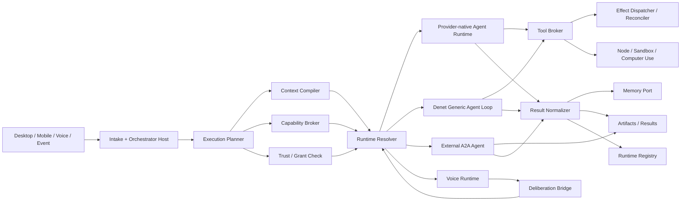
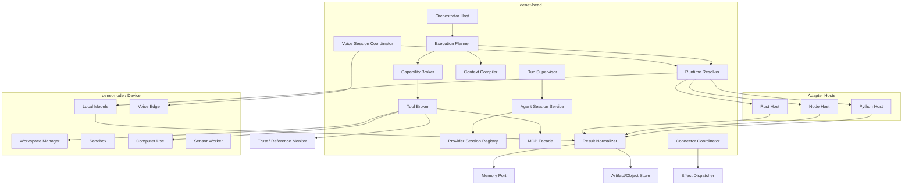
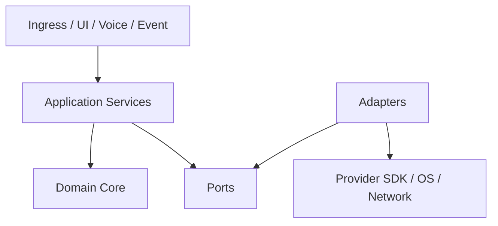
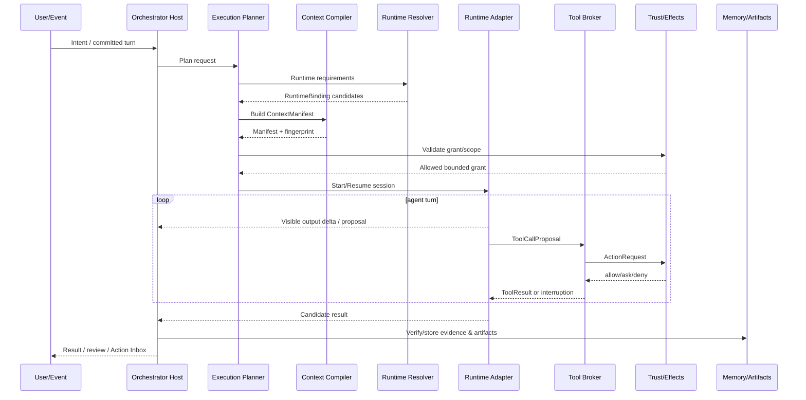
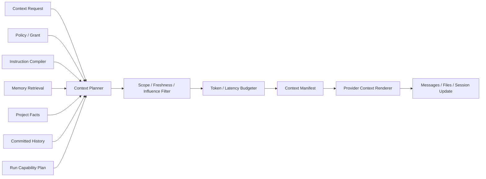
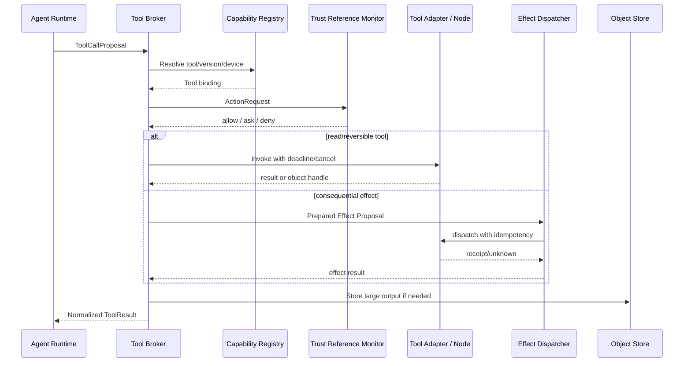
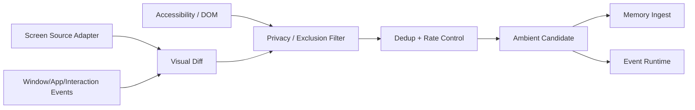

# Denet Agent, Voice, Capability and Integration Architecture

> **Repository edition · 2026-07-13 · `82`**  
> Канонический архитектурный том. Сначала прочитайте [карту архитектуры](README.md) и [cross-domain contracts](../specifications/contracts/README.md).  
> Бывший временный предархитектурный документ разнесён по этим contracts; исторические ссылки на него означают данный интегрированный набор.


**Архитектура интеллектуального исполнения, агентных runtime, контекстной сборки, голосового контура, skills, MCP, plugins, computer-use, локальных моделей и внешних интеграций**

**Версия:** 1.0  
**Дата исследования:** 13 июля 2026 года  
**Статус:** канонический архитектурный baseline перед формированием кодового skeleton  
**Каноническое имя:** `82_Denet_Agent_Voice_Capability_and_Integration_Architecture.md`

Этот документ является самостоятельным. Он объясняет архитектуру интеллектуального и интеграционного слоя Denet так, чтобы читатель мог понять её после общего описания продукта, не зная историю обсуждения и прежние варианты решений.

**Denet** — персональная агентная операционная система. Пользователь напрямую работает с проектными агентами в папках и репозиториях, общается с постоянным главным оркестратором, использует голосовой режим, долговременную память, локальные и облачные модели, skills, MCP, computer-use и внешние connectors. Система должна уметь продолжать работу в фоне, использовать несколько устройств, действовать с регулируемой автономностью и заменять провайдеры без переписывания бизнес-логики.

Этот том отвечает на вопрос:

> **Как Denet превращает намерение и контекст в работу моделей и агентов, подключает быстро меняющиеся внешние возможности, сохраняет нативные преимущества провайдеров, контролирует инструменты и внешние эффекты, обеспечивает живой голосовой режим и остаётся тестируемым, заменяемым и пригодным для продакшена?**

Документ продолжает и не переопределяет:

- функциональную концепцию Denet; [[S01]]
- общие контракты и ownership документов; [[S02]]
- Memory Fabric 1.2; [[S03]]
- Pragmatic Agentic Control Fabric 1.1; [[S04]]
- Trust, Identity, Autonomy and Permissions; [[S05]]
- Voice and Ambient Interaction Fabric; [[S06]]
- Capabilities, Providers and Integrations; [[S07]]
- Server Runtime, Events, Sync and Portability; [[S08]]
- Desktop и Mobile бизнес-логику; [[S09]] [[S10]]
- End-to-End Validation и временные pre-architecture дополнения; [[S11]] [[S12]]
- System Architecture and Runtime Topology; [[S13]]
- Data, Memory, Storage, Sync and Protocol Architecture. [[S14]]

---

# Как читать этот том

Документ организован от устойчивого центра к сменным краям:

1. сначала фиксируется выбранная архитектурная модель и границы ответственности;
2. затем описывается единый lifecycle агентного исполнения;
3. после этого — Context Compiler и model routing;
4. далее — tools, skills, MCP, plugins и внешние agents;
5. затем — sandbox, computer-use, voice, ambient sources и connectors;
6. в конце — надёжность, observability, tests, структура кода, ADR и этапы внедрения.

Технологические продукты в тексте являются **адаптерами или кандидатами**, а не источниками истины Denet. Их текущие возможности датированы и обязаны подтверждаться capability probes. Архитектурные инварианты не должны зависеть от того, какая модель или SDK популярны в конкретный год.

---

# Часть I. Итоговое решение и исследовательский протокол

## 0. Архитектурный вердикт

### 0.1. Stable Intelligence Core + Native Runtime Adapters

Лучшее решение для Denet — **Stable Intelligence Core + Native Runtime Adapters**.

Стабильное ядро Denet определяет:

- намерение и владельца работы;
- Project, Session, Task и Run;
- Context Manifest;
- разрешённый Capability Plan;
- completion contract;
- cancellation;
- artifacts и evidence;
- memory read/write;
- permission и external-effect boundary;
- provider session registry;
- placement, budget и observability.

Сменные адаптеры предоставляют:

- конкретную модель;
- provider-native agent loop;
- coding runtime;
- sandbox;
- voice realtime session;
- MCP transport;
- browser/computer-use;
- connector;
- локальный inference runtime;
- внешнего A2A-agent.

Ни один adapter не становится владельцем Task, разрешения, проекта, памяти или факта внешнего эффекта.



### 0.2. Нативный runtime раньше универсального agent loop

Если Codex, Claude Agent SDK, OpenAI Agents SDK, Google ADK, OpenHands или другой runtime уже умеет:

- sessions;
- tools;
- workspace;
- checkpoints;
- subagents;
- permissions;
- sandbox;
- tracing;
- continuation;
- provider-specific reasoning;

Denet использует это через нативный adapter.

Собственный generic agent loop нужен, но как:

- baseline для прямых model APIs;
- способ подключить локальные модели;
- fallback;
- тестовый oracle;
- средство выполнить короткий bounded run без тяжёлого SDK.

Он не должен стать обязательным слоем поверх каждого нативного runtime. OpenAI Agents SDK прямо разделяет случаи, когда приложению выгодно владеть loop самостоятельно, и случаи, когда runtime должен управлять turns, tools, handoffs и sessions. [[S15]]

### 0.3. Provider session ускоряет работу, но не является Task

Provider может хранить:

- thread/session ID;
- conversation state;
- internal compaction;
- workspace snapshot;
- remote run handle;
- native approvals;
- provider trace.

Denet хранит отдельно:

- пользовательскую цель;
- Project/Task/Run;
- committed messages;
- Context Manifest revision;
- tool/effect history;
- artifacts;
- evidence;
- checkpoint;
- completion state;
- permission references.

Если provider session потеряна, Denet может создать новую и восстановить работу из собственного состояния. При этом система честно отмечает потерю нативной continuity, а не делает вид, что скрытое состояние полностью мигрировало между моделями.

### 0.4. Один сильный агент остаётся default

Архитектура не создаёт swarm по умолчанию.

Обычный путь:

```text
одна Project Session
→ один основной agent runtime
→ минимальный набор tools
→ Memory handles по требованию
→ результат и evidence
```

Subagent создаётся только после marginal-utility gate из Agentic Control Fabric. Внутренние subagents используют лёгкий Denet protocol или provider-native delegation. A2A предназначен прежде всего для внешних самостоятельных агентов, а не для каждого внутреннего помощника.

### 0.5. Голос — интерактивный контур, а не второй оркестратор

Voice Session имеет одного conversational owner. Голосовой runtime:

- управляет audio floor;
- committed turns;
- interruption;
- actually-heard output;
- кратким разговорным ответом;
- передачей намерения.

Сложная работа передаётся:

- сильной модели как deliberative sidecar;
- существующему project agent;
- главному оркестратору;
- Managed Run.

Голосовой backend может быть OpenAI Realtime, Gemini Live, LiveKit/Pipecat pipeline или полностью локальная цепочка. Voice business state остаётся Denet-native.

### 0.6. Structured-first computer use

При управлении приложениями Denet предпочитает:

```text
native API / connector
→ SDK / CLI
→ DOM / DevTools / accessibility
→ provider-native visual computer-use
→ open-source visual agent
→ собственный узкий adapter
```

Причина практическая: актуальные GUI-agents всё ещё показывают низкую надёжность в длинных cross-application задачах; WindowsWorld сообщает менее 21% успеха у протестированных систем на сложных multi-app сценариях. [[S37]]

Visual computer-use остаётся важной capability, но не становится единственным способом автоматизации.

### 0.7. Маленький общий контракт и богатые native extensions

Common contract охватывает только то, что Denet обязан понимать независимо от поставщика:

- start/resume/cancel session;
- send committed turn;
- stream visible output;
- propose tool call;
- report usage;
- produce artifact/result;
- expose checkpoint/continuation capability;
- report health/error;
- honour cancellation and deadline.

Provider-specific возможности хранятся в `native_extensions` и доступны target-specific UI/logic. Denet не рисует несуществующие настройки и не сводит все платформы к устаревшему Chat Completions API.

### 0.8. Короткая формула

> **Denet Intelligence Plane — это стабильный оркестрационный и контекстный контур, который выбирает минимально достаточный runtime, сохраняет каноническое состояние вне провайдера, активирует только нужные capabilities, проводит tools и внешние эффекты через системные границы, а voice, coding, MCP, computer-use и connectors подключает как заменяемые нативные адаптеры.**

---

## 1. Область ответственности

### 1.1. Этот том владеет

- процессной и модульной архитектурой Orchestrator Host;
- Agent Runtime abstraction;
- Provider Session lifecycle;
- generic agent loop;
- нативными adapters Codex/Claude/OpenAI/Google/OpenHands;
- Context Compiler;
- provider-specific context rendering;
- model/runtime routing;
- capability activation на Run;
- Tool Broker;
- Skill Runtime;
- MCP Gateway;
- plugin runtime loading;
- external A2A-agent adapter;
- sandbox/workspace integration;
- computer-use architecture;
- voice runtime architecture и strong-model bridge;
- ambient source adapters на интеллектуальной границе;
- connector runtime;
- Trust/Effect/Secret integration;
- adapter isolation, health, failure и conformance tests;
- кодовой структурой интеллектуального и интеграционного слоя.

### 1.2. Этот том не переопределяет

- бизнес-смысл Task, Run и delegation — Agentic Control Fabric;
- память, claims, retrieval semantics и deletion — Memory Fabric;
- permissions, identity и safety floor — Trust Fabric;
- capability lifecycle, discovery и ownership — Capability Fabric;
- network, Head election, sync и canonical runtime state — Server Runtime;
- физические БД, object storage и wire protocol baseline — Data Architecture;
- turn-taking policy и пользовательские voice profiles — Voice Fabric;
- кнопки и экраны — Desktop/Mobile документы.

### 1.3. Не-цели

Denet 1.x не обязан иметь:

- единый универсальный agent framework для всех providers;
- идеальную миграцию скрытого состояния между моделями;
- full-mesh multi-agent communication;
- собственную foundation computer-use model;
- отдельный process на каждый tool;
- обязательный A2A для внутренних workers;
- обязательный LiteLLM gateway;
- обязательный LiveKit;
- собственный MCP protocol fork;
- один giant prompt, содержащий все tools и всю память;
- LLM-router на каждый запрос;
- постоянный security-agent;
- постоянный voice deliberation swarm;
- hot loading непроверенных native libraries в Head.

---

## 2. Исследовательский протокол

### 2.1. План для построения плана

Перед проектированием были сформулированы вопросы, способные разрушить неверную архитектуру:

1. Можно ли сохранять provider-native преимущества без vendor lock-in канонического состояния?
2. Достаточно ли одного generic agent loop или coding runtimes требуют нативной интеграции?
3. Как восстановить Session после падения SDK или смены provider?
4. Как собрать один и тот же смысловой контекст для принципиально разных runtimes?
5. Как не загрузить тысячи tools и skills в prompt?
6. Как разрешить MCP sampling, roots и elicitation без обхода Trust Fabric?
7. Когда нужен A2A, а когда он только создаёт сетевую бюрократию?
8. Как сделать computer-use заменяемым и проверяемым?
9. Где должен жить low-latency voice state?
10. Как голосовой runtime получает сильное рассуждение, не читая hidden chain-of-thought?
11. Как local models участвуют в системе без ложного предположения о полном OpenAI compatibility?
12. Как connector не получает права самостоятельно отправить сообщение?
13. Какие failures должны быть локализованы в adapter host?
14. Как тестировать adapters без реальных платных providers на каждом CI-run?
15. Где архитектура рискует повторить ошибку оверинжиниринга?

### 2.2. Классы источников

Использованы:

- официальные SDK и protocol specifications;
- production-oriented agent runtimes;
- provider documentation;
- voice infrastructure;
- computer-use implementations;
- open-source agent platforms;
- исследования tool quality, routing, GUI reliability и safety;
- issue trackers как evidence реальных failure modes;
- ранее принятые документы Denet.

### 2.3. Проверенные альтернативы

Для каждого крупного слоя сравнивались:

- один прямой model call;
- generic tool loop;
- provider-native runtime;
- full framework;
- внешний agent protocol;
- собственный subsystem;
- adapter вокруг зрелого проекта;
- отказ от функции в первой версии.

### 2.4. Критерии принятия

Механизм принимается, если:

- закрывает конкретный сценарий;
- сохраняет прямой project-chat path;
- не дублирует каноническое состояние;
- имеет cancel/recovery;
- тестируется без всего Denet;
- допускает fake implementation;
- не требует LLM на обычном fast path;
- даёт измеримый выигрыш качества, latency, portability или safety;
- может быть заменён локально;
- не превращает adapter в скрытый второй Head.

### 2.5. Критерии отказа

Механизм отклоняется или становится optional, если:

- common abstraction обрезает важные native capabilities;
- provider state становится единственной копией Task;
- для добавления модели надо менять несколько core modules;
- tool может обойти Reference Monitor;
- context renderer смешивает external data и authority;
- fallback меняет direct-chat model молча;
- agent swarm запускается без marginal utility;
- adapter crash роняет Head;
- voice contributor может озвучить stale result;
- computer-use считается успешным без environment verification;
- MCP package получает доверие из-за registry badge;
- plugin может загрузить native code в Head без isolation;
- architecture требует cloud provider для local-only profile.

---

# Часть II. Контейнеры, процессы и модульная карта

## 3. Размещение интеллектуального слоя

### 3.1. Модули внутри `denet-head`

В основной модульный монолит входят:

- `OrchestratorHost`;
- `ExecutionPlanner`;
- `RunSupervisor`;
- `AgentSessionService`;
- `ProviderSessionRegistry`;
- `RuntimeResolver`;
- `ContextCompiler`;
- `CapabilityBroker`;
- `ToolBroker`;
- `SkillResolver`;
- `McpFacade`;
- `ResultNormalizer`;
- `ConnectorCoordinator`;
- `VoiceSessionCoordinator` — control state, не media codecs;
- `TrustBridge`;
- `EffectBridge`;
- `MemoryBridge`;
- `ArtifactBridge`;
- `IntegrationHealthCoordinator`.

В первой версии это модули одного binary, а не микросервисы.

### 3.2. `denet-adapter-host`

Out-of-process host используется для:

- Python SDK;
- TypeScript/Node SDK;
- быстро меняющихся provider packages;
- MCP clients/servers;
- connectors;
- browser agents;
- media libraries;
- plugins;
- integrations с повышенным crash/leak risk.

Реализации:

```text
denet-adapter-host-rust
denet-adapter-host-python
denet-adapter-host-node
```

Не нужно запускать три host всегда. Composition Root поднимает только необходимые.

### 3.3. `denet-node`

Node daemon предоставляет:

- project workspace;
- filesystem и Git;
- shell;
- local model coordinator;
- sandbox runtime;
- computer-use coordinator;
- sensor coordinator;
- voice edge runtime;
- local connector adapters, которым нужен OS/user session;
- local object/cache access.

### 3.4. Специализированные workers

Отдельный worker оправдан для:

- длительного audio/media pipeline;
- browser/computer-use session;
- Screenpipe/native sensor source;
- local model server;
- тяжёлого conversion/OCR;
- недоверенного plugin;
- remote disposable workspace.

### 3.5. Общая component diagram



---

## 4. Composition Root и dependency rules

### 4.1. Явная сборка

`CompositionRoot` получает:

- deployment profile;
- available devices;
- Capability Registry snapshot;
- provider connections;
- Trust policies;
- enabled adapters;
- local hardware profile;
- feature flags;
- protocol versions.

Он строит concrete ports и регистрирует их в typed registries.

Глобальный service locator запрещён. Domain/application component получает зависимости через constructor/builder.

### 4.2. Разрешённое направление зависимостей



### 4.3. Запрещённые зависимости

- `agent-core` → OpenAI/Anthropic/Google SDK;
- `context-compiler` → provider session database;
- `tool-broker` → Telegram API;
- provider adapter → Trust Registry table;
- MCP server → model API key;
- voice backend → direct Project DB;
- computer-use backend → global Secret Store;
- connector → UI;
- plugin → Head internal module;
- local model runtime → canonical Memory DB;
- A2A agent → permission grant creation;
- frontend → adapter host protocol напрямую.

### 4.4. Dynamic registration без hidden magic

Dynamic component descriptor регистрирует:

- `component_id`;
- version/fingerprint;
- provided capability classes;
- required capabilities;
- host language/process;
- wire protocol version;
- configuration schema;
- health contract;
- cancellation semantics;
- effect classes;
- trust manifest;
- supported native extensions.

Registry не создаёт объект через произвольный код в Head. Descriptor выбирает заранее известный adapter factory или supervised plugin host.

---

# Часть III. Единая модель агентного исполнения

## 5. Канонические runtime-сущности

### 5.1. `AgentDefinition`

Описывает повторно используемую роль:

```yaml
agent_definition:
  agent_definition_id: id
  purpose: text
  default_runtime_policy: ref
  behavior_profile: ref
  instruction_profile: ref
  capability_requirements: []
  memory_scope_policy: ref
  output_contract: ref
  default_budget: ref
  native_preferences: {}
```

### 5.2. `AgentInstance`

Конкретный участник Session/Run:

```yaml
agent_instance:
  agent_instance_id: id
  definition_ref: ref
  owner_run_or_session: ref
  parent_agent_ref: optional
  project_ref: optional
  runtime_binding_ref: optional
  grant_ref: ref
  status: proposed | starting | running | waiting | completed | failed | cancelled
```

### 5.3. `RuntimeBinding`

Фиксирует выбранный способ исполнения:

```yaml
runtime_binding:
  binding_id: id
  runtime_kind: native_agent | generic_loop | external_a2a | voice
  adapter_id: id
  connection_ref: optional
  model_endpoint_ref: optional
  device_ref: optional
  workspace_ref: optional
  provider_session_ref: optional
  pinned_component_versions: {}
  native_options: {}
```

### 5.4. `ProviderSessionRecord`

```yaml
provider_session:
  provider_session_id: id
  adapter_id: id
  provider_connection_ref: ref
  opaque_session_handle: encrypted_or_opaque
  project_ref: optional
  workspace_ref: optional
  created_at: time
  last_active_at: time
  context_manifest_revision: integer
  instruction_revision: integer
  capability_snapshot_ref: ref
  native_state_version: text
  continuation_mode: native_resume | snapshot | rehydrate_only | none
  health: healthy | stale | lost | incompatible | revoked
  last_checkpoint_ref: optional
```

Opaque handle никогда не становится глобальной identity Task.

### 5.5. `RunExecutionPlan`

План фиксирует архитектурное решение до запуска:

- goal/intent;
- execution level;
- primary runtime;
- optional bounded contributors;
- placement;
- Context Manifest;
- Run Capability Plan;
- workspace/sandbox;
- grant;
- budget/deadline;
- checkpoint policy;
- retry/fallback policy;
- completion contract;
- result destinations.

Он не обязан быть огромным workflow graph.

---

## 6. Жизненный цикл исполнения

### 6.1. Общий путь

```text
Intake
→ Intent normalization
→ выбрать execution level
→ собрать Runtime Requirements
→ resolve runtime/model/device
→ compile Context Manifest
→ resolve minimal capabilities
→ получить/проверить grant
→ start or resume provider session
→ stream visible events
→ broker tool proposals
→ checkpoint при необходимости
→ verify completion
→ normalize result
→ write artifacts/evidence/memory
→ release resources
```

### 6.2. Sequence diagram



### 6.3. Direct Turn

Для короткого запроса:

- no durable Task;
- один RuntimeBinding;
- минимальный Context Manifest;
- ограниченный Tool Plan;
- короткий trace;
- Result Envelope;
- memory write только при значимости.

Provider session может быть текущей project/voice session.

### 6.4. Adaptive Agent Session

Основной режим project work:

- provider-native или generic loop;
- агент свободно меняет план;
- пользователь может Add/Revise/Retract/Steer;
- session continuity сохраняется;
- work items остаются локальными;
- significant state записывается;
- subagents bounded;
- diff/tests/artifacts используются для completion.

### 6.5. Managed Run

Добавляет:

- Task/Run ID;
- checkpoint;
- cancel;
- budget;
- placement;
- durable waits;
- Effect Claims;
- restart/recovery;
- Action Inbox linkage.

Agent strategy остаётся динамической.

### 6.6. Structured Automation

Используется только для:

- повторяемых operational flows;
- timers/waits;
- strict sequence;
- массовых shards;
- publish/release pipelines;
- длительных процессов с настоящей durability.

Agent runtime может быть одним node внутри automation, но automation не превращает каждый reasoning step в явный graph node.

---

## 7. Cancellation, steer и late results

### 7.1. Structured cancellation

Каждое исполнение получает cancellation tree:

```text
Run token
├── primary provider session
├── tool invocations
├── bounded contributors
├── computer-use session
├── object transfers
└── voice deliberation requests
```

Cancel распространяется вниз, но external effect после dispatch сначала reconciled.

### 7.2. `Add`, `Revise`, `Retract`, `Stop`

- `Add` добавляет constraint без отмены текущего плана;
- `Revise` создаёт новую revision intent и просит агента перестроить план;
- `Retract` отменяет конкретное прежнее требование;
- `Stop` отменяет active work;
- `Stop and Send` завершает текущий turn и создаёт новый;
- `New Topic` создаёт независимую Session.

Adapter обязан уметь либо применить steer нативно, либо выполнить controlled interrupt + rehydrate. UI видит, какой путь использован.

### 7.3. Late output policy

Любой async result содержит:

- target Run/Session;
- intent revision;
- context revision;
- deadline;
- validity scope.

Если result устарел:

- он не вставляется молча в текущий разговор;
- может стать artifact;
- может быть предложен как follow-up;
- может быть отброшен;
- может инициировать новый candidate only if policy allows.

### 7.4. Checkpoints

Checkpoint содержит:

- goal и intent revision;
- current progress summary;
- Context Manifest fingerprint;
- provider session handle;
- completed logical actions;
- pending actions;
- artifacts/evidence;
- external effects;
- workspace/commit state;
- tool/capability versions;
- continuation notes.

Hidden chain-of-thought не является частью checkpoint.

---

## 8. Completion и Result Normalization

### 8.1. Candidate completion

Runtime adapter может сообщить `candidate_complete`, но Completion Governor проверяет:

- output contract;
- required artifacts;
- filesystem/Git state;
- tests;
- citations/evidence;
- blocking review findings;
- external effects;
- unresolved user requirements;
- partial failures.

### 8.2. Normalized Result Envelope

```yaml
result_envelope:
  result_id: id
  run_or_session_ref: ref
  outcome: succeeded | partial | failed | cancelled | no_op
  summary: text
  artifacts: []
  evidence: []
  changes: []
  external_effects: []
  unresolved_items: []
  user_decisions_needed: []
  provider_native_result_ref: optional
  usage_ref: optional
  memory_commit_candidates: []
```

### 8.3. Native result preservation

Provider-native trace, citations, patches, screenshots или diagnostics могут храниться как:

- artifact;
- debug object;
- `native_extensions` payload;
- link в provider UI.

Но downstream business logic опирается на Normalized Result и evidence, а не на vendor-specific JSON.


# Часть IV. Runtime adapters и provider sessions

## 9. Общий Agent Runtime Port

### 9.1. Назначение

`AgentRuntimePort` позволяет Head Runtime управлять разными agent systems без попытки сделать их внутренности одинаковыми.

Иллюстративный Rust-контракт:

```rust
#[async_trait]
pub trait AgentRuntimePort: Send + Sync {
    async fn describe(&self) -> Result<RuntimeDescriptor, RuntimeError>;
    async fn probe(&self, request: ProbeRequest) -> Result<ProbeReport, RuntimeError>;
    async fn start_session(
        &self,
        request: StartAgentSession,
    ) -> Result<StartedAgentSession, RuntimeError>;
    async fn resume_session(
        &self,
        request: ResumeAgentSession,
    ) -> Result<ResumedAgentSession, RuntimeError>;
    async fn send_turn(
        &self,
        request: AgentTurnRequest,
    ) -> Result<BoxStream<'static, Result<ProviderEvent, RuntimeError>>, RuntimeError>;
    async fn steer(&self, request: SteerRequest) -> Result<SteerOutcome, RuntimeError>;
    async fn cancel(&self, request: CancelRuntimeRequest) -> Result<CancelOutcome, RuntimeError>;
    async fn snapshot(&self, request: SnapshotRequest) -> Result<RuntimeSnapshot, RuntimeError>;
    async fn close_session(&self, request: CloseSessionRequest) -> Result<(), RuntimeError>;
}
```

Это архитектурная форма, а не окончательная сигнатура кода.

### 9.2. `ProviderEvent`

Нормализованные события:

- `session_started`;
- `visible_text_delta`;
- `visible_audio_delta`;
- `reasoning_summary_delta`, только если provider официально предоставляет пользовательски видимое summary;
- `tool_call_proposed`;
- `tool_call_started`;
- `tool_call_finished`;
- `artifact_created`;
- `workspace_changed`;
- `approval_requested`;
- `usage_updated`;
- `checkpoint_available`;
- `candidate_complete`;
- `warning`;
- `error`;
- `session_ended`.

Adapter не выдаёт hidden chain-of-thought как контракт Denet.

### 9.3. Native extensions

```protobuf
message NativeExtension {
  string namespace = 1;
  string schema_version = 2;
  google.protobuf.Any payload = 3;
}
```

Native payload:

- versioned;
- bounded по размеру;
- не используется core policy без отдельного parser;
- может быть сохранён для provider-specific UI;
- не становится permissions или canonical state.

---

## 10. Adapter Host Protocol

### 10.1. Почему out-of-process

Python/Node SDK меняются быстрее Rust-ядра и могут:

- утечь памятью;
- зависнуть в event loop;
- загрузить native extension;
- конфликтовать по dependency versions;
- выполнить неожиданный subprocess;
- требовать собственный update cycle.

Out-of-process host локализует эти риски.

### 10.2. Транспорт

Используется baseline тома 81:

- gRPC/Protobuf;
- Unix Domain Socket на Unix;
- Windows Named Pipe или локальный защищённый TCP fallback;
- mTLS для remote adapter host;
- object handles для больших payload;
- bidirectional stream для provider events.

### 10.3. Host API

```text
RegisterHost
ListAdapters
ProbeAdapter
LoadAdapter
UnloadAdapter
StartSession
ResumeSession
StreamSessionEvents
SendTurn
Steer
Cancel
Snapshot
InvokeAdapterOperation
GetHealth
GetUsage
Drain
Shutdown
```

### 10.4. Deadlines и backpressure

Каждый call получает:

- deadline;
- cancellation token;
- maximum event buffer;
- maximum payload size;
- expected heartbeat interval;
- object-store fallback threshold.

Если consumer не успевает читать stream:

- token deltas могут coalesce;
- usage updates могут replace latest;
- tool/effect/final events не теряются;
- debug noise может drop с явным counter.

### 10.5. Host grouping

Adapters группируются по:

- language/runtime;
- trust domain;
- provider account;
- resource profile;
- crash isolation;
- dependency compatibility.

Не каждый adapter получает отдельный process. Однако connector с secret и недоверенный community plugin не должны жить в одном host без причины.

### 10.6. Version negotiation

Handshake включает:

- Denet protocol version;
- host version;
- adapter version;
- supported event schemas;
- supported cancellation modes;
- native extensions;
- maximum payload;
- capability fingerprint.

Несовместимый adapter остаётся disabled, а не запускается «на удачу».

---

## 11. First-class runtime adapters

### 11.1. Сводная стратегия

| Runtime | Основное применение | Что сохраняем нативно | Что остаётся Denet-native |
|---|---|---|---|
| Codex SDK/App Server | coding Project Sessions | threads, worktrees, native coding tools, provider events | Task/Run, grants, memory, completion, effects |
| Claude Agent SDK | coding/general project agents | Claude Code loop, tools, sessions, subagents, hooks, permissions | global policy, project state, memory, artifacts |
| OpenAI Agents SDK | server agents, tools, sandbox, voice | agent loop, handoffs, sessions, tracing, Realtime | orchestration authority, effect boundary, canonical state |
| Google ADK | Gemini-native agents, live/multimodal, A2A | agents/workflows, sessions, tools, A2A | user/project authority, Denet Run and memory |
| OpenHands | isolated software work | sandboxed coding runtime, remote workspace | Project/Task authority and final verification |
| Generic Denet loop | local/direct APIs and fallback | none beyond model endpoint | full bounded loop state |
| External A2A | independent external agents | Agent Card, external Task/artifacts | local permission, mapping and acceptance |

### 11.2. Codex adapter

Рекомендуемая форма:

- Node/TypeScript host использует Codex SDK или App Server;
- один Denet Project Session может быть связан с одним или несколькими Codex threads;
- workspace/worktree регистрируется в Workspace Manager;
- Codex approvals отражаются в Denet TrustBridge;
- provider-native events преобразуются в `ProviderEvent`;
- file changes подтверждаются через актуальный Git/filesystem state;
- thread ID сохраняется в ProviderSessionRecord;
- resume используется при доступности;
- при потере thread выполняется rehydrate из Context Manifest и project state.

Codex SDK официально предоставляет программный запуск и продолжение threads, а App Server даёт более низкоуровневый интеграционный surface. [[S16]] [[S17]]

Не допускается:

- считать thread самой Project Session;
- хранить важное решение только в Codex transcript;
- выдавать Codex более широкий filesystem scope, чем Denet grant;
- автоматически переключать пользователя с выбранного Codex model/runtime.

### 11.3. Claude Agent SDK adapter

Claude Agent SDK полезен для:

- Claude Code-compatible project work;
- built-in tools;
- subagents;
- hooks;
- MCP;
- permission events;
- sessions и checkpointing;
- cost/observability.

SDK использует тот же agent loop и tool infrastructure, что Claude Code. [[S18]]

Adapter сохраняет:

- session continuation;
- native permission prompt;
- subagent lineage;
- hook results;
- MCP identity;
- CLAUDE/rules semantics через Effective Instruction Set;
- provider usage.

Provider permission не заменяет Denet grant. Если Claude слой строже, его prompt остаётся; если слабее, Denet не ослабляет собственную границу.

### 11.4. OpenAI Agents SDK adapter

Используется для:

- server-side agents;
- direct Responses API paths;
- function tools;
- MCP;
- sessions;
- agents-as-tools/handoffs;
- sandbox agents;
- Realtime agents;
- tracing.

OpenAI Agents SDK сознательно строится вокруг небольшого набора primitives и допускает сочетание SDK-managed и application-owned loops. [[S15]]

Denet adapter разделяет:

1. `OpenAIModelRuntimeAdapter` — прямые model/Responses calls;
2. `OpenAIAgentRuntimeAdapter` — SDK agent loop;
3. `OpenAISandboxAgentAdapter` — isolated workspace;
4. `OpenAIRealtimeVoiceAdapter` — native voice.

Они могут использовать одну Connection, но являются разными capabilities.

### 11.5. Google ADK adapter

Google ADK подключается как optional first-class runtime для:

- Gemini-native agent applications;
- Live/multimodal paths;
- graph workflows, когда они действительно нужны;
- tools/MCP;
- A2A;
- provider-specific session behavior.

ADK умеет композицию agents и workflows, разные model providers, sessions/memory, tools и A2A. [[S19]]

Denet не использует ADK graph как универсальный внутренний Task model. Adapter получает bounded assignment и возвращает artifacts/evidence.

### 11.6. OpenHands adapter

OpenHands полезен как optional coding/runtime backend, особенно если требуется:

- isolated workspace;
- local-to-remote sandbox;
- software-agent toolset;
- model-agnostic execution;
- remote development environment.

OpenHands SDK описывает composable architecture, sandbox abstractions и production-oriented agent server. [[S32]]

Denet использует его как runtime, но:

- workspace lease выдаётся Denet;
- completion проверяется Denet;
- permissions не переходят из OpenHands config автоматически;
- remote state имеет explicit lifecycle;
- artifacts возвращаются в Denet Object/Project layer.

### 11.7. Generic Denet agent loop

Generic loop состоит из:

```text
Model turn
→ visible output / tool calls
→ Tool Broker
→ tool results
→ next model turn
→ completion proposal
```

Он поддерживает:

- streaming;
- structured tool calls;
- bounded steps;
- cancel;
- budgets;
- Context Manifest;
- tool result trimming;
- checkpoint summary;
- local/OpenAI-compatible models.

Не реализует без необходимости:

- сложные handoff graphs;
- собственный vector memory;
- workflow DSL;
- hidden multi-agent chat;
- provider-specific features через hacks.

---

## 12. Provider Session continuity

### 12.1. Четыре уровня восстановления

1. **Native resume:** provider поддерживает продолжение по session/thread ID.
2. **Adapter snapshot:** SDK позволяет сохранить portable session state.
3. **Denet rehydrate:** создаётся новая provider session из committed history, Context Manifest, workspace state и stable handles.
4. **Fresh restart:** provider-specific continuity потеряна; пользователь видит это явно.

### 12.2. Rehydrate package

Содержит:

- agent definition;
- current intent revision;
- conversation committed turns;
- Effective Instruction Set;
- relevant project state;
- Memory handles/evidence;
- completed actions;
- pending actions;
- artifacts;
- test status;
- grant summary;
- continuation note.

Не содержит:

- hidden reasoning;
- provider secret;
- stale tool outputs без provenance;
- неуслышанный voice output;
- незафиксированные speculative actions.

### 12.3. Cross-provider migration

Cross-provider migration всегда означает новую session. Denet переносит только собственное наблюдаемое состояние.

UI должен показать:

- исходный runtime;
- новый runtime;
- что сохранено;
- что потеряно;
- изменился ли model character;
- изменились ли tools;
- нужно ли повторно подтвердить действие.

### 12.4. Session compaction

Compaction может выполняться provider-native или Denet-side.

Denet сохраняет:

- pre-compaction committed history references;
- generated summary;
- summary provenance;
- context fingerprint;
- unresolved facts;
- open tool/effect state.

Provider summary не становится Memory Claim без отдельного Memory Committer.

---

# Часть V. Context Compiler и Instruction Runtime

## 13. Context Manifest как канонический вход

### 13.1. Manifest не является готовым prompt

`ContextManifest` — структурированная спецификация того, **что разрешено и необходимо передать runtime**, а не строка system prompt.

```yaml
context_manifest:
  manifest_id: id
  revision: integer
  target:
    runtime_kind: native_agent | generic_loop | voice | external_agent
    adapter_id: id
    model_endpoint_ref: optional
  scope:
    user_ref: ref
    project_ref: optional
    session_ref: ref
    task_or_run_ref: optional
  intent:
    revision: integer
    goal: text
    constraints: []
  authority:
    system_policy_refs: []
    effective_instruction_set_ref: ref
    grant_ref: ref
  context_channels:
    runtime_state: []
    authoritative_project_facts: []
    evidence: []
    historical_episodes: []
    advisory_preferences: []
    validated_procedures: []
    untrusted_external_content: []
  handles: []
  tool_plan_ref: ref
  output_contract_ref: ref
  budget: {}
  freshness_requirements: {}
  redaction_profile_ref: ref
  fingerprint: hash
```

### 13.2. Каналы влияния

Context Compiler сохраняет границы:

1. system/runtime contract;
2. trusted instructions;
3. current task state;
4. authoritative project facts;
5. evidence;
6. historical context;
7. advisory preferences;
8. validated procedures;
9. untrusted external content;
10. stable handles.

Provider renderer может изменить формат, но не смешивает authority классы молча.

### 13.3. Context sources

- текущий Project/Session/Run;
- Memory Query Planner;
- repository/filesystem snapshot;
- Git status/commit;
- Effective Instruction Set;
- Capability Broker;
- Trust/Grant;
- user attachments;
- previous committed turns;
- artifacts;
- active effects;
- provider-native session history;
- local device state.

### 13.4. Freshness

Каждый segment содержит:

- observed_at;
- valid_at/interval;
- source authority;
- revision/commit;
- freshness requirement;
- stale behavior.

Если project status требует live read, старая Memory Note не используется как authority.

---

## 14. Context assembly pipeline



### 14.1. Дешёвый fast path

Для простого project turn Context Compiler переиспользует:

- текущую provider session;
- unchanged instruction revision;
- cached project summary;
- recent overlay;
- небольшой delta.

Никакого нового full retrieval или LLM context-builder call, если state не изменился.

### 14.2. Query-specific expansion

Для сложного вопроса:

- Context Planner формирует memory/project queries;
- retrieval возвращает evidence bundle и handles;
- Context Compiler выбирает необходимое;
- runtime может открыть handle позднее через tool.

### 14.3. Context budget

Budget учитывает:

- model context;
- prompt cache;
- tool descriptions;
- output budget;
- provider limitations;
- cost;
- latency;
- direct-chat continuity.

При нехватке места приоритет:

1. safety/runtime contract;
2. task and current state;
3. required instructions;
4. exact project facts;
5. evidence;
6. relevant history;
7. procedures;
8. advisory personalization;
9. optional examples.

### 14.4. Stable handles

Большой artifact, note, screenshot, file, memory episode или tool result входит как:

```text
handle + short description + authority + freshness
```

Agent использует scoped tools:

- `memory_open`;
- `artifact_open`;
- `project_read`;
- `evidence_open`;
- `context_search`.

Handles имеют scope и expiry; копирование текстового ID не расширяет права.

---

## 15. Provider-specific renderers

### 15.1. Renderer Port

```rust
pub trait ContextRenderer {
    fn target(&self) -> RuntimeTarget;
    fn estimate(&self, manifest: &ContextManifest) -> ContextEstimate;
    fn render(&self, manifest: &ContextManifest) -> Result<RenderedContext, ContextError>;
}
```

### 15.2. Codex renderer

Может использовать:

- thread continuation;
- project working directory;
- `AGENTS.md`/rules через Instruction Interoperability;
- direct file references;
- skills/plugins;
- concise delta message.

Denet не генерирует огромный root AGENTS на каждый turn. Effective Instruction Set может materialize provider-specific managed view только при изменении revision.

### 15.3. Claude renderer

Использует:

- Claude session continuation;
- CLAUDE/rules semantics;
- built-in tools;
- subagent definitions;
- MCP servers;
- permission hooks;
- provider-native context management.

### 15.4. Generic chat/tool renderer

Формирует:

- system/runtime messages;
- explicit channel labels;
- compact history;
- tool schemas;
- artifact handles;
- output schema.

### 15.5. Realtime voice renderer

Передаёт:

- краткую identity/personality;
- active topic;
- recent committed turns;
- voice behavior;
- safe tool list;
- stable handles;
- strong-model tool;
- spoken-output rules.

Большой project context остаётся у deliberative sidecar.

### 15.6. External A2A renderer

Передаёт только bounded assignment:

- goal;
- required inputs;
- artifact/evidence references;
- expected result;
- deadline;
- authorization limitations;
- no secret values.

---

## 16. Instruction Compiler

### 16.1. Источники

- Denet-native Instruction Items;
- project memory instructions;
- root/nested `AGENTS.md`;
- `CLAUDE.md`, `.claude/rules`;
- provider plugin instructions;
- skill instructions;
- user/session overrides;
- system policy.

Memory Fabric владеет их семантикой и precedence. Этот том определяет runtime materialization.

### 16.2. Effective Instruction Set

Compiler получает:

- provider;
- model;
- agent definition;
- project path;
- task;
- active skills;
- user profile;
- trust mode.

Возвращает:

- ordered instruction items;
- source/provenance;
- provider-specific render hints;
- conflicts;
- token estimate;
- revision fingerprint.

### 16.3. Conflict handling

- system/Trust deny не переопределяется;
- более локальная project instruction может переопределить общую только в разрешённой области;
- skill не переопределяет project non-negotiable rule;
- untrusted README не становится instruction;
- unresolved material conflict попадает в Context Manifest как conflict, а не выбирается молча.

### 16.4. Generated views

Provider-specific files или prompt blocks являются generated views. Они:

- имеют ownership marker;
- не перезаписывают human-owned file;
- regenerable;
- versioned;
- не являются единственным источником инструкций.

---

## 17. Context security и secrets

### 17.1. Redaction

До provider boundary выполняется:

- scope filter;
- sensitivity filter;
- provider/data-region policy;
- secret redaction;
- external-content marking;
- prompt-injection source labeling;
- attachment minimization.

### 17.2. Secret references

Model context получает:

```text
secret exists: github.personal.token
allowed operation: create_pull_request
```

а не secret value.

Secret Broker выполняет действие или передаёт ephemeral credential доверенному process внутри sandbox.

### 17.3. Hidden reasoning

Denet не требует и не хранит hidden chain-of-thought как интеграционный интерфейс.

Допустимы:

- final answer;
- concise rationale;
- evidence;
- plan state;
- provider-visible reasoning summary;
- tool/action trace;
- uncertainty;
- open questions.

### 17.4. Context audit

Для значимого Run сохраняется `Context Influence Trace`:

- какие sources использованы;
- какие segments попали;
- какие были redacted;
- какая instruction revision;
- какие handles открывались;
- какой provider получил данные;
- что повлияло на action proposal.

Полный prompt может храниться только в debug/privacy policy и не является обязательным perpetual artifact.


# Часть VI. Model routing и локальные модели

## 18. Разделение Model, Endpoint, Connection и Runtime

### 18.1. Model Definition

Логическая family/model с известными возможностями:

- modalities;
- reasoning;
- tool calling;
- structured output;
- context;
- coding;
- voice;
- latency class;
- known limitations.

### 18.2. Model Endpoint

Конкретно вызываемая сущность:

```yaml
model_endpoint:
  endpoint_id: id
  model_definition_ref: ref
  connection_ref: ref
  provider_model_id: text
  deployment_region: optional
  runtime_options: {}
  live_capabilities_ref: ref
  health_ref: ref
  pricing_or_quota_ref: ref
```

Одна model family может иметь direct, Azure, Bedrock, Vertex, local и aggregator endpoints.

### 18.3. Provider Connection

Хранит способ аутентификации, account/workspace/project, data policy, quotas и provider-specific settings. Subscription surface и API connection не смешиваются автоматически.

### 18.4. Agent Runtime

Runtime может использовать один или несколько model endpoints, но не равен модели. Codex, Claude Code и OpenHands являются runtime surfaces, а не просто endpoint.

---

## 19. Runtime Requirements

Execution Planner формирует требования:

```yaml
runtime_requirements:
  task_class: coding | research | general | voice | vision | extraction | routing
  interaction: direct_chat | background | realtime | batch
  required_modalities: []
  required_tools: []
  required_native_features: []
  workspace_requirement: none | local | sandbox | remote
  privacy: local_only | allowed_providers | unrestricted
  session_continuity: required | preferred | none
  latency_target: duration
  quality_target: typed
  context_requirement: integer
  reasoning_policy: fast | balanced | deep
  budget: {}
  user_lock: optional
  project_preferences: []
```

Requirements описывают потребность, а не заранее выбранный provider.

---

## 20. Eligibility filter и ranking

### 20.1. Сначала детерминированный filter

Кандидат исключается, если:

- не поддерживает обязательную modality;
- tool calling не прошло probe;
- provider запрещён privacy policy;
- endpoint unhealthy;
- quota exhausted;
- model не помещается на local hardware;
- нужная session continuity невозможна;
- provider runtime не поддерживает требуемый workspace;
- version incompatible;
- пользователь закрепил другой runtime;
- trust boundary недостаточна.

### 20.2. Ranking

Оставшиеся candidates оцениваются по:

```text
fit
+ measured quality for task class
+ session continuity
+ latency
+ availability
+ native capability value
+ locality/privacy value
+ user/project preference
- expected cost
- coordination cost
- failure probability
- cold-start penalty
```

Весы зависят от execution profile. Cost-aware reliability research используется как аргумент в пользу адаптивной, а не максимальной строгости для всех задач. [[S42]]

### 20.3. Не вызывать router-model на fast path

Для типичных запросов используются:

- task class из текущей session;
- cached routing decision;
- explicit user selection;
- capability filters;
- historical metrics.

Маленькая classifier-model допустима, если request действительно неоднозначен. Она предлагает label; final resolution остаётся детерминированным.

### 20.4. User lock

Для direct project/orchestrator chat:

- выбранная модель видима;
- runtime не меняется молча;
- outage показывает проблему;
- fallback требует заранее настроенной policy или user choice;
- migration создаёт новую provider session.

Для внутренних bounded tasks автоматический routing разрешён в пределах profile.

### 20.5. Reasoning policy

Пользовательское `fast | balanced | deep` преобразуется provider-specific:

- reasoning effort;
- thinking budget;
- выбор model variant;
- max output;
- additional reflection turn;
- no-op, если provider не поддерживает.

UI и logs должны показывать реальное mapping.

---

## 21. Fallback и provider failure

### 21.1. Типы fallback

**Same endpoint retry** — transport/temporary error, только если безопасно.

**Same model, alternate deployment** — compatible endpoint/region.

**Same provider, alternate model** — internal task, policy permits.

**Cross-provider model fallback** — semantics may change; direct chat user-visible.

**Local fallback** — privacy/offline/availability.

**Agent runtime fallback** — native runtime → generic loop или наоборот.

**No fallback** — exact reproducibility, provider-specific session, local-only or sensitive.

### 21.2. Fallback не повторяет external effect

Если failure произошёл после Tool Broker dispatch:

- provider reasoning may restart;
- Effect Claim first reconciled;
- tool result reused if valid;
- no blind duplicate call.

### 21.3. Circuit breaker

Breaker key:

```text
provider connection + endpoint + operation class + region
```

States:

- closed;
- open;
- half-open;
- degraded/manual.

Provider outage не открывает breaker для всех моделей мира.

### 21.4. Session continuity cost

Runtime Resolver может предпочесть менее сильный, но уже прогретый/состоявшийся session, если:

- task strongly depends on continuity;
- difference in quality small;
- migration cost high;
- user chose direct flow.

В новом independent Run quality may outweigh continuity.

---

## 22. Local Model Runtime Architecture

### 22.1. `LocalModelCoordinator`

Живёт на Node и управляет:

- discovery;
- model artifacts;
- runtimes;
- load/unload;
- warm pool;
- context allocation;
- KV cache where supported;
- VRAM/RAM budgets;
- concurrency;
- health;
- power/thermal limits;
- usage metrics.

### 22.2. Backends

Через adapters поддерживаются:

- Ollama;
- LM Studio;
- llama.cpp;
- vLLM;
- SGLang;
- OpenVINO GenAI;
- MLX-LM;
- TensorRT-LLM/NIM;
- Transformers/TGI;
- OpenAI-compatible custom endpoint.

OpenAI compatibility является удобным wire surface, но capabilities всё равно probes. Ollama, например, заявляет compatibility только с частью OpenAI API. [[S33]]

### 22.3. Local capability probe

Проверяются:

- chat format;
- tool calls;
- parallel tools;
- structured JSON;
- vision;
- context length under real runtime;
- stop/cancel;
- streaming;
- reasoning markers;
- throughput;
- first-token latency;
- memory use;
- concurrent sessions.

### 22.4. Роли локальных моделей

- ambient relevance filter;
- wake/voice classifier;
- event triage;
- cheap routing;
- private summarization;
- OCR/VLM;
- embeddings/rerank;
- local project agent;
- offline generic agent;
- fallback;
- background maintenance.

### 22.5. Custom model code

Model repository custom code считается executable capability:

- отдельный adapter host/container;
- explicit review/trust;
- no direct Head import;
- pinned revision/hash;
- network disabled by default;
- contract tests.

### 22.6. Warm pool policy

Warm model сохраняется, если:

- используется frequently;
- interactive latency важна;
- достаточно ресурсов;
- нет thermal/battery pressure.

Eviction учитывает:

- recency;
- startup cost;
- pinned Voice Session;
- active Run;
- VRAM fragmentation;
- user policy.

---

## 23. LiteLLM и generic gateways

LiteLLM предоставляет unified OpenAI-like interface, routing, fallback и cost tracking для большого числа providers. [[S32A]]

В Denet он может быть:

- optional adapter для long-tail providers;
- deployment gateway в organisation profile;
- normalization helper;
- low-level retry/load-balancer внутри одного logical endpoint.

Он не должен быть:

- обязательным gateway;
- источником model semantics;
- единственным routing policy;
- способом скрыть provider from privacy/audit;
- заменой native Codex/Claude/Gemini adapters.

Причина: unified format полезен, но может потерять нативные controls, events, sessions и tool semantics.

---

## 24. Outcome-based routing learning

### 24.1. Наблюдения

Для каждой completed attempt сохраняются:

- task class;
- runtime/model/adapter version;
- context size;
- tools;
- latency;
- cost/quota;
- success/partial/failure;
- verification;
- user correction;
- retry;
- provider error;
- artifact quality signals.

### 24.2. Не превращать feedback в автоматический глобальный рейтинг

Outcome может зависеть от:

- prompt;
- context;
- project;
- tool bug;
- model;
- user preference;
- provider outage.

Routing model обновляет task/project-specific priors только после attribution и минимального sample size.

### 24.3. Exploration

Exploration разрешено:

- для internal bounded tasks;
- при low risk;
- в explicit exploratory profile;
- при достаточном budget.

Direct user chat не становится A/B test без согласия.

### 24.4. Self-healing routing

Свежие исследования предлагают graph- и feedback-based routing, но в Denet они остаются optional. [[S43]] Сначала применяются простые правила и измеренные outcomes. Learned router принимается только после offline replay и shadow comparison.

---

# Часть VII. Capability Broker и Tool Runtime

## 25. От Registry до Run Capability Plan

### 25.1. Пять уровней

```text
Capability Registry
→ User Collection
→ Project Capability Set
→ Candidate Resolution
→ Run Capability Plan
```

Agent видит только последний уровень.

### 25.2. Run Capability Plan

```yaml
run_capability_plan:
  plan_id: id
  run_or_session_ref: ref
  required: []
  active: []
  on_demand: []
  fallback: []
  forbidden: []
  tool_exposure_budget: integer
  selected_adapters: {}
  versions: {}
  trust_refs: {}
  rationale: []
```

### 25.3. Lazy activation

Capability может быть:

- materialized upfront;
- discoverable through tool search;
- activated after agent request;
- used by parent but not child;
- available only on one device;
- hidden due to scope/privacy.

---

## 26. Tool Descriptor и Tool Broker

### 26.1. Descriptor

```yaml
tool_descriptor:
  tool_id: stable_id
  version: text
  source_component_ref: ref
  name: text
  purpose: text
  input_schema: ref
  output_schema: optional
  effects: []
  resource_scopes: []
  required_secrets: []
  idempotency: none | caller_key | provider_key | read_only
  cancellation: supported | best_effort | unsupported
  timeout_class: typed
  streaming: boolean
  concurrency: typed
  output_size_class: typed
  trust_state_ref: ref
  quality_observations: []
  native_extensions: {}
```

### 26.2. Tool invocation pipeline



### 26.3. Tool result

```yaml
tool_result:
  invocation_id: id
  status: succeeded | partial | failed | cancelled | unknown
  summary: text
  structured_output: optional
  object_handles: []
  evidence_refs: []
  effect_receipt_ref: optional
  warnings: []
  retry_advice: typed
  provenance: ref
```

### 26.4. Large output policy

Tool Broker:

- stores large stdout/document/media as object/artifact;
- returns summary + handle;
- applies line/byte/token caps;
- supports range open;
- preserves original evidence;
- prevents context explosion.

### 26.5. Tool output is untrusted

Даже trusted tool может вернуть external content. Output channel маркирует:

- source;
- whether generated/external;
- authority;
- sensitivity;
- prompt-injection risk;
- current freshness.

Tool output не может выдавать новое permission.

---

## 27. Tool discovery и описания

### 27.1. Почему нельзя показать все tools

Большой tool list:

- съедает context;
- ухудшает выбор;
- увеличивает confusion;
- раскрывает лишние capabilities;
- расширяет attack surface.

### 27.2. Двухступенчатое discovery

1. Agent получает небольшой каталог классов/релевантных tools.
2. При необходимости вызывает `tool_search` с task context.
3. Capability Broker возвращает небольшой ranked set.
4. Полные schemas materialize только выбранным tools.

### 27.3. Tool Description Normalizer

Исследования обнаруживают широко распространённые дефекты в MCP tool descriptions и показывают, что улучшение описаний может повышать успех, но иногда увеличивает число steps и вызывает regressions. [[S34]]

Denet сохраняет:

- original description;
- normalized description;
- provenance;
- model-generated augmentation;
- test history;
- version.

Normalizer может добавить:

- preconditions;
- effect summary;
- examples;
- failure modes;
- exact distinctions from similar tools.

Но не меняет input schema или фактические effects без adapter owner.

### 27.4. Duplicate/overlap resolution

Capability Broker различает:

- equivalent tools;
- preferred/fallback;
- specialized tool;
- native connector vs MCP;
- structured vs visual control;
- version conflict.

Agent обычно видит preferred tool и fallback handle, а не пять дубликатов.

---

## 28. Retry, timeout и concurrency

### 28.1. Классы retries

**Pure/read-only:** можно повторить с bounded backoff.

**Idempotent with key:** можно повторить тем же key.

**State-changing reconcilable:** сначала check state.

**Unknown external effect:** запрещён слепой retry.

**Human-facing interactive:** timeout возвращается пользователю, background work может продолжиться отдельно.

### 28.2. Concurrency

Tool Descriptor определяет:

- unlimited read;
- per-account serial;
- per-workspace exclusive;
- GPU slot;
- device/window exclusive;
- provider rate pool;
- effect-specific lock.

### 28.3. Backpressure

Tool queue имеет:

- priority class;
- max queue age;
- cancellation;
- per-run budget;
- global provider quota;
- circuit breaker;
- fairness.

Voice/cancel/user-waiting operations имеют приоритет над background indexing.

### 28.4. Long tool

Долгая операция возвращает operation handle и progress events. Agent не держит tool call stack бесконечно.

---

# Часть VIII. Skills, plugins, MCP и внешние агенты

## 29. Skill Runtime Architecture

### 29.1. Skill не является кодовым runtime

Skill может содержать:

- `SKILL.md`;
- references;
- templates;
- assets;
- scripts;
- examples.

Текстовая часть входит через Context Compiler. Scripts регистрируются как отдельные executable tools и проходят Trust/Sandbox.

### 29.2. Skill Resolver

Вход:

- task intent;
- project type;
- provider/model;
- tool availability;
- installed collection;
- project set;
- measured gain;
- conflicts;
- token budget.

Выход:

- selected skill IDs/versions;
- provider-specific materialization;
- required tools;
- conflicts/warnings;
- full-content loading policy.

### 29.3. Progressive disclosure

Agent сначала получает:

- name;
- one-line purpose;
- applicability;
- handle.

Полный skill открывается только после выбора.

### 29.4. Scope and precedence

```text
explicit session override
→ project-local pinned skill
→ project recommended
→ user/global verified
→ provider-native optional
→ candidate only by explicit test
```

Skill не переопределяет system/Trust policy.

### 29.5. Provider renderers

- Codex skill/plugin layout;
- Claude plugin/skill layout;
- Gemini extension/skill;
- generic prompt package;
- Denet-native handle.

Denet-native content остаётся canonical source, если skill Denet-managed. Provider-native user-owned package сохраняет свой ownership.

### 29.6. Skill feedback

После Run сохраняются:

- selected/not selected;
- full-loaded;
- token overhead;
- tool usage;
- outcome;
- user correction;
- conflict;
- candidate improvement.

Автоматическое изменение выполняется Capability Fabric lifecycle, не Runtime.

---

## 30. Plugin and Extension Runtime

### 30.1. Package decomposition

Plugin может содержать:

- skills;
- agents;
- hooks;
- MCP configuration;
- commands;
- connectors;
- provider adapter;
- UI metadata;
- executables;
- WASM module.

Каждый component регистрируется отдельно.

### 30.2. Declarative first

Declarative component может materialize без code execution:

- skill;
- prompt;
- schema;
- command metadata;
- MCP endpoint declaration.

Executable component требует:

- adapter host/WASM/container;
- pinned version;
- trust review;
- capability grant;
- health and tests.

### 30.3. WASM plugins

Wasmtime/WASI позволяют выдавать явные host capabilities вместо полного доступа process. [[S35]]

WASM подходит для:

- deterministic transforms;
- validators;
- small parsers;
- format converters;
- bounded tools.

Не подходит автоматически для:

- GUI automation;
- provider SDK с native dependency;
- GPU model runtime;
- произвольного desktop integration.

### 30.4. Live update

Active Run pins plugin version. Update:

- устанавливается рядом;
- проходит probe;
- новые Runs используют новую version;
- старые завершаются на pinned version;
- rollback остаётся возможным;
- security revoke может остановить старую немедленно.

---

## 31. MCP Gateway

### 31.1. Роль Denet как MCP Host

Denet Head/Adapter Host выступает MCP host/client. Каждый server connection изолирован и связан с Capability Source/Trust state.

MCP architecture разделяет host, clients и servers; servers предоставляют tools/resources/prompts, а client capabilities включают sampling и другие callbacks. [[S20]]

### 31.2. Components

```text
MCP Registry Adapter
→ McpServerDefinition
→ McpConnection Manager
→ one logical MCP client per server
→ component inventory
→ Tool/Resource/Prompt adapters
→ Capability Broker
```

### 31.3. Supported transports

- local stdio;
- Streamable HTTP;
- authenticated remote;
- managed provider MCP;
- secure tunnel where needed.

Transport details остаются внутри MCP adapter host.

### 31.4. Namespacing

Tool ID:

```text
mcp:{server_identity}:{tool_name}:{schema_hash}
```

Rename/schema change создаёт новую revision, а не тихо меняет semantic contract.

### 31.5. Tools

MCP tools нормализуются в Tool Descriptor. Их discovery и invocation должны сохранять semantics официальной MCP Tools specification. [[S21]] Оригинальные annotations и description сохраняются. Tool list changes вызывают:

- registry diff;
- invalidation cached Tool Plans;
- security-sensitive re-review при расширении effects;
- active Run продолжает pinned schema, если server поддерживает;
- иначе Run получает incompatibility.

### 31.6. Resources

MCP resource не вставляется автоматически в prompt. Он становится scoped retrievable source:

- URI;
- mime/type;
- source server;
- freshness;
- sensitivity;
- content handle.

### 31.7. Prompts

MCP prompts считаются imported prompt templates, а не system authority. Они проходят Instruction Influence policy.

### 31.8. Sampling

MCP server может запросить sampling у client. [[S22]]

Denet обрабатывает так:

```text
MCP sampling request
→ validate server and request scope
→ create bounded Model Request
→ Context Compiler excludes unrelated memory/secrets
→ Runtime Resolver chooses allowed model
→ return result to server
```

MCP server не получает API key и не выбирает произвольную личную память.

### 31.9. Elicitation

Если server требует пользовательский ввод:

- low-risk structured question → active session;
- can wait → Action Inbox;
- sensitive → trusted UI/step-up;
- timeout → server receives cancellation/timeout.

### 31.10. Roots

Roots выдаются Workspace Manager и Trust:

- exact project/worktree;
- read/write mode;
- symlink policy;
- no implicit home directory.

### 31.11. Security

MCP не является trust authority. Исследования descriptor-level attacks показывают, что manipulated tool metadata может заметно влиять на выбор инструментов; therefore server identity и registry listing недостаточны без semantic vetting и runtime boundaries. [[S36]]

Обязательны:

- origin/version/fingerprint;
- least privilege;
- token passthrough prohibition;
- output marking;
- tool schema limits;
- reconnect policy;
- server update review;
- no secret in model context;
- cancellation/deadline;
- audit.

---

## 32. A2A Integration

### 32.1. Где A2A нужен

- внешний специализированный agent service;
- agent другого пользователя/организации;
- long-running independent remote agent;
- marketplace/external capability;
- cross-language agent platform boundary.

### 32.2. Где A2A не нужен

- micro-subagent в одном Run;
- provider-native subagent;
- один local helper;
- tool call;
- MCP server;
- in-process module.

### 32.3. External Agent Binding

```yaml
external_agent_binding:
  binding_id: id
  agent_card_ref: ref
  endpoint: uri
  protocol_version: text
  security_scheme_ref: ref
  supported_interfaces: []
  capabilities: []
  trust_state_ref: ref
  task_mapping_policy: ref
  artifact_mapping_policy: ref
```

### 32.4. Mapping

A2A Task ↔ Denet child Task/Run.

- external state не заменяет local state;
- streaming updates map to progress;
- artifacts import через staging/Object Store;
- `input-required` создаёт bounded question;
- cancel propagates;
- provider push notification treated as untrusted transport event;
- idempotency keys preserved.

A2A 1.0 определяет Task, Message, Artifact, streaming, async operations, Agent Cards, versioning и несколько protocol bindings. [[S23]]

### 32.5. Authority

Agent Card signature/identity повышает provenance confidence, но не выдаёт permission. External agent получает только scoped inputs и не может передать Denet grant обратно текстом.

### 32.6. Exposing Denet agents

Поздняя функция. Exported agent должен иметь:

- отдельный principal/service identity;
- explicit Agent Card;
- narrow capabilities;
- tenant/data isolation;
- no access to personal memory by default;
- effect boundary;
- quotas.

Personal Denet не обязан публиковать оркестратора наружу.


# Часть IX. Workspace, sandbox и исполнение кода

## 33. Workspace Manager

### 33.1. Workspace является ресурсом

`WorkspaceRef` указывает на:

- local project root;
- Git worktree;
- temporary scratch;
- container mount;
- remote VM workspace;
- provider-native sandbox;
- read-only imported package.

Workspace имеет:

```yaml
workspace:
  workspace_id: id
  project_ref: optional
  device_ref: ref
  root: opaque_location
  kind: local | worktree | container | remote_vm | provider_sandbox
  access: read_only | read_write
  owner_ref: ref
  lease_ref: optional
  base_revision: optional
  cleanup_policy: typed
  sensitivity: typed
```

### 33.2. Project session default

Один interactive project agent работает в основной папке или выбранном worktree без lease на каждый файл.

Workspace lease появляется при:

- нескольких writers;
- background branch;
- risky experiment;
- external runtime;
- remote sandbox;
- computer-use exclusive session.

### 33.3. Worktrees

Для параллельных code agents:

- отдельные worktrees/branches;
- base commit pinned;
- integration owner;
- merge barrier;
- conflict detection;
- no shared stash;
- explicit cleanup.

### 33.4. Scratch workspace

Используется для:

- untrusted files;
- generated patches;
- extraction;
- quick prototype;
- capability probe;
- imported skill inspection.

Scratch не имеет права записать в project без отдельной apply/merge operation.

---

## 34. Sandbox Port

```rust
#[async_trait]
pub trait SandboxPort {
    async fn create(&self, spec: SandboxSpec) -> Result<SandboxHandle, SandboxError>;
    async fn exec(&self, request: SandboxExec) -> Result<SandboxExecResult, SandboxError>;
    async fn snapshot(&self, handle: &SandboxHandle) -> Result<SandboxSnapshot, SandboxError>;
    async fn restore(&self, snapshot: SandboxSnapshot) -> Result<SandboxHandle, SandboxError>;
    async fn terminate(&self, handle: &SandboxHandle) -> Result<(), SandboxError>;
}
```

### 34.1. Isolation ladder

1. trusted in-process pure adapter;
2. supervised adapter host;
3. OS process with filesystem/network restrictions;
4. container;
5. local VM;
6. remote disposable VM/provider sandbox.

Выбирается минимально достаточный уровень.

### 34.2. Filesystem policy

- explicit roots;
- read/write distinction;
- symlink resolution;
- no inherited home access;
- temp directory;
- project secrets excluded;
- mount manifest;
- output collection paths.

### 34.3. Network policy

- deny by default for untrusted package;
- allowlist domains/IP classes;
- separate package-install grant;
- DNS and redirect checks;
- egress receipt;
- no metadata-service access;
- proxy/tunnel identity visible.

### 34.4. Secrets

Secret Broker can:

- execute brokered request;
- mount ephemeral credential file;
- inject short-lived env var to trusted child;
- issue scoped token;
- revoke after session.

Secret never writes into project log or provider prompt by default.

### 34.5. Resource limits

- CPU;
- RAM;
- disk;
- process count;
- file descriptors;
- wall-clock;
- GPU;
- network;
- output volume.

### 34.6. Provider-native sandbox

OpenAI Agents SDK sandbox agents and provider coding sandboxes can be used, but Denet stores:

- workspace mapping;
- source snapshot;
- grant;
- artifacts;
- provider handle;
- cleanup status.

Provider sandbox cannot silently become permanent storage. [[S15]]

---

## 35. Extension isolation

### 35.1. Native libraries

Third-party native dynamic library не загружается в `denet-head`.

Исключение возможно только для:

- audited first-party crate;
- stable platform integration;
- explicit ADR;
- crash/security tests.

### 35.2. Python/Node packages

- pinned lockfile;
- isolated environment;
- package provenance;
- no arbitrary install in long-lived host without restart;
- adapter-specific dependency group;
- vulnerability/license scan;
- reproducible image where practical.

### 35.3. WASM

WASM plugin получает только declared imports. Wasmtime рассматривает filesystem access через WASI как explicit capability и не предоставляет ambient access автоматически. [[S35]]

### 35.4. Plugin quarantine

Quarantined plugin можно:

- прочитать;
- статически разобрать;
- показать пользователю;
- протестировать в disposable sandbox;

но нельзя подключить к production Run.

---

# Часть X. Computer-use Architecture

## 36. Computer-use Resolver

### 36.1. Выбор способа действия

```text
1. direct connector/API
2. provider/local SDK or CLI
3. browser DOM / Playwright / DevTools
4. OS accessibility/UI automation
5. provider-native visual computer-use
6. adaptive open-source browser/GUI agent
7. user takeover/manual step
```

Resolver сравнивает:

- target app;
- available structured surface;
- task length;
- risk;
- need for visual semantics;
- credentials;
- expected reliability;
- latency;
- provider;
- user state;
- verification path.

### 36.2. Почему visual не default

WindowsWorld показывает, что cross-application GUI agents пока значительно отстают от надёжности, необходимой для слепого production execution. [[S37]] Privacy benchmark также показывает сложности fine-grained recognition и task-necessity judgment для чувствительных данных. [[S39]]

Поэтому visual backend получает больше checkpoints и verification, чем API/DOM path.

---

## 37. `ComputerUseSession`

```yaml
computer_use_session:
  session_id: id
  run_ref: ref
  device_ref: ref
  workspace_ref: optional
  backend_binding_ref: ref
  allowed_apps_or_windows: []
  allowed_operations: []
  grant_ref: ref
  control_owner: agent | user | paused
  observation_mode: dom | accessibility | screenshot | hybrid
  state: starting | observing | acting | waiting | takeover | verifying | ended | failed
  last_observation_ref: optional
  action_sequence: integer
  risk_profile: ref
```

### 37.1. Observation

```yaml
computer_observation:
  observation_id: id
  timestamp: time
  app_window: ref
  url_or_document: optional
  accessibility_or_dom_ref: optional
  screenshot_ref: optional
  cursor_focus: optional
  privacy_mask_ref: optional
  state_fingerprint: hash
```

### 37.2. Action Proposal

- action type;
- coordinates/selector;
- target element;
- expected state transition;
- provenance;
- confidence;
- effect class;
- verification plan.

### 37.3. Action Receipt

- actual backend action;
- before/after observation;
- state fingerprint;
- outcome;
- external-effect reference;
- warnings;
- retry safety.

---

## 38. Computer-use backends

### 38.1. Playwright / Chrome DevTools

Preferred browser path for:

- DOM/accessibility interaction;
- deterministic locators;
- screenshots;
- network inspection;
- forms;
- downloads;
- browser state.

Playwright MCP provides structured browser control through accessibility snapshots; it is useful as a provider-neutral adapter, but direct Playwright library/CLI can be more efficient where Denet owns execution. [[S26]]

### 38.2. OpenAI computer-use

Provider-native visual backend:

- observations/actions through OpenAI tool protocol;
- environment managed by Denet or provider;
- screenshots routed through object handles;
- exact consequential click still passes Effect Bridge;
- action loop bounded and observable. [[S24]]

### 38.3. Anthropic computer-use

Same common session contract, but native tool schema and model behavior preserved. [[S25]]

### 38.4. Browser Use

Optional adaptive browser-agent backend for sites where structured automation needs agentic planning. It runs in adapter host/sandbox and does not own project/permission state. [[S27]]

### 38.5. OpenHands

Can provide remote software workspace, browser/terminal capability and coding agent environment. Use when the whole task benefits from isolated development environment, not as a click engine for every UI. [[S28]]

### 38.6. Future local visual agents

UI-TARS, Agent S2-like designs and future backends implement the same `ComputerUsePort`. Agent S2’s generalist/specialist separation suggests value in separating planning and grounding for difficult GUI tasks, but Denet does not require this internal topology from every backend. [[S38]]

---

## 39. Transaction boundaries in UI

Buttons/actions like:

- Pay;
- Send;
- Publish;
- Delete;
- Confirm order;
- Grant access;
- Change password;
- Push to protected branch

are recognized as `UI External Effect Proposal`.

Flow:

```text
agent navigates/prepares
→ extracts exact recipient/amount/target
→ Effect Bridge creates prepared claim
→ Trust confirms/authorizes
→ backend performs exact action
→ after-state verified
→ receipt/reconciliation
```

Click coordinate alone is never sufficient description of consequential effect.

---

## 40. Verification and recovery

### 40.1. Verification strategies

- exact DOM state;
- API query;
- application notification;
- URL/route;
- filesystem change;
- screenshot comparison;
- provider receipt;
- user confirmation;
- independent read-only model.

### 40.2. No-success-without-evidence

Agent statement «готово» не считается proof.

### 40.3. Unknown state

If action may have occurred:

- pause action loop;
- preserve browser/session;
- query API/DOM/account state;
- show reconciliation state;
- no blind repeat.

### 40.4. User takeover

User input can:

- pause agent immediately;
- transfer control ownership;
- keep session open;
- annotate next goal;
- return control.

No background clicks while user owns session.

### 40.5. Privacy protection

Before remote VLM/provider:

- apply source policy;
- mask unrelated sensitive regions where possible;
- crop to target window;
- minimize history;
- log disclosure;
- preserve local original only under retention policy.

GUIGuard-Bench shows that privacy necessity recognition is not solved reliably, so masking cannot rely only on model confidence. [[S39]]

---

## 41. Computer-use safety evaluation

Tests include:

- allowed/unrelated/unsafe action classification;
- changed recipient;
- malicious page instruction;
- hidden iframe;
- login/secret field;
- ambiguous button;
- app switch;
- stale screenshot;
- duplicate submit;
- user takeover race;
- provider timeout;
- multi-app task;
- privacy mask utility;
- recovery after crash.

OSGuard’s distinction between nominal goal completion and unsafe shortcut motivates separate safety score, not only success rate. [[S40]] Simulation-before-real patterns such as MirrorGuard are candidates for high-risk sessions, not mandatory for every click. [[S41]]

---

# Часть XI. Voice Runtime Architecture

## 42. Разделение Voice Edge и Voice Session Coordinator

### 42.1. Voice Edge Runtime

Живёт на active interaction node и отвечает за:

- microphone capture;
- output playback;
- VAD;
- local stop/mute;
- ring buffer;
- echo/noise processing;
- push-to-talk;
- hardware/headset events;
- first-audio timestamp;
- actual playback accounting;
- low-latency transport.

### 42.2. Voice Session Coordinator

Логически живёт в Head/local Head composition:

- Voice Session ID;
- conversational owner;
- committed turns;
- current topic/project;
- backend binding;
- turn revision;
- spoken output ledger;
- tool/action routing;
- deliberation requests;
- handoff;
- session result.

### 42.3. Media plane не через Head обязательно

Audio stream может идти:

- device ↔ realtime provider;
- device ↔ LiveKit room;
- device ↔ local model;
- device ↔ voice worker.

Head получает control/events/committed transcript, а не обязан проксировать каждую frame.

---

## 43. Voice Backend Port

```rust
#[async_trait]
pub trait VoiceRuntimePort {
    async fn start(&self, request: StartVoiceBackend) -> Result<VoiceBackendSession, VoiceError>;
    async fn update_context(&self, request: VoiceContextUpdate) -> Result<(), VoiceError>;
    async fn send_tool_result(&self, request: VoiceToolResult) -> Result<(), VoiceError>;
    async fn interrupt(&self, request: VoiceInterrupt) -> Result<InterruptOutcome, VoiceError>;
    async fn transfer(&self, request: VoiceTransfer) -> Result<VoiceTransferOutcome, VoiceError>;
    async fn close(&self, request: CloseVoiceBackend) -> Result<VoiceBackendSummary, VoiceError>;
}
```

Events:

- input audio activity;
- partial transcript;
- committed user turn;
- assistant text/audio delta;
- playback started/stopped;
- interruption;
- tool proposal;
- usage;
- backend warning/error;
- session close suggestion.

---

## 44. Voice backend strategies

### 44.1. Direct OpenAI Realtime

Используется для:

- низкой latency;
- natural speech-to-speech;
- interruptions;
- tool calls;
- server-side controls.

OpenAI Agents SDK предлагает Realtime agents с automatic interruption detection и context management; Realtime quickstart дополнительно задаёт session и transport patterns. [[S15]] [[S31]]

Adapter не получает всю Denet память. Он получает compact voice manifest и tools для обращения к strong model/project agent.

### 44.2. Gemini Live adapter

Optional native live/multimodal path через Google ecosystem. Denet сохраняет committed turns и action boundary независимо от provider.

### 44.3. LiveKit adapter

Рекомендуемый кандидат, когда нужны:

- WebRTC;
- mobile/web/telephony;
- rooms;
- media transport;
- turn detection;
- provider-neutral voice pipeline;
- agent handoff infrastructure.

LiveKit Agents позиционируется как framework для realtime multimodal agents и предоставляет transport, turn handling, interruptions и integrations. [[S29]]

LiveKit не становится owner Voice Session/Task; это media and realtime execution adapter.

### 44.4. Pipecat adapter

Подходит для highly customizable chained pipelines и широкого набора speech/provider transports. [[S30]]

Используется, если:

- нужен нестандартный STT/LLM/TTS pipeline;
- direct provider недостаточно гибок;
- требуется fast provider swapping;
- нужна experiment-friendly voice worker.

### 44.5. Local chained adapter

```text
local VAD
→ faster-whisper / whisper.cpp / other STT
→ Generic Agent or Project Agent
→ Piper/Kokoro/other TTS
```

Нужен для:

- offline;
- privacy;
- local commands;
- fallback;
- low-cost ambient interaction.

### 44.6. Hybrid path

Conversation Controller может:

- вести casual turn realtime;
- передать complex question strong text agent;
- озвучить structured result;
- переключить следующий turn в chained mode.

Backend switch допускается между committed turns, не посреди audio output, кроме emergency fallback.

---

## 45. Spoken Output Ledger

```yaml
spoken_output:
  output_id: id
  voice_session_ref: ref
  turn_revision: integer
  planned_text_ref: optional
  synthesized_audio_ref: optional
  queued_duration_ms: integer
  played_duration_ms: integer
  committed_text_or_alignment_ref: ref
  state: planned | synthesizing | queued | playing | interrupted | completed | cancelled
```

History включает только actually played/committed content.

If backend has no exact alignment:

- estimate from audio timestamps;
- mark confidence;
- retain conservative truncation;
- do not claim unheard tail was communicated.

---

## 46. Deliberation Bridge

### 46.1. Strong model as tool, not mind reader

Realtime voice agent invokes:

```text
ask_denet_deliberation(question, handles, desired_depth, deadline)
```

Strong model returns:

```yaml
advice_packet:
  advice_id: id
  voice_session_ref: ref
  turn_revision: integer
  summary: text
  recommendation: optional
  evidence_handles: []
  uncertainty: text
  proposed_action: optional
  valid_until: time_or_turn
  presentation_hint: text
```

Hidden chain-of-thought is neither requested nor required.

### 46.2. Target choice

Deliberation can target:

- current project agent;
- main orchestrator agent;
- strong general model;
- research agent;
- local private model;
- one bounded critic.

### 46.3. Deadlines

Request contains:

- deadline_at;
- max model calls;
- max tokens;
- late-result policy;
- cancellation.

Voice layer may acknowledge without inventing result.

### 46.4. Stale result

If turn revision changed:

- do not speak automatically;
- evaluate relevance;
- offer short follow-up;
- send to visual UI;
- save artifact;
- discard.

### 46.5. Contributor limit

Balanced default:

- 0 contributors for simple turn;
- 1 contributor for hard turn;
- 2 only explicit brainstorm/deep profile;
- more becomes Managed Run.

---

## 47. Voice actions and tools

### 47.1. Local immediate commands

Handled without cloud/model where possible:

- stop;
- mute;
- cancel speech;
- pause ambient;
- privacy mode;
- push-to-talk release;
- handoff stop.

### 47.2. Informational tool

Status/read-only queries can route directly through scoped tool.

### 47.3. Consequential intent

Committed turn:

```text
voice transcript + speaker/device context
→ Intent Proposal
→ Orchestrator/Trust
→ confirmation if required
→ execution
```

Partial transcript never triggers external effect.

### 47.4. Approval

Voice can discuss approval, but high-assurance confirmation may move to trusted screen/biometric. The Voice Session receives result event.

### 47.5. Long action

Voice does not hold conversational floor until completion. It creates Managed Run and returns:

- acknowledgement;
- status handle;
- notification policy;
- ability to continue conversation.

---

## 48. Voice failure and fallback

Cases:

- realtime provider disconnect;
- STT failure;
- TTS failure;
- no audio despite speaking state;
- lost first user audio during interruption;
- late output after timeout;
- tool call stuck;
- device handoff race;
- Head unavailable;
- local model pressure.

Recovery:

- local stop remains functional;
- preserve committed turns;
- close stale playback token;
- switch backend between turns;
- fall back to chained/local;
- discard late audio;
- mark degraded;
- continue text/chat if audio unavailable.

Voice runtime tests must include issue-derived failures such as false interruptions, stale speaking state, reconnect and late playback.

---

# Часть XII. Ambient sensor adapters

## 49. Sensor boundary

Sensor runtime produces `AmbientCandidate`, not Memory Event directly.

```yaml
ambient_candidate:
  candidate_id: id
  source: microphone | screen | camera | clipboard | app_activity
  device_ref: ref
  time_interval: {}
  project_hypothesis: optional
  local_summary: optional
  raw_object_refs: []
  structured_context_refs: []
  relevance_score: optional
  privacy_flags: []
  dedup_fingerprint: hash
  recommended_action: discard | retain_buffer | commit | wake | event
```

### 49.1. Adapter sources

- Screenpipe;
- Windows capture/accessibility;
- macOS ScreenCaptureKit/accessibility;
- Linux PipeWire/portals;
- local audio VAD/ASR;
- mobile platform capture;
- clipboard/selection hooks.

### 49.2. Separation from voice

Ambient audio can activate Voice Session, but is not itself continuous conversation state.

### 49.3. Separation from memory

Sensor Adapter:

- captures;
- filters;
- deduplicates;
- describes.

Memory Fabric:

- decides canonical ingest;
- stores evidence;
- builds claims/indexes;
- handles retention/deletion.

---

## 50. Screen context pipeline



### 50.1. Screenpipe adapter

Screenpipe may supply capture, OCR/accessibility and local retrieval, but Denet imports through SensorSourcePort. Its DB is not canonical Memory.

### 50.2. Native fallback

Native adapters implement same candidate contract. Switching source does not alter Memory model.

### 50.3. Storage pressure

Sensor Coordinator receives pressure policy:

- reduce frequency;
- disable raw retention;
- keep structured context;
- offload cold media;
- pause source;
- notify user.

Canonical committed evidence is not silently lost.

---

## 51. Ambient audio pipeline

```text
microphone
→ local noise/VAD
→ ring buffer
→ speaker/activity hints
→ duplicate/relevance filters
→ optional local ASR
→ Ambient Candidate
→ discard / memory / event / Voice activation
```

Rules:

- cloud model not always open;
- raw buffer overwrite-only until commit;
- local stop independent of Head;
- user/other speaker confidence explicit;
- repeated audio deduplicated;
- private mode provably disables source;
- source health visible.

---

# Часть XIII. Connector and Communication Architecture

## 52. Connector Port

```rust
#[async_trait]
pub trait ConnectorPort {
    async fn describe(&self) -> Result<ConnectorDescriptor, ConnectorError>;
    async fn bind_account(&self, request: BindAccountRequest) -> Result<AccountBinding, ConnectorError>;
    async fn start_inbound(&self, request: StartInboundRequest) -> Result<InboundHandle, ConnectorError>;
    async fn fetch_delta(&self, request: DeltaRequest) -> Result<ConnectorDelta, ConnectorError>;
    async fn prepare_effect(&self, request: PrepareConnectorEffect) -> Result<PreparedConnectorEffect, ConnectorError>;
    async fn dispatch_effect(&self, request: DispatchConnectorEffect) -> Result<ConnectorEffectResult, ConnectorError>;
    async fn reconcile(&self, request: ReconcileConnectorEffect) -> Result<ConnectorEffectResult, ConnectorError>;
    async fn revoke(&self, binding: AccountBindingRef) -> Result<(), ConnectorError>;
}
```

### 52.1. Connector Definition vs Account Binding

Definition описывает service/channel. Binding — конкретный account/workspace with scopes.

### 52.2. Connector state

- configured;
- auth required;
- healthy;
- rate limited;
- webhook degraded;
- polling;
- revoked;
- removed.

---

## 53. Inbound pipeline

```text
webhook / long poll / local client update
→ connector authentication
→ source-specific dedup
→ normalized External Message/Event
→ object staging for attachments
→ Event Runtime
→ Communication Context reconstruction
→ no-op / memory / draft / notification / orchestration
```

Inbound text is external content, not command authority.

### 53.1. Delta/watermark

Connector stores:

- provider cursor/update ID;
- account binding;
- event ID;
- received/observed time;
- dedup key;
- retry state.

### 53.2. Attachments

- staged in Object Store;
- malware/type/size checks;
- provenance;
- preview rendition;
- no automatic execution.

---

## 54. Outbound pipeline

External Communication Operation from prearchitecture contract is implemented as:

```text
Communication Agent builds content/style/disclosure proposal
→ exact recipient/account/attachments
→ Trust/Effect preparation
→ Connector adapter prepare
→ user/standing authorization
→ dispatch with idempotency
→ provider result
→ confirmed / failed / unknown
→ reconciliation
→ thread state and memory update
```

### 54.1. Draft ownership

User-edited draft becomes human-owned revision. Agent cannot overwrite it silently; new suggestion becomes branch/diff.

### 54.2. Scheduled send

Schedule references immutable draft version or explicit dynamic template. At execution:

- recipient and permissions revalidated;
- stale attachment checked;
- timezone evaluated;
- cancel window;
- effect claim.

### 54.3. Unknown delivery

Connector implements provider-specific reconciliation:

- query message by idempotency/client ID;
- inspect outbox/thread;
- check provider receipt;
- ask user only if unresolved.

---

## 55. Connector classes

### 55.1. Telegram

Two distinct adapters:

- TDLib/user-account adapter for personal client semantics;
- Bot API adapter for bot identity.

They are not interchangeable. TDLib/native library should run out-of-process due native dependency and local state.

### 55.2. Email

Preferred provider API where available:

- Gmail API;
- Microsoft Graph;
- IMAP/SMTP fallback.

Adapter normalizes threads, messages, drafts, attachments and delivery limitations.

### 55.3. Calendar/contacts

- Google/Microsoft provider APIs;
- CalDAV/CardDAV optional;
- timezone-aware events;
- write operations through Effect Bridge.

### 55.4. GitHub

Different paths:

- local Git CLI/library for repository state;
- GitHub App/OAuth/connector for remote issues/PR/releases;
- webhook for events;
- `gh` adapter where user prefers existing authenticated CLI.

Push/release/delete are consequential effects.

### 55.5. Cloud storage

Connector provides object/file operations but Denet backup and Object Store policies remain separate.

---

# Часть XIV. Trust, permissions and external effects integration

## 56. Action Proposal boundary

Model/runtime can only propose:

```yaml
action_proposal:
  proposal_id: id
  actor_ref: ref
  on_behalf_of: principal_ref
  run_or_session_ref: ref
  capability_ref: ref
  operation: text
  parameters: structured
  target_scope: scope
  expected_effects: []
  provenance_refs: []
  reversibility: typed
  idempotency_support: typed
```

Reference Monitor decides.

### 56.1. Fast path

Exact grant + trusted component + allowed scope + low/normal effect + fresh policy → execute without model call.

### 56.2. Semantic escalation

Only if action meaning cannot be determined from structured request:

- classify relevance;
- identify recipient/target;
- compare task intent;
- propose safer alternative.

Final capability enforcement remains deterministic.

---

## 57. Provider-native approvals

Adapter maps provider approval to Denet:

```text
provider requests approval
→ normalize requested operation
→ check existing Denet grant
→ if allowed, answer provider automatically
→ if not, Trust creates Action Inbox/step-up
→ answer provider with bounded decision
```

This minimizes duplicate prompts.

Provider approval text is not itself authority. Denet inspects actual operation.

---

## 58. Secret Broker integration

Tool/connector adapter receives:

- secret handle;
- allowed operation;
- ephemeral materialization policy;
- target process identity;
- expiry;
- redaction rules.

Broker logs:

- secret class, not value;
- consumer process;
- action;
- time;
- outcome;
- revoke.

Adapter crash triggers credential revoke where possible.

---

## 59. Effect Bridge

Consequential operations use Effect Dispatcher from Head:

```text
prepare exact effect
→ persist claim
→ authorize
→ dispatch once logically
→ receive provider result
→ reconcile unknown
→ persist receipt
→ expose to Run/Memory/UI
```

Agent runtime never calls connector’s send/pay/delete method directly.

---

## 60. Prompt injection containment

### 60.1. Data/control separation

External webpage, message, tool output, screenshot and MCP description are marked data-only unless promoted through trusted instruction lifecycle.

### 60.2. Authority-bearing arguments

For high-risk call track provenance of:

- recipient;
- URL/domain;
- amount;
- account/resource ID;
- path;
- branch;
- secret handle;
- command payload.

### 60.3. Tool poisoning

Defenses:

- original description retained;
- normalized description separate;
- server identity/version;
- tool diff on update;
- no hidden dynamic tool injection;
- output untrusted;
- scope limited;
- security tests.

### 60.4. Safe continuation

Suspicious fragment can be removed while factual source remains usable. Whole Run stops only if safe continuation is impossible.

---

# Часть XV. Reliability, observability and operations

## 61. Failure domains

| Failure | Containment | Recovery |
|---|---|---|
| Provider API outage | affected binding/circuit | retry/fallback/wait |
| Adapter host crash | host group | supervised restart, session rehydrate |
| Provider session lost | one Session/Run | native resume or Denet rehydrate |
| Tool timeout | invocation | cancel/reconcile/retry policy |
| MCP disconnect | one server | reconnect, cached inventory marked stale |
| Plugin crash | plugin host | quarantine/restart |
| Local model OOM | local runtime | evict, smaller model, cloud if allowed |
| Computer-use backend stuck | one CU session | terminate, preserve screenshots, takeover |
| Voice backend disconnect | one Voice backend | local/chained fallback |
| Connector webhook loss | account binding | delta poll from watermark |
| Secret broker unavailable | secret-requiring actions | wait/deny, no secret fallback |
| Context Compiler failure | turn | use minimal safe context or fail visibly |
| Result Normalizer failure | provider output retained | repair/re-normalize |

---

## 62. Bulkheads and resource pools

Separate limits for:

- interactive text;
- voice;
- background agents;
- local GPU;
- computer-use;
- connectors;
- MCP;
- indexing;
- media.

A slow provider cannot consume all adapter threads. A large OCR task cannot block cancel or Voice stop.

---

## 63. Supervision

Adapter host supervisor tracks:

- process heartbeat;
- event progress;
- memory/resource usage;
- open sessions;
- restart intensity;
- crash signature;
- version.

Strategies:

- restart single adapter;
- restart host;
- quarantine version;
- fail over;
- drain;
- require user action.

Repeated crash does not lead to infinite loop.

---

## 64. Observability

### 64.1. Correlation chain

```text
user/voice/event
→ intent
→ Task/Run
→ Context Manifest
→ RuntimeBinding
→ provider session
→ model turn
→ tool invocation
→ effect/artifact
→ result/memory
```

### 64.2. OpenTelemetry

Use traces, metrics and logs with GenAI semantic conventions where mature, plus Denet-specific attributes. [[S36A]]

### 64.3. Required spans

- `denet.intent.resolve`;
- `denet.context.compile`;
- `denet.runtime.resolve`;
- `denet.provider.session.start`;
- `denet.model.turn`;
- `denet.tool.invoke`;
- `denet.mcp.call`;
- `denet.computer.action`;
- `denet.voice.turn`;
- `denet.connector.effect`;
- `denet.result.normalize`.

### 64.4. Metrics

- task success by runtime;
- latency/TTFT;
- tokens/cost/quota;
- session resume success;
- fallback rate;
- tool selection success;
- tool error/timeout;
- context bytes/tokens;
- handle opens;
- MCP reconnect;
- voice interruption/late output;
- computer-use verified success;
- connector unknown effects;
- adapter crash/restart;
- local model load/VRAM.

### 64.5. Privacy

Telemetry exports:

- IDs hashed/pseudonymized;
- no secret;
- prompt/output off by default externally;
- content sampling explicit;
- local debug bundle user-controlled;
- redaction before exporter.

---

## 65. Usage accounting

Each provider/model/tool/voice/computer-use operation emits `UsageObservation`:

- provider units;
- input/output/audio/image tokens;
- approximate subscription usage;
- latency;
- local compute time;
- GPU memory/time;
- network bytes;
- storage objects;
- project/run allocation.

Resource Coordinator combines these without pretending all units are directly comparable.

---

## 66. Degraded modes

### 66.1. No cloud providers

- local models;
- local project tools;
- cached memory;
- offline queue;
- local voice;
- no cloud connector effects.

### 66.2. No adapter host

- Rust/core adapters only;
- current native sessions unavailable;
- tasks preserved;
- visible degraded state.

### 66.3. No Memory Service

- cached Context Manifest;
- project files;
- local recent context;
- memory writes queued;
- no confident long-term personal answer.

### 66.4. No Head

- local project session if node acts emergency local;
- no global authority;
- external effects limited by offline policy;
- voice local commands;
- queued intents.

### 66.5. Provider-specific feature missing

- show unsupported;
- use explicit fallback adapter if semantics acceptable;
- never fake feature silently.

---

# Часть XVI. Test Architecture

## 67. Test pyramid

### 67.1. Pure domain tests

- execution level selection;
- runtime eligibility;
- fallback policy;
- context priority;
- tool retry classification;
- skill precedence;
- effect classification;
- late-result policy;
- voice contributor limit.

### 67.2. Application tests with fake ports

- Orchestrator → Runtime Resolver;
- Context Compiler;
- Tool Broker;
- provider session recovery;
- computer-use coordination;
- connector pipeline;
- voice deliberation.

### 67.3. Adapter contract tests

Every adapter must pass shared conformance.

### 67.4. Integration tests

Real adapter host processes + mock provider servers + disposable workspace.

### 67.5. E2E vertical slices

- project chat → tool → diff → completion;
- native runtime resume;
- provider outage → fallback;
- skill materialization;
- MCP dynamic tool update;
- voice → strong model → spoken result;
- computer-use → effect confirmation;
- Telegram draft → send → receipt;
- local model offline agent.

---

## 68. Agent Runtime Conformance Suite

Tests:

1. start session;
2. stream visible output;
3. tool proposal;
4. tool result continuation;
5. cancel before model response;
6. cancel during tool;
7. steer;
8. resume;
9. lost native session;
10. usage;
11. artifact;
12. malformed event;
13. deadline;
14. provider error mapping;
15. native extension version;
16. no hidden permission bypass;
17. large output handle;
18. checkpoint;
19. crash recovery;
20. component update pinning.

---

## 69. Context Compiler tests

- golden manifests;
- provider renderer snapshots;
- authority-channel separation;
- stale fact exclusion;
- secret redaction;
- prompt injection marking;
- token budget;
- tool-list budget;
- handle scope;
- instruction conflict;
- project path hierarchy;
- voice compact context;
- cross-provider semantic parity;
- compaction recovery.

Snapshot test does not freeze wording forever; semantic assertions verify required sections and absence of forbidden data.

---

## 70. Tool/MCP tests

### 70.1. Schema fuzzing

- missing required;
- wrong type;
- huge string;
- nested object;
- invalid enum;
- malicious description;
- schema update.

### 70.2. MCP tests

- stdio start/stop;
- remote reconnect;
- OAuth expiry;
- tool list changed;
- sampling request;
- elicitation;
- roots;
- large resource;
- malicious output;
- token passthrough attempt;
- server crash;
- duplicate tool names.

### 70.3. Skill tests

- lazy load;
- conflicting instructions;
- provider rendering;
- script isolated;
- project override;
- token overhead;
- version pin.

---

## 71. Voice tests

Use recorded/synthetic audio traces and virtual clock:

- normal turn;
- long pause;
- self-correction;
- barge-in;
- backchannel;
- filler word;
- false interruption;
- first-audio loss;
- late TTS;
- speaking-with-no-audio watchdog;
- provider disconnect;
- sidecar late result;
- device handoff;
- partial transcript not action;
- spoken-output ledger;
- local fallback;
- permission step-up.

Metrics:

- turn-end latency;
- first meaningful audio;
- interruption stop latency;
- false/true interruption;
- heard-history correctness;
- stale Advice Packet rate;
- cost.

---

## 72. Computer-use tests

### 72.1. Deterministic test apps

Build small local apps/pages with:

- stable selectors;
- dynamic layout;
- misleading buttons;
- sensitive fields;
- injected text;
- delayed confirmation;
- duplicate submit;
- cross-app transitions.

### 72.2. Backend comparison

Same tasks run via:

- API;
- Playwright/DOM;
- accessibility;
- OpenAI computer use;
- Anthropic computer use;
- adaptive browser agent;
- future local backend.

Measure success, steps, latency, cost, privacy exposure and recovery.

### 72.3. Safety

Use OSGuard/GUIGuard-like cases:

- unrelated action;
- unsafe shortcut;
- sensitive screenshot;
- target substitution;
- untrusted instruction;
- confirmation boundary.

---

## 73. Connector/effect tests

- webhook duplicate;
- out-of-order update;
- missed webhook + delta recovery;
- token expiry;
- rate limit;
- two accounts;
- draft user edit;
- schedule timezone;
- timeout after send;
- reconcile found/not found;
- attachment upload partial;
- recipient changed;
- revoke binding;
- offline queued command stale.

---

## 74. Deterministic simulation

`denet-sim` includes fakes:

- model runtime;
- agent runtime;
- adapter host;
- MCP server;
- connector;
- voice backend;
- computer-use environment;
- local model runtime;
- Trust/Effect;
- clock/network/fault injector.

Fault schedule can:

- kill adapter after tool proposal;
- duplicate event;
- reorder output;
- lose provider session;
- return stale result;
- expire permission;
- disconnect voice;
- delay TTS;
- crash computer-use after submit;
- update tool schema mid-run.

Seed makes failure reproducible.

---

## 75. Architecture fitness tests

CI enforces:

- provider SDK imports only in adapters;
- no direct DB access from adapter/UI;
- every external adapter has conformance manifest;
- no tool bypass EffectBridge;
- no secret types in prompt DTO;
- Context Manifest authority classes preserved;
- no cycles between agent/context/capability/trust modules;
- no provider wire type in domain core;
- versioned protocols;
- AGENTS.md present at major boundaries;
- cancellation accepted by every long-running adapter;
- every computer-use backend supports takeover or is marked foreground-only.

---

# Часть XVII. Code and Repository Blueprint

## 76. Предлагаемая структура

```text
crates/
├── agent-kernel/
│   ├── domain/
│   ├── application/
│   ├── ports/
│   └── AGENTS.md
├── agent-runtime/
├── run-supervisor/
├── provider-session-registry/
├── context-compiler/
├── instruction-runtime/
├── runtime-resolver/
├── model-routing/
├── capability-broker/
├── tool-broker/
├── skill-runtime/
├── mcp-gateway-core/
├── a2a-core/
├── sandbox-core/
├── computer-use-core/
├── voice-core/
├── connector-core/
├── integration-contracts/
├── result-normalizer/
└── integration-observability/

services/
├── adapter-host-rust/
├── adapter-host-python/
├── adapter-host-node/
├── voice-worker/
├── computer-use-worker/
└── connector-worker/

adapters/
├── agents/
│   ├── codex/
│   ├── claude-agent-sdk/
│   ├── openai-agents/
│   ├── google-adk/
│   ├── openhands/
│   └── generic-loop/
├── models/
│   ├── openai/
│   ├── anthropic/
│   ├── google/
│   ├── openai-compatible/
│   ├── litellm/
│   └── local/
├── voice/
│   ├── openai-realtime/
│   ├── gemini-live/
│   ├── livekit/
│   ├── pipecat/
│   └── local-chained/
├── mcp/
├── a2a/
├── computer-use/
│   ├── playwright/
│   ├── chrome-devtools/
│   ├── openai/
│   ├── anthropic/
│   ├── browser-use/
│   └── openhands/
├── sensors/
│   ├── screenpipe/
│   ├── windows-native/
│   ├── macos-native/
│   ├── linux-native/
│   └── audio-local/
└── connectors/
    ├── telegram-tdlib/
    ├── telegram-bot/
    ├── gmail/
    ├── microsoft-graph/
    ├── github/
    ├── calendar/
    └── cloud-storage/

protocols/
├── adapter-host.proto
├── provider-events.proto
├── voice-runtime.proto
├── computer-use.proto
├── connector.proto
└── a2a-mapping/

tests/
├── adapter-conformance/
├── context-golden/
├── provider-fixtures/
├── voice-traces/
├── computer-use-worlds/
├── mcp-security/
├── connector-effects/
├── simulation/
└── e2e/
```

### 76.1. Не создавать всё сразу

Initial workspace может объединить:

- `agent-kernel + agent-runtime`;
- `context-compiler + instruction-runtime`;
- `capability-broker + tool-broker`;
- `computer-use-core + sandbox-core`;
- `connector-core + result-normalizer`.

Разделение выполняется при реальном росте ownership или compile-time cost.

---

## 77. Ответственность ключевых crates

### `agent-kernel`

- AgentDefinition/Instance;
- RuntimeRequirements;
- RunExecutionPlan;
- intent revisions;
- completion contracts;
- no SDK imports.

### `agent-runtime`

- generic loop;
- runtime event handling;
- cancellation;
- turn orchestration;
- provider-independent state.

### `context-compiler`

- ContextManifest;
- source planners;
- budget;
- influence channels;
- handles;
- provider renderer ports.

### `runtime-resolver`

- eligibility;
- ranking;
- fallback;
- placement;
- session continuity.

### `capability-broker`

- Run Capability Plan;
- component selection;
- tool/skill/MCP binding;
- version pinning.

### `tool-broker`

- proposal validation;
- Trust call;
- invocation;
- retry;
- output normalization;
- Effect Bridge.

### `mcp-gateway-core`

- MCP identities;
- component inventory;
- sampling/elicitation/roots policy;
- no transport SDK in core.

### `voice-core`

- Voice Session state;
- committed turns;
- spoken output;
- deliberation contract;
- backend port.

### `computer-use-core`

- session;
- observation/action/receipt;
- resolver;
- takeover;
- verification.

### `connector-core`

- definitions/bindings;
- normalized inbound;
- prepared outbound;
- watermark;
- reconciliation.

---

## 78. Adapter package contract

Каждый adapter directory содержит:

```text
README.md
AGENTS.md
adapter.toml
schema/
src/
tests/
fixtures/
CHANGELOG.md
```

`adapter.toml`:

```toml
id = "agent.claude-sdk"
version = "1.0.0"
host = "python"
protocol = "denet-adapter/1"
provides = ["agent.runtime", "agent.subagents", "mcp.client"]
requires = ["provider.anthropic"]
cancellation = "best_effort"
session_resume = "native"
trust_profile = "provider_official"
```

Adapter must declare:

- capabilities;
- native extensions;
- config schema;
- secrets;
- filesystem/network;
- effects;
- cancellation;
- resume;
- usage;
- health;
- test fixtures;
- update behavior.

---

## 79. Локальный `AGENTS.md`

Шаблон для интеллектуального модуля:

```markdown
# Purpose

# Canonical specifications

# Public contracts

# State ownership

# Allowed dependencies

# Forbidden dependencies

# Runtime and cancellation semantics

# Provider-specific behavior

# Security and external effects

# Failure and recovery

# Tests and fixtures

# Observability

# How to add a new adapter

# Definition of Done
```

Adapter AGENTS должен отвечать:

- что adapter может нормализовать;
- что обязан сохранить нативно;
- как восстановить session;
- как обрабатывать cancel;
- какие tool/effect boundaries;
- как запускать contract suite;
- какие upstream versions поддерживаются.

Он не копирует весь том 82.

---

## 80. Code-generation guidance

Coding agent не должен придумывать бизнес-логику. Skeleton содержит:

- domain types;
- port traits;
- fake adapters;
- protocol stubs;
- Composition Root;
- error taxonomy;
- telemetry hooks;
- one vertical slice.

Но не содержит сотни пустых классов. Каждый созданный package должен компилироваться и иметь test.

---

# Часть XVIII. ADR, risk spikes и implementation plan

## 81. Обязательные ADR

1. Native agent runtimes vs universal loop.
2. Adapter Host protocol and languages.
3. Provider Session canonical-state boundary.
4. Context Manifest and provider renderers.
5. Runtime/model routing policy.
6. LiteLLM optional role.
7. MCP Gateway ownership.
8. A2A external-only baseline.
9. Plugin isolation and WASM boundary.
10. Sandbox ladder.
11. Structured-first computer use.
12. Voice direct vs LiveKit/Pipecat/local composition.
13. Strong-model deliberation contract.
14. Local model runtime selection.
15. Connector process isolation.
16. Tool Description normalization.
17. Provider tracing and OpenTelemetry mapping.
18. Session migration and rehydrate.

---

## 82. Risk spikes

### Spike A — Codex and Claude continuity

- start real sessions;
- restart adapter host;
- resume;
- lose handle;
- rehydrate;
- compare continuity and artifacts.

### Spike B — Adapter RPC overhead

- stream tokens/events through UDS/Named Pipe;
- cancel latency;
- large object handle;
- host crash;
- memory/CPU.

### Spike C — Context renderer parity

Run equivalent tasks with:

- Codex;
- Claude;
- generic model;

and verify same project constraints/evidence without flattening native capabilities.

### Spike D — Local model tool calling

Test user hardware profiles for:

- reliable JSON/tool calls;
- latency;
- context;
- cancellation;
- warm pool;
- fallback.

### Spike E — MCP dynamic behavior

- tool list changes;
- malicious descriptions;
- sampling;
- elicitation;
- server crash;
- OAuth refresh;
- tool result size.

### Spike F — Voice realtime + strong sidecar

Compare:

- direct OpenAI Realtime;
- LiveKit;
- Pipecat chained;
- local chain.

Measure latency, interruptions, sidecar timing, cancellation and cost.

### Spike G — Computer-use resolver

Same tasks through API/Playwright/provider visual/browser-use. Measure verified success and privacy exposure.

### Spike H — OpenHands remote workspace

Evaluate whether it reduces custom sandbox work enough to justify adapter maintenance.

### Spike I — Connector unknown effects

Telegram/email mock timeout after send and reconciliation.

### Spike J — Plugin/WASM boundary

Run untrusted validator/transform with Wasmtime; verify explicit capabilities and resource limits.

---

## 83. Порядок реализации

### Phase 1 — Core and fake runtime

- Agent kernel;
- RuntimeRequirements;
- Context Manifest;
- generic agent loop;
- Tool Broker;
- fake model/tool;
- Result Normalizer;
- project chat vertical slice.

### Phase 2 — Native coding runtimes

- Codex adapter;
- Claude Agent SDK adapter;
- Provider Session Registry;
- workspace/worktree;
- session resume;
- direct-chat model lock.

### Phase 3 — Managed Runs and recovery

- Run Supervisor;
- checkpoints;
- cancellation tree;
- provider restart/rehydrate;
- fallback;
- usage;
- completion verification.

### Phase 4 — Capability runtime

- Skill Resolver;
- MCP Gateway;
- plugin descriptors;
- capability lazy activation;
- tool search;
- adapter host hardening.

### Phase 5 — Connectors

- Telegram/GitHub/Google first;
- inbound events;
- drafts;
- Effect Bridge;
- reconciliation.

### Phase 6 — Local models

- Ollama/LM Studio/OpenAI-compatible;
- hardware probe;
- local routing;
- offline generic agent;
- local classifier/embeddings.

### Phase 7 — Voice

- chained baseline;
- OpenAI Realtime adapter;
- Deliberation Bridge;
- spoken output ledger;
- LiveKit/Pipecat evaluation;
- local fallback.

### Phase 8 — Sensors and computer-use

- Screenpipe/native adapter;
- Ambient Candidates;
- Playwright/CDP;
- one provider visual backend;
- takeover/effects/verification.

### Phase 9 — External agents and advanced adapters

- Google ADK;
- OpenHands;
- A2A client;
- advanced local runtimes;
- additional computer-use/providers.

### Phase 10 — Production hardening

- soak tests;
- security tests;
- update compatibility;
- provider version matrix;
- telemetry/redaction;
- recovery drills;
- packaging.

---

## 84. Vertical slices

### Slice 1 — Project agent

```text
Desktop project message
→ Head Intent
→ Context Compiler
→ Generic/Codex runtime
→ project_read tool
→ response
→ Result Envelope
→ UI
```

### Slice 2 — Tool effect

```text
Agent proposes GitHub PR
→ Tool Broker
→ Trust
→ Effect Claim
→ GitHub connector
→ receipt
→ Run result
```

### Slice 3 — Session recovery

```text
Claude/Codex session
→ adapter crash
→ ProviderSessionRecord
→ restart
→ native resume or rehydrate
→ continue
```

### Slice 4 — Voice strong-model bridge

```text
Voice turn
→ realtime shell
→ DeliberationRequest to project agent
→ AdvicePacket
→ spoken response
→ committed output
```

### Slice 5 — Computer use

```text
User asks browser task
→ resolver chooses Playwright
→ observations/actions
→ UI submit becomes Effect Proposal
→ confirm
→ receipt
```

### Slice 6 — MCP

```text
Project requests tool
→ MCP server discovered/configured
→ inventory
→ Tool Plan
→ call
→ large result as artifact
→ agent continues
```

---

# Часть XIX. Самокритика и replacement triggers

## 85. Риск adapter explosion

### 85.1. Проблема

Много first-class adapters могут стать maintenance burden.

### 85.2. Ограничитель

- first-class only for high-value runtimes;
- generic model adapter for long tail;
- community adapters out-of-process;
- conformance suite;
- capability probes;
- deprecation lifecycle.

### 85.3. Trigger пересмотра

Если adapter maintenance превышает пользовательскую ценность, runtime переводится в generic/community tier.

---

## 86. Common contract может быть слишком слабым

### 86.1. Ответ

Common contract намеренно мал. Native extensions и provider-specific renderer сохраняют детали.

Если core начинает проверять provider JSON, значит extension следует оформить typed optional interface.

---

## 87. Provider-native sessions усиливают lock-in

### 87.1. Ответ

Lock-in ограничивается тем, что Task, committed turns, workspace, artifacts, effects и memory остаются в Denet. Нативная continuity является ускорением, а не единственным состоянием.

Migration всё равно может изменить поведение; UI должен это показывать.

---

## 88. Polyglot hosts усложняют packaging

### 88.1. Ответ

Один Python и один Node host могут покрыть большинство внешних SDK. Rust остается core. Усложнение оправдано только если SDK value выше packaging cost.

Если Tauri/Rust ecosystem получит зрелые native SDK, adapter можно перенести, сохраняя protocol.

---

## 89. Context Compiler может стать новым giant prompt framework

### 89.1. Ограничитель

- manifest references, not giant copied content;
- fast path;
- lazy handles;
- provider renderer;
- token metrics;
- golden/eval;
- no LLM assembly unless necessary.

Если compiler требует model call на каждый turn, design возвращается на переработку.

---

## 90. Model routing может оптимизировать не то

### 90.1. Ограничитель

- deterministic eligibility;
- user lock;
- measured end-to-end outcomes;
- attribution;
- shadow evaluation;
- no hidden experiments in direct chat.

---

## 91. MCP может стать вторым интеграционным ядром

### 91.1. Ограничитель

MCP — один adapter class. Core integrations могут использовать native connector. MCP server никогда не получает canonical state ownership.

---

## 92. Voice architecture может стать слишком сложной

### 92.1. Ограничитель

MVP:

- one chained pipeline;
- one realtime backend;
- one optional sidecar;
- no multi-agent voice swarm;
- local stop;
- simple session state.

LiveKit/Pipecat вводятся только при доказанной необходимости.

---

## 93. Computer-use остаётся ненадёжным

### 93.1. Ответ

- structured-first resolver;
- bounded sessions;
- verification;
- user takeover;
- exact effects;
- benchmark per backend;
- manual fallback.

Если visual backend не достигает threshold, capability остаётся experimental, а не блокирует Denet.

---

## 94. A2A может быть лишним

A2A client откладывается до реального внешнего agent use case. Internal subagents не зависят от него.

---

# Часть XX. Rejection gates и Definition of Done

## 95. Архитектура отклоняется, если

- provider session является единственным Task state;
- прямой project chat проходит через обязательный workflow engine;
- один agent turn требует команды моделей;
- UI/agent читает provider/Memory DB напрямую;
- tool вызывает external effect без Effect Bridge;
- secret попадает в prompt без явной necessity;
- direct-chat model переключается скрытно;
- provider-native features теряются из-за generic adapter;
- generic adapter притворяется, что поддерживает неподтверждённую feature;
- MCP server получает модельный API key;
- plugin загружается в Head без isolation;
- Adapter Host не поддерживает cancel/deadline;
- tool list целиком загружается в каждый prompt;
- late voice/audio result может проиграться после смены темы;
- computer-use успех принимается без verification;
- connector retry может дублировать сообщение;
- local-only profile требует облако;
- новое provider integration требует изменить domain core;
- тесты нельзя запустить с fake providers.

---

## 96. Definition of Done тома

Документ достаточен для реализации, если разработчик может:

1. создать Agent Runtime Port и fake runtime;
2. реализовать Codex/Claude/OpenAI adapter без изменения core;
3. понять, где хранится provider session;
4. восстановить Run после adapter crash;
5. собрать Context Manifest и target renderer;
6. выбрать модель/runtime без router LLM на fast path;
7. подключить local model;
8. добавить skill/MCP/plugin;
9. провести любой tool через Trust/Effect;
10. запустить isolated workspace;
11. добавить новый computer-use backend;
12. связать realtime voice с сильной моделью;
13. подключить screen/audio sensor adapter;
14. реализовать Telegram/email connector;
15. наблюдать latency/cost/failure;
16. протестировать всё с fakes и conformance suites;
17. заменить provider/backend без переписывания пользовательской истории.

---

# Часть XXI. Передача тому 83

`83_Denet_Client_Operations_Testing_and_Implementation_Blueprint.md` должен уточнить:

- Tauri command/state bridges к Head/Node;
- mobile client architecture;
- generated client SDK из protocols;
- local UI cache and command queue;
- packaging Python/Node adapter hosts;
- installer/service registration;
- update bundles;
- OS permissions/capabilities;
- notification/wake/background integration;
- CI/CD;
- release channels;
- repository root README/AGENTS;
- complete runnable skeleton;
- exact build/test commands;
- operations/runbooks;
- end-to-end test deployment;
- initial implementation milestones.

Этот том не должен менять Agent/Voice/Capability contracts молча. Если client/packaging limitation требует изменения, оно фиксируется ADR и обновлением тома 82.

---

# Appendix A. Key contracts checklist

## A.1. Agent runtime

- RuntimeDescriptor;
- Start/Resume/Turn/Steer/Cancel/Snapshot;
- ProviderEvent stream;
- native extensions;
- usage;
- checkpoint;
- session health.

## A.2. Context

- ContextManifest;
- ContextSegment;
- EffectiveInstructionSet;
- RenderedContext;
- stable handles;
- fingerprint;
- influence trace.

## A.3. Capability/tool

- RunCapabilityPlan;
- ToolDescriptor;
- ToolCallProposal;
- ToolResult;
- action/effect mapping;
- version pin.

## A.4. Voice

- VoiceSession;
- committed turn;
- spoken output;
- AdvicePacket;
- backend events;
- floor/handoff token.

## A.5. Computer use

- ComputerUseSession;
- Observation;
- ActionProposal;
- ActionReceipt;
- takeover;
- verification.

## A.6. Connector

- ConnectorDefinition;
- AccountBinding;
- InboundDelta;
- PreparedEffect;
- DispatchResult;
- Reconciliation.

## A.7. Adapter host

- host handshake;
- adapter descriptor;
- event stream;
- object handle;
- cancellation;
- health;
- drain/update.

---

# Appendix B. Source Ledger

## Internal Denet specifications

**[S01] Denet Functional Concept.** Видение продукта, project chats, voice, agents, memory, capabilities и автономность.  
`00_Denet_Functional_Concept.md`

**[S02] Denet Specification Index and Shared Contracts.** Ownership, sources of truth и общие envelopes.  
`01_Denet_Specification_Index_and_Shared_Contracts.md`

**[S03] Denet Memory Fabric 1.2.** Context Manifest, evidence, retrieval, project memory и influence boundaries.  
`10_Denet_Memory_Fabric.md`

**[S04] Denet Pragmatic Agentic Control Fabric 1.1.** Single-agent-first, execution levels, Tasks/Runs, delegation и completion.  
`20_Denet_Agentic_Control_Fabric.md`

**[S05] Denet Trust, Identity, Autonomy and Permissions.** Reference Monitor, grants, secrets, prompt injection и effects.  
`30_Denet_Trust_Identity_Autonomy_and_Permissions.md`

**[S06] Denet Voice and Ambient Interaction Fabric.** Voice Session, turn-taking, sidecar, ambient и multi-device semantics.  
`40_Denet_Voice_and_Ambient_Interaction_Fabric.md`

**[S07] Denet Capabilities, Providers and Integrations.** Capability lifecycle, providers, skills, MCP, plugins, connectors и local models.  
`41_Denet_Capabilities_Providers_and_Integrations.md`

**[S08] Denet Server Runtime, Events, Sync and Portability.** Head, Nodes, runtime, events, effects, failover и device channels.  
`50_Denet_Server_Runtime_Events_Sync_and_Portability.md`

**[S09] Denet Desktop Business Logic.** Project workbench, Inbox, Radar, voice/capture и command surface.  
`60_Denet_Desktop_Application_Business_Logic.md`

**[S10] Denet Mobile Business Logic.** Mobile remote, capture, approvals, interruption-safe UX и voice.  
`61_Denet_Mobile_Application_Business_Logic.md`

**[S11] Denet End-to-End Validation and Architecture Handoff.** Сквозные сценарии и architecture gates.  
`70_Denet_End_to_End_Validation_and_Architecture_Handoff.md`

**[S12] Denet Pre-Architecture Business Logic Completion.** Communication, ambient, recovery, packages и search contracts.  
`../specifications/contracts/README.md`

**[S13] Denet System Architecture and Runtime Topology.** Process-selective modular monolith, Tauri/daemon, MemoryPort, adapters и testing.  
`80_Denet_System_Architecture_and_Runtime_Topology.md`

**[S14] Denet Data, Memory, Storage, Sync and Protocol Architecture.** PostgreSQL/SQLite/Object Store, gRPC/Protobuf, sync, effects, backup и packages.  
`81_Denet_Data_Memory_Storage_Sync_and_Protocol_Architecture.md`

## Agent runtimes and provider SDKs

**[S15] OpenAI Agents SDK.** Lightweight agent primitives, agent loop, agents-as-tools/handoffs, sandbox agents, tools, MCP, sessions, HITL, tracing and Realtime agents. Accessed 13 July 2026.  
https://openai.github.io/openai-agents-python/

**[S16] OpenAI Codex SDK.** Programmatic Codex threads, run and resume for coding workflows. Accessed 13 July 2026.  
https://developers.openai.com/codex/sdk/

**[S17] OpenAI Codex App Server.** Lower-level programmatic integration surface for Codex applications. Accessed 13 July 2026.  
https://developers.openai.com/codex/app-server/

**[S18] Claude Agent SDK.** Claude Code agent loop, built-in tools, sessions, subagents, hooks, MCP, permissions, checkpoints, cost and observability. Accessed 13 July 2026.  
https://code.claude.com/docs/en/agent-sdk/overview

**[S19] Google Agent Development Kit.** Agents/workflows, multiple model providers, tools, MCP, A2A, sessions/memory and live experiences. Accessed 13 July 2026.  
https://adk.dev/

## Open protocols

**[S20] Model Context Protocol Architecture, 2025-11-25.** Host/client/server model and capability negotiation.  
https://modelcontextprotocol.io/specification/2025-11-25/architecture

**[S21] MCP Tools specification.** Tool discovery and invocation semantics.  
https://modelcontextprotocol.io/specification/2025-11-25/server/tools

**[S22] MCP Sampling specification.** Server requests to client model sampling without exposing server-held model credentials.  
https://modelcontextprotocol.io/specification/2025-11-25/client/sampling

**[S23] Agent2Agent Protocol v1.0.** Agent Cards, Tasks, Messages, Artifacts, streaming, asynchronous operations, idempotency, versioning and protocol bindings.  
https://a2a-protocol.org/latest/specification/

## Computer-use and browser automation

**[S24] OpenAI Computer Use.** Provider-native computer tool and action loop guidance. Accessed 13 July 2026.  
https://developers.openai.com/api/docs/guides/tools-computer-use

**[S25] Anthropic Computer Use Tool.** Provider-native computer-use interface and implementation guidance. Accessed 13 July 2026.  
https://platform.claude.com/docs/en/agents-and-tools/tool-use/computer-use-tool

**[S26] Microsoft Playwright MCP.** Structured browser automation using Playwright and accessibility snapshots.  
https://github.com/microsoft/playwright-mcp

**[S27] Browser Use.** Open-source adaptive browser agent framework.  
https://github.com/browser-use/browser-use

**[S28] OpenHands.** Open-source software agent platform and SDK documentation.  
https://github.com/OpenHands/OpenHands  
https://docs.openhands.dev/

## Voice infrastructure

**[S29] LiveKit Agents.** Realtime multimodal agents, WebRTC transport, turn detection, interruptions and integrations. Accessed 13 July 2026.  
https://docs.livekit.io/agents/

**[S30] Pipecat.** Open-source framework for real-time voice and multimodal agent pipelines. Accessed 13 July 2026.  
https://docs.pipecat.ai/

**[S31] OpenAI Realtime Agents quickstart.** Realtime model sessions, interruptions, tools and transport.  
https://openai.github.io/openai-agents-python/realtime/quickstart/

## Generic gateways and local inference

**[S32] OpenHands Software Agent SDK paper.** Composable/extensible production agent SDK, sandbox abstractions and local-to-remote execution. 2025.  
https://arxiv.org/abs/2511.03690

**[S32A] LiteLLM.** Unified model interface, routing, fallback, cost tracking and gateway for many providers. Accessed 13 July 2026.  
https://docs.litellm.ai/docs/

**[S33] Ollama OpenAI compatibility.** Partial OpenAI-compatible API surface for local models. Accessed 13 July 2026.  
https://docs.ollama.com/api/openai-compatibility

## Tool quality and security

**[S34] MCP Tool Descriptions Are Smelly.** Large-scale analysis of defects in MCP tool descriptions and trade-offs of augmentation. 2026.  
https://arxiv.org/abs/2602.14878

**[S35] Wasmtime Security.** Explicit host imports and WASI capability-oriented sandboxing. Accessed 13 July 2026.  
https://docs.wasmtime.dev/security.html

**[S36] Semantic Attacks on Tool-Augmented LLMs.** Descriptor-level MCP attacks: tool poisoning, shadowing and rug-pull behavior; used as security evidence, not as proof of a complete defense. Revised 2026.  
https://arxiv.org/abs/2512.06556

**[S36A] OpenTelemetry Generative AI Semantic Conventions.** Vendor-neutral trace/metric/log conventions for GenAI operations. Accessed 13 July 2026.  
https://opentelemetry.io/docs/specs/semconv/gen-ai/

## GUI reliability, privacy and safety

**[S37] WindowsWorld.** Cross-application GUI benchmark; leading agents under 21% success on complex professional workflows in reported experiments. 2026.  
https://arxiv.org/abs/2604.27776

**[S38] Agent S2.** Compositional generalist-specialist computer-use framework with separate planning and grounding. 2025.  
https://arxiv.org/abs/2504.00906

**[S39] GUIGuard-Bench.** Privacy recognition, localization and task-necessity challenges for GUI agents. 2026.  
https://arxiv.org/abs/2601.18842

**[S40] OSGuard.** Benchmark separating task success from action-level and end-to-end safety in computer-use. 2026.  
https://arxiv.org/abs/2606.15034

**[S41] MirrorGuard.** Simulation-to-real reasoning correction for computer-use safety; treated as optional high-risk pattern, not universal baseline. 2026.  
https://arxiv.org/abs/2601.12822

## Routing and adaptation research

**[S42] Cost-Aware Adaptive Reliability for LLM Agents.** Communication-theoretic view of adapting reliability mechanisms to cost and task needs. 2026.  
https://arxiv.org/abs/2605.09121

**[S43] Graph-Based Self-Healing Tool Routing.** Dynamic tool-routing proposal with feedback and graph structure; used as a research candidate rather than required architecture. 2026.  
https://arxiv.org/abs/2603.01548

---

# Финальная нормативная формула

> **Denet не является обёрткой над одним agent framework. Его интеллектуальный слой состоит из устойчивого Agent/Context/Capability/Trust ядра и набора заменяемых нативных runtimes. Project agent по умолчанию остаётся одним сильным собеседником пользователя; provider sessions ускоряют работу, но не владеют Task; Context Manifest сохраняет границы authority; Tool Broker и Effect Bridge контролируют реальные действия; skills и MCP загружаются лениво; voice получает сильное рассуждение через bounded Advice Packet; computer-use выбирается после структурированных путей и всегда проверяется; connectors не отправляют ничего вне Effect lifecycle. Любой provider, model, voice backend, local runtime, MCP server или GUI agent можно заменить без изменения пользовательской истории и основных доменных контрактов.**

Конец документа.
