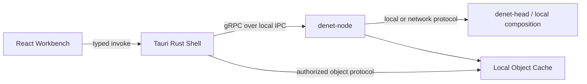
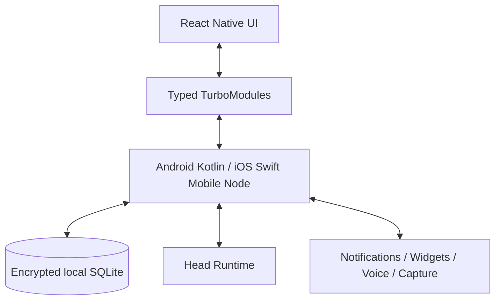

# Denet Client, Operations, Testing and Implementation Blueprint

> **Repository edition · 2026-07-13 · `83`**  
> Канонический архитектурный том. Сначала прочитайте [карту архитектуры](README.md) и [cross-domain contracts](../specifications/contracts/README.md).  
> Бывший временный предархитектурный документ разнесён по этим contracts; исторические ссылки на него означают данный интегрированный набор.


## Полная архитектура клиентских приложений, поставки, эксплуатации, тестирования, репозитория и исполняемого кодового каркаса

**Версия:** 1.0  
**Дата исследования:** 13 июля 2026 года  
**Статус:** канонический архитектурный том перед формированием репозитория и началом реализации.  
**Каноническое имя:** `83_Denet_Client_Operations_Testing_and_Implementation_Blueprint.md`.

Этот документ является самостоятельным. Читателю достаточно знать, что **Denet** — персональная агентная операционная система с постоянным главным runtime, проектами по принципу Codex/Claude Code, долговременной памятью, регулируемой автономностью, голосовым режимом, локальными и облачными моделями, внешними интеграциями, desktop- и mobile-клиентами.

Предыдущие архитектурные тома уже определили:

- системную топологию, процессы и deployment profiles — `80_Denet_System_Architecture_and_Runtime_Topology.md`; [[S13]]
- данные, память, хранилища, синхронизацию и протоколы — `81_Denet_Data_Memory_Storage_Sync_and_Protocol_Architecture.md`; [[S14]]
- агентов, voice, capabilities, providers и integrations — `82_Denet_Agent_Voice_Capability_and_Integration_Architecture.md`. [[S15]]

Он также сохраняет продуктовые и бизнес-логические обязательства функциональной концепции, Specification Index, Memory/Agentic/Trust/Voice/Capability/Server документов, desktop/mobile UX и end-to-end gap closure. [[S01]] [[S02]] [[S03]] [[S04]] [[S05]] [[S06]] [[S07]] [[S08]] [[S09]] [[S10]] [[S11]] [[S12]]

Этот том превращает их в **воспроизводимый производственный blueprint**. Он определяет:

- внутреннюю архитектуру desktop и mobile;
- точные границы между UI, локальным Node и Head Runtime;
- local IPC и generated client SDK;
- client caches, drafts, offline queues и live updates;
- installers, daemon registration, packages и updates;
- secrets и локальное шифрование;
- рабочее developer environment;
- структуру монорепозитория;
- `README.md` и `AGENTS.md`;
- многоуровневую тестовую архитектуру;
- deterministic simulation и scenario specification;
- CI/CD, release channels, signing, SBOM и provenance;
- observability, diagnostics, runbooks, backup drills и incident recovery;
- первый компилируемый skeleton;
- порядок вертикальной реализации.

Он **не переопределяет** бизнес-логику памяти, агентов, permissions, Voice Session, Project, Task, Run или Capability. Если ограничение клиента или packaging требует изменить один из этих контрактов, создаётся ADR и целевая правка соответствующего архитектурного тома. Клиентская удобность не имеет права незаметно создать второй источник истины.

---

# Часть I. Итоговое решение, границы и исследовательский протокол

## 0. Итоговое архитектурное решение

### 0.1. От спецификации к работающему продукту

Лучшая реализационная модель Denet:

> **Один монорепозиторий, одно устойчивое Rust-ядро, Tauri desktop как тонкий workbench, React Native mobile как interruption-safe remote, постоянные Node/Head процессы вне жизненного цикла UI, сгенерированные protocol clients, адаптеры вне core, многоуровневое тестирование и поставка независимых, подписанных компонентов.**

В первой производственной версии принимается следующий стек.

**Desktop**

- Tauri 2;
- React;
- TypeScript;
- Vite;
- Tauri Rust shell;
- отдельный `denet-node`, зарегистрированный как фоновый процесс ОС;
- локальный typed IPC между Tauri shell и Node;
- TanStack Query для authoritative remote state;
- небольшой store только для локального presentation state;
- WebdriverIO Tauri service для настоящих desktop E2E.

**Mobile**

- React Native New Architecture;
- TypeScript;
- Hermes;
- нативные Kotlin/Swift modules для background, transport, storage, notifications, widgets, voice и capture;
- React Native Codegen/TurboModules как typed boundary;
- локальная операция и draft сохраняются нативным mobile-node слоем до передачи в Head;
- Maestro для сквозных flows;
- XCTest/Android instrumentation для platform-critical modules.

**Core и службы**

- Rust workspace;
- `tokio`, `tonic`, `prost` и общие domain crates;
- PostgreSQL, SQLite и Object Store согласно тому 81;
- Protobuf как основной межпроцессный и device protocol;
- Buf для lint, generation и breaking-change checks;
- Python adapters через подписанный `uv`-managed runtime package;
- Node adapters как bundled application с закреплённым runtime; Node SEA рассматривается после packaging spike;
- OpenTelemetry-compatible instrumentation;
- GitHub Actions как baseline CI/CD;
- `just` и `cargo xtask` как единая командная поверхность.

### 0.2. Клиент не владеет системой

Desktop и mobile:

- отображают authoritative state;
- отправляют commands;
- сохраняют локальный UX state;
- могут сохранять offline operations;
- могут выполнять разрешённые локальные capabilities;
- не становятся владельцами Task, permission, Memory Claim или external effect только потому, что кнопка была нажата локально.

WebView и React Native JavaScript не получают:

- ключи mTLS;
- database credentials;
- Secret Broker master key;
- прямой SQL;
- unrestricted filesystem;
- provider credentials;
- произвольный shell;
- право считать optimistic state каноническим.

### 0.3. Фоновая жизнь отделена от окна

Закрытие Tauri-окна не останавливает:

- `denet-node`;
- локальный capture;
- offline queue;
- активные Managed Runs;
- local model server;
- device sync;
- notifications;
- background voice session, если ОС и policy это допускают.

На mobile постоянное выполнение ограничено реальными правилами Android/iOS. React Native JS не объявляется вечным daemon. Долговечное состояние сохраняется нативно, а долгие процессы выполняются Head/desktop/server либо platform-approved background mechanisms.

### 0.4. Тестируется не только функция, но и граница

Каждый значимый модуль обязан иметь:

1. pure domain tests;
2. application tests с fake ports;
3. adapter conformance suite;
4. protocol compatibility tests;
5. integration test с реальной зависимостью;
6. хотя бы один сквозной vertical scenario;
7. fault/recovery test, если модуль владеет долговечным состоянием или внешним эффектом;
8. observability assertions.

Одна гигантская E2E-сборка не считается тестовой архитектурой.

### 0.5. Репозиторий объясняет себя

Человек начинает с `README.md` и архитектурных томов. Coding-agent начинает с:

1. root `AGENTS.md`;
2. ближайшего nested `AGENTS.md`;
3. public contracts;
4. тестов;
5. связанного раздела архитектуры;
6. похожей существующей реализации.

`AGENTS.md` не дублирует спецификацию. Он является короткой исполняемой картой конкретной области кода.

### 0.6. Короткая формула

> **Denet реализуется как один проверяемый конструктор: стабильные контракты и доменная логика находятся в Rust-ядре; desktop и mobile являются быстрыми клиентами, а не вторыми серверами; внешние SDK и OS-функции подключаются через изолированные adapters; каждый компонент имеет тестовый double и conformance suite; обновления подписаны и обратимы; репозиторий, документация и CI не позволяют архитектуре незаметно разъехаться.**

---

## 1. Область ответственности

Этот том является каноническим владельцем:

- клиентской process topology;
- структуры Tauri/React desktop;
- структуры React Native mobile;
- frontend/native bridge;
- local IPC implementation;
- generated client SDK;
- client-side state/cache rules;
- draft и offline-command persistence на клиенте;
- client reconnect/resync;
- desktop service installation;
- mobile background integration;
- OS permissions и app extensions;
- component packaging;
- update distribution;
- release channels;
- developer environment;
- build tooling;
- monorepo layout;
- `README`/`AGENTS` conventions;
- CI/CD;
- test taxonomy;
- scenario format;
- observability deployment;
- diagnostics/runbooks;
- initial code skeleton;
- implementation milestones.

Этот том использует, но не переопределяет:

- `Project`, `Session`, `Task`, `Run`, `AgentInstance`;
- `MemoryEvent`, `EvidenceObject`, `Claim`, `CurrentState`;
- `PermissionDecision`, `Grant`, `EffectClaim`;
- `CapabilityDefinition`, `RuntimeBinding`;
- `VoiceSession`, `CommittedTurn`, `SpokenOutput`;
- `OperationLog`, `WatchSnapshot`, `WatchDelta`;
- `ArtifactDescriptor`;
- `BackupManifest`;
- `AuthorityEpoch`.

---

## 2. Исследовательский протокол

### 2.1. План для построения плана

До выбора инструментов проверялись следующие вопросы.

1. Какая часть клиента должна работать без Head?
2. Какая часть обязана переживать закрытие UI и process death?
3. Можно ли переиспользовать один UI stack без ухудшения глубоких OS integrations?
4. Где совместное использование кода экономит работу, а где создаёт искусственный общий знаменатель?
5. Как не допустить прямого доступа WebView/JS к секретам и хранилищам?
6. Как тестировать domain logic без GUI и provider?
7. Как тестировать GUI без реального облака?
8. Как воспроизводить split-brain, duplicate effects, late events, disk full и bad migration?
9. Как обновлять разные процессы, когда mobile store release задерживается?
10. Как coding-agent поймёт границу изменения без чтения сотен страниц?
11. Как начать с маленького runnable skeleton, не создавая сотни ложных пустых модулей?
12. Как собрать installers и adapter hosts без требования вручную устанавливать Rust, Node или Python?
13. Как выпускать артефакты с доказуемым provenance?
14. Как сделать production profile диагностируемым одним пользователем?
15. Какие решения должны остаться заменяемыми после первого релиза?

### 2.2. Проверенные гипотезы

**H1. Tauri UI может владеть фоновым runtime.**  
Отклонено. UI process подходит для окон и desktop integration, но не должен владеть жизненным циклом Node.

**H2. Tauri Mobile позволит использовать один client stack.**  
Не принят как baseline. Он остаётся кандидатом, но глубокая интеграция с notifications, widgets, foreground services, background audio, App Intents и platform stores требует слишком большого риска до отдельного spike.

**H3. Две полностью native mobile codebase дадут наилучшее качество.**  
Технически возможно, но удваивает presentation, navigation и feature work. React Native New Architecture даёт production-proven renderer, JSI и typed TurboModules, сохраняя возможность писать критическое нативно.

**H4. Всё можно хранить в React/JavaScript state.**  
Отклонено. Authoritative state и durable offline queue принадлежат Node/native core.

**H5. Один E2E suite найдёт интеграционные ошибки.**  
Отклонено. Такой suite медленный, flaky и плохо локализует дефект. Нужны contract, simulation и process integration layers.

**H6. Максимальная code sharing всегда полезна.**  
Отклонено. Делятся contracts, command IDs, domain vocabulary, generated clients, design tokens и test scenarios; platform UI и lifecycle остаются нативно подходящими.

**H7. GitHub Actions secrets достаточно для release.**  
Отклонено как предпочтительный путь. Для cloud publishing используется OIDC и короткоживущие credentials. Signing keys имеют отдельную custody policy.

**H8. Tauri updater достаточно для всех компонентов.**  
Отклонено. Он хорошо обновляет desktop bundle и требует signature, но Node, Head, memoryd, adapters и schemas нуждаются в Component Update Coordinator.

**H9. Каждый adapter host нужно собирать в один бинарник.**  
Отклонено. Rust adapters могут быть binaries; Python/Node получают reproducible runtime packages. Single-executable packaging остаётся оптимизацией после spike.

**H10. Общий coverage threshold гарантирует качество.**  
Отклонено. Критические state machines, sync, Trust и effects требуют property/mutation/fault tests; простой UI glue не должен искусственно переписываться ради процента.

### 2.3. Критерии принятия решений

Решение принимается, если оно:

- работает на Windows как главной desktop-платформе;
- не блокирует macOS/Linux;
- имеет реальный test path;
- переживает process restart там, где требуется;
- не расширяет authority UI;
- поддерживает local-only profile;
- сохраняет provider/backend replacement;
- не требует отдельной облачной инфраструктуры для development;
- может быть упрощено без миграции пользовательских данных;
- имеет понятный owner и failure mode;
- не требует LLM для build, update или recovery.

Решение возвращается на пересмотр, если:

- бизнес-логика дублируется в frontend и backend;
- mobile JS должен оставаться живым для сохранности command;
- update требует стереть данные;
- тесты требуют реальных платных providers на каждом PR;
- package нельзя проверить без его запуска;
- один flaky E2E блокирует всю разработку неделями;
- adapter может обойти Trust/Effect boundary;
- новый provider требует правки desktop/mobile;
- новый screen требует менять protocol без новой информации;
- repository map нельзя объяснить коротко;
- первый запуск разработчика занимает часы ручной настройки.

---

## 3. Реализационные инварианты

1. UI cache не является источником истины.
2. Каждый command имеет idempotency/correlation identity там, где повтор возможен.
3. Все durable user drafts сохраняются вне памяти WebView.
4. Необратимый effect не считается успешным по optimistic UI.
5. Frontend не открывает PostgreSQL/SQLite/Object Store напрямую.
6. Tauri command является UI bridge, а не доменным use case.
7. React Native TurboModule является platform bridge, а не новой доменной моделью.
8. Head/Node protocol имеет version negotiation.
9. Generated protocol files не редактируются вручную.
10. Любой live stream имеет snapshot, revision, gap detection и resync.
11. Любой background process имеет health, shutdown и restart policy.
12. Любой installer имеет repair и uninstall semantics.
13. Любое update bundle подписано и проверяется до исполнения.
14. Любая migration имеет preflight, backup и repair path.
15. Provider live tests отделены от deterministic CI.
16. Тест не считается стабильным только потому, что его автоматически повторили.
17. Fixtures не содержат реальные пользовательские secrets и личные данные.
18. Logs и crash reports проходят redaction до отправки.
19. Root README предназначен человеку; AGENTS — исполнителю изменения.
20. Nested AGENTS создаётся только на устойчивой архитектурной границе.
21. Code skeleton компилируется и выполняет vertical slice; пустые TODO-файлы не создаются ради вида.
22. Platform-specific код остаётся за port/TurboModule boundary.
23. Mobile store delay учитывается как нормальный version-skew.
24. Desktop, mobile, CLI и notifications вызывают одни domain commands.
25. Operations должны быть выполнимы без Kubernetes.

---

# Часть II. Клиентская технологическая стратегия

## 4. Desktop: Tauri 2 + React + отдельный Node

### 4.1. Почему Tauri

Tauri 2 принят как desktop shell благодаря:

- отдельному Rust Core process;
- системному WebView вместо полного bundled Chromium;
- command IPC;
- Channels для streaming;
- capabilities/permissions;
- sidecar support;
- tray, global shortcut, updater и OS plugins;
- Windows/macOS/Linux packaging;
- единому языку Rust с локальным Node.

Tauri documentation рекомендует Channels для streaming data вместо потока отдельных events. Его updater создаёт подписанные bundles и не позволяет отключить проверку signature. Эти свойства используются, но не считаются полной системой update всего Denet. [[S20]] [[S21]]

### 4.2. Почему не Electron

Electron остаётся fallback только если WebView/Tauri:

- не сможет обеспечить требуемую стабильность workbench;
- даст неприемлемые различия рендеринга;
- заблокирует accessibility;
- сделает desktop E2E ненадёжным;
- не позволит требуемую extension surface.

Baseline не принимает дополнительный Chromium и Node authority в UI process без доказанной необходимости.

### 4.3. Process boundary



React не общается с Node socket напрямую. Tauri shell:

- устанавливает локальную authenticated session;
- валидирует command payload;
- применяет Tauri capability scopes;
- вызывает generated Rust client;
- превращает watch stream в Tauri Channel;
- выдаёт ограниченные object handles;
- скрывает credentials и filesystem path.

### 4.4. Tauri shell остаётся тонким

В `src-tauri` допустимы:

- app lifecycle;
- window management;
- OS integration;
- local Node discovery;
- local IPC client;
- command/channel bridge;
- custom object protocol;
- secure storage facade;
- update UI bridge;
- desktop notifications;
- deep links;
- global shortcuts.

Недопустимы:

- самостоятельное изменение Project/Task state;
- собственный scheduler;
- Memory retrieval;
- model routing;
- direct SQL;
- provider SDK;
- external effect dispatch;
- дублирование Node offline queue.

---

## 5. Mobile: React Native New Architecture + native Mobile Node boundary

### 5.1. Принятое решение

Mobile-клиент строится на **React Native New Architecture** с TypeScript и Hermes.

React Native New Architecture production-proven в приложениях Meta, включена по умолчанию начиная с 0.76, поддерживает concurrent rendering и JSI; Turbo Native Modules описываются typed TypeScript specification и генерируют platform interfaces через Codegen. [[S22]] [[S23]]

Это даёт:

- одну presentation codebase;
- общие TypeScript contracts и command semantics;
- быстрый доступ к Kotlin/Swift;
- возможность делать сложные native modules;
- зрелую экосистему accessibility/navigation/testing;
- отсутствие требования писать весь UI дважды.

### 5.2. React Native не владеет background runtime

JavaScript runtime может быть:

- suspended;
- killed;
- restarted;
- ограничен энергосбережением;
- недоступен при lock screen action.

Поэтому под UI существует **Mobile Node Boundary**.



Mobile Node отвечает за:

- paired device identity;
- transport;
- local database;
- command queue;
- drafts;
- capture staging;
- notification commands;
- deep-link validation;
- sync watermarks;
- biometric step-up;
- background tasks;
- network reconnect;
- secure key access.

React Native UI отвечает за:

- presentation;
- navigation;
- interaction;
- accessibility;
- local ephemeral state;
- user-visible recovery.

### 5.3. Kotlin/Swift baseline, Rust optional

В первой версии Mobile Node реализуется небольшими нативными Kotlin/Swift modules поверх generated protocol clients.

Общий Rust mobile library через UniFFI допускается для:

- cryptographic package validation;
- shared operation-log logic;
- complex sync merge;
- reusable project pack handling;
- security-sensitive parser.

Но он не вводится только ради симметрии. UniFFI умеет генерировать Kotlin и Swift bindings, включая async interfaces, однако дополнительный FFI-слой должен доказать снижение дублирования, а не добавить новый packaging bottleneck. [[S24]]

### 5.4. Почему не pure native

Полностью отдельные SwiftUI и Compose UI дадут максимальную platform purity, но удвоят:

- screens;
- state projections;
- accessibility work;
- command wiring;
- navigation;
- visual regression;
- product iterations.

Переход к pure native допускается, если React Native:

- не выдерживает voice/capture/large-list performance;
- создаёт систематические crashes на bridge;
- не позволяет нужные widgets/extensions;
- ухудшает accessibility;
- требует слишком много platform forks.

Native Mobile Node boundary сохранит такую замену локальной.

### 5.5. Почему Tauri Mobile не baseline

Tauri Mobile остаётся experimental alternative для отдельного spike. Он может улучшить code sharing с desktop, но риск сосредоточен в:

- background execution;
- foreground microphone services;
- widgets;
- Live Activities/Live Updates;
- share extensions;
- notification service extensions;
- Car/Watch surfaces;
- native store lifecycle.

Архитектура не исключает будущий Tauri mobile renderer, потому что domain commands, protocol и Mobile Node остаются независимы от React Native.

---

## 6. Что действительно разделяется между клиентами

Общие packages:

- generated protocol types;
- client DTO validation;
- stable command IDs;
- error taxonomy;
- feature flags;
- locale keys;
- design tokens;
- icon semantics;
- keyboard/action descriptions;
- fixtures;
- scenario IDs;
- telemetry event names;
- redaction rules;
- pure formatting utilities.

Не объединяются искусственно:

- desktop layout;
- mobile navigation;
- desktop diff renderer;
- Android service lifecycle;
- iOS background tasks;
- mobile widgets;
- Tauri windowing;
- platform accessibility implementation.

Общая функция существует только если поведение действительно одинаково. Внешне похожие кнопки могут использовать общий `command_id`, но разные presentation paths.

---

## 7. Toolchain и воспроизводимость

### 7.1. Версии

Репозиторий закрепляет:

- Rust toolchain через `rust-toolchain.toml`;
- Node LTS через `mise.toml`;
- pnpm через Corepack и `packageManager`;
- Python через `uv.lock` и `.python-version`;
- Java/Android SDK через `mise`/Gradle version catalogs;
- Ruby/Bundler только для iOS tooling;
- Buf version;
- Protoc plugins;
- Tauri CLI;
- cargo-nextest;
- cargo-llvm-cov.

`latest` не используется в CI и release scripts.

### 7.2. Почему `mise` + `just` + `xtask`

**`mise`** устанавливает и закрепляет внешние toolchains.

**`just`** предоставляет короткие одинаковые команды:

```text
just bootstrap
just dev
just test
just check
just scenario <id>
just doctor
just release-check
```

**`cargo xtask`** выполняет типизированные repository-specific операции:

- generation;
- architecture checks;
- migration validation;
- package manifest;
- fixture generation;
- update metadata;
- release assembly;
- docs indexes.

Не создаётся самописный универсальный build system.

### 7.3. Package managers

- Rust — Cargo workspace;
- TypeScript — pnpm workspace;
- Python adapters — uv workspace/locked projects;
- Android — Gradle;
- iOS — Swift Package Manager там, где возможно, и CocoaPods только для React Native requirements.

Bazel/Nix не являются baseline. Dev Container и Nix flake могут быть добавлены как optional environment, если они реально сокращают onboarding или CI drift.

---

# Часть III. Desktop client architecture

## 8. Структура desktop-приложения

```text
apps/desktop/
├── README.md
├── AGENTS.md
├── package.json
├── vite.config.ts
├── tsconfig.json
├── src/
│   ├── app/
│   ├── platform/
│   ├── features/
│   ├── entities/
│   ├── workspaces/
│   ├── shared/
│   └── test/
├── src-tauri/
│   ├── Cargo.toml
│   ├── tauri.conf.json
│   ├── capabilities/
│   ├── src/
│   │   ├── lib.rs
│   │   ├── lifecycle.rs
│   │   ├── bridge/
│   │   ├── ipc/
│   │   ├── objects/
│   │   ├── os/
│   │   └── update/
│   └── tests/
└── e2e/
```

### 8.1. Frontend layers

**`app/`**

- composition root;
- router/workbench shell;
- Query Client;
- feature flags;
- locale;
- theme;
- error boundaries;
- global command registry.

**`platform/`**

- typed Tauri bridge;
- notifications;
- clipboard;
- deep links;
- object URLs;
- window state;
- platform capability detection.

**`entities/`**

Read models and view helpers for:

- Project;
- Session;
- Run;
- InboxCard;
- Artifact;
- MemoryItem;
- Capability;
- Device.

Это не domain entities Rust.

**`features/`**

User capabilities:

- send project turn;
- resolve Inbox card;
- pause Run;
- capture;
- review diff;
- correct memory;
- install skill;
- handoff device.

**`workspaces/`**

Compositions:

- Home;
- Orchestrator;
- Projects;
- Project;
- Inbox;
- Radar;
- Library;
- Settings.

**`shared/`**

- UI primitives;
- design tokens;
- formatting;
- accessibility;
- generic hooks;
- test utilities.

Dependency direction:

```text
app
→ workspaces
→ features
→ entities
→ platform/shared
```

`shared` не импортирует feature. `entities` не вызывает commands самостоятельно.

### 8.2. Не превращать frontend layering в религию

Для небольшой feature допускается один folder. Новая сущность создаётся только если:

- имеет повторно используемое представление;
- появляется в нескольких workspaces;
- имеет самостоятельные states/actions;
- требует отдельного test contract.

Нельзя создавать десятки пустых `model/ui/api/lib` directories по шаблону.

---

## 9. Tauri bridge

### 9.1. Два вида вызова

**Request/response**

Tauri commands для:

- execute typed command;
- query current object;
- open object handle;
- register window;
- request OS action;
- update check;
- export/import picker.

**Streaming**

Tauri Channels для:

- WatchSnapshot/WatchDelta;
- Run output;
- voice transcript;
- transfer progress;
- update progress;
- logs в Diagnostics mode.

Tauri Channels являются рекомендованным Tauri механизмом streaming data. [[S20]]

### 9.2. Bridge API

```rust
#[tauri::command]
async fn execute_command(
    state: tauri::State<'_, DesktopBridge>,
    request: ExecuteCommandRequest,
) -> Result<CommandAccepted, ClientError>;

#[tauri::command]
async fn watch_scope(
    state: tauri::State<'_, DesktopBridge>,
    request: WatchRequest,
    channel: tauri::ipc::Channel<WatchFrame>,
) -> Result<(), ClientError>;
```

Это иллюстрация формы, а не требование точных имён.

Каждый command:

- имеет correlation ID;
- содержит base revision, если изменяет versioned object;
- получает local client session;
- не содержит secret;
- проходит schema validation;
- возвращает accepted/rejected, а не притворяется завершённым effect.

### 9.3. Local object protocol

Большие screenshots, audio, video и artifacts не сериализуются в JSON через `invoke`.

Tauri shell предоставляет:

```text
denet-object://<object-handle>/<rendition>
```

Custom protocol:

1. проверяет active desktop session;
2. проверяет scope handle;
3. запрашивает object у Node/cache;
4. поддерживает range reads;
5. ставит безопасные content headers;
6. не раскрывает physical path;
7. закрывает handle после expiry/revoke.

Export выполняется отдельной командой с OS file picker.

### 9.4. Security

Tauri capability files разрешают только конкретные commands для конкретных окон.

Plugin/extension UI:

- работает в отдельном webview или iframe-like constrained surface;
- получает namespaced contribution contract;
- не вызывает core Tauri commands напрямую;
- не читает arbitrary object protocol;
- не получает Node session credential.

Content Security Policy запрещает произвольный remote script. Remote provider pages открываются системным browser или изолированным OAuth window.

---

## 10. Desktop state management

### 10.1. Четыре класса состояния

**Authoritative remote state**

- Project;
- Task/Run;
- Inbox;
- Radar;
- permission;
- capability health;
- memory current state.

Хранится в Head/Node, кэшируется через TanStack Query.

**Durable client-local state**

- composer draft;
- unsent attachments;
- capture staging;
- offline command;
- recently opened objects;
- resume capsule.

Хранится Node, а не только WebView.

**Presentation state**

- open tabs;
- pane sizes;
- current selection;
- inspector visibility;
- filters;
- scroll positions.

Хранится локально и может использовать небольшой UI store.

**Ephemeral interaction state**

- hover;
- temporary menu;
- drag indicator;
- streaming cursor;
- animation.

Остаётся внутри компонента.

### 10.2. TanStack Query

TanStack Query используется именно для server state: fetching, caching, synchronizing, stale marking, deduplication и background refresh. [[S25]]

Каждый query key включает stable identity:

```text
['project', project_id]
['session', session_id]
['run', run_id]
['inbox', filters_hash]
['memory-item', memory_id, revision]
```

WatchDelta не является отдельной второй store. Delta применяет:

1. revision check;
2. domain-specific cache patch;
3. invalidation зависимых queries;
4. resync при gap.

### 10.3. Optimistic UI

Разрешено:

- pin/unpin;
- local layout;
- draft editing;
- reversible label;
- queue message;
- mark notification read.

Осторожно:

- pause Run;
- snooze Inbox;
- project archive.

Запрещено показывать final success оптимистично для:

- отправки сообщения;
- permission;
- deletion;
- payment;
- publication;
- Git push;
- external account change;
- unknown effect.

UI может показать `Sending…`, затем `Accepted`, но `Sent` появляется только после receipt/reconciliation.

### 10.4. Draft persistence

Composer draft сохраняется:

- с debounce;
- при window blur;
- перед update/restart;
- при project/session change;
- перед close;
- при crash recovery через Node-owned journal.

Draft имеет:

- session ID;
- text;
- attachment handles;
- selection;
- mode;
- created/updated time;
- base context revision.

Если session была удалена или superseded, draft не теряется: предлагается открыть новую session или скопировать текст.

---

## 11. Desktop command system

Core operations имеют typed RPC. UI command registry добавляет:

- stable `command_id`;
- localized label;
- contexts;
- keybinding;
- menu placements;
- permission hint;
- offline behavior;
- handler reference.

Пример:

```yaml
command_id: run.pause
operation: PauseRun
contexts: [run.active, radar.row, project.run]
offline: queue_if_safe
optimistic: pending_only
undo: run.resume
```

Plugin command может использовать JSON Schema payload, но core command не превращается в generic untyped JSON.

Одни и те же IDs используются:

- button;
- menu;
- Command Center;
- keyboard;
- notification;
- voice intent;
- mobile shortcut.

---

## 12. Desktop lifecycle

### 12.1. Startup

```text
start Tauri
→ render local shell
→ load presentation state
→ discover Node endpoint
→ establish authenticated IPC
→ protocol handshake
→ get bootstrap snapshot
→ open watch stream
→ reconcile pending desktop commands
→ restore tabs/drafts
→ health background refresh
```

UI появляется до завершения полной синхронизации. Cached state имеет явную freshness.

### 12.2. Node отсутствует

Tauri показывает Recovery, а не пустой app:

- Start Node;
- Install/Repair Node;
- Connect to Remote Head in limited mode;
- Open diagnostics;
- Export local drafts;
- Safe Mode.

### 12.3. Shutdown

Close Window:

- сохраняет presentation state;
- оставляет Node.

Quit UI:

- закрывает все окна;
- не останавливает Node.

Stop Denet on Device:

- требует явную команду;
- Node прекращает новые local work;
- drain;
- checkpoint;
- sensor stop;
- close queues;
- shutdown.

### 12.4. Crash

Tauri crash не инвалидирует Node session immediately. При restart shell получает новую UI session, восстанавливает drafts и resubscribes.

---

# Часть IV. Mobile client architecture

## 13. Структура mobile-приложения

```text
apps/mobile/
├── README.md
├── AGENTS.md
├── package.json
├── src/
│   ├── app/
│   ├── navigation/
│   ├── features/
│   ├── entities/
│   ├── screens/
│   ├── platform/
│   ├── shared/
│   └── test/
├── specs/
│   ├── NativeDenetNode.ts
│   ├── NativeDenetVoice.ts
│   ├── NativeDenetCapture.ts
│   └── NativeDenetSystemSurfaces.ts
├── android/
├── ios/
├── maestro/
└── native-tests/
```

### 13.1. React Native application

React Native владеет:

- navigation;
- screens;
- render state;
- accessibility;
- interaction;
- animations;
- local formatting;
- low-attention UI;
- handoff UX.

### 13.2. NativeDenetNode TurboModule

Typed surface:

```ts
export interface Spec extends TurboModule {
  bootstrap(): Promise<BootstrapSnapshot>;
  executeCommand(request: CommandRequest): Promise<CommandAccepted>;
  subscribe(scope: WatchRequest): EventSubscription;
  saveDraft(draft: DraftRecord): Promise<void>;
  stageCapture(request: CaptureRequest): Promise<CaptureHandle>;
  getSystemState(): Promise<MobileNodeState>;
  requestStepUp(request: StepUpRequest): Promise<StepUpResult>;
}
```

Фактическая API будет сгенерирована из более узких modules; пример показывает обязанность, а не один giant module.

### 13.3. Native split

**Node/Transport**

- pairing;
- mTLS;
- gRPC;
- SQLite;
- offline queue;
- watch deltas;
- object transfer.

**Voice**

- audio session;
- foreground/background controls;
- headset;
- interruption;
- local ring buffer;
- Voice Session handoff.

**Capture**

- camera;
- document scanner;
- share extension;
- clipboard;
- local durable staging;
- upload.

**System Surfaces**

- notifications;
- widgets;
- Live Activity/Live Update;
- shortcuts;
- Action button/App Intents;
- quick settings;
- deep links.

Так отказ виджета не ломает transport, а audio lifecycle не смешивается с navigation.

---

## 14. Mobile state

Применяются те же четыре класса состояния, что на desktop.

TanStack Query может кэшировать Head/Node read models в JavaScript для UI, но durable offline state принадлежит native Mobile Node.

Mobile presentation state:

- navigation stack;
- current quick action;
- transient sheet;
- filters;
- selected tab.

Durable native state:

- drafts;
- capture staging;
- pending commands;
- last snapshots;
- notification actions;
- resume capsule;
- object cache;
- pairing;
- encrypted tokens.

### 14.1. Process death

Перед background/termination:

- navigation snapshot сохраняется;
- draft уже находится в native store;
- capture имеет local object ID;
- command queue fsynced;
- current Voice Session имеет server/native state;
- UI не обещает продолжение неподдерживаемой background работы.

После restart:

```text
native bootstrap
→ pending actions
→ last authoritative snapshot
→ process-death marker
→ React navigation restore
→ Resume Capsule
→ reconnect/resync
```

### 14.2. Offline command

Каждая offline command имеет:

- command ID;
- actor/device;
- created time;
- base revision;
- expiry;
- idempotency key;
- required revalidation;
- user-visible description;
- cancellation.

При reconnect она не dispatch-ится слепо. Mobile Node отправляет её Head, который возвращает:

- accepted;
- stale;
- conflict;
- permission expired;
- superseded;
- no longer useful;
- requires confirmation.

---

## 15. Background execution

### 15.1. Android

Используются разные механизмы по назначению.

**Foreground service**

Только для видимой длительной активности:

- active Voice Session;
- explicit ambient microphone profile;
- user-followed transfer;
- active device control.

Показывается persistent notification и stop action.

**WorkManager**

Для persistent deferrable work:

- sync;
- upload;
- retry;
- cleanup;
- backup metadata;
- notification reconciliation.

Android WorkManager предназначен для persistent work с constraints/retries, а не для бесконечной realtime-сессии. [[S26]]

**Alarm/schedule**

Только если точность действительно требуется и platform policy позволяет.

### 15.2. iOS

Используются:

- BGAppRefresh/BGProcessing для разрешённых фоновых операций;
- push notifications;
- background URLSession для transfers;
- audio background mode только для явной Voice/Ambient policy;
- App Intents;
- WidgetKit/ActivityKit;
- extensions.

iOS не обещает произвольный вечный daemon. Если Head недоступен и приложение приостановлено, Denet честно не выполняет неизвестные фоновые действия.

### 15.3. JS task не является гарантом

Background JS допускается как convenience layer, но не хранит единственный экземпляр:

- command;
- draft;
- capture;
- permission;
- effect state;
- sync watermark.

---

## 16. Mobile system surfaces

Notification, widget, Live Activity и shortcut вызывают Native Node command.

Например:

```text
notification action
→ native validation
→ command persisted
→ biometric if required
→ send/queue
→ OS surface shows Pending
→ Head result
→ update/close surface
```

Notification dismissal не закрывает Inbox card.

Lock-screen surface:

- скрывает sensitive project names по policy;
- не показывает secret;
- не даёт broad `Always allow`;
- проверяет freshness;
- для consequential action открывает step-up.

---

## 17. Handoff между устройствами

Handoff передаёт не «всё приложение», а конкретный набор:

- object reference;
- view intent;
- Voice floor;
- execution placement;
- draft;
- selected artifact/diff;
- permission card.

Пример:

```text
Open Diff on Desktop
→ mobile emits HandoffRequest
→ Head verifies target device
→ desktop receives signed deep link
→ desktop opens exact project/revision
→ mobile shows acknowledged
```

Voice handoff дополнительно использует floor token и heard-output ledger. Два устройства не должны одновременно озвучивать один answer.

---

# Часть V. IPC, generated SDK и client consistency

## 18. Local desktop IPC

### 18.1. Транспорт

Baseline:

- Linux/macOS — Unix Domain Socket;
- Windows — Named Pipe;
- Rust `tonic`/gRPC protocol;
- OS ACL;
- per-install endpoint;
- process credential check, где ОС позволяет;
- short-lived UI session challenge;
- no TCP listener by default.

Не используется unauthenticated localhost HTTP для privileged commands.

### 18.2. Handshake

```protobuf
message ClientHello {
  string client_component = 1;
  string component_version = 2;
  repeated uint32 protocol_versions = 3;
  string installation_id = 4;
  string device_id = 5;
  bytes session_challenge = 6;
  repeated string requested_features = 7;
}

message ServerWelcome {
  uint32 protocol_version = 1;
  string node_version = 2;
  uint64 authority_epoch_seen = 3;
  repeated string enabled_features = 4;
  bytes session_proof = 5;
  bool resync_required = 6;
}
```

Точные schemas живут в `protocols/proto`, а не копируются из документа.

### 18.3. Watch stream

Client запрашивает scopes:

```text
project/<id>
session/<id>
run/<id>
inbox
radar
system
```

Server сначала возвращает `WatchSnapshot`, затем monotonic `WatchDelta`.

Client хранит:

- stream ID;
- base revision;
- last sequence;
- snapshot fingerprint.

При gap:

- перестаёт применять deltas;
- маркирует view stale;
- запрашивает resync;
- не угадывает пропущенное состояние.

### 18.4. Backpressure

Stream разделяет priority:

1. cancel/takeover/security;
2. user-visible state;
3. Run output;
4. logs;
5. telemetry preview.

Large logs не блокируют Inbox resolution.

---

## 19. Mobile transport

Mobile uses the same Protobuf domain contracts.

Baseline implementations:

- Android generated Kotlin gRPC client;
- iOS generated Swift gRPC client;
- mTLS device identity;
- direct connection/Tailscale or relay selected by Node;
- unary commands;
- bidirectional watch stream;
- resumable object channel.

React Native не реализует TLS identity в JS.

Если native gRPC creates unacceptable packaging/connectivity issues, allowed fallback:

- HTTPS unary;
- WebSocket watch;
- same Protobuf payload or Connect-compatible mapping;
- same command/revision semantics.

Fallback оформляется ADR; protocol semantics не меняются.

---

## 20. Code generation

Buf является единой точкой Protobuf operations:

```text
buf lint
buf format
buf generate
buf breaking --against .git#branch=main
```

Generated targets:

- Rust `prost`/`tonic`;
- TypeScript client DTO;
- Kotlin;
- Swift;
- documentation/schema descriptor;
- compatibility fixtures.

Buf detects source- and wire-level breaking changes and supports local/CI comparisons. Для внутренних wire consumers baseline category — `WIRE_JSON`; public generated SDK may require `PACKAGE` or stricter rules. [[S27]]

Generated code:

- хранится или воспроизводимо генерируется по policy;
- имеет header `DO NOT EDIT`;
- проверяется `git diff --exit-code` после generation;
- никогда не меняется coding-agent вручную.

---

## 21. Error model

Wire error:

```protobuf
message ErrorEnvelope {
  string code = 1;
  string message_key = 2;
  string correlation_id = 3;
  bool retryable = 4;
  bool user_action_required = 5;
  string details_handle = 6;
  optional uint64 current_revision = 7;
}
```

UI локализует `message_key`, но технический code остаётся стабильным.

Классы:

- validation;
- unauthorized;
- stale_revision;
- conflict;
- unavailable;
- timeout;
- rate_limited;
- resource_pressure;
- migration_required;
- incompatible_version;
- unknown_effect;
- internal;
- corrupted_state.

Raw provider error не показывается как основной user message и не определяет retry policy напрямую.

---

## 22. Client cache policy

Каждый cached record содержит:

- object ID;
- revision;
- observed time;
- source;
- freshness class;
- incomplete fields;
- permission scope;
- schema version.

Client не выводит `live`, если:

- watch disconnected;
- snapshot expired;
- Head epoch changed;
- device offline;
- object read model partial.

Views use:

- Fresh;
- Cached likely current;
- Cached may be outdated;
- Local provisional;
- Conflict possible;
- Resyncing;
- Unavailable.

---

## 23. Object/media path

Desktop:

```text
React
→ scoped object handle
→ Tauri custom protocol
→ Node object cache
→ local/remote ObjectStore
```

Mobile:

```text
React Native
→ Native Object Module
→ local encrypted file URI
→ background transfer
→ ObjectStore
```

Object handle includes:

- object ID;
- rendition;
- scope;
- expiry;
- disposition;
- expected hash;
- sensitivity.

No component passes arbitrary physical path through a cross-device protocol.

---

# Часть VI. Packaging, installation, updates and local security

## 24. Component inventory

Release may include:

- `denet-desktop`;
- `denet-node`;
- `denet-head`;
- `denet-memoryd`;
- `denetctl`;
- `denet-sensor-worker`;
- Rust adapter hosts;
- Python adapter host package;
- Node adapter host package;
- migrations;
- Protobuf descriptors;
- default skills/templates;
- diagnostics assets;
- optional OTel configuration;
- personal-server Compose bundle.

Каждый component has:

```yaml
id:
version:
protocol_range:
schema_range:
platform:
architecture:
hash:
signature:
dependencies:
migration_set:
restart_policy:
rollback_class:
```

---

## 25. Desktop installation

### 25.1. Windows

Baseline personal install:

- Tauri NSIS user-wide installer;
- desktop app under user application directory;
- `denet-node` in versioned component directory;
- startup through per-user Task Scheduler/logon registration;
- Named Pipe ACL only for current user;
- updater uses passive user-wide install;
- optional machine-wide service package for server/advanced profile.

MSI is produced for managed environments but is not required for first personal release.

### 25.2. macOS

- signed/notarized `.app`;
- LaunchAgent for `denet-node`;
- Keychain;
- application support directories;
- privileged helper avoided unless a real capability requires it.

### 25.3. Linux

- AppImage and `.deb` baseline;
- systemd user service;
- Secret Service when available;
- XDG directories;
- Flatpak/Snap considered later because sandbox permissions for projects, capture and external tools require separate design.

### 25.4. Repair

Installer/desktop supports:

- Verify Installation;
- Repair Node;
- Re-register Startup;
- Verify permissions;
- Repair local DB;
- Re-download optional component;
- Rebuild index;
- reset UI only;
- preserve user data.

---

## 26. Mobile distribution

Android:

- signed App Bundle;
- Play internal/beta/stable tracks;
- reproducible Gradle lockfiles;
- native symbols uploaded separately;
- foreground service declarations reviewed;
- permissions requested contextually.

iOS:

- signed archive;
- TestFlight/stable;
- entitlements review;
- privacy manifest;
- extensions versioned with app;
- migration tested across store-skipped versions.

No baseline over-the-air native or JavaScript code update outside the stores. This prevents client code/protocol moving independently from reviewed native modules. A later OTA mechanism requires separate supply-chain and version-skew ADR.

---

## 27. Adapter host packaging

### 27.1. Python

Python host package contains:

```text
adapter-host-python/
├── manifest.json
├── uv.lock
├── pyproject.toml
├── wheelhouse/          # offline bundle profile
├── runtime/             # signed standalone Python, optional
├── app/
└── signatures/
```

`uv` is used for locked environments, Python runtime acquisition, workspace management and reproducible sync. It supports Windows/macOS/Linux and universal lockfiles. [[S28]]

Two distributions:

- **online component** — signed host + lockfile, downloads verified runtime/wheels;
- **offline component** — includes runtime and wheelhouse.

Adapter package never installs into system Python.

### 27.2. Node

Node host:

- bundles JS with esbuild/rolldown-like tool;
- includes exact Node LTS runtime;
- has pnpm lock and license inventory;
- runs from versioned component directory.

Node Single Executable Applications are available but remain in active development. They are evaluated as a size/operability optimization, not required baseline. [[S29]]

### 27.3. Adapter isolation

Host gets:

- scoped work directory;
- explicit network policy;
- no inherited secrets;
- brokered credentials;
- memory/object handles;
- deadline/cancel;
- max resource limits;
- versioned RPC;
- redacted logs.

Update of one adapter host does not update Head.

---

## 28. Filesystem layout

### 28.1. Windows example

```text
%LOCALAPPDATA%\Denet\
├── app\
├── components\
│   ├── node\<version>\
│   ├── memoryd\<version>\
│   └── adapters\<id>\<version>\
├── current\
├── data\
│   ├── sqlite\
│   ├── objects\
│   ├── cache\
│   ├── logs\
│   └── updates\
└── config\
```

### 28.2. Linux/macOS

Use XDG / Application Support equivalents.

Data, binaries, config, cache and logs are separate so:

- update does not touch data;
- uninstall can offer data preservation;
- cache can be cleared;
- backup excludes binaries;
- repair can replace one component.

---

## 29. Local encryption and secrets

### 29.1. Key hierarchy

```text
Recovery Root
└── Installation Master Key
    ├── Device Identity Key
    ├── Local Database Key
    ├── Object Domain Keys
    ├── Backup Encryption Key references
    └── Session/transport derived keys
```

Secret values do not appear in JS, config JSON or logs.

### 29.2. Platform key stores

- Android Keystore;
- Apple Keychain/Secure Enclave where suitable;
- Windows DPAPI/Credential Manager;
- macOS Keychain;
- Linux Secret Service, TPM/systemd credential or explicit recovery-unlock fallback.

Android Keystore supports non-exportable keys and hardware-backed protection where available. [[S30]]

### 29.3. SQLite

Initial decision:

- mobile operational SQLite uses SQLCipher;
- portable/laptop desktop SQLite uses SQLCipher if packaging/performance spike passes;
- server SQLite test/dev can be unencrypted on disposable profile;
- high-sensitivity fields remain envelope-encrypted independent of DB encryption.

Database key is fetched natively from keystore. React/Tauri frontend never sees it.

SQLCipher provides transparent SQLite database encryption but introduces build, migration and compatibility cost; conformance and performance tests are mandatory. [[S31]]

### 29.4. Objects

Sensitive objects use per-privacy-domain data keys and authenticated encryption. Metadata necessary for routing stays minimal. Redacted rendition may use a separate key/scope.

### 29.5. Server headless profile

Baseline:

- encrypted secret vault file;
- unlock key from systemd credential, TPM-backed secret or explicit startup recovery;
- provider credentials issued to adapters only through Secret Broker;
- HashiCorp Vault remains optional for advanced deployments.

---

## 30. Update architecture

### 30.1. Two layers

**Desktop bundle update**

- Tauri updater;
- signed artifact;
- HTTPS endpoint;
- separate check/download/install;
- relaunch.

Tauri requires update signatures and produces platform-specific signed update bundles. [[S21]]

**Denet component update**

- Update Coordinator;
- signed release manifest;
- component hashes;
- compatibility ranges;
- staged installation;
- drain;
- health check;
- rollback.

### 30.2. Versioned slots

```text
components/node/
├── 1.4.2/
├── 1.5.0/
└── current -> 1.5.0
```

Update:

1. download staging;
2. verify signature/hash;
3. validate manifest;
4. ensure disk budget;
5. backup if migration;
6. preflight;
7. drain process;
8. install inactive slot;
9. switch pointer;
10. start;
11. readiness;
12. migration smoke;
13. commit or rollback.

Windows uses update helper because running binary cannot replace itself safely.

### 30.3. Metadata security

Baseline uses:

- Tauri artifact signature for desktop;
- signed Denet release manifest;
- monotonic version/channel policy;
- expiration;
- hash verification;
- key rotation procedure;
- rollback only through explicitly authorized metadata.

For broad public distribution, TUF-compatible metadata is recommended because TUF explicitly addresses key compromise, rollback, freeze and mix-and-match attacks. It is a release-hardening milestone rather than a prerequisite for the first private alpha. [[S32]]

### 30.4. Release channels

- `stable`;
- `beta`;
- `nightly`;
- optional `dev/local`.

A device can follow different channel only within compatibility policy. Head may reject an unsafe old client but should provide a read-only/update path.

### 30.5. Version skew

Baseline:

- Head supports current and previous desktop protocol generation;
- Head supports current and previous two mobile protocol generations because store rollout is slower;
- Device declares features, not only version;
- unsupported command is rejected explicitly;
- old client does not erase unknown fields;
- migrations use expand-contract.

---

## 31. Migration user experience

Migration states:

- preflight;
- backup;
- waiting for devices;
- draining;
- migrating;
- rebuilding projections;
- validating;
- complete;
- degraded complete;
- rollback available;
- forward-fix required;
- repair required.

UI shows:

- what changes;
- expected downtime;
- backup status;
- components affected;
- whether downgrade remains possible;
- what can continue locally.

A long index rebuild does not keep the entire installation unavailable if canonical data is usable.

---

## 32. Uninstall and data preservation

Choices:

- Remove application only;
- Remove application and caches;
- Remove device from installation;
- Export then remove;
- Remove all local Denet data;
- Decommission Head;
- Destroy installation.

Uninstall does not silently:

- delete projects;
- delete remote repositories;
- revoke all provider accounts incorrectly;
- destroy backups;
- erase other devices.

A device decommission operation revokes identity at Head before local key deletion when connectivity exists; offline decommission produces recovery instructions.


# Часть VII. Observability, operations, backup и эксплуатационная надёжность

## 33. Операционная модель

Denet должен быть обслуживаем одним технически заинтересованным владельцем без команды SRE.

Поэтому production baseline:

- не требует Kubernetes;
- не требует отдельного commercial observability vendor;
- не требует ручного SSH для обычной диагностики;
- имеет `denetctl`;
- имеет `denet doctor`;
- сохраняет локальный health summary;
- предоставляет guided repair;
- автоматически проверяет backup;
- показывает unknown effects;
- ограничивает crash loops;
- экспортирует privacy-redacted support bundle.

Сложный observability stack является опциональным profile, а не зависимостью запуска.

---

## 34. Telemetry architecture

### 34.1. Четыре разных источника

**Operational telemetry**

- latency;
- queue depth;
- errors;
- resource use;
- provider health;
- sync lag;
- index lag.

**Execution trace**

- command;
- Task/Run;
- agent/provider;
- tool;
- permission;
- effect;
- result.

**Security audit**

- identity;
- grant;
- secret access;
- external effect;
- revoke;
- incident.

**Product/UX analytics**

- feature use;
- time to result;
- resume success;
- notification action;
- failure recovery.

Security audit не удаляется вместе с обычным debug log по одной кнопке, но не содержит лишнего private content.

### 34.2. OpenTelemetry

Rust, TypeScript, Python и Node components используют OpenTelemetry-compatible:

- traces;
- metrics;
- structured logs;
- semantic attributes;
- correlation IDs.

OpenTelemetry Collector может работать:

- как local agent на device;
- как gateway на personal server;
- отсутствовать, если пользователь не включил export.

Официальная документация Collector описывает agent, gateway и agent-to-gateway deployment patterns; Denet выбирает профиль по установке, а не требует отдельный collector в local-only mode. [[S33]]

### 34.3. Correlation

Обязательные attributes:

```text
denet.installation.id
denet.device.id
denet.component
denet.project.id
denet.session.id
denet.task.id
denet.run.id
denet.command.id
denet.effect.id
denet.capability.id
denet.provider.id
denet.protocol.version
denet.authority.epoch
```

Высококардинальные user content, prompts и object IDs не отправляются в metrics labels.

### 34.4. Privacy

До export:

- secrets удаляются;
- message body не включается;
- filenames могут хэшироваться;
- project title заменяется ID;
- prompts и model output off by default;
- screenshots/audio не прикладываются;
- crash stack очищается от paths;
- пользователь видит preview support bundle.

---

## 35. Default observability profiles

### 35.1. Personal Quiet

Default:

- rotating structured logs;
- embedded metrics snapshot;
- local traces для последних значимых Runs;
- no remote export;
- diagnostics UI;
- retention 7–14 days для debug logs;
- audit по policy.

### 35.2. Developer

- verbose tracing;
- local OTel Collector;
- console/OTLP;
- trace viewer;
- provider cassettes;
- hot reload;
- query plan diagnostics.

### 35.3. Personal Server Advanced

Optional Compose profile:

- OpenTelemetry Collector;
- Prometheus-compatible metrics;
- Tempo-compatible traces;
- Loki-compatible logs;
- Grafana dashboards.

Эта конфигурация находится в `deploy/observability/` и не является частью core runtime.

### 35.4. Support Session

Временный режим:

- повышенная детализация;
- ограниченное время;
- explicit consent;
- visible indicator;
- auto-expiry;
- support bundle;
- revert to normal.

---

## 36. Health, readiness и liveness

Каждый persistent process предоставляет:

**Liveness**

Процесс способен отвечать event loop.

**Readiness**

Компонент может выполнять свою основную работу.

**Degraded capabilities**

Например, memoryd может быть ready для exact read/write, но vector search degraded.

**Dependency health**

- DB;
- object store;
- adapter;
- provider;
- disk;
- clock;
- protocol.

Health ответ содержит:

```yaml
component:
  state: healthy | degraded | unavailable | migrating | draining
  version:
  protocol_range:
  since:
  dependencies: []
  repair_actions: []
```

Heartbeat не считается доказательством корректности: `denet doctor` выполняет semantic probes.

---

## 37. `denetctl`

Baseline CLI:

```text
denetctl status
denetctl doctor
denetctl start
denetctl stop
denetctl restart
denetctl components
denetctl devices
denetctl runs
denetctl effects unknown
denetctl effects reconcile <id>
denetctl sync status
denetctl sync retry
denetctl backup create
denetctl backup verify
denetctl backup restore-plan
denetctl migrate status
denetctl update check
denetctl update apply
denetctl update rollback
denetctl logs
denetctl support-bundle
denetctl config validate
denetctl protocol check
denetctl scenario run <id>
```

CLI использует тот же Node/Head API, а не прямую DB.

Destructive commands:

- показывают exact scope;
- требуют explicit flag/interactive confirmation;
- поддерживают plan/dry-run;
- сохраняют receipt.

---

## 38. `denet doctor`

Проверки:

1. process discovery;
2. component versions;
3. protocol compatibility;
4. Head authority/epoch;
5. Node identity;
6. local IPC;
7. database integrity;
8. pending migrations;
9. object-store integrity sample;
10. index watermarks;
11. disk space;
12. local clock/tzdata;
13. sync lag;
14. offline queue;
15. unknown effects;
16. crash loops;
17. provider health;
18. capability probes;
19. Secret Broker;
20. backup age;
21. last restore drill;
22. update metadata;
23. OS permissions;
24. sensor state;
25. log redaction configuration.

Output:

- summary;
- evidence;
- severity;
- safe auto-repair;
- manual action;
- support reference.

`doctor --repair-safe` выполняет только обратимые и доказуемые действия: rebuild cache, restart adapter, fix permissions in owned directory, resync read model. Он не удаляет user data и не повторяет external effect.

---

## 39. Runbooks

Минимальный набор:

```text
docs/runbooks/
├── head-unavailable.md
├── node-unavailable.md
├── memoryd-degraded.md
├── postgres-recovery.md
├── sqlite-corruption.md
├── object-corruption.md
├── disk-pressure.md
├── unknown-external-effect.md
├── provider-outage.md
├── adapter-crash-loop.md
├── device-lost.md
├── certificate-expiry.md
├── sync-conflict.md
├── bad-update.md
├── migration-failure.md
├── backup-restore.md
├── ambient-source-stuck.md
└── emergency-stop-recovery.md
```

Каждый runbook:

- symptom;
- impact;
- do not do;
- diagnostics;
- containment;
- recovery;
- verification;
- data-loss risk;
- rollback;
- incident record;
- prevention.

---

## 40. Service objectives

Это initial SLO hypotheses, которые корректируются после risk spikes.

### 40.1. Client responsiveness

- desktop cached shell visible: p95 ≤ 1.5 s warm, ≤ 3 s cold;
- mobile cached Home: p95 ≤ 2 s;
- local command accepted: p95 ≤ 150 ms;
- watch delta visible: p95 ≤ 300 ms under normal local conditions;
- Stop/Emergency Stop local acknowledgement: p95 ≤ 100 ms;
- project chat first visible streaming state: p95 ≤ 500 ms after provider starts;
- no UI main-thread task > 50 ms during ordinary streaming.

### 40.2. Reliability

- locally committed draft/capture RPO: 0 after durable acknowledgement;
- personal-server canonical DB RPO: ≤ 5 min with WAL archive;
- ordinary Head restart RTO: ≤ 5 min;
- full server restore target: ≤ 2 h for initial personal deployment;
- backup verification freshness: ≤ 24 h;
- full restore drill: quarterly;
- unknown effect never blind-retried.

### 40.3. Test stability

- required PR suite flake rate < 0.5%;
- deterministic simulation must reproduce failure by seed;
- quarantined flaky test has owner and expiry ≤ 7 days;
- no release with unknown migration failure;
- no release if backup restore smoke fails.

SLOs are product expectations, not promises independent of hardware or provider.

---

## 41. Default resource and retention profile

### 41.1. Resource profiles

**Balanced — default**

- background CPU limited;
- one heavy local model by default;
- sensor indexing lower priority than interaction;
- network transfers paused on metered connection if not urgent;
- battery-sensitive mobile work deferred;
- provider budget warnings.

**Private Local**

- local models preferred;
- no telemetry export;
- media local;
- cloud connectors explicit.

**Low Resource**

- smaller caches;
- lower capture frequency;
- no automatic heavy consolidation;
- aggressive model unload.

**Research/High Capacity**

- larger indexes;
- longer artifact retention;
- more parallel background work;
- server/GPU placement.

### 41.2. Initial local budgets

Desktop/laptop Node:

- logs: 1–2 GB max rotating;
- UI cache: 1 GB default;
- object hot cache: 10 GB default, adaptive;
- local indexes: bounded by 15% free disk or explicit limit;
- update staging: reserve two component versions;
- minimum emergency free disk: 5 GB or 5%, whichever larger.

Mobile:

- object cache: 1–3 GB adaptive;
- captures pending upload retained until acknowledged;
- logs: 100–250 MB;
- model files opt-in and separately budgeted;
- background transfer respects data saver.

Server:

- warning at 20% free;
- pressure at 10%;
- critical at 5%;
- emergency read-only before filesystem exhaustion.

### 41.3. Sensory defaults

- ambient audio ring buffer: local overwrite-only, default 90 s;
- no automatic long-term raw audio unless event committed;
- static screen frames deduplicated;
- screen hot raw default 30 days for committed automatic captures, configurable;
- manual captures/artifacts retained until user policy;
- derived OCR/transcript can outlive raw media if policy allows;
- secret/private source can have shorter/no raw retention;
- low-disk mode drops rebuildable derivatives before canonical metadata.

---

## 42. Exact backup baseline

### 42.1. Personal Server

PostgreSQL/pgBackRest:

- continuous WAL archive;
- weekly full;
- daily differential;
- 6-hour incremental where storage allows;
- retain 2 full backup chains;
- retain PITR window 30 days;
- one local/NAS repository;
- one encrypted offsite repository.

Objects/config/restic:

- snapshot every 6 hours for changed canonical objects/config;
- retain 14 daily;
- 8 weekly;
- 12 monthly;
- weekly `restic check` subset;
- monthly full metadata/integrity check.

### 42.2. Local-only

SQLite:

- Online Backup/VACUUM INTO snapshot after significant migration and at least daily;
- optional Litestream adapter for continuous off-device replication;
- retain 48 hourly, 14 daily, 8 weekly subject to space.

Objects:

- restic daily;
- immediate snapshot before destructive migration;
- off-device target strongly recommended.

### 42.3. Restore verification

Daily automated smoke:

- decrypt metadata;
- list snapshots;
- verify manifests;
- sample object hashes.

Monthly isolated restore:

- restore DB;
- apply WAL;
- restore objects;
- start compatible Head/memoryd;
- rebuild one index;
- open known Project;
- retrieve known Evidence;
- verify deletion tombstone;
- execute fake Run.

Quarterly full drill:

- new environment;
- Recovery Kit;
- device re-pair;
- all critical stores;
- measured RTO;
- documented discrepancies.

Backup success notification without restore test is not considered healthy.

---

# Часть VIII. Тестовая архитектура

## 43. Цель тестирования

Тестовая система должна:

- локализовать ошибку близко к её источнику;
- воспроизводить distributed failures;
- отделять deterministic core от nondeterministic providers;
- проверять compatibility;
- тестировать recovery, а не только happy path;
- работать без платных credentials;
- быть достаточно быстрой для постоянного использования;
- служить документацией coding-agents;
- не создавать ложное доверие высоким coverage.

React Native official guidance рассматривает static, unit, integration, component и E2E tests как разные уровни; E2E даёт высокий confidence, но дорог и должен применяться к критическим flows. [[S34]]

---

## 44. Пирамида Denet

### T0. Static and architecture checks

- Rust fmt/clippy;
- TypeScript;
- ESLint;
- Swift/Kotlin lint;
- schema lint;
- dependency direction;
- forbidden imports;
- generated diff;
- license/advisory;
- secret scan.

Запускается на каждом PR.

### T1. Pure domain tests

- state transitions;
- policy;
- merge decisions;
- effect lifecycle;
- Task/Run;
- memory current-state resolver;
- command applicability;
- capability selection.

Без DB, network, clock и model.

### T2. Application tests with fake ports

- use cases;
- transaction intent;
- command handling;
- context assembly;
- cancellation;
- error mapping.

Используются fake clock, fake repositories, fake providers.

### T3. Repository and adapter contracts

Один contract suite запускается против:

- PostgreSQL;
- SQLite;
- embedded Memory;
- memoryd;
- object store implementations;
- provider adapters;
- connector adapters;
- computer-use backends;
- sensor sources.

### T4. Process integration

Реальные binaries и disposable dependencies:

- Node;
- Head;
- memoryd;
- adapter host;
- PostgreSQL;
- object store;
- mock provider.

Testcontainers Rust создаёт disposable container dependencies для integration tests. [[S35]]

### T5. Deterministic simulation

- virtual time;
- message reorder/drop/duplicate;
- process crash;
- partition;
- disk pressure;
- provider timeout;
- stale epoch;
- delayed result;
- migration interruption.

### T6. Client component and bridge tests

- React/Vitest;
- React Native Testing Library;
- Tauri command mocks;
- TurboModule fakes;
- Storybook state stories;
- accessibility.

### T7. End-to-end

- Tauri binary via WebdriverIO;
- Android/iOS via Maestro;
- system extensions where possible;
- real local processes;
- fake services.

### T8. Live provider and hardware canaries

- selected cloud model;
- one live connector sandbox;
- voice backend;
- screen capture;
- local GPU.

Не блокирует каждый PR; запускается scheduled/pre-release.

### T9. Soak, chaos and recovery

- hours/days;
- memory leaks;
- resource pressure;
- backup/restore;
- update/rollback;
- repeated reconnect;
- sensor lifecycle;
- provider degradation.

---

## 45. Rust tests

### 45.1. Runner

`cargo-nextest` является default runner:

- process isolation;
- filtersets;
- per-test timeout;
- sharding;
- JUnit;
- record/replay;
- slow-test detection.

Nextest поддерживает process-per-test, CI partitioning и recording/replay. [[S36]]

Commands:

```text
just test-rust
cargo nextest run --profile ci
cargo nextest run -E 'package(denet-trust-core)'
```

### 45.2. Property tests

`proptest` применяется к:

- sync operations;
- merge;
- revision;
- event ordering;
- retention;
- package parser;
- state machines;
- idempotency;
- protocol conversions.

Property test генерирует inputs и минимизирует failing case через shrinking. [[S37]]

Примеры properties:

```text
apply(op) twice == apply(op) once
merge(a,b) preserves both non-conflicting edits
stale epoch never commits effect
encode/decode preserves semantic fields
deletion obligation never returns to active
```

### 45.3. Model-based testing

State model используется для:

- Task/Run;
- Effect Claim;
- Head handoff;
- Inbox card;
- update;
- object upload;
- backup;
- Voice floor.

Generated command sequences сравнивают model state с system under test.

### 45.4. Fuzzing

Targets:

- Protobuf/JSON package parsing;
- import manifests;
- plugin descriptors;
- MCP schemas;
- object metadata;
- sync batches;
- deep links;
- URL/recipient normalization;
- compression/decompression;
- redaction.

Fuzz failures сохраняются как regression fixtures.

### 45.5. Mutation testing

Обязательно для небольших критических crates:

- trust/effect decisions;
- sync conflict logic;
- deletion;
- recovery;
- update verification.

Не запускается для всего UI-кода.

---

## 46. Protocol and schema tests

CI:

```text
buf lint
buf format --diff
buf breaking --against .git#branch=main
buf generate
git diff --exit-code
```

Дополнительно:

- old client ↔ new server;
- new client ↔ old supported server;
- unknown fields;
- reordered fields;
- removed reserved tags;
- large payload;
- malformed payload;
- cancellation;
- partial stream;
- resync.

Golden wire fixtures хранятся по protocol generation.

---

## 47. Persistence tests

### 47.1. Repository conformance

Одинаковый suite:

- create/read/update;
- revision conflict;
- transaction rollback;
- outbox atomicity;
- pagination;
- deletion;
- migration;
- crash after commit;
- pool exhaustion;
- clock/timezone.

### 47.2. PostgreSQL

Testcontainers запускает реальную поддерживаемую версию, не in-memory substitute.

Проверяется:

- transaction isolation;
- constraints;
- concurrent writers;
- WAL/backup;
- migrations;
- search extensions;
- reconnect.

### 47.3. SQLite/SQLCipher

Проверяется:

- WAL;
- process death;
- busy timeout;
- encryption key;
- wrong key;
- migration;
- backup;
- low disk;
- corrupted tail;
- Android/iOS build parity.

### 47.4. Object Store

Contract tests:

- atomic finalize;
- multipart;
- resume;
- wrong hash;
- duplicate object;
- range;
- concurrent upload;
- incomplete staging;
- encryption;
- GC reachability;
- redacted rendition.

---

## 48. Adapter conformance

Каждый adapter проходит common suite:

1. describe/probe;
2. version;
3. start;
4. cancel;
5. deadline;
6. stream ordering;
7. malformed result;
8. large result handle;
9. usage;
10. health;
11. restart;
12. secret redaction;
13. effect mapping;
14. capability changes;
15. update compatibility.

Provider-specific tests добавляются отдельно.

Adapter не считается ready только потому, что один demo запрос прошёл.

---

## 49. Provider и LLM testing

### 49.1. Fake runtime

Основной CI использует deterministic fake:

- scripted responses;
- tool calls;
- streaming chunks;
- timeout;
- refusal;
- malformed JSON;
- late event;
- token usage;
- session loss.

### 49.2. Cassettes

Sanitized recordings:

- provider request shape;
- event order;
- tool call;
- error;
- resume token.

Cassettes не содержат credentials/user data и имеют provider/version metadata.

### 49.3. Live smoke

Scheduled:

- cheapest compatible model;
- one trivial prompt;
- one tool call;
- one session resume;
- one cancel;
- usage/latency.

Live test failure marks provider integration degraded but не доказывает core regression.

### 49.4. Evaluation

Для nondeterministic quality:

- task-level acceptance;
- evidence requirements;
- tests/environment outcome;
- rubric;
- repeated trials;
- cost;
- latency;
- provider/model version.

Не сравнивать точную natural-language строку.

---

## 50. Desktop testing

### 50.1. Vitest

- pure UI logic;
- reducers;
- command applicability;
- formatting;
- cache delta application;
- accessibility helpers.

Vitest Browser Mode supports component/visual/ARIA testing in real browser context. [[S38]]

### 50.2. Component stories

Storybook stories для всех material states; isolated stories одновременно служат визуальной документацией и test fixtures. [[S45]]

Состояния:

- loading;
- cached;
- stale;
- offline;
- conflict;
- partial;
- restricted;
- error;
- recovery;
- high contrast;
- large text.

Story is documentation and visual fixture, not only showcase.

### 50.3. Tauri bridge tests

- command serialization;
- Channels;
- reconnect;
- object protocol;
- Node absent;
- capability scope;
- deep link;
- update events.

### 50.4. Desktop E2E

WebdriverIO with Tauri service:

- Windows;
- macOS;
- Linux;
- embedded WebDriver;
- frontend/backend log capture;
- command mocking for renderer-only runs.

Tauri currently recommends WebdriverIO and `@wdio/tauri-service`; it supports Windows/Linux/macOS and browser-only mode for fast frontend tests. [[S39]]

Critical desktop flows:

1. start app and recover Node;
2. import project;
3. send project turn;
4. receive stream;
5. review diff;
6. resolve Inbox;
7. pause Run;
8. offline/reconnect;
9. update/relaunch;
10. restore tabs/draft;
11. screen-reader navigation;
12. Emergency Stop.

---

## 51. Mobile testing

### 51.1. Unit/component

- Jest/Vitest as supported;
- React Native Testing Library;
- navigation;
- Resume Capsule;
- quick actions;
- offline labels;
- large text;
- accessibility.

### 51.2. Native modules

Android:

- JVM tests;
- instrumentation;
- WorkManager tests;
- foreground service;
- notification;
- database;
- keystore;
- process death.

iOS:

- XCTest;
- Keychain;
- BGTask scheduling;
- URLSession transfer;
- App Intent;
- Widget/Live Activity;
- Voice audio session.

### 51.3. Maestro

Maestro flows cover user-facing Android/iOS paths. Maestro is architecture-agnostic, simulates user interactions and supports modular flows and CI parallelization. [[S40]]

Critical mobile flows:

- pair device;
- open cached Home offline;
- quick capture and kill app;
- resume upload;
- resolve Inbox from notification;
- biometric permission;
- voice start/stop;
- handoff;
- process death;
- stale command conflict;
- Emergency Stop.

### 51.4. Store-skew matrix

Test mobile versions:

```text
current Head ↔ current mobile
current Head ↔ previous mobile
current Head ↔ two-generations-old supported mobile
next Head candidate ↔ current store mobile
```

---

## 52. Voice, sensor and computer-use testing

### 52.1. Audio fixtures

Synthetic and consented public fixtures:

- silence;
- noise;
- overlapping speakers;
- interruption;
- filler words;
- self-correction;
- wake false positive;
- network jitter;
- TTS truncation.

Assertions:

- committed turn;
- heard output;
- cancellation;
- no late playback;
- no external effect from partial transcript.

### 52.2. Sensor fixtures

Screen simulator emits:

- window change;
- static screen;
- rapid scroll;
- password field;
- excluded app;
- OCR failure;
- privacy redaction;
- disk pressure.

### 52.3. Computer-use test apps

Controlled browser/desktop fixtures:

- forms;
- canvas;
- modal;
- login;
- file picker;
- fake payment;
- Send/Delete buttons;
- layout changes.

Success measured from environment, not model text.

### 52.4. Hardware lab

Optional small real-device matrix:

- Windows main PC;
- Intel laptop;
- Android phone;
- iOS simulator/device when available;
- GPU node;
- microphone/headset.

---

## 53. Security tests

- prompt injection through page/email/image/tool;
- malicious skill/plugin;
- MCP schema rug-pull;
- stale permission;
- leaked token attempt;
- path traversal;
- symlink escape;
- local IPC unauthorized process;
- deep-link spoof;
- update rollback/freeze;
- package signature;
- recovery takeover;
- logs redaction;
- notification lock-screen disclosure;
- unknown effect duplicate prevention.

CI static tools:

- `cargo-deny` advisories/licenses/bans/sources;
- `cargo audit`;
- npm/pnpm audit with policy;
- secret scanning;
- CodeQL/SAST;
- OS dependency scanner;
- SBOM comparison.

`cargo-deny` provides checks for advisories, bans, licenses and sources. [[S41]]

---

## 54. Performance and resource tests

Benchmarks:

- UI startup;
- query/cache;
- diff rendering;
- 500 sessions;
- 1000 Inbox cards;
- 10000 memory results pagination;
- IPC throughput;
- watch stream;
- object transfer;
- SQLite writes;
- sync batch;
- memory retrieval;
- vector filtering;
- voice time-to-first-audio;
- screen capture overhead;
- local model load;
- adapter host startup.

Budgets are stored as versioned thresholds with hardware profile.

Regression policy:

- >10% important regression requires explanation;
- >20% blocks unless accepted ADR;
- benchmark noise calibrated;
- cold/warm separated.

---

## 55. Accessibility and usability tests

Automated:

- semantic roles;
- focus order;
- keyboard;
- contrast;
- ARIA snapshots;
- touch targets;
- large text;
- reduced motion;
- screen reader announcements.

Manual release checklist:

- Windows Narrator;
- macOS VoiceOver;
- Android TalkBack;
- iOS VoiceOver;
- keyboard-only;
- 200% scaling;
- high contrast;
- one-handed mobile;
- screen sharing privacy curtain.

Usability metrics from business specs become scenario assertions:

- time to resume;
- time to Stop;
- time to find Run;
- distinction Inbox/notification;
- recognition of stale data;
- successful handoff;
- recovery after interruption.

---

## 56. Flaky-test policy

A retry does not turn a failing test into passing evidence.

States:

- stable;
- suspected flaky;
- quarantined;
- fixed;
- deleted with justification.

Rules:

- retry recorded;
- first failure preserved;
- owner/issue required;
- quarantine max seven days by default;
- release-critical scenario cannot remain quarantined;
- network/provider test separated from core;
- sleep-based timing replaced by virtual clock/event wait;
- random seed stored;
- screenshots/logs/traces attached.

Nextest retries may collect evidence, but CI reports retried success as flake signal.

---

## 57. Coverage and mutation policy

No single global number as sole gate.

Initial targets:

- critical domain crates: branch coverage ≥ 90%;
- application orchestration: ≥ 80%;
- adapters: contract suite mandatory; line coverage secondary;
- frontend feature logic: ≥ 75%;
- visual components: story/state coverage;
- generated code excluded.

Mutation testing threshold for:

- trust;
- effects;
- sync;
- deletion;
- update verification.

Coverage decline on changed critical code blocks PR unless justified.

---

## 58. Scenario Specification

### 58.1. Purpose

Denet needs repeatable scenarios spanning processes and faults. A full programming language would be overengineering, so baseline is a small declarative specification executed by `denet-sim`.

```yaml
version: 1
id: effect-timeout-no-duplicate
tags: [effect, recovery, critical]

topology:
  head: true
  nodes: [desktop]
  providers: [fake-telegram]

fixtures:
  project: sample-project
  user: owner
  clock: "2026-07-13T12:00:00Z"

steps:
  - command:
      actor: desktop
      name: communication.send
      input:
        recipient: contact:alice
        text: hello

  - fault:
      target: fake-telegram
      kind: response_lost_after_commit

  - expect:
      effect_state: unknown

  - restart:
      component: head

  - command:
      actor: system
      name: effects.reconcile

  - expect:
      provider_send_count: 1
      effect_state: confirmed
      receipt_exists: true
```

### 58.2. Supported primitives

- command;
- query;
- expect;
- event;
- advance_time;
- disconnect;
- reconnect;
- crash;
- restart;
- partition;
- duplicate;
- reorder;
- drop;
- corrupt;
- fill_disk;
- expire_permission;
- change_epoch;
- provider_script;
- user_action;
- screenshot;
- metric_assertion.

### 58.3. Guard against DSL growth

If a scenario needs arbitrary loops/logic, write a Rust test using the same testkit. YAML remains readable acceptance/fault composition, not a second programming platform.

Schema is JSON Schema-validated and versioned.

---

## 59. Test data

Principles:

- synthetic personas;
- synthetic projects;
- public/open repositories where allowed;
- generated screenshots;
- fake messages;
- no production export;
- no real secret;
- redacted provider cassettes;
- deterministic timestamps;
- stable IDs;
- fixture provenance/license.

Large fixture packs stored outside normal Git through test artifact/object mechanism if needed.

---

## 60. Release qualification

A release candidate passes:

1. static checks;
2. protocol breaking check;
3. domain/unit;
4. contract tests;
5. PostgreSQL/SQLite/Object tests;
6. desktop E2E Windows/macOS/Linux;
7. mobile critical Android/iOS;
8. migration from last supported versions;
9. update/rollback simulation;
10. backup/restore smoke;
11. unknown-effect scenario;
12. sync/failover scenario;
13. security suite;
14. SBOM/license/advisory;
15. signed artifact verification;
16. performance budgets;
17. accessibility smoke;
18. release notes and runbooks;
19. canary install;
20. rollback readiness.

---

# Часть IX. CI/CD и software supply chain

## 61. GitHub Actions workflow model

```text
.github/workflows/
├── pr-fast.yml
├── pr-integration.yml
├── desktop-e2e.yml
├── mobile-e2e.yml
├── nightly.yml
├── security.yml
├── protocol-compat.yml
├── backup-restore.yml
├── release-build.yml
├── release-publish.yml
└── docs.yml
```

Reusable workflows reduce duplication, but permissions are declared per job.

All third-party actions:

- pinned by commit SHA;
- reviewed;
- minimal permissions;
- update through controlled bot/PR;
- no untrusted PR content interpolated into shell.

---

## 62. PR Fast

Target ≤ 15 minutes:

- generated files clean;
- Rust fmt/clippy;
- TypeScript lint/typecheck;
- Kotlin/Swift static checks where affected;
- Buf lint/breaking;
- architecture dependency rules;
- unit/application tests;
- frontend component tests;
- license/advisory;
- docs links;
- changed-scope scenario smoke.

Uses path-aware jobs without skipping required cross-cutting contracts.

---

## 63. PR Integration

For affected boundaries:

- Testcontainers PostgreSQL/object;
- memory embedded/service parity;
- adapter conformance;
- local IPC;
- Tauri renderer/browser mode;
- Android native unit;
- protocol old/new fixtures.

External contributor PRs do not receive release secrets or run privileged provider workflows.

---

## 64. Nightly

- all OS Rust tests;
- full database matrix;
- simulation seeds;
- fuzz corpus;
- mutation subset;
- desktop binary E2E;
- Android emulator;
- iOS simulator where hosted runner supports;
- provider live smoke;
- voice fixtures;
- screen capture spike tests on self-hosted Windows;
- local model smoke;
- soak;
- backup restore;
- dependency drift;
- performance trend.

Failures create actionable issue only after reproducibility filter; they do not spam users.

---

## 65. Release pipeline

### 65.1. Build

Hermetic-ish clean runners produce:

- desktop packages;
- Rust binaries;
- server OCI images;
- adapter host packages;
- protocol descriptors;
- migration bundles;
- mobile artifacts through store pipelines.

### 65.2. Verify

- tests;
- hashes;
- signatures;
- malware scan;
- SBOM;
- license;
- provenance;
- install smoke;
- update from previous release;
- rollback.

### 65.3. Publish

Publishing uses GitHub Actions OIDC for short-lived cloud tokens rather than long-lived deployment secrets. GitHub documents OIDC as a way to exchange job identity for short-lived provider tokens with granular claims. [[S42]]

### 65.4. Attest

GitHub artifact attestations provide cryptographically signed provenance linking artifact to workflow, repository and commit and can include an SBOM. [[S43]]

Release outputs include:

- checksum manifest;
- signature;
- provenance attestation;
- CycloneDX SBOM;
- licenses;
- release manifest;
- migration compatibility;
- release notes.

### 65.5. SLSA

Target:

- alpha: provenance generated;
- beta: isolated, reproducible build steps and attestation verification;
- stable public: SLSA current-version guidance as practical target, not badge theater.

SLSA defines incremental supply-chain guarantees and provenance/verification concepts. [[S44]]

---

## 66. CI secrets and signing keys

- cloud deploy via OIDC;
- App Store/Play signing in protected environments;
- Tauri updater private key offline/HSM-backed where possible;
- root update key not available to ordinary PR workflow;
- delegated channel key rotated;
- signing jobs require protected environment approval;
- logs never echo keys;
- self-hosted runner considered compromised after untrusted job;
- release runners ephemeral.

---

## 67. Build matrix

### Rust

- Ubuntu x86_64;
- Windows x86_64;
- macOS arm64;
- optional Linux arm64.

### Desktop E2E

- Windows;
- macOS;
- Ubuntu with supported display environment.

### Mobile

- Android current and one older supported API;
- iOS current and one older supported major;
- physical device smoke periodically.

### Server

- Linux x86_64;
- Linux arm64;
- PostgreSQL current supported baseline and next candidate during upgrade.

### Special hardware

Self-hosted, isolated:

- NVIDIA;
- Intel Arc/OpenVINO;
- microphone/screen;
- mobile devices.

Hardware jobs do not hold broad repository write credentials.

---

## 68. Cache policy

Cache:

- Cargo registry/git/build;
- sccache;
- pnpm store;
- Gradle;
- CocoaPods/SPM;
- uv;
- model fixture subsets.

Never cache:

- secrets;
- signed release output before verification;
- mutable database fixture across tests;
- private provider response;
- user data.

Cache key includes lockfile/toolchain/target.

---

## 69. Dependency management

- Renovate or Dependabot PRs;
- lockfiles committed;
- grouping only related low-risk updates;
- major/native/security updates isolated;
- adapter/provider updates run conformance;
- React Native/Tauri upgrades use dedicated branch and full matrix;
- abandoned package flagged;
- license policy enforced;
- transitive dependency explanation available.

No automatic merge for:

- native module;
- updater;
- crypto;
- IPC;
- DB;
- provider SDK;
- GitHub Action;
- build/signing tool.

---

# Часть X. Монорепозиторий и документация

## 70. Финальная целевая структура

```text
denet/
├── README.md
├── AGENTS.md
├── CONTRIBUTING.md
├── DEVELOPMENT.md
├── SECURITY.md
├── CHANGELOG.md
├── LICENSE
├── Cargo.toml
├── Cargo.lock
├── rust-toolchain.toml
├── package.json
├── pnpm-lock.yaml
├── pnpm-workspace.yaml
├── mise.toml
├── justfile
├── buf.yaml
├── buf.gen.yaml
├── deny.toml
│
├── docs/
│   ├── README.md
│   ├── specifications/
│   ├── architecture/
│   ├── decisions/
│   ├── research/
│   ├── diagrams/
│   ├── runbooks/
│   ├── protocols/
│   ├── generated/
│   └── archive/
│
├── apps/
│   ├── desktop/
│   └── mobile/
│
├── services/
│   ├── head/
│   ├── node/
│   ├── memoryd/
│   ├── adapter-host-python/
│   ├── adapter-host-node/
│   ├── sensor-worker/
│   └── index-worker/
│
├── crates/
│   ├── kernel/
│   ├── contracts/
│   ├── client-sdk/
│   ├── head-core/
│   ├── node-core/
│   ├── agent-core/
│   ├── trust-core/
│   ├── memory-core/
│   ├── capability-core/
│   ├── event-runtime/
│   ├── sync-core/
│   ├── effect-core/
│   ├── artifact-core/
│   ├── object-store/
│   ├── search-core/
│   ├── protocol-core/
│   ├── update-core/
│   ├── backup-core/
│   ├── observability/
│   └── testkit/
│
├── adapters/
│   ├── agent-runtimes/
│   ├── model-providers/
│   ├── local-models/
│   ├── mcp/
│   ├── connectors/
│   ├── browser/
│   ├── computer-use/
│   ├── voice/
│   ├── sensors/
│   ├── transport/
│   ├── storage/
│   └── backup/
│
├── packages/
│   ├── protocol-ts/
│   ├── command-registry/
│   ├── design-tokens/
│   ├── locale/
│   ├── client-state/
│   ├── test-fixtures/
│   └── ui-primitives/
│
├── protocols/
│   ├── proto/
│   ├── json-schema/
│   ├── openapi/
│   ├── asyncapi/
│   ├── fixtures/
│   └── generated/
│
├── schemas/
│   ├── packages/
│   ├── capabilities/
│   ├── scenarios/
│   └── configuration/
│
├── tests/
│   ├── scenarios/
│   ├── contracts/
│   ├── integration/
│   ├── e2e/
│   ├── simulation/
│   ├── performance/
│   ├── security/
│   ├── compatibility/
│   ├── fixtures/
│   └── hardware/
│
├── tools/
│   ├── xtask/
│   ├── denetctl/
│   ├── simulator/
│   ├── fixture-builder/
│   ├── release/
│   └── docs-check/
│
├── deploy/
│   ├── compose/
│   ├── systemd/
│   ├── launchd/
│   ├── windows/
│   ├── observability/
│   └── backup/
│
├── packaging/
│   ├── desktop/
│   ├── server/
│   ├── adapters/
│   ├── update/
│   └── mobile/
│
└── .github/
    ├── workflows/
    ├── actions/
    ├── ISSUE_TEMPLATE/
    ├── pull_request_template.md
    └── CODEOWNERS
```

Это target layout. Phase 0 создаёт только реально используемые directories.

---

## 71. Root README.md

Обязательная структура:

```markdown
# Denet

One-paragraph description.

## Status
What works; what is experimental; what is not implemented.

## Quick start
Development local vertical slice.

## What Denet contains
Short product map.

## Architecture at a glance
Diagram and links to volumes 80–83.

## Repository map
Apps, services, crates, adapters, protocols, tests.

## Common commands
bootstrap, dev, test, scenario, doctor.

## Documentation reading order
Human-oriented order.

## Deployment profiles
Development, local-only, personal server, hybrid.

## Security and privacy
Clear limitations and link.

## Contributing
Link.

## License
```

README не содержит все domain invariants и не обещает unimplemented features.

---

## 72. Root AGENTS.md

Пример содержания:

```markdown
# Mission

Build Denet according to the canonical specifications. Prefer the
simplest implementation that preserves the stated invariants.

# Canonical document order

1. docs/specifications/00...
2. docs/specifications/01...
...
10. docs/architecture/80...
11. docs/architecture/81...
12. docs/architecture/82...
13. docs/architecture/83...

When documents conflict, follow the ownership matrix in 01 and the
newer canonical version. Do not silently invent business logic.

# Repository map

- apps/: user interfaces
- services/: persistent processes
- crates/: stable domain/application logic
- adapters/: replaceable external implementations
- protocols/: wire schemas
- tests/: cross-boundary verification

# Architecture rules

- UI is never authoritative.
- Domain/application code does not import provider or storage SDKs.
- Do not access another module's DB/files directly.
- External effects go through Effect Bridge.
- Permissions come from Trust, never prompts.
- Provider sessions are not canonical Task state.
- Use one strong agent before adding teams/workflows.
- Generated files are not edited by hand.
- Every background operation supports cancellation.

# Before editing

1. Read nearest AGENTS.md.
2. Identify state owner.
3. Find public contract and tests.
4. Check whether protocol/migration/ADR is affected.
5. Prefer extending an existing port over adding cross-layer imports.

# Common commands

...
# Definition of Done
...
```

Root AGENTS ориентировочно 100–200 строк.

---

## 73. Nested AGENTS.md template

```markdown
# Purpose

What this directory owns and explicitly does not own.

# Canonical requirements

Links to exact specification/architecture sections.

# Public surface

Traits, RPCs, events, schemas, commands.

# State ownership

Authoritative, cached, derived, external.

# Allowed dependencies

List/direction.

# Forbidden dependencies

Direct DB/provider/UI/etc.

# Invariants

Small numbered list.

# Runtime semantics

Lifecycle, cancellation, deadlines, retries, idempotency.

# Failure and recovery

Expected degraded behavior.

# Tests

Exact commands and mandatory suites.

# Observability

Required spans, metrics, redaction.

# How to add or change

Safe extension procedure.

# Generated files

What not to edit.

# Definition of Done

Checklist.
```

Nested AGENTS создаётся в:

- apps/desktop;
- apps/mobile;
- services/head;
- services/node;
- services/memoryd;
- services/adapter-host-*;
- crates/contracts;
- crates/memory-core;
- crates/trust-core;
- crates/agent-core;
- crates/sync-core;
- crates/effect-core;
- adapters;
- protocols;
- tests/scenarios.

Не создавать AGENTS в каждой маленькой папке.

---

## 74. Module README

README модуля отвечает человеку:

- зачем модуль;
- architecture diagram;
- public API;
- quick development;
- examples;
- config;
- operations;
- limitations.

AGENTS отвечает, как его безопасно менять.

---

## 75. Documentation navigation

`docs/README.md`:

- product docs;
- business logic;
- architecture;
- ADR;
- protocol;
- runbook;
- generated docs;
- historical archive.

Каждый canonical document имеет:

- status;
- version;
- owner;
- supersedes;
- related;
- implementation map.

`docs/generated/implementation-map.md` строится автоматически:

```text
spec section
→ architecture section
→ module
→ public contract
→ tests
```

Это помогает человеку и агенту понять, где реализовано требование.

---

## 76. Architecture decision workflow

ADR нужен, если решение:

- трудно обратимо;
- меняет process/data boundary;
- вводит major dependency;
- меняет protocol;
- меняет encryption;
- затрагивает recovery;
- добавляет new source of truth;
- меняет supported platform.

ADR states:

- proposed;
- accepted;
- superseded;
- rejected;
- experimental.

PR template спрашивает:

- Does this need ADR?
- Protocol change?
- Migration?
- Backup/restore?
- Security?
- AGENTS/docs?
- New adapter?
- Test/fault path?

---

# Часть XI. Developer environment and build system

## 77. Bootstrap

```text
git clone ...
cd denet
mise install
corepack enable
pnpm install --frozen-lockfile
cargo xtask bootstrap
just doctor-dev
just test-smoke
```

`bootstrap`:

- validates OS prerequisites;
- installs Rust components;
- installs Buf/nextest/llvm-cov;
- syncs Python via uv;
- generates protocol clients;
- creates local config from example;
- starts disposable dependencies if requested;
- never asks for real provider keys.

---

## 78. Common commands

```make
just bootstrap
just generate
just check
just fmt
just lint
just test
just test-rust
just test-web
just test-mobile
just test-contracts
just test-integration
just test-e2e-desktop
just test-e2e-mobile
just scenario ID
just dev-head
just dev-node
just dev-desktop
just dev-mobile
just dev
just doctor
just backup-smoke
just migration-check
just release-check
```

`just dev` starts fake-provider vertical slice.

---

## 79. `cargo xtask`

Subcommands:

```text
xtask bootstrap
xtask generate
xtask architecture-check
xtask protocol-check
xtask fixtures
xtask scenario
xtask migrate
xtask backup-verify
xtask package
xtask update-manifest
xtask sbom
xtask release
xtask docs-index
```

Complex repository logic belongs here, not in fragile shell scripts.

---

## 80. Development profiles

### 80.1. Minimal

- Head in-process Node;
- embedded memory;
- SQLite/disposable PostgreSQL;
- fake provider;
- desktop;
- no Docker required where possible.

### 80.2. Full Local

- Node;
- Head;
- memoryd;
- PostgreSQL;
- object store;
- adapter host;
- desktop/mobile;
- OTel collector optional.

### 80.3. Server Compose

- personal server layout;
- network;
- backup;
- remote device.

### 80.4. Fault

- simulator;
- virtual clock;
- fault injection;
- no real provider.

---

## 81. Configuration

Precedence:

```text
compiled defaults
→ installation config
→ user config
→ device config
→ project config
→ session/run override
→ command explicit parameters
```

Security policy cannot be weakened by lower-authority project config.

Configuration schemas:

- JSON Schema;
- versioned;
- documented;
- validated at startup;
- unknown fields retained where compatibility requires;
- secrets referenced by handles.

Dev config never stored with real production secret.

---

## 82. Feature flags

Types:

- build-time platform;
- release channel;
- experimental capability;
- server-controlled rollout;
- local developer.

Flag:

- has owner;
- expiry/review;
- safe default;
- telemetry;
- migration effect;
- cleanup issue.

Security invariant cannot be permanently hidden behind experimental flag.

---

## 83. Fake services

Default development provides:

- fake LLM;
- fake streaming agent;
- fake Telegram/email;
- fake object store;
- fake voice;
- fake computer-use app;
- fake notification;
- virtual device;
- fake clock.

Developers can implement UI and domain without API cost.

---

# Часть XII. Executable code skeleton

## 84. Phase-0 repository

Create only:

```text
denet/
├── README.md
├── AGENTS.md
├── Cargo.toml
├── package.json
├── pnpm-workspace.yaml
├── rust-toolchain.toml
├── mise.toml
├── justfile
├── protocols/proto/
├── crates/
│   ├── kernel/
│   ├── contracts/
│   ├── client-sdk/
│   ├── head-core/
│   ├── node-core/
│   ├── memory-core/
│   ├── effect-core/
│   └── testkit/
├── services/
│   ├── head/
│   └── node/
├── adapters/
│   └── model-providers/fake/
├── apps/
│   └── desktop/
├── tests/
│   ├── integration/
│   └── scenarios/
├── tools/xtask/
└── .github/workflows/pr-fast.yml
```

Mobile appears after stable desktop/Node protocol unless mobile approval is chosen as second vertical slice.

---

## 85. First public contracts

Minimum Protobuf:

```text
SystemService
  Bootstrap
  Watch
  GetHealth

ProjectService
  CreateProject
  ListProjects
  GetProject

SessionService
  CreateSession
  SendTurn
  CancelTurn
  WatchSession

RunService
  GetRun
  PauseRun
  ResumeRun
  CancelRun

MemoryService
  AppendEvent
  QueryRecent

ObjectService
  BeginDownload
  GetObjectMetadata
```

Minimum domain:

- InstallationId;
- DeviceId;
- ProjectId;
- SessionId;
- RunId;
- CommandId;
- Revision;
- ResultEnvelope;
- ErrorEnvelope;
- WatchSnapshot/Delta.

No permissions/effects fake success; initial fake adapter has no consequential tools.

---

## 86. First vertical slice

```text
Tauri project chat
→ Tauri command
→ local gRPC/IPC
→ denet-node
→ embedded Head application
→ fake model adapter
→ streamed chunks
→ ResultEnvelope
→ MemoryEvent
→ WatchDelta
→ React UI
```

Acceptance:

- desktop window can close/reopen;
- Node remains;
- session and result restored;
- fake provider can timeout;
- cancel works;
- stream gap triggers resync;
- no direct DB from UI;
- correlation trace exists;
- unit/contract/integration/E2E pass.

---

## 87. Suggested phase-0 files

```text
crates/contracts/src/
├── ids.rs
├── revision.rs
├── command.rs
├── result.rs
├── error.rs
└── watch.rs

crates/head-core/src/
├── lib.rs
├── projects.rs
├── sessions.rs
└── ports.rs

crates/node-core/src/
├── lib.rs
├── client_sessions.rs
├── command_router.rs
└── watch_hub.rs

services/node/src/main.rs
services/head/src/main.rs

apps/desktop/src/
├── app/App.tsx
├── platform/denetBridge.ts
├── workspaces/project/ProjectWorkspace.tsx
├── features/sendTurn/
└── shared/ui/

apps/desktop/src-tauri/src/
├── lib.rs
├── bridge/commands.rs
├── bridge/watch.rs
├── ipc/node_client.rs
└── lifecycle.rs
```

Small crates may remain flat until complexity appears.

---

## 88. No placeholder architecture

Forbidden:

```rust
todo!("implement later");
```

in production path of committed skeleton.

Allowed:

- explicit `UnsupportedCapability` error;
- feature flag;
- fake adapter;
- interface without production adapter if not exposed as working.

README status lists implemented vertical slices honestly.

---

## 89. Scaffolding generators

`xtask new-adapter` creates:

- manifest;
- README;
- AGENTS;
- port implementation skeleton;
- conformance test registration;
- fake fixture;
- health probe;
- package metadata.

It does not generate business logic.

`xtask new-crate` creates only standard metadata and architecture checks.

---

# Часть XIII. Implementation roadmap

## 90. Milestone 0 — Repository and contracts

Deliver:

- monorepo;
- toolchain;
- root docs;
- architecture fitness;
- proto generation;
- fake provider;
- CI fast.

Exit:

- clean machine bootstrap;
- one command check;
- protocol breaking gate;
- no real credentials.

---

## 91. Milestone 1 — Local desktop conversation

Deliver:

- Tauri shell;
- Node daemon lifecycle;
- local IPC;
- Projects/Sessions;
- fake and one real model adapter;
- streamed result;
- basic memory event;
- draft recovery.

Exit:

- first vertical slice;
- desktop E2E;
- UI close does not stop Node;
- cancel;
- crash recovery.

---

## 92. Milestone 2 — Project workspace and review

Deliver:

- real folder/repository binding;
- file read/write;
- diff;
- tests/terminal adapter;
- worktree;
- artifact basics;
- checkpoints.

Exit:

- coding task changes file;
- diff evidence;
- undo/revert;
- source-of-truth tests.

---

## 93. Milestone 3 — Managed Runs and control surfaces

Deliver:

- Task/Run;
- checkpoint;
- restart;
- Action Inbox;
- Radar;
- notifications;
- budgets;
- dummy Effect Bridge.

Exit:

- Head restart resumes Run;
- Inbox revision;
- UNKNOWN effect simulation;
- Radar rebuild.

---

## 94. Milestone 4 — Memory production baseline

Deliver:

- PostgreSQL/SQLite stores;
- object store;
- memoryd;
- lexical/vector baseline;
- context handles;
- correction;
- project pack minimal;
- backup.

Exit:

- embedded/service parity;
- retrieval benchmark;
- index rebuild;
- deletion test;
- restore drill.

---

## 95. Milestone 5 — Personal server and devices

Deliver:

- separate Head;
- mTLS device pairing;
- Node sync;
- offline queue;
- Authority Epoch;
- handoff;
- server Compose;
- optional Tailscale.

Exit:

- laptop offline/reconnect;
- stale command reject;
- head migration;
- split-brain containment.

---

## 96. Milestone 6 — Mobile trusted remote

Deliver:

- React Native app;
- native Mobile Node;
- pairing;
- Home/Projects/Chat;
- Inbox;
- quick capture;
- notifications;
- biometric;
- offline drafts;
- handoff.

Exit:

- process death;
- notification command;
- mobile E2E;
- store-skew tests;
- Emergency Stop.

---

## 97. Milestone 7 — Capability ecosystem

Deliver:

- provider registry;
- skills;
- MCP;
- plugin isolation;
- Python/Node adapter hosts;
- local models;
- update/health.

Exit:

- adapter conformance;
- project capability set;
- safe install/update/remove;
- provider fallback visible.

---

## 98. Milestone 8 — Voice and ambient

Deliver:

- chained voice;
- one realtime backend;
- sidecar;
- local stop;
- background controls;
- ambient audio;
- screen adapter;
- memory ingest;
- privacy/resource policy.

Exit:

- interruption fixtures;
- late-result rejection;
- screen/audio resource budget;
- mobile/desktop handoff;
- no raw cloud stream by default.

---

## 99. Milestone 9 — External communication and computer-use

Deliver:

- Telegram/email connector;
- draft/send lifecycle;
- Effect Claim;
- reconciliation;
- structured browser;
- visual computer-use experimental;
- user takeover.

Exit:

- no duplicate send;
- recipient/disclosure tests;
- sandbox;
- effect verification;
- benchmark threshold.

---

## 100. Milestone 10 — Production hardening

Deliver:

- signed updater;
- component updates;
- migration;
- observability;
- denet doctor;
- runbooks;
- supply-chain attestations;
- full CI matrix;
- release channels;
- performance/accessibility;
- backup drills.

Exit:

- release qualification;
- bad update rollback;
- clean install/upgrade/uninstall;
- full restore;
- 7-day soak;
- stable beta.

---

## 101. Parallelization

Can proceed in parallel after contracts:

- desktop presentation and Rust core;
- mobile research spike;
- fake providers/testkit;
- memory storage;
- packaging;
- docs/AGENTS.

Must remain sequential at boundaries:

- protocol before clients;
- effect semantics before connectors;
- update manifest before auto-update;
- memory contract before memoryd;
- Node API before mobile native module;
- scenario primitives before large E2E corpus.

---

## 102. Coding agents in implementation

Use agents for bounded coherent units:

- one adapter;
- one screen with defined contract;
- one migration plus tests;
- one conformance suite;
- one runbook;
- one platform package.

Do not split a new cross-cutting vertical slice into many agents before architecture is understood.

Each agent receives:

- nearest AGENTS;
- exact requirement;
- public contracts;
- fixture;
- tests;
- DoD;
- no permission to redesign adjacent domains silently.

---

# Часть XIV. Risk spikes and ADR backlog

## 103. Mandatory spikes

1. Tauri ↔ Node UDS/Named Pipe gRPC.
2. WebdriverIO Tauri on Windows/macOS/Linux.
3. Node daemon registration/update on all desktop OS.
4. React Native native gRPC/TurboModule.
5. Mobile process-death/offline queue.
6. SQLCipher packaging and migration.
7. Python uv adapter package.
8. Node runtime package/SEA.
9. Component A/B updater.
10. OTel local quiet profile.
11. Scenario simulation/replay.
12. Backup/restore full profile.
13. Store-skew mobile compatibility.
14. Tauri custom object protocol.
15. Notification command acknowledgement.

Each spike has:

- question;
- smallest prototype;
- measured criteria;
- exit decision;
- artifact;
- ADR.

---

## 104. ADR backlog

- ADR-001 Tauri + independent Node.
- ADR-002 React Native New Architecture.
- ADR-003 Mobile native core language/FFI.
- ADR-004 Local IPC gRPC UDS/Named Pipe.
- ADR-005 Generated SDK toolchain.
- ADR-006 TanStack Query/local state split.
- ADR-007 SQLCipher.
- ADR-008 Secrets/key hierarchy.
- ADR-009 Python adapter packaging.
- ADR-010 Node adapter packaging.
- ADR-011 Update metadata/TUF threshold.
- ADR-012 CI runner/security model.
- ADR-013 Observability profile.
- ADR-014 Scenario specification.
- ADR-015 Backup defaults/RPO/RTO.
- ADR-016 Release signing/provenance.
- ADR-017 Mobile OTA policy.
- ADR-018 Support bundle privacy.
- ADR-019 UI component/story strategy.
- ADR-020 Flaky test policy.

---

# Часть XV. Самокритика и replacement triggers

## 105. React Native может стать плохим компромиссом

Risk:

- native module burden;
- debugging across JS/Kotlin/Swift;
- background constraints;
- performance;
- upgrade churn.

Controls:

- thin UI;
- native Mobile Node;
- generated specs;
- no canonical JS state;
- limited third-party native dependencies;
- dedicated upgrade tests.

Replace with native UI if measured maintenance/quality is worse than duplication cost. Protocol and native Node boundaries remain.

---

## 106. Tauri bridge может разрастись

Risk: every feature creates custom command glue.

Controls:

- generated clients;
- small generic bridge primitives;
- stable command registry;
- object handles;
- channels;
- no domain logic.

If bridge exceeds reasonable complexity, move typed client logic to shared Rust crate, not frontend.

---

## 107. gRPC on mobile may be operationally awkward

Risk:

- HTTP/2/proxy;
- RN/native packaging;
- background reconnect;
- binary size.

Fallback:

- HTTPS unary + WebSocket watch;
- same Protobuf messages;
- same mTLS/device identity where possible;
- no semantic fork.

Decision based on spike, not aesthetics.

---

## 108. Polyglot adapters may make release too heavy

Controls:

- only first-class high-value SDKs;
- generic API for long tail;
- on-demand packages;
- signed component manifests;
- two host runtimes max;
- community adapters isolated.

If packaging burden exceeds capability gain, reduce first-class set.

---

## 109. Scenario DSL may become a second product

Controls:

- declarative limited primitives;
- Rust escape hatch;
- schema version;
- no user-facing workflow;
- only testkit.

If features demand general programming, write Rust tests and keep YAML small.

---

## 110. CI matrix may become too expensive

Controls:

- fast PR;
- path-aware integration;
- nightly expensive matrix;
- canary;
- cached artifacts;
- hardware scheduled.

Never remove protocol/security/recovery tests merely for speed; move them to suitable cadence with release gate.

---

## 111. Update security may be overengineered for private alpha

Baseline Tauri signatures and signed component manifest are enough for private alpha.

TUF-compatible metadata becomes mandatory before broad unattended public distribution or third-party component repository.

---

## 112. Optional observability stack may distract

Default local logs/metrics/doctor remain sufficient.

Grafana stack is optional and must not become requirement for bug diagnosis.

---

## 113. Backup defaults may cost too much

Retention is adjustable by storage profile. Reduction order preserves recoverability. Actual capacity spike may lower frequency while preserving WAL/object consistency.

---

## 114. Repository may over-fragment

Controls:

- phase-0 minimal tree;
- crate only at stable boundary;
- flat small modules;
- no empty service;
- architecture fitness prevents cycles, not encourages microcrates.

Merge crates if boundaries produce boilerplate without independent test/reuse value.

---

## 115. Rejection gates

Architecture is rejected if implementation requires:

- UI direct DB access;
- mobile JS as only durable queue;
- Node stops with Tauri window;
- untyped ad-hoc IPC;
- protocol without compatibility tests;
- release artifact without signature/hash;
- update without repair/rollback classification;
- backup without restore;
- real paid provider for basic test;
- E2E as only cross-module test;
- automatic retry hiding flaky test;
- secrets in GitHub long-lived deploy credentials where OIDC exists;
- plugin UI with unrestricted bridge;
- production data in fixtures;
- generated code manual edits;
- hundreds of placeholder files;
- separate command semantics per client;
- impossible local-only development;
- inability to reproduce a fault by trace/seed;
- no runbook for unknown effect/data restore;
- mobile store skew ignored.

---

# Часть XVI. Definition of Done and final formula

## 116. Том считается достаточным, если

Разработчик или coding-agent может:

1. bootstrap clean repository;
2. понять human docs vs AGENTS;
3. запустить local vertical slice одной командой;
4. реализовать desktop feature без прямого storage;
5. реализовать mobile feature с correct native boundary;
6. добавить command без semantic duplication;
7. изменить Protobuf с compatibility check;
8. добавить adapter с conformance suite;
9. протестировать DB/object через disposable dependencies;
10. воспроизвести fault scenario;
11. выпустить signed component;
12. обновить Node без потери Runs;
13. восстановить backup;
14. диагностировать installation через doctor;
15. подключить OTel без обязательного cloud;
16. прогнать desktop/mobile E2E;
17. выдержать process death/offline;
18. проверить accessibility;
19. добавить nested AGENTS только в нужной boundary;
20. выполнить milestone без преждевременного skeleton bloat.

## 117. Финальная нормативная формула

> **Denet поставляется не как один хрупкий AI-клиент, а как проверяемая система компонентов. Tauri desktop и React Native mobile дают быстрые человеческие поверхности, но authoritative state и background life остаются в Node/Head. Typed protocols и generated SDK не позволяют клиентам разойтись по смыслу. Репозиторий разделяет stable core и сменные adapters, а README и локальные AGENTS объясняют человеку и coding-agent, где и как менять код. Каждый слой имеет быстрые тесты, contract suite, deterministic simulation, E2E и recovery path. Releases подписываются, имеют provenance, migration и rollback; backups доказываются restore; observability помогает исправлять систему без утечки пользовательской жизни. Архитектура начинается с одного компилируемого vertical slice и растёт только по реальным границам — поэтому её можно развивать годами, заменяя модели, UI, providers и infrastructure без переписывания всей Denet.**

---


# Часть XVII. Точные implementation contracts и шаблоны репозитория

Эта часть не превращает архитектуру в полную реализацию. Она фиксирует те формы, отсутствие которых заставило бы coding-agent самостоятельно изобретать структуру проекта, правила изменения и критерии завершения.

## 118. Полный шаблон root `README.md`

```markdown
# Denet

Denet is a personal agent operating environment: project agents work directly
inside folders and repositories, a persistent orchestrator coordinates work,
memory preserves evidence and context, and desktop/mobile clients provide
voice, capture, review and control.

> Status: pre-alpha / architecture implementation.
> The repository is not yet a safe personal assistant for production data.

## Current vertical slice

Implemented:
- [list actual working paths only]

Experimental:
- [list behind flags]

Not implemented:
- [honest list]

## Quick start

Prerequisites:
- Git
- mise
- platform build prerequisites

```sh
git clone ...
cd denet
mise install
just bootstrap
just dev
```

Open the desktop application and use the bundled fake provider.
No cloud credentials are required.

## Product model

- Projects are normal folders/repositories with direct agent chats.
- The Head Runtime owns global durable coordination.
- Device Nodes provide local files, models, sensors and offline operation.
- Memory is evidence-first and can run embedded or as memoryd.
- Providers, skills, MCP and computer-use are replaceable capabilities.
- Permissions and external effects are enforced outside models.

## Architecture

Start here:
1. docs/README.md
2. docs/architecture/80_...
3. docs/architecture/81_...
4. docs/architecture/82_...
5. docs/architecture/83_...

[small C4/container diagram]

## Repository map

- apps/ — desktop and mobile user interfaces
- services/ — persistent executables
- crates/ — stable Rust core
- adapters/ — replaceable external implementations
- protocols/ — wire schemas and generated SDKs
- tests/ — contracts, scenarios and E2E
- docs/ — specifications, architecture, ADR and runbooks

## Common commands

```sh
just check
just test
just dev
just scenario project-chat-basic
just doctor
```

## Deployment profiles

- Development/Test
- Local-only personal
- Personal server
- Hybrid

## Security and privacy

Read SECURITY.md before using real credentials or ambient capture.
Do not report vulnerabilities in public issues.

## Contributing

See CONTRIBUTING.md and AGENTS.md.

## License

[chosen license and third-party notice]
```

Rules:

- the status block is generated from a versioned feature inventory;
- screenshots or demos are not allowed to imply missing functionality;
- Quick Start always uses fake/local providers;
- architecture links are checked in CI;
- the root README remains under roughly ten minutes of reading.

---

## 119. Полный шаблон root `AGENTS.md`

```markdown
# Mission

Implement Denet according to the canonical specifications and architecture.
Prefer a simple, testable implementation over a speculative framework.
Never silently invent business semantics.

# Canonical reading order

For any cross-domain change:
1. docs/specifications/01_Denet_Specification_Index...
2. the owning business-logic document
3. the relevant architecture volume 80–83
4. the nearest nested AGENTS.md
5. public contracts and tests

If documents conflict, use the ownership matrix and latest canonical version.
Open an ADR or documentation issue rather than choosing silently.

# Core architecture

- UI is a client, never an authority.
- Head owns global coordination; Node owns device-local execution.
- Stable domain/application code lives in crates.
- Provider/OS/storage SDKs live in adapters.
- Domain code depends on ports, not adapters.
- Memory is accessed through MemoryPort.
- External effects use Effect Bridge and receipts.
- Permissions come from Trust, not model text.
- Provider sessions are not canonical Tasks.
- One strong agent is the default.
- Background work must support cancel/deadline/recovery where applicable.

# Repository map

[short map]

# Before changing code

1. Read the nearest AGENTS.md.
2. Identify the authoritative owner of every state you touch.
3. Find an existing public port/command before adding one.
4. Locate tests and an analogous implementation.
5. Decide whether the change affects:
   - protocol compatibility,
   - migration,
   - update/rollback,
   - security,
   - backup/deletion,
   - observability,
   - docs/ADR.
6. Keep the change inside the smallest coherent boundary.

# Forbidden shortcuts

- No direct DB access from UI, provider or unrelated module.
- No provider SDK type in domain/public wire contracts.
- No external send/delete/publish outside Effect Bridge.
- No secrets in prompts, logs, fixtures or source.
- No manual edits to generated files.
- No unbounded background task.
- No blind retry after unknown external outcome.
- No new service/crate merely to match a diagram.
- No real cloud dependency in basic tests.
- No broad permission bypass to make a test pass.

# Generated code

Generated directories are marked. Change their source schema/generator and run:
`just generate`.

# Common commands

- `just fmt`
- `just check`
- `just test`
- `just test-contracts`
- `just scenario <id>`
- `just architecture-check`

Use the nearest AGENTS.md for subsystem commands.

# Change protocol

A change is complete only when:
- production path works;
- failure/cancel path is defined;
- relevant tests pass;
- new telemetry is privacy-safe;
- protocol/migration compatibility is addressed;
- AGENTS/README/docs are updated if behavior or boundary changed;
- generated files are current;
- no new placeholder claims unsupported behavior.

# Reporting completion

Report:
- files changed;
- requirement/invariant implemented;
- tests actually run;
- compatibility/migration impact;
- security/effect impact;
- remaining limitation.
```

The file must not contain provider-specific transient instructions. Provider rendering occurs through Instruction Interoperability.

---

## 120. Example nested `AGENTS.md`: `crates/sync-core`

```markdown
# Purpose

Own domain semantics for device operation logs, watermarks, deduplication,
conflict routing and revalidation. It does not own network transport,
database schemas, UI or permissions.

# Canonical requirements

- Architecture 81: Sync chapter
- Server Runtime: offline/reconnect
- Trust: stale permission and device revoke
- Pre-Architecture Completion: package/version compatibility

# Public surface

- `SyncOperation`
- `OperationOutcome`
- `SyncPlan`
- `MergeDecision`
- `Watermark`
- `SyncRepositoryPort`
- `PermissionRevalidationPort`

# State ownership

This crate owns no physical state. Repositories own persistence.
Head remains authoritative for permission/Task/effect state.

# Allowed dependencies

- kernel
- contracts
- protocol-independent value types
- time abstraction

# Forbidden dependencies

- tonic
- sqlx
- tauri
- provider SDKs
- concrete PostgreSQL/SQLite
- UI packages

# Invariants

1. Duplicate operation has one logical outcome.
2. Stale authority epoch cannot expand state.
3. Unknown field is not silently erased.
4. Permission is revalidated before consequential queued command.
5. Conflicting semantic updates are preserved or explicitly resolved.
6. Watermark advances only after durable accepted outcome.

# Runtime semantics

Pure planning functions must be deterministic for the same state/input.
Transport retry is expected. Cancellation cannot leave an accepted operation
without an outcome record.

# Failure and recovery

Repository/transport failures return typed errors. Do not convert storage
failure into rejected user intent. Recovery resumes by operation ID/watermark.

# Tests

Run:
- `cargo nextest run -p denet-sync-core`
- `just test-sync-contracts`
- `just scenario offline-reconnect`
- `just scenario stale-epoch`

Property and state-machine tests are mandatory for new transitions.

# Observability

Emit decisions through caller-provided trace context. Never log operation
payloads containing user content.

# Definition of Done

A change includes model tests, duplicate/reorder cases, migration impact,
and a scenario when cross-device semantics change.
```

This is intentionally more concrete than root AGENTS and shorter than the full architecture chapter.

---

## 121. Component release manifest

```yaml
manifest_version: 1
release:
  version: 0.1.0-beta.3
  channel: beta
  published_at: 2026-07-13T12:00:00Z
  minimum_compatible_installation: 0.1.0-beta.1
  notes_ref: object:release-notes-hash

components:
  - id: denet-desktop
    version: 0.1.0-beta.3
    platform: windows
    arch: x86_64
    url: https://...
    blake3: ...
    size: 123
    signature: ...
    protocol:
      min: 1
      max: 2
    schemas:
      control_db: [3, 4]
    migration_set: desktop-none
    rollback: binary

  - id: denet-node
    version: 0.1.0-beta.3
    platform: windows
    arch: x86_64
    url: https://...
    blake3: ...
    signature: ...
    protocol:
      min: 1
      max: 2
    migration_set: node-0004
    rollback: conditional

metadata:
  expires_at: 2026-07-20T12:00:00Z
  key_id: delegated-beta-2026
  provenance_ref: ...
  sbom_ref: ...
```

Rules:

- a component is selected only if platform/arch and compatibility match;
- expiry prevents indefinite stale metadata;
- lower version is not accepted unless signed rollback intent exists;
- migration set is inspected before download/install;
- signature and hash are verified independently;
- manifests are retained for incident reconstruction.

---

## 122. Client SDK boundary

Generated clients expose transport-neutral facade:

```ts
interface DenetClient {
  bootstrap(request: BootstrapRequest): Promise<BootstrapSnapshot>;
  execute<T extends CoreCommand>(
    request: CommandRequest<T>,
  ): Promise<CommandAccepted>;
  query<T extends CoreQuery>(
    request: QueryRequest<T>,
  ): Promise<QueryResult<T>>;
  watch(request: WatchRequest): AsyncIterable<WatchFrame>;
  objects: ObjectClient;
}
```

Desktop implementation wraps Tauri invokes/channels. Mobile implementation wraps TurboModules. Tests use in-memory fake.

A feature imports `DenetClient`, not `@tauri-apps/api` or native module directly.

Platform-only operations use separate ports:

```ts
interface PlatformSurface {
  showNotification(...): Promise<void>;
  selectFile(...): Promise<FileHandle>;
  authenticate(...): Promise<StepUpResult>;
}
```

This permits renderer/browser tests and reduces conditional platform code.

---

## 123. Watch reducer contract

```ts
type WatchState<T> =
  | { kind: 'empty' }
  | { kind: 'fresh'; revision: bigint; value: T }
  | { kind: 'stale'; revision: bigint; value: T; reason: string }
  | { kind: 'resyncing'; previous?: T }
  | { kind: 'unavailable'; error: ClientError };

function applyFrame<T>(
  current: WatchState<T>,
  frame: WatchFrame<T>,
): WatchState<T>;
```

Properties:

- snapshot establishes revision;
- delta base must match;
- duplicate delta is no-op;
- future gap causes `resyncing`;
- stale epoch invalidates;
- `unavailable` does not erase previous cached value;
- access revoke removes protected content immediately;
- client does not merge domain state generically.

Property tests generate frame sequences and compare to reference model.

---

## 124. Pull request checklist

```markdown
## Requirement

- [ ] Owning specification/architecture section linked
- [ ] Nearest AGENTS.md followed

## Boundaries

- [ ] State owner unchanged or documented
- [ ] No forbidden dependency
- [ ] No direct external effect/storage bypass

## Compatibility

- [ ] Protocol change checked
- [ ] Migration included
- [ ] Update/rollback impact considered
- [ ] Old client/device behavior tested

## Safety and privacy

- [ ] Permission/effect path
- [ ] Secrets/log redaction
- [ ] Offline/retry/unknown outcome
- [ ] Deletion/retention impact

## Quality

- [ ] Unit/application tests
- [ ] Contract/integration tests
- [ ] Failure/recovery case
- [ ] Accessibility for UI
- [ ] Observability

## Documentation

- [ ] README/AGENTS
- [ ] ADR if required
- [ ] Generated files
- [ ] Runbook if operational behavior changed
```

---

## 125. Architecture fitness checks

`cargo xtask architecture-check` validates:

- crate dependency allowlist;
- no `sqlx` in frontend/domain crates;
- no provider SDK outside adapters;
- no Tauri in domain;
- no direct `reqwest` from business core;
- no filesystem write outside owning adapter;
- every persistent binary has health/shutdown;
- every adapter directory has manifest and conformance registration;
- every major boundary has AGENTS;
- generated code clean;
- protocol version documented;
- migrations sequential;
- no circular package dependency;
- no secret-like literals;
- command IDs unique;
- telemetry attributes use registry;
- scenario IDs unique.

A failed fitness test explains architectural rule and link, not only regex match.

---

## 126. Release branch and channel policy

- `main` is always releasable to nightly;
- beta and stable are immutable signed tags;
- hotfix branches are short-lived;
- migration cannot be changed after published release;
- release manifest references exact commit;
- channel promotion reuses verified artifact where platform permits instead of rebuild;
- stable rollback uses signed rollback metadata or previous supported bundle;
- mobile store release is tracked independently but compatibility matrix is updated before server promotion.

---

## 127. Operations severity

**SEV-0 — owner safety/data at immediate risk**

- suspected secret compromise;
- destructive effect in progress;
- corrupted canonical store with continuing writes.

Action: Emergency Stop, isolate, preserve evidence.

**SEV-1 — core installation unavailable or possible data loss**

- Head down without safe failover;
- database corruption;
- backup unusable;
- update blocks startup.

**SEV-2 — major degraded capability**

- memory search unavailable;
- provider ecosystem down;
- sync delayed;
- mobile approvals unavailable.

**SEV-3 — local feature defect**

- one adapter;
- one UI workspace;
- optional sensor.

A personal system does not need corporate paging, but severity determines UI urgency, automatic containment and support-bundle detail.

---

## 128. Final implementation handoff checklist

Before generating the final repository ZIP:

1. Canonical documents copied under final names.
2. Historical versions moved to archive.
3. `71_...` deltas distributed and marked.
4. Architecture volumes 80–83 linked.
5. ADR skeletons created.
6. Root README and AGENTS generated from templates.
7. Nested AGENTS generated only for initial boundaries.
8. Phase-0 code compiles.
9. Fake vertical slice runs.
10. `just check` succeeds.
11. `just scenario project-chat-basic` succeeds.
12. CI workflows validate generated/protocol/architecture.
13. No real credentials or user data.
14. All advertised features marked implemented/experimental/planned.
15. Repository tree matches actual files, not future fiction.

---


# Appendix A. Source Ledger

## Internal Denet documents

**[S01] Denet Functional Concept.** Product vision, desktop/mobile, projects, voice, memory, server and capabilities.  
`00_Denet_Functional_Concept.md`

**[S02] Denet Specification Index.** Ownership, canonical state and document boundaries.  
`01_Denet_Specification_Index_and_Shared_Contracts.md`

**[S03] Denet Memory Fabric 1.2.** Memory, project packs, deletion, offline and retrieval.  
`10_Denet_Memory_Fabric.md`

**[S04] Denet Agentic Control Fabric 1.1.** Sessions, Tasks, Runs and pragmatic execution.  
`20_Denet_Agentic_Control_Fabric.md`

**[S05] Denet Trust Fabric.** Identity, grants, secrets, confirmations and incidents.  
`30_Denet_Trust_Identity_Autonomy_and_Permissions.md`

**[S06] Denet Voice Fabric.** Voice Session, ambient, turn-taking and handoff.  
`40_Denet_Voice_and_Ambient_Interaction_Fabric.md`

**[S07] Denet Capability Fabric.** Providers, skills, MCP, plugins, connectors and lifecycle.  
`41_Denet_Capabilities_Providers_and_Integrations.md`

**[S08] Denet Server Runtime.** Head, Node, sync, effects, backups and portability.  
`50_Denet_Server_Runtime_Events_Sync_and_Portability.md`

**[S09] Denet Desktop Business Logic.** Workbench, commands, states, accessibility and phases.  
`60_Denet_Desktop_Application_Business_Logic.md`

**[S10] Denet Mobile Business Logic.** Trusted remote, capture, interruption, offline and OS surfaces.  
`61_Denet_Mobile_Application_Business_Logic.md`

**[S11] End-to-End Validation.** Quality scenarios, gaps and architecture gates.  
`70_Denet_End_to_End_Validation_and_Architecture_Handoff.md`

**[S12] Pre-Architecture Completion.** Communication, artifacts, packages, search, recovery and resource contracts.  
`../specifications/contracts/README.md`

**[S13] Architecture Volume 80.** Processes, Tauri/daemon, modular boundaries and repository direction.  
`80_Denet_System_Architecture_and_Runtime_Topology.md`

**[S14] Architecture Volume 81.** PostgreSQL/SQLite/Object Store, protocols, sync, backup and migration.  
`81_Denet_Data_Memory_Storage_Sync_and_Protocol_Architecture.md`

**[S15] Architecture Volume 82.** Agents, voice, capabilities, adapters and integrations.  
`82_Denet_Agent_Voice_Capability_and_Integration_Architecture.md`

## Desktop and mobile platforms

**[S20] Tauri 2 — Calling Rust from Frontend / Channels.** Commands and recommended streaming channel mechanism. Accessed 13 July 2026.  
https://v2.tauri.app/develop/calling-rust/

**[S21] Tauri 2 Updater.** Signed updater bundles; signature verification cannot be disabled; platform packages and update endpoints. Accessed 13 July 2026.  
https://v2.tauri.app/plugin/updater/

**[S22] React Native — About the New Architecture.** Production-proven architecture, JSI, concurrent rendering and default enablement since 0.76. Updated 22 March 2026.  
https://reactnative.dev/architecture/landing-page

**[S23] React Native Turbo Native Modules.** Typed TypeScript/Flow spec and Codegen-generated native interfaces. React Native 0.86 documentation.  
https://reactnative.dev/docs/turbo-native-modules-introduction

**[S24] UniFFI.** Rust bindings for Kotlin, Swift, Python and async interfaces; optional shared mobile-core path.  
https://mozilla.github.io/uniffi-rs/latest/

**[S25] TanStack Query.** Fetching, caching, synchronizing, stale handling and updating server state.  
https://tanstack.com/query/latest/docs/framework/react/overview

**[S26] Android WorkManager.** System-managed persistent/deferrable background work with constraints and retries.  
https://developer.android.com/develop/background-work/background-tasks/persistent

**[S27] Buf Breaking Change Detection.** Protobuf FILE/PACKAGE/WIRE_JSON/WIRE compatibility checks in local/CI lifecycle.  
https://buf.build/docs/breaking/

**[S28] uv.** Cross-platform Python project/runtime manager with universal lockfile, workspaces and Python installation. Updated March 2026.  
https://docs.astral.sh/uv/

**[S29] Node Single Executable Applications.** Bundled Node application distribution; feature remains in active development. Node 26 documentation.  
https://nodejs.org/api/single-executable-applications.html

**[S30] Android Keystore.** Non-exportable/hardware-backed key storage where available.  
https://developer.android.com/privacy-and-security/keystore

**[S31] SQLCipher API.** Transparent SQLite encryption and migration/configuration surface.  
https://www.zetetic.net/sqlcipher/sqlcipher-api/

**[S32] The Update Framework.** Metadata, key compromise resilience, rollback/freeze protection and target verification.  
https://theupdateframework.io/docs/overview/

## Observability, tests and CI

**[S33] OpenTelemetry Collector deployment.** Agent, gateway and agent-to-gateway deployment patterns.  
https://opentelemetry.io/docs/collector/deploy/

**[S34] React Native Testing.** Static, unit, integration, component and E2E layers; E2E from real user perspective. Updated May 2026.  
https://reactnative.dev/docs/testing-overview

**[S35] Testcontainers Rust.** Disposable container dependencies for integration tests.  
https://docs.rs/testcontainers/latest/testcontainers/

**[S36] cargo-nextest.** Process isolation, filtering, retries, sharding, recording/replay and CI outputs.  
https://nexte.st/

**[S37] Proptest.** Arbitrary-input property tests, shrinking and state-machine testing.  
https://proptest-rs.github.io/proptest/

**[S38] Vitest.** Vite-powered tests, Browser Mode, component testing, visual regression and ARIA snapshots.  
https://vitest.dev/guide/

**[S39] Tauri WebDriver.** WebdriverIO Tauri service for Windows/Linux/macOS, IPC mocking, logs, multiremote and browser mode. Updated 29 June 2026.  
https://v2.tauri.app/develop/tests/webdriver/

**[S40] Maestro.** Architecture-agnostic mobile UI flows, device control, modular flows and CI parallel execution.  
https://docs.maestro.dev/

**[S41] cargo-deny.** Dependency advisories, bans, licenses and source checks.  
https://embarkstudios.github.io/cargo-deny/

**[S42] GitHub Actions OIDC.** Job-scoped, short-lived cloud credentials instead of duplicated long-lived secrets.  
https://docs.github.com/en/actions/concepts/security/openid-connect

**[S43] GitHub Artifact Attestations.** Cryptographically signed provenance claims and optional SBOM association.  
https://docs.github.com/en/actions/concepts/security/artifact-attestations

**[S44] SLSA.** Incremental software supply-chain security levels, provenance and verification guidance; use current supported specification during implementation.  
https://slsa.dev/

**[S45] Storybook.** Isolated component development, documentation and visual state catalogue.  
https://storybook.js.org/docs

---

# Appendix B. CI cadence matrix

| Suite | Local | PR | Merge | Nightly | Release |
|---|---:|---:|---:|---:|---:|
| Format/lint/type | yes | yes | yes | yes | yes |
| Architecture fitness | yes | yes | yes | yes | yes |
| Unit/application | yes | yes | yes | yes | yes |
| Protocol breaking | yes | yes | yes | yes | yes |
| DB/object contract | optional | affected | full | full | full |
| Adapter conformance | selected | affected | full | full | full |
| Simulation smoke | yes | yes | full | many seeds | full seeds |
| Desktop browser-mode | yes | yes | yes | yes | yes |
| Desktop binary E2E | selected | smoke | full | full matrix | full matrix |
| Mobile component | yes | yes | yes | yes | yes |
| Mobile E2E | selected | smoke | selected | full | full |
| Live providers | no | no | selected | yes | yes |
| Hardware sensors/GPU | no | no | no | scheduled | selected |
| Backup restore | smoke | no | selected | yes | yes |
| Security/fuzz | selected | static | static | full | full |
| Performance | selected | smoke | trend | full | full |
| Accessibility | component | smoke | smoke | full | full |

---

# Appendix C. Support bundle inventory

Included by default:

- component versions;
- protocol versions;
- health;
- recent error codes;
- redacted logs;
- queue depth;
- migration status;
- backup age;
- unknown effect IDs;
- crash metadata;
- OS/runtime summary.

Excluded by default:

- prompts;
- model output;
- message bodies;
- screenshots/audio;
- secrets;
- private filenames;
- contact names;
- project content;
- raw database.

User previews and explicitly opts in to additional data.

---

# Appendix D. Initial release gates

```text
G0 repository boots on clean machine
G1 first vertical slice works
G2 local daemon survives UI close/restart
G3 protocol compatibility CI active
G4 managed Run survives restart
G5 memory backup/restore proven
G6 mobile approval and capture survive process death
G7 provider/adapters conformance active
G8 voice/sensor resource and privacy thresholds met
G9 update and rollback proven
G10 stable beta soak and recovery passed
```

Конец документа.

---

# Repository integration decision: Head eligibility and canonical memory

## Следствие для clients и установки

Настройки устройства показывают кандидатство на Head как расширенный owner-controlled выбор с тремя понятными значениями: `Никогда`, `Только аварийно` и `Полный кандидат`. По умолчанию — `Никогда`. Изменение требует step-up authentication и показывает требования к storage, keys, availability и power.

Installer может превратить ПК в основной personal-server profile, установив Head/Memory components и canonical storage role. UI должен различать `client cache`, `local-only canonical`, `full canonical replica` и `emergency subset`; устройство только с кэшем никогда не показывается готовым к full failover. Promotion, demotion и migration получают отдельные тесты и recovery UI.
